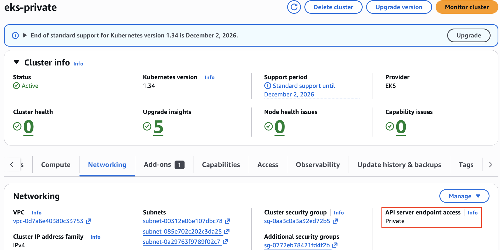

> *CloudNet 팀의 [2026년 AWS EKS Workshop Study 4기](https://gasidaseo.notion.site/26-AWS-EKS-Hands-on-Study-4-31a50aec5edf804b8294d8d512c43370) 1주차 학습 내용을 담고 있습니다.*

## Kubernetes의 핵심 구성요소

/// caption
[https://kubernetes.io/docs/concepts/overview/components/](https://kubernetes.io/docs/concepts/overview/components/)
///

마이크로서비스 아키텍처로 애플리케이션을 운영하고자 한다면 서비스가 많아질 수록 확장성, 보안, 지속성, 부하 분산을 체계적으로 관리해야 합니다.
쿠버네티스는 물리적 머신, 가상 머신 또는 클라우드 환경에서 수백 개, 수천 개 단위까지의 대규모 컨테이너 기반 워크로드를 운영하는 데 도움을 주는 컨테이너 오케스트레이션 소프트웨어입니다. 

쿠버네티스 클러스터는 최소한 하나씩의 Control Plane과 Worker Node로 구성되어 있습니다.
Control Plane은 워크로드 스케줄링 및 기능 관리를 위한 진입점 역할을 하며, Worker Node는 Control Plane으로부터 할당받은 워크로드를 처리합니다. 

마이크로서비스 아키텍처에서는 애플리케이션 스택을 여러 개의 독립적인 서비스(Pod)로 분리해 배포하며, 이 서비스들은 서로 네트워크 통신을 통해 상호 작용합니다. 이때 Control Plane과 Worker Node의 구성 요소가 각각 어떤 역할을 하는지 이해하면 클러스터 동작을 더 잘 추적하고 문제를 빠르게 진단할 수 있습니다.

각 노드의 주요 구성 요소와 역할에 대해 간략하게 알아보겠습니다.

### Control Plane
컨트롤 플레인은 워크로드 스케줄링 및 클러스터 전체의 기능 관리를 위한 진입점 역할을 합니다. 관리자는 커맨드라인 도구 `kubectl`을 사용하여 쿠버네티스 클러스터와 상호작용할 수 있습니다.

- kube-apiserver: API 서버는 클라이언트가 쿠버네티스와 통신하는 데 사용하는 API 엔드포인트를 노출하는 핵심 컴포넌트입니다. 예를 들어, 쿠버네티스 클라이언트인 kubectl을 통해 명령어를 실행하면 API 노출된 엔드포인트에 RESTful API 호출을 수행하게 됩니다. API 서버는 API 처리 절차에서 인증, 권한 부여, 승인 제어를 보장합니다. 

- etcd: [etcd](https://etcd.io/)는 쿠버네티스 클러스터와 관련된 모든 상태 데이터를 백업하는데 사용되는 key-value 형태의 저장소입니다. 클러스터 데이터는 노드나 전체 클러스터가 재시작 되더라도 재구성될 수 있도록 지속적으로 유지됩니다.

- kube-scheduler: 워커노드에 아직 할당(Binding)되지 않은 새로운 Pod를 찾고, 각 Pod를 가장 적절한 워커 노드에 할당하는 백그라운드 프로세스입니다.

- kube-controller-manager: 클러스터의 현재 상태를 모니터링하고, 사용자가 정의한 원하는 상태(Desired state)와 일치하도록 변경 사항을 적용합니다. 예를 들어, 기존 쿠버네티스 객체(Pod, ReplicaSet, Deployment 등)의 구성이 변경되면 Controller manager가 이를 감지하고 전환을 시도합니다. 

- cloud-controller-manager: 클러스터를 퍼블릭 클라우드(AWS, GCP, Azure 등)의 API와 연결하는 컴포넌트입니다. s

### Worker Node
워커 노드는 애플리케이션 워크로드의 실행을 책입집니다. Control Plane의 명령을 받아 컨테이너를 시작·중지하고, 상태를 보고하며, 네트워크 트래픽을 적절한 Pod로 전달합니다. 클러스터의 워커 노드 세트를 데이터 플레인이라고 합니다. 각 워커 노드에는 공통적으로 아래의 구성 요소가 사용됩니다. 

- kubelet: kubelet은 각 노드에서 실행되는 에이전트로, Pod 내에서 필요한 컨테이너가 실행되고 상태를 유지하도록 보장합니다. 쿠버네티스와 컨테이너 런타임 엔진 사이의 접착제 역할을 하며 컨테이너가 실행되고 정상 상태를 유지하도록 보장한다고 할 수 있습니다. 컨트롤 플레인에서도 실행은 가능하지만, 컨트롤 플레인은 워크로드 처리가 주 목적이 아니므로 일반적으로 워커 노드에서 주로 실행됩니다.

- kube-proxy(선택 사항): 각 워커 노드에서 실행되는 네트워크 프록시입니다. 네트워크 규칙을 유지하고, 클러스터 내부 또는 외부에서 들어온 트래픽이 적절한 Pod로 라우팅될 수 있습니다.

- Container runtime: 컨테이너 관리를 책임지는 소프트웨어입니다. kubelet은 설정에 따라 다양한 컨테이너 런타임 엔진(예: containerd, CRI-O 등) 중에서 선택하도록 구성할 수 있습니다. 


## Amazon EKS
Amazon EKS는 AWS 클라우드와 온프레미스 환경에서 쿠버네티스를 실행하기 위한 AWS의 완전 관리형 서비스입니다. 핵심은 쿠버네티스의 컨트롤 플레인을 AWS가 직접 관리한다는 점입니다.

- **컨트롤 플레인(AWS 관리 범위)**: EKS에서 컨트롤 플레인은 AWS 백단에서 자체적으로 관리하는 VPC에서 실행되며, 컨트롤 플레인의 API 서버, etcd와 같은 핵심 컴포넌트들을 3개의 가용 영역에 걸쳐 최소 2개의 API 서버와 3개의 `etcd` 노드를 분산 배치합니다. 컨트롤 플레인에 사용되는 인프라는 추상화되어 사용자에게 보이지 않습니다.
- **데이터 플레인**: 워크로드가 배포되고 실행되는 환경으로, 사용자의 AWS 계정 내 VPC 또는 온프레미스(EKS Hybrid Nodes 또는 EKS Anywhere 사용 시)에 구성됩니다. 사용자는 목적에 맞게 데이터 플레인을 구성할 수 있습니다.
- **컨트롤 플레인과 데이터 플레인 간 통신**: 두 영역은 네트워크 상으로 완전히 분리 되어있으나, 컨트롤 플레인과 워커 노드가 통신할 때는 외부 인터넷 망을 거치지 않고 AWS가 생성하는 Cross-Account ENI를 통하여 사설망으로 통신하여 보안을 유지합니다.

### 도전과제1
> `도전과제1`: aws eks vs vanilla k8s 간 control plane , data plane 비교 정리 해보기

#### Control Plane

- Vanilla K8s는 자체 서버에 컨트롤 플레인을 직접 설치 및 구성하는 방식입니다. 마스터 노드에 SSH 접속이 가능하여 컴포넌트를 직접 프로세스 단위로 모니터링할 수 있으며 /etc/kubernetes/manifests, etcd 데이터 경로, 로그 파일 등을 직접 확인하고 편집할 수 있습니다.
- EKS는 AWS가 컨트롤 플레인을 관리합니다. 사용자는 AWS가 제공하는 API 서버 엔드포인트(Private/Public DNS)를 kubectl로 접근하는 것만 가능합니다. API 서버 VM이나 etcd에 직접 접근이 불가합니다.

| 항목 | Vanilla K8S | Amazon EKS |
|---|---|---|
| 고가용성(HA) 구성 | 다중 AZ 분산 및 로드밸런싱을 사용자가 직접/설계/구축 | AWS가 최소 2개의 API Server 관리 | 
| etcd 저장소 관리 | 사용자가 직접 백업/복구/테스트/모니터링 진행 | AWS가 3개의 etcd 관리 |
| 인증서 라이프사이클 관리 | 인증서 수동 발급 | 자동 발급 및 로테이션/재배포 |
| 스케일링 | 클러스터 규모가 커지면 사용자가 직접 마스터 노드를 Scale-up/out | 부하에 따라 AWS가 컨트롤 플레인 리소스를 자동 확장 |
<!-- | Add-on 및 네트워크/스토리지 플러그인 관리 |  |  |
| 무중단 버전 업그레이드 | 사용자가 롤백 전략 |  | -->

#### Data Plane
데이터 플레인은 애플리케이션 워크로드가 실행되는 워커 노드 환경입니다.

| 항목 | Vanilla K8S | Amazon EKS |
|---|---|---|
| 노드 프로비저닝 | OS 설치, 컨테이너 런타임 및 컴포넌트, 클러스터 조인을 사용자가 직접 수행 | EKS 최적화 AMI 사용 시 자동으로 클러스터 조인 | 
| 컴퓨팅 옵션 | 물리 서버 또는 가상 머신 | Managed 노드 그룹, Auto Mode, 서버리스, 온프레미스 서버 등의 옵션 선택 가능 |
| 인증서 라이프사이클 관리 | 인증서 수동 발급 | 자동 발급 및 로테이션/재배포 |
| OS 패치 | 사용자가 직접 수행 | Managed 노드 그룹/Auto Mode 사용 시 자동 | 
| 컨테이너 런타임 | 직접 설치 | AMI에 포함(Custom 필요시 직접 설치 필요) |
| 오토 스케일링 | Cluster Autoscaler | Karpenter/Auto Mode/ASG 연동 | 

## Hands-on 1

EKS 클러스터는 다음과 같은 방법으로 프로비저닝 및 관리할 수 있습니다.

Hands-on은 제공된 Terraform 실습코드를 통해 배포하였습니다.

| 프로비저닝 방법 | 설명 |
|---|---|
| AWS Management Console | AWS 콘솔에서 GUI 기반으로 EKS 클러스터를 생성합니다. 직접 버튼을 클릭하고 값을 입력하여 클러스터를 생성하는 방식으로, 코드로 상태를 관리하거나 저장하지 않고 Live objects를 직접 조작합니다. 과정을 코드로 추적할 수 없어 프로덕션으로 적합하지 않으나 러닝 커브가 낮아 학습 용도로 접근하기 좋습니다. |
| eksctl | `eksctl create cluster --name my-cluster`와 같은 CLI 명령어를 통해 EKS 클러스터를 생성합니다. 사용자는 명령형으로 다루지만, eksctl 내부적으로는 CloudFormation으로 변환하여 배포를 수행하며 실제로 CloudFormation 스택이 생성되거나 업데이트 됩니다. |
| IaC(예: Terraform, Pulumi, CloudFormation) | `.tf`와 같은 IaC 도구 관련 파일들이 모인 디렉토리에 인프라를 정의해두고, 시스템 엔진이 리소스 블록을 읽고 조합하여 목표 상태와 일치하도록 인프라를 자동 배포하는 방식입니다. 인프라를 코드로 관리하므로 버전 관리와 협업이 용이하여 프로덕션 환경에 가장 적합합니다. |

### 로컬 환경 설정
macOS 사용자는 터미널, Windows OS 사용자는 WSL 터미널을 사용하여 로컬 PC에 Hands-on 환경을 설정합니다. 

1) AWS CLI 설치
```Zsh
# Install aws cli
brew install awscli
aws --version

# iam (주체) 자격 증명 설정
aws configure
AWS Access Key ID : <액세스 키 입력>
AWS Secret Access Key : <시크릿 키 입력>
Default region name : ap-northeast-2

# 확인
aws sts get-caller-identity
```

2) IAM User 생성 및 자격증명 설정(`aws configure`), EC2 Key Pair 생성

3) K8s 관리 도구 설치(kubectl, helm) 설치
```Zsh
# Install kubectl
brew install kubernetes-cli
kubectl version --client=true

# Install Helm
brew install helm
helm version
```

4) K8s 관리에 유용한 툴(krew, k9s, kube-ps1, kubectx) 설치(권장)
```Zsh
# Install krew
brew install krew

# Install k9s
brew install k9s

# Install kube-ps1
brew install kube-ps1

# Install kubectx
brew install kubectx

# kubectl 출력 시 하이라이트 처리
brew install kubecolor
echo "alias k=kubectl" >> ~/.zshrc
echo "alias kubectl=kubecolor" >> ~/.zshrc
echo "compdef kubecolor=kubectl" >> ~/.zshrc

# k8s krew path : ~/.zshrc 아래 추가
export PATH="${KREW_ROOT:-$HOME/.krew}/bin:$PATH"
```

5) 여러 버전의 Terraform을 설치하고 쉽게 관리할 수 있도록 tfenv 설치

```Zsh
# tfenv 설치
brew install tfenv

# 설치 가능 버전 리스트 확인
tfenv list-remote

# 테라폼 특정 버전 설치
tfenv install 1.14.6

# 테라폼 특정 버전 사용 설정 
tfenv use 1.14.6

# tfenv로 설치한 버전 확인
tfenv list

# 테라폼 버전 정보 확인
terraform version

# 자동완성
terraform -install-autocomplete

## 참고 .zshrc 에 아래 추가됨
cat ~/.zshrc
autoload -U +X bashcompinit && bashcompinit
complete -o nospace -C /usr/local/bin/terraform terraform
```

### Terraform 실습 코드 배포
1) Github 저장소에서 실습 코드 다운로드 

```Zsh
# 코드 다운로드
git clone https://github.com/gasida/aews.git
cd aews
tree aews

# 작업 디렉터리 이동
cd 1w
```

2) Terraform 배포 및 K8s 자격증명 설정

```Zsh
# 변수 지정
aws ec2 describe-key-pairs --query "KeyPairs[].KeyName" --output text
export TF_VAR_KeyName=$(aws ec2 describe-key-pairs --query "KeyPairs[].KeyName" --output text)
export TF_VAR_ssh_access_cidr=$(curl -s ipinfo.io/ip)/32
echo $TF_VAR_KeyName $TF_VAR_ssh_access_cidr

# 배포 : 12분 정도 소요
terraform init
terraform plan
nohup sh -c "terraform apply -auto-approve" > create.log 2>&1 &
tail -f create.log


# 자격증명 설정
aws eks update-kubeconfig --region ap-northeast-2 --name myeks

# k8s config 확인 및 rename context
cat ~/.kube/config
cat ~/.kube/config | grep current-context | awk '{print $2}'
kubectl config rename-context $(cat ~/.kube/config | grep current-context | awk '{print $2}') myeks
cat ~/.kube/config | grep current-context
```

3) 테라폼 모듈 버전 정보 확인
테라폼에서 레지스트리의 모듈을 가져올 때는 코드 호환성을 유하기 위해 버전 제약 조건([Version Constraints](https://developer.hashicorp.com/terraform/language/expressions/version-constraints))을 설정할 수 있습니다. 

| 연산자 | 설명 |
|---|---|
| `=` | 특정한 버전을 지정합니다. <br/> `=` 기호를 쓰거나 기호를 생략하여 표기합니다. <br/> - version = "= 1.2.3"  <br/> - version = "1.2.3" |
| 부등호(`>`, `>=`, `<`, `<=`) | 특정 버전 이상이거나 미만인 버전을 허용합니다. |
| `~>` | 지정된 버전에서 가장 오른쪽에 있는 자리의 버전 업데이트만 허용합니다. <br/>- version = "~> 1.2": 1.2.0 이상, 2.0.0 미만의 최신 버전을 설치합니다. <br/>- version = "~> 1.2.3": 1.2.3 이상, 1.3.0 미만의 최신 버전을 설치합니다. |
| 조건 결합(`,` | 여러 조건을 쉼표로 결합하여 더 세밀한 범위를 지정합니다. <br/> - version = ">= 1.2.0, != 1.2.5": 1.2.0 이상을 허용하되, 버그가 있는 특정 버전(1.2.5)만 제외합니다. | 

예제 코드에는 `~>` 조건이 설정되어 있습니다.

```Zsh
module "vpc" {
  source  = "terraform-aws-modules/vpc/aws"
  version = "~>6.5"

module "eks" {
  
  source  = "terraform-aws-modules/eks/aws"
  version = "~> 21.0" 
```

`terraform init` 명령어를 실행한 후, 실제로 다운로드 및 적용된 모듈의 정확한 버전은 .terraform/modules/modules.json 파일을 통해 다음과 같이 확인할 수 있습니다.

vpc는 6.5 이상의 최신 버전인 6.6.0이, eks는 21.0 이상의 최신 버전인 21.15.1 버전이 설치된 것을 확인하였습니다.

```Zsh
cat .terraform/modules/modules.json | jq
{
  "Modules": [
    {
      "Key": "vpc",
      "Source": "registry.terraform.io/terraform-aws-modules/vpc/aws",
      "Version": "6.6.0",
      "Dir": ".terraform/modules/vpc"
    },
    {
      "Key": "eks",
      "Source": "registry.terraform.io/terraform-aws-modules/eks/aws",
      "Version": "21.15.1",
      "Dir": ".terraform/modules/eks"
    }
  ]
}
```
### EKS 클러스터 정보 확인 

#### 제어부 정보 
1) EKS 클러스터 정보 확인
```Zsh
kubectl cluster-info
Kubernetes control plane is running at https://F06234AE0397E05608EB21DAED43151D.gr7.ap-southeast-1.eks.amazonaws.com
CoreDNS is running at https://F06234AE0397E05608EB21DAED43151D.gr7.ap-southeast-1.eks.amazonaws.com/api/v1/namespaces/kube-system/services/kube-dns:dns/proxy
```

2) Endpoint Access 설정 확인

**Public Cluster Endpoint만 활성화, IP 접근 제한 미적용**

```Zsh
aws eks describe-cluster --name $CLUSTER_NAME | jq .cluster.resourcesVpcConfig
{
  "endpointPublicAccess": true,
  "endpointPrivateAccess": false,
  "publicAccessCidrs": [
    "0.0.0.0/0"
  ]
}
```
**API 서버 Endpoint 조회**
```Zsh
aws eks describe-cluster --name $CLUSTER_NAME | jq -r .cluster.endpoint
https://F06234AE0397E05608EB21DAED43151D.gr7.ap-southeast-1.eks.amazonaws.com
```

3) API 서버 Endpoint의 DNS 질의
```Zsh
APIDNS=$(aws eks describe-cluster --name $CLUSTER_NAME | jq -r .cluster.endpoint | cut -d '/' -f 3)
dig +short $APIDNS

18.136.245.227
18.141.20.137
```

```Zsh
curl -s ipinfo.io/18.136.245.227
{
  "ip": "18.136.245.227",
  "hostname": "ec2-18-136-245-227.ap-southeast-1.compute.amazonaws.com",
  "city": "Singapore",
  "region": "Singapore",
  "country": "SG",
  "loc": "1.2897,103.8501",
  "org": "AS16509 Amazon.com, Inc.",
  "postal": "018989",
  "timezone": "Asia/Singapore",
  "readme": "https://ipinfo.io/missingauth"
}
```

4) eks 노드 그룹 정보 확인
```Zsh
aws eks describe-nodegroup --cluster-name $CLUSTER_NAME --nodegroup-name $CLUSTER_NAME-node-group | jq
{
  "nodegroup": {
    "nodegroupName": "myeks-node-group",
    "nodegroupArn": "arn:aws:eks:ap-southeast-1:{AccountID}:nodegroup/myeks/myeks-node-group/d4ce7f6d-1dee-e4f0-5188-ce82c3754bac",
    "clusterName": "myeks",
    "version": "1.34",
    "releaseVersion": "1.34.4-20260304",
    "createdAt": "2026-03-18T11:50:44.386000+09:00",
    "modifiedAt": "2026-03-19T02:51:21.461000+09:00",
    "status": "ACTIVE",
    "capacityType": "ON_DEMAND",
    "scalingConfig": {
      "minSize": 1,
      "maxSize": 4,
      "desiredSize": 2
    },
    "instanceTypes": [
      "t3.medium"
    ],
    "subnets": [
      "subnet-0378f8589255a2d7f",
      "subnet-0df35014dbd94b704",
      "subnet-0b88a18c994f9aba6"
    ],
    "amiType": "AL2023_x86_64_STANDARD",
    "nodeRole": "arn:aws:iam::{AccountID}:role/myeks-node-group-eks-node-group-20260318024325206100000005",
    "labels": {},
    "resources": {
      "autoScalingGroups": [
        {
          "name": "eks-myeks-node-group-d4ce7f6d-1dee-e4f0-5188-ce82c3754bac"
        }
      ]
    },
    "health": {
      "issues": []
    },
    "updateConfig": {
      "maxUnavailablePercentage": 33
    },
    "launchTemplate": {
      "name": "default-20260318025034909900000008",
      "version": "1",
      "id": "lt-0c5106b59b7b4875e"
    },
    "tags": {
      "Terraform": "true",
      "Environment": "cloudneta-lab",
      "Name": "myeks-node-group"
    }
  }
}
```

5) 노드 상세 정보 확인
```Zsh
kubectl get node --label-columns=node.kubernetes.io/instance-type,eks.amazonaws.com/capacityType,topology.kubernetes.io/zone
kubectl get node --label-columns=node.kubernetes.io/instance-type
kubectl get node --label-columns=eks.amazonaws.com/capacityType # 노드의 capacityType 확인
kubectl get node
kubectl get node -owide
NAME                                               STATUS   ROLES    AGE   VERSION               INTERNAL-IP     EXTERNAL-IP      OS-IMAGE                        KERNEL-VERSION                   CONTAINER-RUNTIME
ip-192-168-1-116.ap-southeast-1.compute.internal   Ready    <none>   15h   v1.34.4-eks-f69f56f   192.168.1.116   52.221.196.142   Amazon Linux 2023.10.20260216   6.12.68-92.122.amzn2023.x86_64   containerd://2.1.5
ip-192-168-3-89.ap-southeast-1.compute.internal    Ready    <none>   15h   v1.34.4-eks-f69f56f   192.168.3.89    18.141.156.72    Amazon Linux 2023.10.20260216   6.12.68-92.122.amzn2023.x86_64   containerd://2.1.5
```

6) kubeconfig 확인
**`aws eks get-token` 명령으로 토큰을 발급받아 EKS API 서버에 인증**
```Zsh
cat ~/.kube/config
kubectl config view
```

7) 인증 정보 확인
```Zsh
AWS_DEFAULT_REGION=ap-southeast-1  
aws eks get-token help
aws eks get-token --cluster-name $CLUSTER_NAME --region $AWS_DEFAULT_REGION | jq
{
  "kind": "ExecCredential",
  "apiVersion": "client.authentication.k8s.io/v1beta1",
  "spec": {},
  "status": {
    "expirationTimestamp": "2026-03-18T19:02:59Z",
    "token": "k8s-aws-v1.aHR0cHM6Ly9zdHMuYXAtc291dGhlYXN0LTEuYW1hem9uYXdzLmNvbS8_QWN0aW9uPUdldENhbGxlcklkZW50aXR5JlZlcnNpb249MjAxMS0wNi0xNSZYLUFtei1BbGdvcml0aG09QVdTNC1ITUFDLVNIQTI1NiZYLUFtei1DcmVkZW50aWFsPUFLSUFXUU9VVk9LQUYzRk5RSDZKJTJGMjAyNjAzMTglMkZhcC1zb3V0aGVhc3QtMSUyRnN0cyUyRmF3czRfcmVxdWVzdCZYLUFtei1EYXRlPTIwMjYwMzE4VDE4NDg1OVomWC1BbXotRXhwaXJlcz02MCZYLUFtei1TaWduZWRIZWFkZXJzPWhvc3QlM0J4LWs4cy1hd3MtaWQmWC1BbXotU2lnbmF0dXJlPTU3ODhlMTM5NjZlOGJkNmEzYTJlNjM5OTViZTRhNDBmNTIyMjc3YmUxNWM4MzI4NjMzYzRhZjAwMDZjNGRjMmI"
  }
}
```

8) 현재 자격증명 정보
```Zsh
kubectl get node -v=6
I0319 03:43:56.227484   98865 cmd.go:527] kubectl command headers turned on
I0319 03:43:56.249948   98865 loader.go:402] Config loaded from file:  /Users/mzc01-siyoung/.kube/config
I0319 03:43:56.259134   98865 envvar.go:172] "Feature gate default state" feature="WatchListClient" enabled=false
I0319 03:43:56.259214   98865 envvar.go:172] "Feature gate default state" feature="InOrderInformersBatchProcess" enabled=false
I0319 03:43:56.259219   98865 envvar.go:172] "Feature gate default state" feature="ClientsAllowCBOR" enabled=false
I0319 03:43:56.259222   98865 envvar.go:172] "Feature gate default state" feature="ClientsPreferCBOR" enabled=false
I0319 03:43:56.259224   98865 envvar.go:172] "Feature gate default state" feature="InformerResourceVersion" enabled=false
I0319 03:43:56.259227   98865 envvar.go:172] "Feature gate default state" feature="InOrderInformers" enabled=true
I0319 03:43:57.923490   98865 round_trippers.go:632] "Response" verb="GET" url="https://F06234AE0397E05608EB21DAED43151D.gr7.ap-southeast-1.eks.amazonaws.com/api/v1/nodes?limit=500" status="200 OK" milliseconds=1627
NAME                                               STATUS   ROLES    AGE   VERSION
ip-192-168-1-116.ap-southeast-1.compute.internal   Ready    <none>   15h   v1.34.4-eks-f69f56f
ip-192-168-3-89.ap-southeast-1.compute.internal    Ready    <none>   15h   v1.34.4-eks-f69f56f
```

### 시스템 포드 정보 확인

1) 파드 정보 확인
kube-system의 pod 정보 확인 시 etcd, 스케줄러 등의 EKS가 관리하는 컴포넌트는 나오지 않음.
*VPC CNI 다름. 2주차 설명 예정
```Zsh
kubectl get pod -n kube-system
kubectl get pod -n kube-system -o wide
kubectl get pod -A

NAMESPACE     NAME                       READY   STATUS    RESTARTS   AGE
kube-system   aws-node-cgxtz             2/2     Running   0          16h
kube-system   aws-node-xg4pg             2/2     Running   0          16h
kube-system   coredns-6f5774597c-59kns   1/1     Running   0          16h
kube-system   coredns-6f5774597c-m2ps9   1/1     Running   0          16h
kube-system   kube-proxy-ksc6s           1/1     Running   0          16h
kube-system   kube-proxy-s6szs           1/1     Running   0          16h
```

2) kube-system 네임스페이스에 모든 리소스 확인
Core DNS PDB 확인 가능, maxUnavailable: 1로 설정되어 있어 동시에 1개 이상의 CoreDNS 파드가 중단되지 않도록 보호됩니다.
```Zsh
kubectl get deploy,ds,pod,cm,secret,svc,ep,endpointslice,pdb,sa,role,rolebinding -n kube-system

NAME                                 MIN AVAILABLE   MAX UNAVAILABLE   ALLOWED DISRUPTIONS   AGE
poddisruptionbudget.policy/coredns   N/A             1                 1                     16h
```

3) 모든 파드의 컨테이너 이미지 정보 확인 : dkr.ecr 저장소 확인!
도커 허브가 아닌 AWS ECR에서 시스템 포드 관련 컨테이너 이미지를 가져옵니다.
```Zsh
kubectl get pods --all-namespaces -o jsonpath="{.items[*].spec.containers[*].image}" | tr -s '[[:space:]]' '\n' | sort | uniq -c
   2 602401143452.dkr.ecr.ap-southeast-1.amazonaws.com/amazon-k8s-cni:v1.21.1-eksbuild.3
   2 602401143452.dkr.ecr.ap-southeast-1.amazonaws.com/amazon/aws-network-policy-agent:v1.3.1-eksbuild.1
   2 602401143452.dkr.ecr.ap-southeast-1.amazonaws.com/eks/coredns:v1.13.2-eksbuild.1
   2 602401143452.dkr.ecr.ap-southeast-1.amazonaws.com/eks/kube-proxy:v1.34.5-eksbuild.2
```

4) kube-proxy : iptables mode, bind 0.0.0.0, conntrack 등
ipvs x, iptables 모드 기본으로 사용
```Zsh
kubectl describe pod -n kube-system -l k8s-app=kube-proxy
kubectl get cm -n kube-system kube-proxy -o yaml
kubectl get cm -n kube-system kube-proxy-config -o yaml
```

5) coredns 
```Zsh
kubectl describe pod -n kube-system -l k8s-app=kube-dns
kubectl get cm -n kube-system coredns -o yaml
kubectl get pdb -n kube-system coredns -o jsonpath='{.spec}' | jq
```

6) aws-node
2개의 컨테이너 
- aws-node(cni plugin), 
- aws-eks-nodeagent(network policy agent)
```
kubectl describe pod -n kube-system -l k8s-app=aws-node
```

### Add-on 정보 확인

1) 클러스터에 설치된 Addon 목록 확인
```Zsh
aws eks list-addons --cluster-name myeks | jq
{
  "addons": [
    "coredns",
    "kube-proxy",
    "vpc-cni"
  ]
}
```

2) 특정 Addon 상세 정보
Addon 버전, Configuration
```Zsh
aws eks describe-addon --cluster-name myeks --addon-name vpc-cni | jq
{
  "addon": {
    "addonName": "vpc-cni",
    "clusterName": "myeks",
    "status": "ACTIVE",
    "addonVersion": "v1.21.1-eksbuild.3",
    "health": {
      "issues": []
    },
    "addonArn": "arn:aws:eks:ap-southeast-1:{AccountID}:addon/myeks/vpc-cni/78ce7f6c-d8c8-5e73-9a11-c1b5afddf523",
    "createdAt": "2026-03-18T11:50:05.774000+09:00",
    "modifiedAt": "2026-03-18T11:51:03.759000+09:00",
    "tags": {
      "Terraform": "true",
      "Environment": "cloudneta-lab"
    }
  }
}
```

3) 전체 Addon 상세 정보  
```Zsh
aws eks list-addons --cluster-name myeks \
| jq -r '.addons[]' \
| xargs -I{} aws eks describe-addon \
     --cluster-name myeks \
     --addon-name {}
```

## API Server Endpoint Access
EKS의 API 서버는 사용자가 관리하지 않고, AWS 관리형 VPC에 API 서버가 배치됩니다.
클러스터의 API 엔드포인트를 어떻게 구성할지 선택하는 옵션입니다.

### Public Cluster Endpoint
- API 서버가 공인 IP로 노출됩니다.
- 워커 노드(kubelet)와 외부 관리자(kubectl) 모두 인터넷을 통해 API 서버와 통신합니다.
- API 서버가 인터넷으로 열려있어 DDoS와 같은 보안 위협에 노출될 수 있습니다.

### Public & Private Endpoint
- 워커 노드와 API 서버 간 Public IP가 아닌 VPC 내부 ENI를 통해 Private IP로 내부 통신을 합니다.
- 외부 관리자와 CI/CD 도구는 Public IP를 통해 API 서버에 접근합니다.
- 보안을 위해 특정 IP에서만 접근할 수 있도록 화이트 리스트로 통제해야 합니다.

### Fully Private Endpoint
- API 서버에 대한 모든 Public Access가 차단되며, EKS owned ENI를 통해서만 접근이 가능합니다. 
- 외부에서 관리자가 인터넷을 통해 접근이 불가하므로 VPN 또는 Bastion Host를 경유하여야 합니다.
- Private DNS Resolution: VPC 설정에서 enableDnsHostnames와 enableDnsSupport가 true여야 합니다.
- AWS 서비스와 통신할 수 있도록 VPC에 PrivateLink가 생성되어야 합니다.

## Hands-on 2: EKS Fully Private Cluster

1) 실습 디렉터리 진입
```
cd eks-private
```

2) 변수 지정
```
aws ec2 describe-key-pairs --query "KeyPairs[].KeyName" --output text
export TF_VAR_KeyName=$(aws ec2 describe-key-pairs --query "KeyPairs[].KeyName" --output text)
export TF_VAR_ssh_access_cidr=$(curl -s ipinfo.io/ip)/32
echo $TF_VAR_KeyName $TF_VAR_ssh_access_cidr
```

3) Terraform 배포
```
terraform init
terraform plan
# vpc 배포
terraform apply -target="module.vpc" -auto-approve
# eks 등 배포 : 14분 소요
terraform apply -auto-approve
```

API server endpoint access 옵션이 Private인 클러스터가 생성됩니다.

1) 자격증명 설정
```Zsh
aws eks --region ap-southeast-1 update-kubeconfig --name eks-private
kubectl config rename-context $(cat ~/.kube/config | grep current-context | awk '{print $2}') eks-private
```

1) kubectl 조회 시도

```Zsh
kubectl get node -v=7
I0319 05:40:44.445712   23971 cmd.go:527] kubectl command headers turned on
I0319 05:40:44.515664   23971 loader.go:402] Config loaded from file:  /Users/mzc01-siyoung/.kube/config
I0319 05:40:44.520991   23971 envvar.go:172] "Feature gate default state" feature="InOrderInformersBatchProcess" enabled=false
I0319 05:40:44.521042   23971 envvar.go:172] "Feature gate default state" feature="ClientsAllowCBOR" enabled=false
I0319 05:40:44.521046   23971 envvar.go:172] "Feature gate default state" feature="ClientsPreferCBOR" enabled=false
I0319 05:40:44.521049   23971 envvar.go:172] "Feature gate default state" feature="InformerResourceVersion" enabled=false
I0319 05:40:44.521051   23971 envvar.go:172] "Feature gate default state" feature="InOrderInformers" enabled=true
I0319 05:40:44.521054   23971 envvar.go:172] "Feature gate default state" feature="WatchListClient" enabled=false
I0319 05:40:44.551540   23971 round_trippers.go:527] "Request" verb="GET" url="https://F06234AE0397E05608EB21DAED43151D.gr7.ap-southeast-1.eks.amazonaws.com/api/v1/nodes?limit=500" headers=<
        Accept: application/json;as=Table;v=v1;g=meta.k8s.io,application/json;as=Table;v=v1beta1;g=meta.k8s.io,application/json
        User-Agent: kubectl/v1.34.1 (darwin/amd64) kubernetes/fb83f9c
 >
I0319 05:40:45.490175   23971 round_trippers.go:632] "Response" status="" milliseconds=938
I0319 05:40:45.493870   23971 helpers.go:264] Connection error: Get https://F06234AE0397E05608EB21DAED43151D.gr7.ap-southeast-1.eks.amazonaws.com/api/v1/nodes?limit=500: dial tcp: lookup F06234AE0397E05608EB21DAED43151D.gr7.ap-southeast-1.eks.amazonaws.com: no such host
Unable to connect to the server: dial tcp: lookup F06234AE0397E05608EB21DAED43151D.gr7.ap-southeast-1.eks.amazonaws.com: no such host
```
Local PC에서 인터넷을 통해 접근이 불가합니다. 

```Zsh
APIDNS=$(aws eks describe-cluster --name $CLUSTER_NAME | jq -r .cluster.endpoint | cut -d '/' -f 3)
dig +short $APIDNS
10.0.39.44
10.0.20.173
```
EKS DNS 질의 테스트 시 이전 Public API Endpoint와 다르게 사설 IP 대역이 반환됩니다. 

6) Bastion EC2에서 접근 테스트
```bash
# 자격증명 설정
root@bastion-EC2:~# aws eks --region ap-southeast-1 update-kubeconfig --name eks-private
Added new context arn:aws:eks:ap-southeast-1:{AccountID}:cluster/eks-private to /root/.kube/config(arn:aws:eks:ap-southeast-1:{AccountID}:cluster/eks-private:N/A) 
root@bastion-EC2:~# kubectl config rename-context $(cat ~/.kube/config | grep current-context | awk '{print $2}') eks-private Context "arn:aws:eks:ap-southeast-1:{AccountID}:cluster/eks-private" renamed to "eks-private".
# eks access endpoint 확인
(eks-private:N/A) root@bastion-EC2:~# APIDNS=$(aws eks describe-cluster --name eks-private | jq -r .cluster.endpoint | cut -d '/' -f 3)
echo $APIDNS
0F20D0C0F108C400A93919294A7D957F.gr7.ap-southeast-1.eks.amazonaws.com
# DNS 질의 전송
(eks-private:N/A) root@bastion-EC2:~# dig +short $APIDNS
10.0.20.173
10.0.39.44
# kubectl 조회 시도
kubectl cluster-info
kubectl get node -v=9
```
<!-- 
### 도전과제2
>`도전과제2`: EKS Fully Private Cluster 환경에서 nginx 디플로이먼트를 배포하고, 외부 노출 설정을 해보자


## 도전과제3
>`도전과제3`: EKS 보안 그룹 : 각 보안 그룹이 어떻게 적용되는지 정리해보기!

### Cluster Security Group


### Node Security Group -->