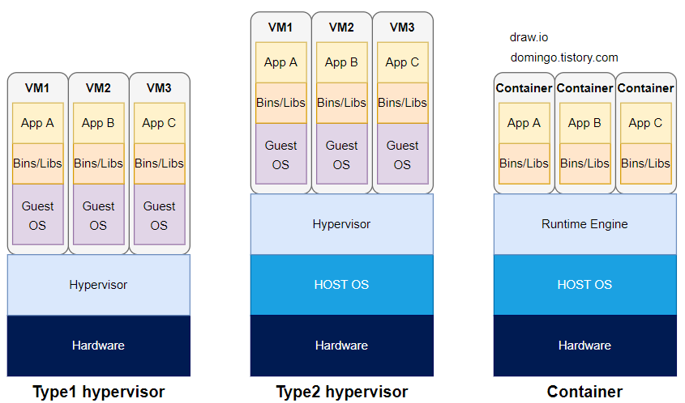

> `git checkout 2022`

2022년에 작성했던 가상화 글을 바탕으로 개념을 다시 한번 환기하고 새롭게 글을 작성해보았습니다. 클라우드 인프라의 기본이 되는 가상화와, 이를 가능하게 하는 하이퍼바이저의 역할과 유형, 구현 방식에 대해 간략하게 짚어보는 글입니다.

## 가상화(Virtualization)
가상화는 CPU/메모리/스토리지/네트워크 등의 물리적 자원을 추상화하여, 논리적으로 분할된 여러 개의 독립적인 가상환경(VM/컨테이너)을 동시에 실행할 수 있게 해주는 기술입니다. 이를 통해 하드웨어 리소스 활용률을 극대화하고, 환경을 격리하여 안전성과 유연성을 확보할 수 있습니다.

이러한 가상화를 구성하고 관리하는 핵심 소프트웨어를 하이퍼바이저 또는 VMM(Virtual Machine Manager)이라고 합니다.

## 하이퍼바이저 타입
하이퍼바이저는 하드웨어와 운영체제 사이에서 어느 위치에 설치되느냐에 따라 크게 두 가지로 나눌 수 있습니다. 

### 1. Type 1 (Bare Metal/Native Hypervisors)
- Type 1 하이퍼바이저는 운영체제 없이 하이퍼바이저가 하드웨어 계층 위에서 직접 동작하며, 여러 게스트 운영체제와 그에 할당된 하드웨어 자원(가상 CPU, 가상 메모리, 가상 디스크, 가상 네트워크 등)을 관리합니다. 
- 게스트 OS가 하드웨어 자원을 요청할 때, 하이퍼바이저가 직접적으로 하드웨어에 명령어를 직접 전달하여 오버헤드가 적습니다. 
- 대표 솔루션으로 VMWare ESXi, Microsoft Hyper-V, Liunx KVM, Citrix Hypervisor(구 XenServer, 젠서버) 등이 있습니다.

#### *KVM / Hyper-V는 왜 Type 1일까?
- 리눅스 기반의 KVM과 윈도우 기반의 Hyper-V는 하드웨어 위에서 하이퍼바이저가 직접 실행되는 Type 1에 속하지만 Host OS가 존재합니다. 
- 리눅스나 윈도우 같은 Host OS가 존재하지만, 기능 활성화 시 Host OS가 가상화 계층 위에서 실행되는 구조를 가지므로 Type 1으로 분류됩니다.

### 2. Type 2 (Embedded/Hosted Hypervisors):
- 구조: Hardware → Host OS → Hypervisor → Guest OS
- Type 2 하이퍼바이저는 Windows, macOS와 같은 OS 위에 설치됩니다. 방식입니다. 하드웨어 계층 위헤 호스트 OS 계층이 있고, 그 위에 하이퍼바이저가 존재합니다. 하이퍼바이저 위에는 Guest OS가 올라갑니다.
- 게스트 OS의 요청이 하이퍼바이저 → 호스트 OS 커널 → 하드웨어라는 복잡한 경로를 거쳐 오버헤드가 가장 큽니다. 
- Oracle VirtualBox, VMWare Workstation, VMware Fusion 등의 솔루션이 있습니다. 

## 가상화 구현 방식

### 1. 호스트 가상화(Hosted Hypervisors)
- 구조: Hardware → Host OS → Hypervisor → Guest OS
- 위 Type 2 하이퍼바이저와 같습니다. 

### 2. 전가상화 (Full-virtualization):
- 구조: Hardware → Hypervisor(Type 1) → Guest OS
- 하이퍼바이저가 하드웨어 전체를 완벽하게 추상화하여 Guest OS에 제공하는 방식입니다. Guest OS는 자신이 가상 환경에서 돌아가고 있다는 사실을 인지하지 못하며, 베어 메탈 서버에 설치되어있는 것처럼 동작합니다.
- 하이퍼바이저가 Guest OS의 명령을 하드웨어가 이해할 수 있도록 번역(Binary Translation)합니다. 이 과정에서 지연이 발생할 수 있습니다.
- 게스트 OS의 명령이 하이퍼바이저에서 Binary translation 과정을 거쳐 하드웨어로 전달됩니다. 예를 들어, 윈도우 Add, 리눅스 ADD, 맥 add 등 서로 다른 각종 OS의 명령을 번역합니다. 이진 번역은 복잡하고 비용이 많이 들기 때문에 오버헤드가 증가합니다. 

### 3. 반가상화(Para-virtualization):
- 구조: Hardware → Hypervisor(Type 1) → Modified Guest OS
- 게스트 OS의 커널을 수정하여, 번역 과정 없이 '하이퍼콜(Hyper Call)'이라는 인터페이스를 통해 하이퍼바이저와 통신합니다.
- 게스트 OS는 자신이 가상환경에서 돌아가고 있다는 것을 인식하고 있으며, 하이퍼바이저와 소통하기 위한 수단인 하이퍼콜을 사용합니다.
- 전가상화와 다르게 이진 번역 과정 없이 하이퍼콜 인터페이스를 통해 Guest OS 명령이 하드웨어로 전달되므로, 이진 번역 과정에서 발생하는 오버헤드가 줄어듭니다.
- 반가상화를 지원하지 않는 운영 체제는 커널 수정이 필요합니다. 또는, 소스코드가 공개되지 않은 특정 OS(e.g. Windows)에 반가상화 인식 드라이버(Paravirtualization-aware drivers, 또는 PV 드라이버)가 제공될 수 있습니다.
- 하이퍼바이저나 운영 체제를 업데이트하는 경우 VM이 더 이상 작동하지 않을 수 있습니다.
- 대표적으로 오픈 소스 하이퍼바이저인 Citrix XEN server가 반가상화에 특화되어 있습니다.

### 4. 하드웨어 지원 가상화 (Hardware-assisted Virtualization) = 전가상화
- 구조: Hardware → Hypervisor → Guest OS
- 하드웨어 지원 가상화는 성능 저하를 일으키던 이진 번역의 필요성을 없애고, CPU 칩셋이 Guest OS의 명령을 직접 제어하는 방식입니다. 
- 하드웨어 지원 가상화를 지원하는 대표적인 하드웨어로 Intel VT, AMD-V, ARM virtualization extension이 있습니다. 
