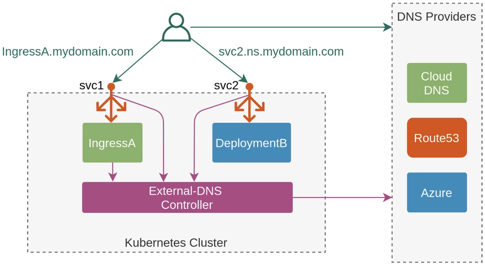

> *CloudNet 팀의 [2026년 AWS EKS Workshop Study 4기](https://gasidaseo.notion.site/26-AWS-EKS-Hands-on-Study-4-31a50aec5edf804b8294d8d512c43370) 2주차 학습 내용을 담고 있습니다.*

## 개요
EKS 데이터 플레인 관점에서 아래 내용을 중심으로 정리합니다.

- Pod IP 할당과 트래픽 경로
- K8s CNI와 AWS VPC CNI 차이점
- VPC CNI 기반의 IP 할당 방식 및 풀 관리 전략
- EKS Service, Ingress, Gateway API를 활용한 서비스 노출
- ExternalDNS, CoreDNS

---

## 들어가며
Amazon EKS의 네트워크 구조는 관리 주체에 따라 AWS가 관리하는 **컨트롤 플레인(Control Plane)**과 사용자의 AWS 계정 내에 구성되는 **데이터 플레인(Data Plane)**으로 나뉩니다. 

- 컨트롤 플레인 (AWS 관리 영역): AWS 소유의 전용 VPC에서 실행됩니다. kube-apiserver, etcd 등 마스터 노드의 역할로 클러스터 상태 관리, 스케줄링 및 API 기반 제어를 처리합니다.
- 데이터 플레인 (사용자 관리 영역): 사용자가 생성한 VPC 내에서 워커 노드와 애플리케이션 Pod가 실행되며, 실제 비즈니스 트래픽이 처리되는 공간입니다.

실제 EKS 운영에서 자주 마주하는 네트워크 이슈(Pod 간 통신 실패, DNS 지연, 외부 로드밸런서 연동, 서브넷 IP 고갈 등)는 대부분 데이터 플레인에서 발생합니다.

---

## Pod 통신
Pod는 쿠버네티스에서 애플리케이션을 실행하는 가장 작은 배포 단위입니다. 일반적으로 Pod 하나에 컨테이너 하나를 실행하지만, 필요에 따라 하나의 Pod에 여러 컨테이너를 배치하는 멀티 컨테이너 패턴도 사용합니다.

<!-- 다중 컨테이너 Pod는 스토리지 볼륨이나 네트워크 네임스페이스 같은 리소스를 공유해야 하는 긴밀하게 결합된 프로세스에 유용합니다. 
- 사이드카 패턴(로그 수집, 모니터링 에이전트)
- 어댑터 패턴(출력 형식 표준화)
- 앰버서더 패턴(프록시 연결)
- 초기화 컨테이너(메인 컨테이너 시작 전 설정 작업 수행) 

Pod는 컨테이너 실행 외에도 스토리지, 구성 데이터 등 쿠버네티스의 다른 기능을 실행할 수 있습니다.  -->

### Pod 네트워크 특징

- 모든 Pod는 고유 IP를 할당받고, Pod 간 통신은 이 IP를 기준으로 이루어진다.
- Pod는 영구적이지 않다. 노드 이슈나 배포로 인한 재시작/재스케줄 시 Pod가 재생성되면 IP가 변경된다.
- 외부에서 안정적으로 Pod에 접근하려면 고정된 진입점인 Service를 사용해야 한다. 

### 트래픽 경로별 통신 흐름

Pod의 통신은 트래픽이 어디서 어디로 흐르는지에 따라 경로가 달라집니다.

| 시나리오 | 트래픽 경로 설명 | 핵심 키워드 | 
|---|---|---|
| Container-to-Container (동일 포드 내) | 동일 Pod 내 `localhost` 통신 | Network Namespace 공유, Loopback, Port 공유 |
| Pod-to-Pod (동일 노드) | 노드 내부의 가상 이더넷(veth) 쌍을 통해 직접 통신 | veth, L2 Bridge(cni0), ARP, Host Network | 
| Pod-to-Pod (타 노드) | CNI 플러그인(Flannel, Calico, Amazon VPC CNI)를 사용하여 Overlay 네트워킹 또는 VPC 라우팅 | CNI (VPC CNI), Overlay(VXLAN) vs Underlay, VPC Routing Table | 
| Pod-to-Service | kube-proxy가 iptables 또는 IPVS 규칙으로 Service IP(ClusterIP)를 백엔드 Pod IP로 DNAT 변환하여 통신 | ClusterIP, DNAT, iptables/IPVS, CoreDNS, Service Discovery | 
| Pod-to-External | Pod의 인터넷향 트래픽은 노드 ENI를 통해 VPC로 나가며, 일반적으로 Private Subnet은 NAT Gateway를 경유. Public Subnet에서 퍼블릭 IP를 사용 시 노드 IP로 변환(SNAT)하여 인터넷 게이트웨이를 통해 통신. AWS 서비스 접근은 NAT 대신 VPC Endpoint 경유 가능 | SNAT (Node IP 변환), NAT Gateway, VPC Endpoint (PrivateLink) | 
| External-to-Pod | 외부 트래픽은 ALB/NLB를 거쳐 유입되며, `target-type=instance`면 NodePort 경유, `target-type=ip`면 Pod IP로 직접 전달 | Target Type(Instance vs IP), NodePort, Ingress Controller | 

> 참고: 실제 NAT 동작은 CNI 설정(예: AWS VPC CNI의 SNAT 비활성화 옵션)과 라우팅 정책에 따라 달라질 수 있습니다.

**호스트(EC2 워커노드) 네트워크 정보**

```Bash
# 192.168.0.0/16 대역의 VPC를 사용합니다.
# 각 포드는 호스트와 연결된 veth를 가지고 있으며 호스트의 라우팅 테이블이 이를 관리합니다. 
ip addr show
1: lo: <LOOPBACK,UP,LOWER_UP> mtu 65536 qdisc noqueue state UNKNOWN group default qlen 1000
    link/loopback 00:00:00:00:00:00 brd 00:00:00:00:00:00
    inet 127.0.0.1/8 scope host lo
       valid_lft forever preferred_lft forever
    inet6 ::1/128 scope host noprefixroute 
       valid_lft forever preferred_lft forever
# 노드의 메인 ENI, 노드가 VPC 통신을 하기 위해 사용하는 IP
2: ens5: <BROADCAST,MULTICAST,UP,LOWER_UP> mtu 9001 qdisc mq state UP group default qlen 1000
    link/ether 02:f7:87:69:ba:f1 brd ff:ff:ff:ff:ff:ff
    altname enp0s5
    inet 192.168.0.174/22 metric 512 brd 192.168.3.255 scope global dynamic ens5
       valid_lft 2230sec preferred_lft 2230sec
    inet6 fe80::f7:87ff:fe69:baf1/64 scope link proto kernel_ll 
       valid_lft forever preferred_lft forever
# 특정 포드와 연결된 호스트 쪽의 veth(virtual ethernet) 인터페이스, link-netns = Link Network Namespace
# = cni-334fc7b6-d283-036e-c4f4-1672ff72b24e라는 네트워크 네임스페이스와 연결되어있다. 
3: eni4d2fe644677@if3: <BROADCAST,MULTICAST,UP,LOWER_UP> mtu 9001 qdisc noqueue state UP group default 
    link/ether ae:7b:4f:1a:27:4b brd ff:ff:ff:ff:ff:ff link-netns cni-334fc7b6-d283-036e-c4f4-1672ff72b24e
    inet6 fe80::ac7b:4fff:fe1a:274b/64 scope link proto kernel_ll 
       valid_lft forever preferred_lft forever
# 보조(Secondary) ENI
4: ens6: <BROADCAST,MULTICAST,UP,LOWER_UP> mtu 9001 qdisc mq state UP group default qlen 1000
    link/ether 02:0d:9c:86:96:29 brd ff:ff:ff:ff:ff:ff
    altname enp0s6
    inet 192.168.2.105/22 brd 192.168.3.255 scope global ens6
       valid_lft forever preferred_lft forever
    inet6 fe80::d:9cff:fe86:9629/64 scope link proto kernel_ll 
       valid_lft forever preferred_lft forever
# 특정 포드와 연결된 호스트 쪽의 veth(virtual ethernet) 인터페이스, link-netns = Link Network Namespace
# = cni-334fc7b6-d283-036e-c4f4-1672ff72b24e라는 네트워크 네임스페이스와 연결되어있다. 
5: enia7cc107bbb9@if3: <BROADCAST,MULTICAST,UP,LOWER_UP> mtu 9001 qdisc noqueue state UP group default 
    link/ether f6:41:b6:81:f4:b4 brd ff:ff:ff:ff:ff:ff link-netns cni-8a685a38-e7f2-157b-be14-93e027133a29
    inet6 fe80::f441:b6ff:fe81:f4b4/64 scope link proto kernel_ll 
       valid_lft forever preferred_lft forever

# 브릿지를 거치지 않고 호스트의 라우팅 테이블을 통해 포드로 패킷을 직접 전달
ip route show
default via 192.168.0.1 dev ens5 proto dhcp src 192.168.0.174 metric 512 
192.168.0.0/22 dev ens5 proto kernel scope link src 192.168.0.174 metric 512 
192.168.0.1 dev ens5 proto dhcp scope link src 192.168.0.174 metric 512 
192.168.0.2 dev ens5 proto dhcp scope link src 192.168.0.174 metric 512 
192.168.2.12 dev eni4d2fe644677 scope link # 192.168.2.12로 가는 패킷이 들어오면 노드는 즉시 eni4d2fe64467 연결
192.168.3.22 dev enia7cc107bbb9 scope link # 192.168.3.22로 가는 패킷이 들어오면 노드는 즉시 eni4d2fe64467 연결
```

---

## AWS VPC CNI

쿠버네티스에서 CNI(Container Network Interface) 플러그인은 Pod IP 할당, Pod/노드 간 라우팅, 네트워크 인터페이스 구성을 담당합니다. CNI가 정상적으로 동작하지 않으면 Pod는 네트워크 기능을 사용할 수 없습니다.

- Host Network Namespace와 Pod Network Namespace 간의 관계

[Best Practices for EKS Networking](https://docs.aws.amazon.com/eks/latest/best-practices/networking.html)

쿠버네티스는 모든 포드를 물리 서버나 VM처럼 취급하며, 포트 할당이나 서비스 디스커버리의 복잡성을 줄이기 위해 다음과 같은 네트워크 요소로 구성됩니다.

**쿠버네티스 네트워킹 요구사항**

1. Pod 간 통신 처리:
      - 각 Pod는 클러스터 전체에서 고유한 IP 주소를 가진다.
      - 같은 Pod의 다른 컨테이너에서 실행되는 프로세스는 `localhost`를 통해 통신할 수 있어야 한다.
      - 클러스터 내의 모든 Pod는 노드 위치에 관계없이 NAT나 프록시를 사용하지 않고 서로 통신할 수 있어야 한다.
2. 노드 에이전트와 Pod 간 통신: 
      - 각 노드에서 실행되는 시스템 데몬([kubelet](https://kubernetes.io/docs/concepts/overview/components/))은 동일한 노드의 Pod와 통신할 수 있어야 한다.
      - `kubelet`이 Pod의 상태를 체크(Livness/Readiness Probe)하거나, 로그를 수집할 때 제약이 없어야 한다.
3. 호스트 네트워크 Pod의 통신:
      - [호스트 네트워크](https://docs.docker.com/network/host/)를 사용하는 Pod는 NAT를 사용하지 않고 클러스터 전체에 있는 다른 모든 노드의 Pod에 연결할 수 있어야 한다.


### Amazon VPC CNI의 동작 방식

[Amazon VPC CNI](https://github.com/aws/amazon-vpc-cni-k8s)는 Amazon EKS가 AWS의 네트워킹 환경과 원활하게 통합되도록 설계된 네트워킹 솔루션입니다. VPC CNI는 EKS 클러스터를 프로비저닝할 때 기본 네트워킹 Add-on으로 설치됩니다. 

VPC CNI는 다음 두 가지 요소로 구성됩니다.

- CNI 바이너리: Pod-to-Pod 통신을 활성화하는 Pod 네트워크를 설정하고, 노드가 추가/제거될 때마다 kubelet에 의해 호출되어 Pod의 가상 이더넷(veth)을 노드의 ENI에 연결하여 VPC 네트워크의 IP 주소를 Pod에 할당합니다.
- IPAM 데몬 (ipamd): 
    - 각 노드에 부착된 ENI의 보조 IP(Secondary IP) 풀을 관리합니다. 
    - IP 웜 풀(L-IPAM=Local-IPAM Warm IP Pool)을 유지하며, Pod 생성 시 즉시 사용 가능한 Secondary IP를 할당합니다.

VPC CNI는 모든 EKS 워커 노드에서 aws-node라는 DaemonSet 형태로 실행되며, 아래와 같은 특징을 가집니다.

- 각 워커노드는 기본 ENI를 부여받습니다.
- VPC 네트워크의 Secondary ENI를 각 Pod에 할당해 IP를 부여할 수 있으며, 인스턴스 용량에 따라 할당 가능한 ENI 개수가 다릅니다. 
- Pod의 veth(가상 이더넷)를 노드의 Secondary IP가 할당된 ENI에 붙여 통신합니다.
- 가상 IP가 아닌 VPC 대역의 실제 IP를 직접 할당하므로 노드/Pod 간 직접 라우팅이 가능하며, AWS 네트워크 서비스(보안 그룹, Route table, VPC Flow Logs 등)를 통합하여 사용할 수 있습니다.

> 참고) EKS 사용 시 기본적으로는 VPC CNI 사용을 권장하나, [EKS Ultra-Scale Cluster](https://aws.amazon.com/blogs/containers/under-the-hood-amazon-eks-ultra-scale-clusters/) 또는 네트워크 지연에 민감한 워크로드를 실행한다면 VPC CNI + Cilium 하이브리드 패턴도 고려할 수 있습니다.


### K8s CNI vs AWS VPC CNI


- `K8s CNI`: 노드 네트워크의 IP 대역과 Pod 네트워크의 IP 대역이 상이합니다.
- `AWS VPC CNI` : VPC 네트워크의 ENI가 Pod에 할당되어, Pod는 노드와 동일한 IP 대역의 주소를 가지며 직접 통신이 가능합니다.


- 일반적으로 K8s CNI(Calico, Flannel 등)는 노드의 네트워크 위에 가상의 네트워크 대역을 만들어 오버레이(VXLAN, IP-IP 등) 통신을 합니다. 오버레이 통신 시, 트래픽을 한 번 더 캡슐화해서 전송하므로 성능 손실이 발생할 수 있습니다. 
- Amazon VPC CNI 사용 시 노드와 포드가 동일한 네트워크 대역에 있어 오버레이 없이 직접 통신하므로 성능 손실이 없을 뿐만 아니라, VPC Flow Logs에서 Pod IP를 그대로 식별할 수 있어 트래픽 분석이 매우 용이합니다!

- 참고: [VPC CNI - Best Practice](https://docs.aws.amazon.com/eks/latest/best-practices/vpc-cni.html), [Github](https://github.com/aws/amazon-vpc-cni-k8s), [Proposal](https://github.com/aws/amazon-vpc-cni-k8s/blob/master/docs/cni-proposal.md)


---

### VPC CNI 환경에서의 Pod IP 할당과 풀 관리

Pod가 생성될 때마다 매번 AWS API를 호출해 IP를 가져오면 지연이 발생합니다. 따라서 VPC CNI는 여분의 IP와 ENI를 웜 풀로 노드에 미리 확보해 두는 방식을 사용하며, 다음 설정값으로 성능과 IP 리소스 소비를 튜닝할 수 있습니다.

- WARM_ENI_TARGET: 노드에 미리 할당해 둘 여분의 ENI 개수 (IP를 낭비하지 않고 조밀하게 관리하고 싶다면 0 권장)
- WARM_IP_TARGET: 포드 생성에 즉시 사용할 수 있도록 미리 확보해 둘 여분의 IP 개수
- MINIMUM_IP_TARGET: 노드가 시작될 때 기본적으로 확보하고 유지해야 하는 최소 IP 개수, 노드 시작 후 초기 대규모 트래픽으로 Pod가 급격하게 Scale-out 될 때 IP 할당이 지연되는 것을 방지

클러스터 규모와 IP 여유 상황에 따라 VPC CNI를 다음 세 가지 모드로 운영할 수 있습니다. [링크](https://docs.aws.amazon.com/eks/latest/userguide/cni-increase-ip-addresses.html)

#### 보조 IP 모드(기본값)
(Secondary IP Mode)

- 인스턴스 ENI의 보조 IP(Secondary IP)를 포드에 1:1로 할당하는 기본 모드입니다.
- 노드의 인스턴스 타입에 따라 하나의 노드에 배치할 수 있는 최대 포드 수의 상한선이 결정됩니다.
- 주 IP와 Secondary IP를 가질 수 있습니다. 
- Secondary IP만 포드에 할당할 수 있으며, 주 IP는 노드 및 `aws-node`, `kube-proxy` 파드에서 사용합니다.

#### 접두사 모드


[Prefix Mode](https://docs.aws.amazon.com/eks/latest/best-practices/prefix-mode-linux.html)

- ENI에 개별 IP 대신 /28 IPv4 Prefix(IP 16개 묶음)를 통째로 할당합니다. 
- 최대 할당 가능한 IP 수와 인스턴스 유형에 권장하는 최대 개수로 IP를 선점합니다. 
- 하나의 ENI로 훨씬 더 많은 IP를 관리할 수 있어, 고밀도 스케줄링이 필요하거나 포드가 폭발적으로 생성될 때 효율적입니다.

#### 사용자 지정 네트워킹
[보조 CIDR 할당 사용, Custom Networking](https://docs.aws.amazon.com/eks/latest/userguide/cni-custom-network.html),
[Best Practice](https://docs.aws.amazon.com/eks/latest/best-practices/ip-opt.html)


- 노드가 사용하는 서브넷과 포드가 사용할 서브넷(보조 CIDR)을 분리하여, 포드에 별도 서브넷을 부여하여 사용하는 방식입니다.
- 기존 VPC 대역의 가용 IP가 부족할 때, 포드 전용의 넓은 서브넷 대역을 추가하여 IP 고갈 문제를 해결할 수 있습니다.
- 포드 서브넷으로 통신사에서 사용하는 CG-NAT 대역대 `100.64.0.0/16`을 권장됩니다. 

---

### Pod 보안 그룹

기본적으로 보안 그룹은 노드의 기본 ENI에 연결된 보안 그룹이 Pod에도 적용됩니다. EKS에서는 Pod 단위로 보안 그룹 정책을 적용할 수 있으므로 특정 Pod만 DB에 접근하게 하는 등의 세밀한 접근 통제가 필요할 때 사용할 수 있습니다.

VPC CNI의 `ENABLE_POD_ENI=true` 설정으로 Pod 보안그룹을 활성화할 수 있습니다. 

>참고: [포드당 보안 그룹](https://docs.aws.amazon.com/ko_kr/eks/latest/best-practices/sgpp.html)

---

### 노드 당 Pod 수 제한
EKS 노드에는 무한한 Pod를 배치할 수 없으며, 인스턴스 유형과 네트워크 모드에 따라 최대 배치할 수 있는 Pod의 수가 결정됩니다.

최대치를 결정하는 파라미터는 `maxPods`이며, 우선순위별별로 아래의 여러 구성 요소의 상호작용에 따라 달라집니다.

**우선순위(가장 높은 순서에서 낮은 순서):**

1. 관리형 노드 그룹
2. kubelet `maxPods`
3. nodeadm `maxPodsExpression`
4. 기본 ENI 기반 계산

> 참고: [Docs](https://docs.aws.amazon.com/eks/latest/userguide/choosing-instance-type.html#max-pods-precedence), [Kor](https://docs.aws.amazon.com/ko_kr/eks/latest/userguide/choosing-instance-type.html#max-pods-precedence)


<!-- ## 노드당 포드 수 제한

EKS 노드(EC2)에 배치할 수 있는 최대 포드 수는 무한하지 않으며, 인스턴스 유형과 네트워크 모드에 따라 결정됩니다. 
이 최대치를 결정하는 파라미터가 maxPods이며, 우선순위로 상호 작용하는 여러 구성 요소에 따라 달라집니다.

- **우선순위(가장 높은 순서에서 낮은 순서):**

1. **관리형 노드 그룹 적용** - [사용자 지정 AMI](https://docs.aws.amazon.com/ko_kr/eks/latest/userguide/launch-templates.html#launch-template-custom-ami) 없이 관리형 노드 그룹을 사용하는 경우 Amazon EKS는 노드 사용자 데이터의 `maxPods`에 최대 한도를 적용합니다. vCPU가 30개 미만인 인스턴스의 경우 최대 한도는 `110` 입니다. vCPU가 30개를 초과하는 인스턴스의 경우 최대 한도는 `250`입니다. 이 값은 `maxPodsExpression`을 포함하여 다른 `maxPods` 구성보다 우선합니다.
    
    ⇒ ***vCPU 30개 미만 EC2 인스턴스 유형은 ([k8s 확장 권고값에 따라](https://github.com/kubernetes/community/blob/master/sig-scalability/configs-and-limits/thresholds.md)) 노드에 최대 파드 110개 제한이 되고,
    vCPU 30이상 EC2 인스턴스 유형은 (AWS 내부 테스트 권고값에 따라) 노드에 최대 파드 250개 제한을 권고합니다.***
    
2. **kubelet `maxPods` 구성** - kubelet 구성에서 직접 `maxPods`를 설정하는 경우(예: 사용자 지정 AMI를 사용하는 시작 템플릿을 통해) 이 값이 `maxPodsExpression`보다 우선합니다.
3. **nodeadm `maxPodsExpression`** - `NodeConfig`에서 [`maxPodsExpression`](https://awslabs.github.io/amazon-eks-ami/nodeadm/doc/examples/#defining-a-max-pods-expression)을 사용하는 경우 nodeadm은 표현식을 평가하여 `maxPods`를 계산합니다. 이 방법은 우선순위가 더 높은 소스에 의해 값이 아직 설정되지 않은 경우에만 유효합니다.
4. **기본 ENI 기반 계산** - 다른 값이 설정되지 않은 경우 AMI는 인스턴스 유형에서 지원하는 탄력적 네트워크 인터페이스 및 IP 주소 수를 기반으로 `maxPods`를 계산합니다. 이는 `(number of ENIs × (IPs per ENI − 1)) + 2` 공식과 동일합니다. `+ 2`는 포드 IP 주소를 소비하지 않는 모든 노드에서 실행되는 Amazon VPC CNI 및 `kube-proxy`를 고려합니다.

-->

## CoreDNS


### CoreDNS의 역할
쿠버네티스 환경에서 Pod 생성과 소멸을 반복하며 IP 주소가 끊임없이 변합니다. 이렇게 일시적이고 예측 불가능한 IP 주소를 대신해, 고정된 이름으로 통신을 가능하게 해주는 쿠버네티스 클러스터의 표준 DNS 서버가 CoreDNS입니다. 

CoreDNS는 클러스터 내부적으로 **모든 서비스 이름을 호스트명으로 등록하고, 이를 해당 서비스의 Cluster IP에 매핑**하는 역할을 수행합니다.

- Pod IP 사용 방식: 10.96.1.42 (변경 또는 삭제가 가능한 Pod의 IP)
- CoreDNS 방식: my-api-service (변하지 않는 선언적인 이름)

### 서비스 디스커버리
쿠버네티스에서 서비스 디스커버리가 정확하게 작동하는 이유는 CoreDNS가 클러스터의 상태를 실시간으로 감시하기 때문입니다.

- 감시(Watch): CoreDNS는 쿠버네티스 API를 통해 새로운 서비스가 생성되거나 레이블(Label)이 변경되는 것을 감지합니다.
- 자동 등록: 서비스가 생성되면 [서비스이름].[네임스페이스].svc.cluster.local 형식의 도메인 레코드를 자동으로 생성합니다.
- 이름 확인: 다른 파드에서 해당 이름을 호출하면, CoreDNS는 매핑된 최신 IP 주소를 응답합니다.

### 서비스 디스커버리 테스트
CoreDNS가 이름을 제대로 해석하고 있는지 테스트용 파드를 띄워 검증할 수 있습니다. 동일한 네임스페이스 내에서는 서비스의 호스트명만으로도 호출이 가능합니다.
정확한 서비스 디스커버리를 확인하려면 동일 네임스페이스에서 호스트명과 포트를 사용해 서비스를 호출하는 테스트 Pod를 실행해 검증할 수 있습니다.

1. 테스트용 Pod 실행: `kubectl run dns-test --image=busybox -it --rm`
2. DNS 질의 확인: nslookup [서비스_이름]
3. 결과: 해당 서비스에 할당된 Cluster IP가 정상적으로 출력된다면 CoreDNS가 올바르게 작동하고 있는 것입니다.


## 서비스로 Pod 외부 노출

Pod가 재시작되면 새로운 Pod IP 주소가 할당되므로, IP 주소를 통한 Pod 간 통신은 시간이 지남에 따라 안정적인 네트워크 엔드포인트를 보장하지 않습니다. 
Service를 통하여 Pod의 재시작에 따른 IP 변경과 무관한 안정적인 엔드포인트를 제공하고, Pod 집합 간의 부하를 분산할 수 있습니다. 

**K8s Service 종류**

- `ClusterIP`: 클러스터 내부 통신용, 클러스터 외부에서는 접근 불가
- `NodePort`: 노드 포트 기반 외부 진입, IP:NodePort로 접근 가능
- `LoadBalancer`: 클라우드 로드밸런서 연동 또는 온프레미스 환경에서 MetalLB와 같은 소프트웨어 사용
- `ExternalName`: 쿠버네티스 클러스터 내부에서 서비스 도메인으로 접근 시 CNAME 레코드를 리턴하여 접속

> Pod에서 서비스 호출 시 대부분의 경우 Pod는 서비스 DNS 이름을 통해 서비스를 호출하며, 이 이름 해석은 kube-system 네임스페이스에서 Pod로 실행되는 CoreDNS가 담당합니다. `[서비스이름].[네임스페이스].svc.cluster.local` or `[서비스이름]`

### ClusterIP 통신 흐름(iptables 관점)

기본 kube-proxy의 iptables 모드에서 트래픽이 흘러가는 핵심 동작 과정은 다음과 같습니다.
쿠버네티스의 ClusterIP 서비스는 가상 IP이며, 실제 전달 대상은 항상 Endpoint(Pod IP)입니다.

1. 요청 발생: Pod가 특정 Service의 ClusterIP로 요청을 보냅니다.
2. `KUBE-SERVICES` 진입: 패킷이 노드의 nat 테이블 PREROUTING 또는 OUTPUT 체인을 거쳐 KUBE-SERVICES 체인으로 진입합니다. (여기서 어떤 서비스로 가는 트래픽인지 매칭됩니다.)
3. 확률적 분기 (`KUBE-SVC-*`): 서비스에 연결된 여러 Endpoint(Pod) 중 하나를 선택하기 위해 KUBE-SVC-* 체인에서 iptables의 statistic 모드를 활용해 트래픽을 확률적으로 분산(로드밸런싱)합니다.
4. 목적지 변환 (`KUBE-SEP-*`): 최종 선택된 KUBE-SEP-* 체인에서, 가상의 ClusterIP였던 목적지 주소를 실제 Pod의 IP와 Port로 DNAT(Destination NAT) 처리합니다.
5. SNAT 결정 (`KUBE-POSTROUTING`): kube-proxy가 사전에 `KUBE-MARK-MASQ`로 마스커레이드 대상을 표시한 트래픽에 대해 `KUBE-POSTROUTING`에서 SNAT(MASQUERADE)가 적용됩니다. ClusterIP 경로에서는 특히 Hairpin NAT(자신이 보낸 요청이 자신에게 돌아오는 경우)나 노드 간 반환 경로 보정을 위해 SNAT이 필요할 때 적용될 수 있습니다.

---

## EKS 외부 노출 방식

외부에서 Pod로 접근하기 위한 주요 방식은 다음과 같습니다:

1. **Service (Kubernetes 표준)**: Kubernetes의 표준 서비스 (ClusterIP, NodePort, LoadBalancer)로 외부 진입을 여는 방법
2. **로드밸런서 레이어**: L4(NLB)와 L7(ALB/Ingress, Gteway API)
3. **프로비저닝 방식**: Cloud Controller Manager, AWS Load Balancer Controller
4. **DNS 자동화**: ExternalDNS

<!-- #### kube-proxy와 Service 트래픽 처리

kube-proxy는 각 노드에서 Service 가상 IP(ClusterIP)를 실제 Pod IP(Endpoint)로 연결해 주는 규칙을 관리합니다.

- 핵심 역할
    - 노드별 `iptables`/`ipvs`/`nftables` 규칙 구성
    - Service 트래픽의 DNAT 및 엔드포인트 분산
    - Service/Endpoint 변경 시 규칙 동기화
- 참고 포인트
    - kube-proxy는 L4(TCP/UDP/SCTP) 트래픽 처리 계층이며, HTTP 레벨 라우팅을 이해하지 않습니다.
    - 실데이터 패킷을 직접 프록시하지 않고(iptables/ipvs 모드 기준) 커널 규칙을 설정하는 역할에 가깝습니다.

#### kube-proxy 모드 요약

- `iptables`
    - netfilter 규칙으로 Service -> Pod DNAT 처리
    - 기본적으로 endpoint 선택은 확률 기반(랜덤)
    - 안정적이고 범용적이며 대부분 환경에서 무난
- `ipvs`
    - 커널 IPVS 기반으로 동작
    - 대규모 서비스에서 규칙 동기화 및 처리량 측면 이점
- `nftables`
    - iptables의 후속 인터페이스
    - 대규모 엔드포인트 변경 처리 효율 개선 기대
    - Kubernetes/네트워크 플러그인 호환성 확인 필요
- `eBPF` 계열(대체 데이터플레인)
    - netfilter 경로를 우회하거나 최소화해 지연/CPU 최적화 가능
    - 운영 난이도와 관측/디버깅 체계까지 함께 설계 필요 -->


### 프로비저닝 방식 비교: Cloud Controller Manager vs AWS Load Balancer Controller

EKS에서 로드밸런서를 프로비저닝하는 방식은 크게 두 가지입니다.

#### Cloud Controller Manager (기본값)

쿠버네티스의 표준 Service 리소스 `type: LoadBalancer`를 사용합니다.

```yaml
apiVersion: v1
kind: Service
metadata:
  name: my-service
spec:
  type: LoadBalancer
  selector:
    app: my-app
  ports:
    - port: 80
      targetPort: 8080
```

**특징:**
- `LoadBalancer` Service로 **CLB 또는 NLB**를 프로비저닝
- NodePort의 IP/포트를 사용해 Pod에 접근
- 트래픽 흐름: LoadBalancer → NodePort → Pod

**트래픽 경로:**

 

[상세 설명 영상](https://youtu.be/E49Q3y9wsUo?si=reLXmCvO1me52lf4&t=3751)

#### AWS Load Balancer Controller (권장)

AWS에서 제공하는 Add-on 기반 컨트롤러로, NLB와 ALB를 더 유연하게 관리할 수 있습니다.

```yaml
apiVersion: v1
kind: Service
metadata:
  name: my-service
  annotations:
    service.beta.kubernetes.io/aws-load-balancer-type: nlb
    service.beta.kubernetes.io/aws-load-balancer-nlb-target-type: ip
spec:
  type: LoadBalancer
  selector:
    app: my-app
  ports:
    - port: 80
      targetPort: 8080
```

**특징:**
- **NLB IP 타깃 모드** 지원: 트래픽이 노드를 거치지 않고 **Pod IP로 직접 전달**
- Amazon VPC CNI와 함께 동작하여 더 효율적인 라우팅 가능
- NodePort 의존성 제거로 네트워크 홉 감소
<!-- - 더 많은 Annotation을 통한 세밀한 제어 가능 -->
- ALB와 Ingress 통합 지원

**트래픽 경로:**


**비교 표:**

| 항목 | Cloud Controller Manager | AWS Load Balancer Controller |
|---|---|---|
| 로드밸런서 타입 | CLB / NLB | NLB / ALB |
| 타겟 방식 | NodePort (기본) | Instance 또는 IP |
| 직접 Pod 접근 | 불가 | 가능 (`target-type: ip`) |
| NAT 오버헤드 | 있음 | 최소 (IP 모드) |
| 설정 복잡도 | 낮음 | 중간-높음 |
| 권장 시나리오 | 간단한 구성 | 프로덕션 환경, L7 라우팅 필요 |

---

### AWS Load Balancer Controller with L4(NLB)

AWS Load Balancer Controller를 사용하여 L4 레이어의 NLB를 배포할 때, 타겟 유형을 설정하여 트래픽을 어떻게 전달할지 결정합니다.

**참고 문서:** [Deploying AWS LBC on Amazon EKS](https://aws.amazon.com/blogs/networking-and-content-delivery/deploying-aws-load-balancer-controller-on-amazon-eks/)

#### 인스턴스 타입 (`target-type: instance`)

트래픽이 EC2 워커 노드의 NodePort를 거쳐 파드로 전달되는 방식입니다. 기본값입니다.

```yaml
apiVersion: v1
kind: Service
metadata:
  name: my-nlb-service
  annotations:
    service.beta.kubernetes.io/aws-load-balancer-type: nlb
spec:
  type: LoadBalancer
  selector:
    app: my-app
  externalTrafficPolicy: Local  # 권장
  ports:
    - port: 80
      targetPort: 8080
      protocol: TCP
```

**트래픽 흐름:**
```
NLB → 워커 노드 (NodePort) → Pod
```

**특징:**

a) `externalTrafficPolicy: Cluster` (기본값)

- 로드밸런서가 임의의 노드로 트래픽을 보냄
- 클러스터 내부에서 iptables 규칙으로 다시 목적지 파드가 있는 노드로 라우팅  (**추가 네트워크 홉 발생**)
- 클라이언트 원본 IP가 손실될 수 있음

b) `externalTrafficPolicy: Local`

- 파드가 실행 중인 노드로만 트래픽을 전달
- 추가 홉이 발생하지 않음
- 클라이언트의 원본 IP가 유지됨
- **주의사항**: 해당 노드에 파드가 없으면 트래픽이 드랍되므로, 쿠버네티스는 `healthCheckNodePort`를 통해 로드밸런서가 파드가 있는 노드로만 트래픽을 보내도록 제어

#### IP 타입 (`target-type: ip`)

트래픽이 노드의 NodePort를 거치지 않고 파드의 IP로 직접 전달됩니다. 

**AWS Load Balancer Controller 필수로 설치되어야 합니다.**

```yaml
apiVersion: v1
kind: Service
metadata:
  name: my-nlb-ip-service
  annotations:
    service.beta.kubernetes.io/aws-load-balancer-type: nlb
    service.beta.kubernetes.io/aws-load-balancer-nlb-target-type: ip
spec:
  type: LoadBalancer
  selector:
    app: my-app
  ports:
    - port: 80
      targetPort: 8080
      protocol: TCP
```

**트래픽 흐름:**
```
NLB → Pod IP (직접)
```

**특징:**
- NodePort 의존성 제거로 네트워크 홉 감소
- Pod가 스케일인/아웃될 때, 컨트롤러가 TargetGroup에 Pod IP를 자동 동기화
- NodePort는 사용되지 않음 (`allocateLoadBalancerNodePorts: false` 옵션을 부여하여 NodePort 할당 차단 필요)

### NLB vs ALB 비교

| 항목 | NLB | ALB |
|---|---|---|
| 동작 계층 | L4 (TCP/UDP/TLS) <br/> ※ TCP 80/443으로 HTTP 트래픽 처리 가능 | L7 (HTTP/HTTPS/gRPC) |
| 패킷 해석 | 해석하지 않고 단순 TCP 스트림 전달 | 해석함 (HTTP 헤더 내용 목적지 판단 가능) |
| 라우팅 방식 | IP/포트 기반 | Host/Path/Header 기반 분기 처리 가능 |
| 성능 특성 | 낮은 지연, 단순 고성능 분산 | 애플리케이션 라우팅 기능 (L7 파싱 연산으로 인해 L4에 비해 성능 지연) |
| 고정 IP | 지원(EIP 할당 가능) | 미지원 (동적 IP) |
| 보안 | 보안 그룹과 NACL 적용이 가능하지만 AWS WAF와 직접 통합 불가 | AWS WAF 통합 가능 |
| 클라이언트 IP 처리 | `target-type: ip` 또는 `externalTrafficPolicy: Local` 설정으로 보존 | L7 헤더인 `X-Forwarded-For`를 통해 클라이언트 원본 IP 식별 용이 |
| TLS 종료 | NLB 단에서 종료하거나, 백엔드 파드로 그대로 넘김 | ALB 단에서 종료 후, 안전하게 백엔드로 재암호화 전송 구성 용이 |
| 주요 사례 | 고정 IP가 필요한 API, 대규모 초고속 분산, 게임/스트리밍, 비HTTP 트래픽 | 일반적인 웹 서비스, 마이크로 서비스 API 게이트웨이 |

---

### ALB & Ingress (L7)를 이용한 외부 진입 구성

ALB(Application Load Balancer)는 L7 계층에서 동작하므로 HTTP/HTTPS 헤더 정보를 이해하고, 복잡한 라우팅 규칙을 지원합니다.

- **Ingress 생성 시 쿠버네티스 서비스와 AWS의 Target Group을 연결해주는 ALB와 TargetGroupBinding이 함께 생성됩니다**
- `target-type을 `ip`로 설정하면 ALB에서 Pod IP로 직접 전달됩니다.

#### Ingress와 ALB의 관계

Ingress는 클러스터 내부 서비스(`ClusterIP`, `NodePort`, `LoadBalancer`)를 외부 사용자가 HTTP/HTTPS로 접근할 수 있도록 노출하는 역할을 합니다. AWS Load Balancer Controller는 Ingress 리소스를 감시하여 ALB를 프로비저닝합니다.

<!-- **Ingress의 이점:**
- HTTP 트래픽 정책을 선언적으로 관리할 때 가장 효과적
- 단일 ALB로 여러 도메인과 경로 관리 가능
- TLS/SSL 인증서 자동 통합 (AWS Certificate Manager) -->

#### Ingress 예제

```yaml
apiVersion: networking.k8s.io/v1
kind: Ingress
metadata:
  name: my-ingress
  annotations:
    alb.ingress.kubernetes.io/scheme: internet-facing
    alb.ingress.kubernetes.io/target-type: ip
    alb.ingress.kubernetes.io/certificate-arn: arn:aws:acm:...
spec:
  rules:
    - host: api.example.com
      http:
        paths:
          - path: /
            pathType: Prefix
            backend:
              service:
                name: api-service
                port:
                  number: 8080
    - host: app.example.com
      http:
        paths:
          - path: /
            pathType: Prefix
            backend:
              service:
                name: app-service
                port:
                  number: 80
```

#### ALB Ingress의 주요 기능

**1. Host 기반 라우팅**
```yaml
- host: api.example.com
- host: app.example.com
```

**2. Path 기반 라우팅**
```yaml
- path: /api/*
- path: /admin/*
```

**3. TLS 인증서 (ACM) 연동**
```yaml
annotations:
  alb.ingress.kubernetes.io/certificate-arn: arn:aws:acm:...
```

**4. WAF 및 보안 정책 결합**
```yaml
annotations:
  alb.ingress.kubernetes.io/wafv2-web-acl-arn: arn:aws:wafv2:...
```


---

### ExternalDNS

ExternalDNS는 쿠버네티스 리소스 선언 → DNS 레코드 동기화를 자동으로 관리해 주는 Add-on입니다.

#### ExternalDNS의 역할

쿠버네티스 Service/Ingress/Gateway API에 도메인을 선언하면, 클라우드 DNS에 자동으로 레코드(A/AAAA/CNAME)와 소유권 확인용 TXT 레코드가 생성됩니다.

```
쿠버네티스 리소스 (Service/Ingress/Gateway) 
    ↓
ExternalDNS 감시
    ↓
AWS Route53에 레코드 자동 생성
```



#### 설치 및 구성

```yaml
apiVersion: v1
kind: ServiceAccount
metadata:
  name: external-dns
  namespace: kube-system
---
apiVersion: rbac.authorization.k8s.io/v1
kind: ClusterRole
metadata:
  name: external-dns
rules:
  - apiGroups: [""]
    resources: ["services", "endpoints"]
    verbs: ["get", "watch", "list"]
  - apiGroups: ["extensions", "networking.k8s.io"]
    resources: ["ingresses"]
    verbs: ["get", "watch", "list"]
---
apiVersion: apps/v1
kind: Deployment
metadata:
  name: external-dns
  namespace: kube-system
spec:
  replicas: 1
  selector:
    matchLabels:
      app: external-dns
  template:
    metadata:
      labels:
        app: external-dns
    spec:
      serviceAccountName: external-dns
      containers:
        - name: external-dns
          image: k8s.gcr.io/external-dns/external-dns:v0.13.0
          args:
            - --source=service
            - --source=ingress
            - --provider=aws
            - --policy=sync
            - --registry=txt
            - --txt-owner-id=my-cluster
            - --domain-filter=example.com
          env:
            - name: AWS_REGION
              value: ap-northeast-2
```

#### 권장 구성

**1. IRSA (IAM Roles for Service Accounts) 기반 권한 부여**
```yaml
annotations:
  eks.amazonaws.com/role-arn: arn:aws:iam::ACCOUNT_ID:role/external-dns-role
```
- IRSA/Pod Identity 기반 권한 부여 권장 (Node IAM Role이나 Static credentials는 비권장)
- 최소 권한 원칙으로 Route53 변경권한만 할당

**2. domainFilters로 관리 대상 도메인 제한**
```yaml
args:
  - --domain-filter=example.com
  - --domain-filter=api.example.com
```

**3. 멀티 클러스터 환경에서 txtOwnerId로 소유권 충돌 방지**
```yaml
args:
  - --txt-owner-id=cluster-1
```

#### 7.5.4 정책 선택

| 정책 | 설명 | 권장 상황 |
|---|---|---|
| `policy: sync` | 쿠버네티스 리소스 삭제 시 DNS도 삭제 | 테스트 환경 |
| `policy: upsert-only` | 생성/수정만 자동화, 삭제는 수동 | 프로덕션 환경 (안전) |
| `policy: create-only` | 생성만 자동화 | DNS 수정/삭제를 수동으로 관리 |

#### 사용 예제

```yaml
apiVersion: v1
kind: Service
metadata:
  name: web-service
  annotations:
    external-dns.alpha.kubernetes.io/hostname: web.example.com
spec:
  type: LoadBalancer
  selector:
    app: web
  ports:
    - port: 80
      targetPort: 8080
```

ExternalDNS가 자동으로 Route53에 `web.example.com → NLB-IP` 레코드를 생성합니다.

**소스 확장**

- 기본: `service`, `ingress` 리소스만 감시
- 확장: `gateway`, `knative` 등 다른 리소스도 소스로 등록 가능

```yaml
args:
  - --source=service
  - --source=ingress
  - --source=gateway  # Gateway API 리소스도 감시
```

---

### Gateway API [Link](https://kubernetes.io/ko/docs/concepts/services-networking/gateway/)

Gateway API는 Service와 **차세대 쿠버네티스 네트워킹 표준**으로, 동적 인프라 프로비저닝과 고급 트래픽 라우팅을 제공합니다.

#### Kubernetes 표준

```
Service (L4 전송, Pod 그룹화) 
    → Ingress (L7 HTTP 라우팅, 호스트/경로 기반 분기) 
        → Gateway API (통합 L4/L7 라우팅, 역할 기반 분리)
```

#### AWS EKS에서의 Gateway API 구현

AWS EKS에서는 두 가지 Gateway API 구현체를 사용할 수 있습니다.

**1. Amazon VPC Lattice 기반**

```yaml
apiVersion: gateway.networking.k8s.io/v1beta1
kind: GatewayClass
metadata:
  name: lattice
spec:
  controllerName: application.networking.aws.com/alb
---
apiVersion: gateway.networking.k8s.io/v1beta1
kind: Gateway
metadata:
  name: my-gateway
spec:
  gatewayClassName: lattice
  listeners:
    - name: http
      protocol: HTTP
      port: 80
```

**특징:**
- AWS Gateway API Controller 필요
- VPC Lattice 리소스로 자동 프로비저닝
- 멀티 클러스터 지원 (VPC Lattice 연동)
- 애플리케이션 관점 네트워킹 (별도의 인프라 구성 최소화)

**2. AWS Load Balancer Controller 기반 (ALB/NLB)**

```yaml
apiVersion: gateway.networking.k8s.io/v1beta1
kind: GatewayClass
metadata:
  name: alb
spec:
  controllerName: elbv2.k8s.aws/elbv2
---
apiVersion: gateway.networking.k8s.io/v1beta1
kind: Gateway
metadata:
  name: my-alb-gateway
spec:
  gatewayClassName: alb
  listeners:
    - name: http
      protocol: HTTP
      port: 80
      allowedRoutes:
        namespaces:
          from: All
```

**특징:**
- AWS Load Balancer Controller v2.6.0 이상 필요
- 기존 ALB/NLB를 Gateway API 표준으로 관리
- Ingress보다 더 강력한 라우팅 가능

#### Gateway API의 주요 리소스

**GatewayClass**
로드밸런서의 유형을 정의하는 템플릿으로, Gateway는 컨트롤러 이름을 포함한 GatewayClass를 반드시 참조해아합니다.

```yaml
apiVersion: gateway.networking.k8s.io/v1beta1
kind: GatewayClass
metadata:
  name: my-gateway-class
spec:
  controllerName: elbv2.k8s.aws/elbv2
  description: "AWS ALB"
```

**Gateway**
실제 트래픽이 들어오는 인프라의 리스너와 엔드포인트를 정의합니다.

```yaml
apiVersion: gateway.networking.k8s.io/v1beta1
kind: Gateway
metadata:
  name: my-gateway
spec:
  gatewayClassName: my-gateway-class
  listeners:
    - name: http
      protocol: HTTP
      port: 80
    - name: https
      protocol: HTTPS
      port: 443
      hostname: www.my-app.com
      tls:
        certificateRefs:
          - name: my-cert
            kind: Secret
     allowedRoutes:
        namespaces:
          from: All # 모든 네임스페이스의 라우팅 수신
```

**HTTPRoute / TLSRoute / TCPRoute**
특정 경로로 들어온 트래픽에 대한 라우팅 규칙을 정의합니다.

```yaml
apiVersion: gateway.networking.k8s.io/v1beta1
kind: HTTPRoute
metadata:
  name: my-http-route
spec:
  parentRefs:
    - name: my-gateway
      sectionName: http
  hostnames:
    - "api.example.com"
    - "app.example.com"
  rules:
    - matches:
        - path:
            type: PathPrefix
            value: /api
      backendRefs:
        - name: api-service
          port: 8080
    - matches:
        - path:
            type: PathPrefix
            value: /app
      backendRefs:
        - name: app-service
          port: 80
```

### Ingress vs Gateway API

| 항목 | Ingress | Gateway API |
|---|---|---|
| 설계 구조 | 단일 리소스 (Monolithic) | 역할 기반 분산 (Role-oriented) |
| 관리 주체 | 클러스터 관리자 (한 곳에서 모두 설정) | 인프라/클러스터/서비스 관리자 분리 |
| 표준 기능 | L7 라우팅(Host/Path 기반), 나머지는 Annotation 의존 | Traffic Split, Mirroring, filters 등이 표준 기능 |
| 네트워크 계층 | 주로 L7 (HTTP/HTTPS) | L4(TCP, UDP) 및 L7(HTTP, gRPC) 통합 지원 |
| Cross-NameSpace | 불가능 (동일 NS 내 서비스만) | 허용 가능 |
| 확장성 | 벤더별 Annotation으로 확장 (일관성 부족) | 벤더 고유의 특수 기능은 CRD(Policy) 기반 표준 확장 |
| 멀티 클러스터 | 커스텀 솔루션 필요 | VPC Lattice 연동 시 네이티브 지원 |

#### 사용 예제

**1. 간단한 웹 서비스**

- 데이터 흐름: (`target-type: instance`)

ALB가 클러스터 내의 EC2 노드(인스턴스) 자체를 타겟으로 삼습니다.
따라서 트래픽이 무조건 노드의 NodePort를 한 번 거치고, 노드 내부의 네트워크(kube-proxy/iptables)를 타야만 Pod에 도착합니다. (네트워크 홉 추가 발생)

```
[ External ]                              [ AWS EKS Cluster ]

┌────────┐   ┌─────────┐   ┌─────────┐   ┌────────────────────────┐
│ Client ├──►│ Route53 ├──►│ AWS ALB ├──►│ EC2 Node               │
└────────┘   └─────────┘   └─────────┘   │                        │
                                         │  [ NodePort (30000+) ] │
                                         │           │            │
                                         │           ▼ kube-proxy │
                                         │      ┌─────────┐       │
                                         │      │   Pod   │       │
                                         │      └─────────┘       │
                                         └────────────────────────┘
```

- 데이터 흐름: (`target-type: ip`)

ALB가 EC2 노드가 아닌 Pod의 프라이빗 IP를 직접 타겟으로 삼습니다.
이 흐름은 Ingress에서 주석을 달든, Gateway API를 쓰든 동일하게 구성할 수 있습니다.

```
[ External ]                              [ AWS EKS Cluster ]

┌────────┐   ┌─────────┐   ┌─────────┐   ┌────────────────────────┐
│ Client ├──►│ Route53 ├──►│ AWS ALB │   │ EC2 Node               │
└────────┘   └─────────┘   └────┬────┘   │                        │
                                │        │  [ NodePort Bypass! ]  │
                                │        │                        │
                                └────────┼─────►┌─────────┐       │
                            (VPC CNI)    │      │   Pod   │       │
                                         │      └─────────┘       │
                                         └────────────────────────┘
```


- Ingress 사용:
```
[ Developer / Infra Admin ]
            │
            ▼
 ┌─────────────────────────────────────────┐
 │ kind: Ingress                           │
 │ metadata:                               │
 │   annotations:                          │
 │     alb.ingress.../target-type: ip      │ ──┐
 │     alb.ingress.../listen-ports: 443    │   │ (AWS LBC reads this to
 │ spec:                                   │   │  bind ALB & TargetGroup)
 │   rules:                                │   │
 │     - host: my-app.com                  │ ──┘
 │       http:                             │
 │         paths: (/api -> serviceA)       │
 └─────────────────────────────────────────┘
```

- Gateway API 사용:
```
[ Infra Team ]                          [ Dev Team ]
       │                                      │
       ▼                                      ▼
┌────────────────────────┐       ┌────────────────────────┐
│ kind: Gateway          │       │ kind: HTTPRoute        │
│ name: my-gateway       │       │ name: app-route        │
│ spec:                  │       │ spec:                  │
│   listeners:           │       │   parentRefs:          │
│     - port: 443        │       │     - name: my-gateway │ (Attach to Gateway)
│       protocol: HTTPS  │       │   hostnames:           │
│                        │       │     - my-app.com       │
└──────┬─────────────────┘       │   rules:               │
       │                         │     - matches: /api    │
       │ (AWS LBC)               │       backendRefs:     │
       ▼                         │         - serviceA     │
 [ Provision AWS ALB ]           └──────┬─────────────────┘
                                        │ (AWS LBC)
                                        ▼
                             [ Create Listener Rules ]
```

**2.카나리 배포 방식**


- Ingress를 사용하여 카나리 배포:
```yaml
kind: Ingress
 annotations:
   alb.ingress.../actions.split-routing:
     {"type":"forward","forwardConfig":
      {"targetGroups":[
        {"serviceName":"v1","weight":90},
        {"serviceName":"v2","weight":10}
      ]}}
```


- Gateway API를 사용하여 카나리 배포:
```yaml
apiVersion: gateway.networking.k8s.io/v1beta1
kind: HTTPRoute
spec:
  rules:
    - backendRefs:
        - name: api-service-v1
          port: 8080
          weight: 90 # 90% 트래픽을 기존 버전으로 라우팅
        - name: api-service-v2
          port: 8080
          weight: 10 # 10% 트래픽을 테스트 중인 신규 버전으로 라우팅
```

<!-- **3. 멀티 클러스터 간 통신 (VPC Lattice)**

VPC Lattice를 사용하여 서로 다른 클러스터에 있는 Service끼리 Transit Gateway나 VPC Peering 없이 East-West 통신이 가능합니다.

- Internal ALB/NLB 사용:

```


- Gateway API + VPC Lattice 방식:
  
```
[ 클러스터 A ]                                            [ 클러스터 B ]
 ┌─────────┐                                              ┌─────────┐
 │  Pod A  │                                              │  Pod B  │
 └────┬────┘                                              └────▲────┘
      │          ┌──────────────────────────────────┐          │
      │          │        Amazon VPC Lattice        │          │
      └─────────►│  (논리적 Service Network 망)     ├──────────┘
 (Lattice DNS로  └──────────────────────────────────┘ (인프라 레벨 직접 라우팅)
  직접 호출)
``` -->

---

## 8. 참고 자료
- EKS Best Practice Docs: [EN](https://docs.aws.amazon.com/eks/latest/best-practices/introduction.html), [KR](https://aws.github.io/aws-eks-best-practices/ko/networking/index/)
- EKS 네트워킹 소개 영상[Link](https://youtu.be/E49Q3y9wsUo?si=wH7fGLTdRs2rPxKl&t=2521)
- Why Cilium Outperforms AWS VPC CNI: [Link](https://dev.to/parimal5/why-cilium-outperforms-aws-vpc-cni-a-deep-dive-into-kubernetes-networking-nef)
- Exposing Kubernetes Applications, Part 1: Service and Ingress Resources: https://aws.amazon.com/blogs/containers/exposing-kubernetes-applications-part-1-service-and-ingress-resources/
- AWS Load Balancer Controller 문서: https://kubernetes-sigs.github.io/aws-load-balancer-controller/latest/
- ExternalDNS AWS 튜토리얼: https://github.com/kubernetes-sigs/external-dns/blob/master/docs/tutorials/aws.md
- Gateway API 공식 문서: https://gateway-api.sigs.k8s.io/