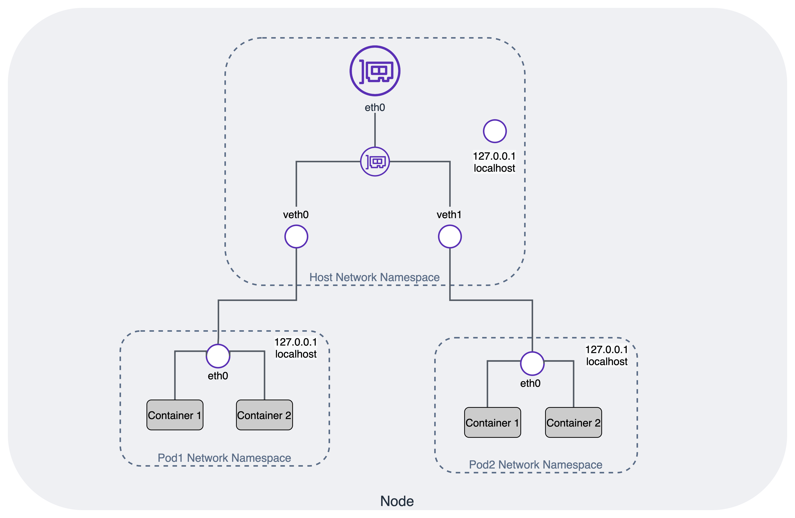
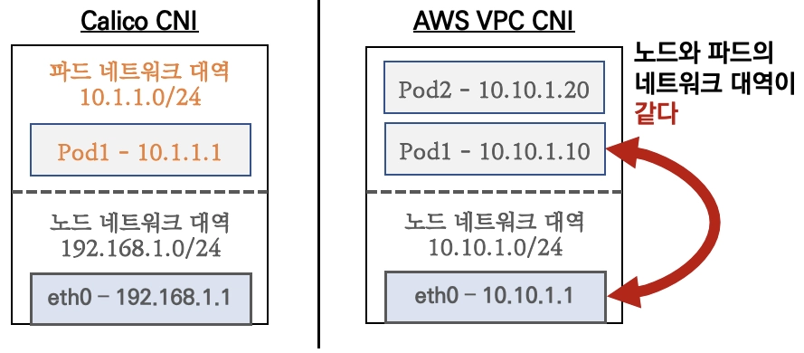
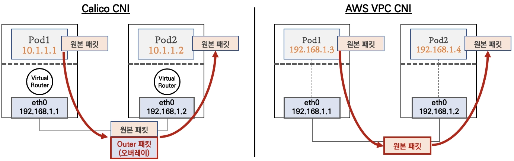
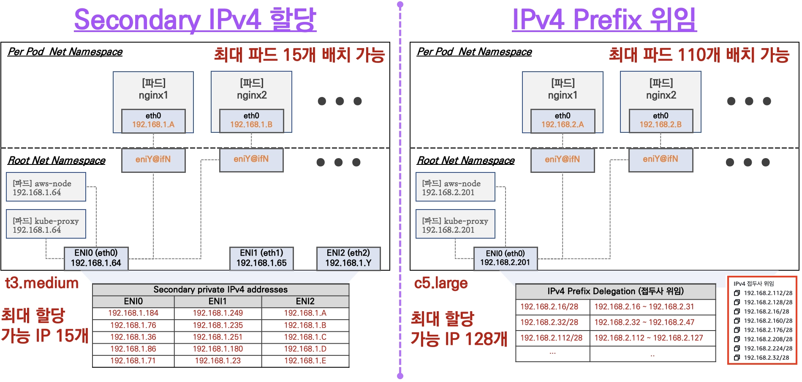
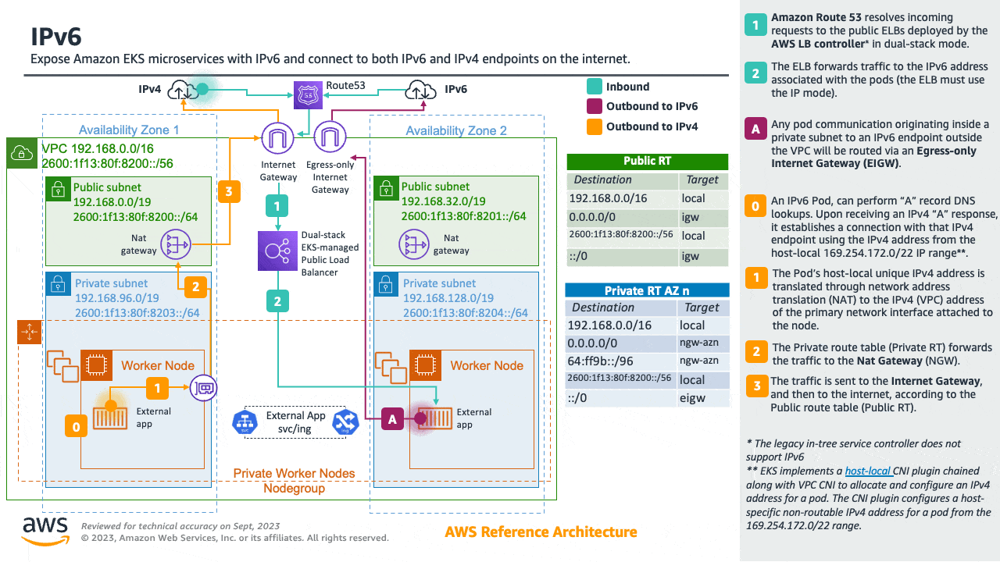
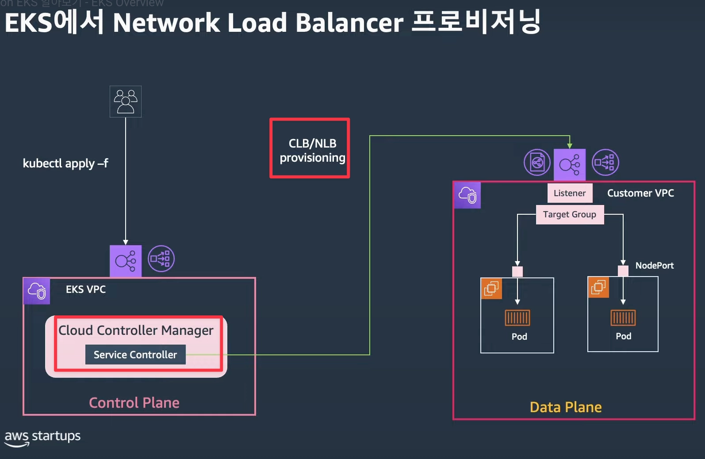
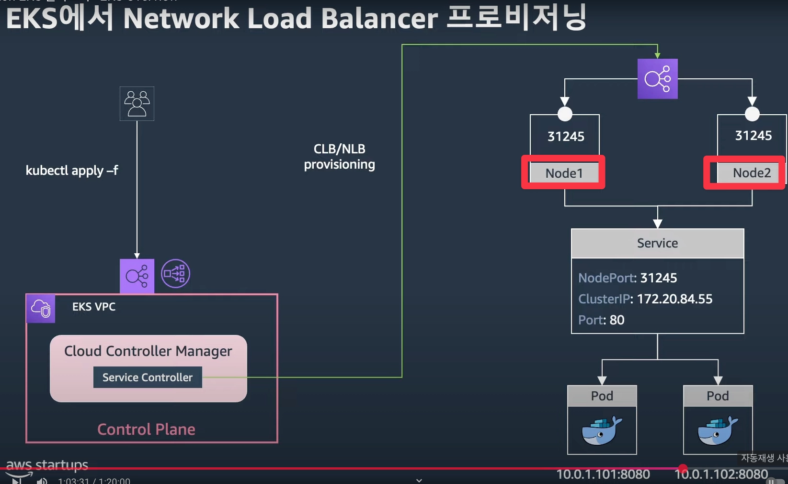
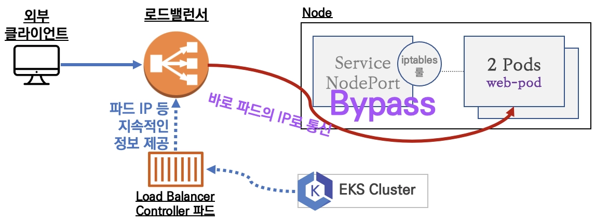
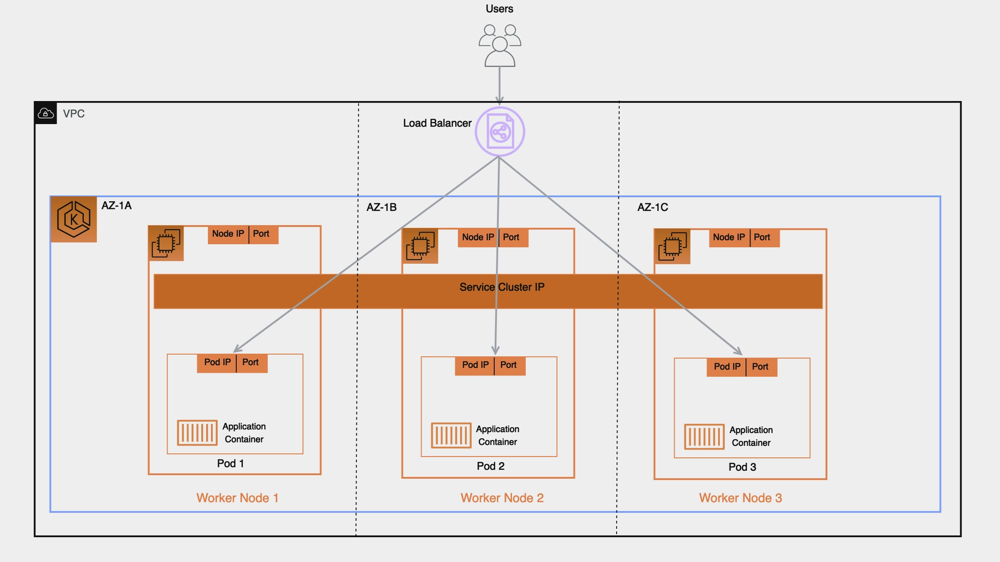

> *CloudNet 팀의 [2026년 AWS EKS Workshop Study 4기](https://gasidaseo.notion.site/26-AWS-EKS-Hands-on-Study-4-31a50aec5edf804b8294d8d512c43370) 2주차 학습 내용을 담고 있습니다.*

<!-- 
- Pod IP는 어떻게 할당되고, 노드 간에는 어떻게 통신하는가?
- AWS VPC CNI 설정값은 성능과 IP 사용량에 어떤 영향을 주는가?
- Service, Ingress, Gateway API, ExternalDNS, CoreDNS는 운영에서 어떤 관점으로 선택/튜닝해야 하는가? -->

## 1. 개요
Amazon EKS의 네트워크 구조는 관리 주체에 따라 AWS가 관리하는 **컨트롤 플레인(Control Plane)**과 사용자의 AWS 계정 내에 구성되는 **데이터 플레인(Data Plane)**으로 나뉩니다. 

- 컨트롤 플레인 (AWS 관리 영역): AWS 소유의 전용 VPC에서 실행됩니다. kube-apiserver, etcd 등 마스터 노드의 역할로 클러스터 상태 관리, 스케줄링 및 API 기반 제어를 처리합니다.
- 데이터 플레인 (사용자 관리 영역): 사용자가 생성한 VPC 내에서 워커 노드와 애플리케이션 Pod가 실행되며, 실제 비즈니스 트래픽이 처리되는 공간입니다.

우리가 실제 EKS 운영 환경에서 마주하는 대부분의 네트워크 이슈(Pod 간 통신 실패, DNS 지연, 외부 로드밸런서 연동, 서브넷의 IP 고갈 등)는 실제 애플리케이션 포드가 작동하는 데이터 플레인에서 발생합니다. 따라서 데이터 플레인의 네트워크 흐름을 잘 이해하는 것이 운영에 도움이 됩니다. 

---

## 2. Pod 통신
Pod는 쿠버네티스에서 애플리케이션을 실행하는 가장 작은 배포 단위입니다. Pod를 사용하여 컨테이너화된 애플리케이션을 실행할 수 있습니다. 단일 Pod와 컨테이너 간 일대일로 맵핑되는 단일 컨테이너가 일반적이나, 여러 컨테이너를 하나의 Pod에 선언하는 멀티 컨테이너 Pod를 사용하기도 합니다.

#### Pod 네트워크 특징

- 모든 Pod는 고유 IP를 할당받고, Pod 간 통신은 이 IP를 기준으로 이루어집니다.
- Pod는 영구적이지 않습니다. 노드 이슈나 배포로 인한 재시작/재스케줄 시 Pod가 재생성되면 IP가 변경됩니다. 외부에서 안정적으로 Pod에 접근하려면 고정된 진입점인 Service를 사용해야 합니다.

#### 트래픽 경로별 통신 흐름

Pod의 통신은 트래픽이 어디서 어디로 흐르는지에 따라 경로가 달라집니다.

| 시나리오 | 트래픽 경로 설명 |
|---|---|
| Pod-to-Pod (동일 노드) | 노드 내부의 가상 이더넷(veth) 쌍을 통해 직접 통신합니다. |
| Pod-to-Pod (타 노드) | 오버레이(캡슐화) 과정 없이 VPC 라우팅 테이블을 통해 타 노드의 Pod와 직접 통신합니다. |
| Pod-to-Service | kube-proxy가 iptables 또는 IPVS 규칙으로 Service IP(ClusterIP)를 백엔드 Pod IP로 DNAT하여 전달합니다. |
| Pod-to-External | Pod의 외부(인터넷) 향 트래픽은 노드 ENI를 통해 VPC로 나가며, 일반적으로 Private Subnet은 NAT Gateway를 경유하고 Public Subnet에서 퍼블릭 IP를 사용하는 경우 Internet Gateway를 통해 통신합니다(SNAT). AWS 서비스 접근은 NAT 대신 VPC Endpoint 경유가 가능합니다. |
| External-to-Pod | 외부 트래픽은 ALB/NLB를 거쳐 유입되며, Target type이 instance면 노드 NodePort로, ip면 Pod IP로 직접 전달됩니다. |

> 참고: 실제 NAT 동작은 CNI 설정(예: AWS VPC CNI의 SNAT 비활성화 옵션)과 라우팅 정책에 따라 달라질 수 있습니다.

<!-- 다중 컨테이너 Pod는 스토리지 볼륨이나 네트워크 네임스페이스 같은 리소스를 공유해야 하는 긴밀하게 결합된 프로세스에 유용합니다. 
- 사이드카 패턴(로그 수집, 모니터링 에이전트)
- 어댑터 패턴(출력 형식 표준화)
- 앰버서더 패턴(프록시 연결)
- 초기화 컨테이너(메인 컨테이너 시작 전 설정 작업 수행) 

Pod는 컨테이너 실행 외에도 스토리지, 구성 데이터 등 쿠버네티스의 다른 기능을 실행할 수 있습니다.  -->

---

## 3. AWS VPC CNI

쿠버네티스에서 CNI(Container Network Interface) 플러그인은 포드에 IP를 할당하고 Pod, 노드 간 네트워크 라우팅 및 네트워크 인터페이스를 구성하는 핵심 역할을 합니다. 
CNI가 정상 동작하지 않으면 포드는 네트워크 기능을 가질 수 없습니다.

- Host Network Namespace와 Pod Network Namespace 간의 관계

[Best Practices for EKS Networking](https://docs.aws.amazon.com/eks/latest/best-practices/networking.html)

- 쿠버네티스 네트워킹 모델 요구사항
    - 동일한 노드에 예약된 포드는 NAT(Network Address Translation)를 사용하지 않고 다른 포드와 통신할 수 있어야 합니다.
    - 특정 노드에서 실행되는 모든 시스템 데몬(백그라운드 프로세스, 예: [kubelet](https://kubernetes.io/docs/concepts/overview/components/))은 동일한 노드에서 실행되는 포드와 통신할 수 있습니다.
    - [호스트 네트워크를](https://docs.docker.com/network/host/) 사용하는 포드는 NAT를 사용하지 않고 다른 모든 노드의 다른 모든 포드에 연결할 수 있어야 합니다.

#### Amazon VPC CNI의 동작 방식

[Amazon VPC CNI](https://github.com/aws/amazon-vpc-cni-k8s)는 Amazon EKS가 AWS의 네트워킹 환경과 원활하게 통합되도록 설계된 네트워킹 솔루션입니다. VPC CNI는 EKS 클러스터를 프로비저닝할 때 기본 네트워킹 Add-on으로 설치됩니다. 

VPC CNI는 다음 두 가지 요소로 구성됩니다.

- CNI 바이너리: Pod-to-Pod 통신을 활성화하는 Pod 네트워크를 설정하고, 노드가 추가/제거될 때마다 kubelet에 의해 호출되어 Pod의 가상 이더넷(veth)을 노드의 ENI에 연결하여 VPC 네트워크의 IP 주소를 Pod에 할당합니다.
- IPAM 데몬 (ipamd): 
    - 각 노드에 부착된 ENI의 보조 IP(Secondary IP) 풀을 관리합니다. 
    - IP의 웜 풀(L-IPAM=Local-IPAM Warm IP Pool)을 유지하며, Pod가 생성될 때 웜 풀에서 즉시 사용가능한 Secondary IP를 가져와 할당합니다.

VPC CNI는 모든 EKS 워커 노드에서 aws-node라는 DaemonSet 형태로 실행되며, 아래와 같은 특징을 가집니다.

- 각 워커노드는 기본 ENI를 부여받습니다.
- VPC 네트워크의 Secondary ENI를 각 Pod에 할당하여 IP를 부여할 수 있으며, 인스턴스 용량에 따라 할당 가능한 ENI 갯수가 다릅니다. 
- Pod의 veth(가상 이더넷)를 노드의 Secondary IP가 할당된 ENI에 붙여 통신합니다.
- 가상 IP가 아닌 VPC 대역의 실제 IP를 직접 할당하므로 노드/Pod 간 직접 라우팅이 가능하며, AWS 네트워크 서비스(보안 그룹, Route table, VPC Flow Logs 등)를 통합하여 사용할 수 있습니다.

> 참고) EKS 사용 시 기본적으로는 VPC CNI 사용을 권장하나, [EKS Ultra-Scale Cluster](https://aws.amazon.com/blogs/containers/under-the-hood-amazon-eks-ultra-scale-clusters/) 또는 네트워크 지연에 민감한 워크로드를 실행한다면 VPC CNI + Cilium 하이브리드 패턴도 고려할 수 있습니다.

#### K8s CNI vs AWS VPC CNI

- `K8s CNI`: 노드 네트워크의 IP 대역과 Pod 네트워크의 IP 대역이 상이합니다.
- `AWS VPC CNI` : VPC 네트워크의 ENI가 Pod에 할당되어, Pod는 노드와 동일한 IP 대역의 주소를 가지며 직접 통신이 가능합니다.

- 일반적으로 K8s CNI(Calico, Flannel 등)는 노드의 네트워크 위에 가상의 네트워크 대역을 만들어 오버레이(VXLAN, IP-IP 등) 통신을 합니다. 오버레이 통신 시, 트래픽을 한 번 더 캡슐화해서 전송하므로 성능 손실이 발생할 수 있습니다. 
- Amazon VPC CNI 사용 시 노드와 포드가 동일한 네트워크 대역에 있어 오버레이 없이 직접 통신하므로 성능 손실이 없습니다.

- 참고: [VPC CNI - Best Practice](https://docs.aws.amazon.com/eks/latest/best-practices/vpc-cni.html), [Github](https://github.com/aws/amazon-vpc-cni-k8s), [Proposal](https://github.com/aws/amazon-vpc-cni-k8s/blob/master/docs/cni-proposal.md)

---

### 3.1 포드 IP 할당과 풀(Pool) 관리

포드가 생성될 때마다 매번 AWS API를 호출해 IP를 가져오면 지연이 발생합니다. 따라서 VPC CNI는 여분의 IP와 ENI를 웜 풀로 노드에 미리 확보해 두는 방식을 사용하며, 다음 설정값으로 성능과 IP 리소스 소비를 튜닝할 수 있습니다.

- WARM_ENI_TARGET: 노드에 미리 할당해 둘 여분의 ENI 개수 (IP를 낭비하지 않고 조밀하게 관리하고 싶다면 0 권장)
- WARM_IP_TARGET: 포드 생성에 즉시 사용할 수 있도록 미리 확보해 둘 여분의 IP 개수
- MINIMUM_IP_TARGET: 노드가 시작될 때 기본적으로 확보하고 유지해야 하는 최소 IP 개수, 노드 시작 후 초기 대규모 트래픽으로 Pod가 급격하게 Scale-out 될 때 IP 할당이 지연되는 것을 방지

클러스터의 규모와 IP 여유 상황에 따라 VPC CNI를 다음 세 가지 모드로 운영할 수 있습니다.
[링크](https://docs.aws.amazon.com/eks/latest/userguide/cni-increase-ip-addresses.html)

#### 보조 IP 모드(기본값)
(Secondary IP Mode)

- 인스턴스 ENI의 보조 IP(Secondary IP)를 포드에 1:1로 할당하는 기본 모드입니다.
- 노드의 인스턴스 타입에 따라 하나의 노드에 배치할 수 있는 최대 포드 수의 상한선이 결정됩니다.
- 주 IP와 Secondary IP를 가질 수 있습니다. 
- Secondary IP만 포드에 할당할 수 있으며, 주 IP는 노드 및 `aws-node`, `kube-proxy` 파드에서 사용합니다.

#### 접두사 모드

[Prefix Mode](https://docs.aws.amazon.com/eks/latest/best-practices/prefix-mode-linux.html)

- ENI에 개별 IP 대신 /28 IPv4 Prefix(IP 16개 묶음)를 통째로 할당합니다. 
- 최대 할당 가능한 IP 수와 인스턴스 유형에 권장하는 최대 갯수로 IP를 선점합니다. 
- 하나의 ENI로 훨씬 더 많은 IP를 관리할 수 있어, 고밀도 스케줄링이 필요하거나 포드가 폭발적으로 생성될 때 효율적입니다.

#### 사용자 지정 네트워킹
[보조 CIDR 할당 사용, Custom Networking](https://docs.aws.amazon.com/eks/latest/userguide/cni-custom-network.html),
[Best Practice](https://docs.aws.amazon.com/eks/latest/best-practices/ip-opt.html)

- 노드가 사용하는 서브넷과 포드가 사용할 서브넷(보조 CIDR)을 분리하여, 포드에 별도 서브넷을 부여하여 사용하는 방식입니다.
- 기존 VPC 대역의 가용 IP가 부족할 때, 포드 전용의 넓은 서브넷 대역을 추가하여 IP 고갈 문제를 해결할 수 있습니다.
- 포드 서브넷으로 통신사에서 사용하는 CG-NAT 대역대 `100.64.0.0/16`을 권장됩니다. 

---

### 3.2 포드 보안 그룹

기본적으로 보안 그룹은 노드의 기본 ENI에 연결된 보안 그룹이 Pod에도 적용됩니다. EKS에서는 Pod 단위로 보안 그룹 정책을 적용할 수 있으므로 특정 Pod만 DB에 접근하게 하는 등의 세밀한 접근 통제가 필요할 때 사용할 수 있습니다.

VPC CNI의 `ENABLE_POD_ENI=true` 설정으로 Pod 보안그룹을 활성화할 수 있습니다. 

>참고: [포드당 보안 그룹](https://docs.aws.amazon.com/ko_kr/eks/latest/best-practices/sgpp.html)

---

<!-- ## 노드당 포드 수 제한

EKS 노드(EC2)에 배치할 수 있는 최대 포드 수는 무한하지 않으며, 인스턴스 유형과 네트워크 모드에 따라 결정됩니다. 
이 최대치를 결정하는 파라미터가 maxPods이며, 우선순위로 상호 작용하는 여러 구성 요소에 따라 달라집니다.

- **우선순위(가장 높은 순서에서 낮은 순서):**

1. **관리형 노드 그룹 적용** - [사용자 지정 AMI](https://docs.aws.amazon.com/ko_kr/eks/latest/userguide/launch-templates.html#launch-template-custom-ami) 없이 관리형 노드 그룹을 사용하는 경우 Amazon EKS는 노드 사용자 데이터의 `maxPods`에 최대 한도를 적용합니다. vCPU가 30개 미만인 인스턴스의 경우 최대 한도는 `110` 입니다. vCPU가 30개를 초과하는 인스턴스의 경우 최대 한도는 `250`입니다. 이 값은 `maxPodsExpression`을 포함하여 다른 `maxPods` 구성보다 우선합니다.
    
    ⇒ ***vCPU 30개 미만 EC2 인스턴스 유형은 ([k8s 확장 권고값에 따라](https://github.com/kubernetes/community/blob/master/sig-scalability/configs-and-limits/thresholds.md)) 노드에 최대 파드 110개 제한이 되고,
    vCPU 30이상 EC2 인스턴스 유형은 (AWS 내부 테스트 권고값에 따라) 노드에 최대 파드 250개 제한을 권고합니다.***
    
2. **kubelet `maxPods` 구성** - kubelet 구성에서 직접 `maxPods`를 설정하는 경우(예: 사용자 지정 AMI를 사용하는 시작 템플릿을 통해) 이 값이 `maxPodsExpression`보다 우선합니다.
3. **nodeadm `maxPodsExpression`** - `NodeConfig`에서 [`maxPodsExpression`](https://awslabs.github.io/amazon-eks-ami/nodeadm/doc/examples/#defining-a-max-pods-expression)을 사용하는 경우 nodeadm은 표현식을 평가하여 `maxPods`를 계산합니다. 이 방법은 우선순위가 더 높은 소스에 의해 값이 아직 설정되지 않은 경우에만 유효합니다.
4. **기본 ENI 기반 계산** - 다른 값이 설정되지 않은 경우 AMI는 인스턴스 유형에서 지원하는 탄력적 네트워크 인터페이스 및 IP 주소 수를 기반으로 `maxPods`를 계산합니다. 이는 `(number of ENIs × (IPs per ENI − 1)) + 2` 공식과 동일합니다. `+ 2`는 포드 IP 주소를 소비하지 않는 모든 노드에서 실행되는 Amazon VPC CNI 및 `kube-proxy`를 고려합니다.

[Docs](https://docs.aws.amazon.com/eks/latest/userguide/choosing-instance-type.html#max-pods-precedence), [Kor](https://docs.aws.amazon.com/ko_kr/eks/latest/userguide/choosing-instance-type.html#max-pods-precedence) -->

## 4. 서비스로 포드 외부 노출

Pod가 재시작되면 새로운 가상 IP 주소가 할당되므로, IP 주소를 통한 Pod 간 통신은 시간이 지남에 따라 안정적인 네트워크 인터페이스를 보장하지 않습니다. 
Service를 통하여 Pod의 재시작에 따른 IP 변경과 무관한 안정적인 엔드포인트를 제공하고, 포드 간 부하를 분산할 수 있습니다. 

- K8s Service 종류
    - `ClusterIP`: 클러스터 내부 통신, 클러스터 외부에서는 접근 X
    - `NodePort`: 노드 포트 기반 외부 진입, IP:NodePort로 접근 가능
    - `LoadBalancer`: 클라우드 로드밸런서 연동 또는 온프레미스 환경에서 MetalLB와 같은 소프트웨어 사용
    - `ExternalName`: 쿠버네티스 클러스터 내부에서 서비스 도메인으로 접근 시 CNAME 레코드를 리턴하여 접속

> Pod에서 서비스 호출 시 대부분의 경우 Pod는 호스트명으로 서비스를 호출하며, 이 이름 해석은 kube-system 네임스페이스에서 Pod로 실행되는 CoreDNS가 담당합니다.

---

## 5. Amazon EKS의 서비스

- Cloud Controller Manager: 기본 `LoadBalancer` Service를 통해 CLB/NLB를 프로비저닝하는 경우 NodePort의 IP, 포트번호 사용하여 Pod 접근
  
 [Video](https://youtu.be/E49Q3y9wsUo?si=reLXmCvO1me52lf4&t=3751)

- AWS Load Balancer Controller를 사용하면 Amazon VPC CNI와 사용하여 NLB IP 타깃 모드 동작 가능

[Best Practice](https://docs.aws.amazon.com/eks/latest/best-practices/load-balancing.html)

<!-- #### kube-proxy와 Service 트래픽 처리

kube-proxy는 각 노드에서 Service 가상 IP(ClusterIP)를 실제 Pod IP(Endpoint)로 연결해 주는 규칙을 관리합니다.

- 핵심 역할
    - 노드별 `iptables`/`ipvs`/`nftables` 규칙 구성
    - Service 트래픽의 DNAT 및 엔드포인트 분산
    - Service/Endpoint 변경 시 규칙 동기화
- 참고 포인트
    - kube-proxy는 L4(TCP/UDP/SCTP) 트래픽 처리 계층이며, HTTP 레벨 라우팅을 이해하지 않습니다.
    - 실데이터 패킷을 직접 프록시하지 않고(iptables/ipvs 모드 기준) 커널 규칙을 설정하는 역할에 가깝습니다.

#### kube-proxy 모드 요약

- `iptables`
    - netfilter 규칙으로 Service -> Pod DNAT 처리
    - 기본적으로 endpoint 선택은 확률 기반(랜덤)
    - 안정적이고 범용적이며 대부분 환경에서 무난
- `ipvs`
    - 커널 IPVS 기반으로 동작
    - 대규모 서비스에서 규칙 동기화 및 처리량 측면 이점
- `nftables`
    - iptables의 후속 인터페이스
    - 대규모 엔드포인트 변경 처리 효율 개선 기대
    - Kubernetes/네트워크 플러그인 호환성 확인 필요
- `eBPF` 계열(대체 데이터플레인)
    - netfilter 경로를 우회하거나 최소화해 지연/CPU 최적화 가능
    - 운영 난이도와 관측/디버깅 체계까지 함께 설계 필요 -->

<!-- #### ClusterIP 통신 흐름(iptables 관점)

실습에서 확인한 핵심 흐름은 아래와 같습니다.

1. Pod가 Service의 ClusterIP로 요청 전송
2. `nat/PREROUTING` -> `KUBE-SERVICES`로 진입
3. `KUBE-SVC-*` 체인에서 endpoint 확률 분기
4. `KUBE-SEP-*` 체인에서 실제 Pod IP:Port로 DNAT
5. 조건에 따라 `KUBE-POSTROUTING`에서 SNAT(MASQUERADE) 적용 여부 결정

중요한 점은 "Service는 가상 IP"이며, 실제 전달 대상은 항상 Endpoint(Pod IP)라는 것입니다. -->

<!-- #### Ingress, ALB, NLB 선택 기준

- L4 중심(TCP/UDP, 고성능 단순 분산): NLB(Service)
- L7 중심(Host/Path 라우팅, HTTP 제어): ALB(Ingress)
- 멀티 리스너/정책 확장 중심: Gateway API

Service vs Ingress vs Gateway API: 언제 무엇을 쓸까?

#### NLB(L4) vs ALB(L7) 비교

| 항목 | NLB (Service 중심) | ALB (Ingress/Gateway HTTPRoute 중심) |
|---|---|---|
| 동작 계층 | L4 (TCP/UDP/TLS) | L7 (HTTP/HTTPS) |
| 라우팅 방식 | 포트/타깃 기반 | Host/Path/Header 기반 |
| 성능 특성 | 낮은 지연, 단순 고성능 분산 | 애플리케이션 라우팅 유연성 우수 |
| 주요 사용처 | 게임, 스트리밍, 고성능 API, 비HTTP 트래픽 | 웹 서비스, 마이크로서비스 API 게이트웨이 |
| 클라이언트 IP 처리 | target type/Proxy Protocol v2 설정 영향 큼 | `X-Forwarded-For` 기반 활용 용이 |
| TLS 종료 | NLB 또는 백엔드에서 처리 | ALB에서 종료/재암호화 구성 용이 | -->

<!-- #### AWS Load Balancer Controller with Service(L4)

AWS Load Balancer Controller를 사용하여 L4 레이어 NLB 서비스 배포 시 인스턴스 유형/IP 유형

1. 인스턴스 유형 : 노드에 NodePort로 전달
- `instance`
    - NLB -> 노드 NodePort -> Pod
    - `externalTrafficPolicy: Cluster`이면 로드밸런서 -> 노드 -> 파드로 
    - `externalTrafficPolicy: Local`인 경우전달하여 Client IP 유지

1. IP 유형 ⇒ 반드시 AWS LoadBalancer 컨트롤러 포드 및 정책 설정 필요
- `ip`
    - NLB -> Pod IP 직접 전달
    - NodePort 의존이 줄고 홉이 감소
    - Pod 증감 시 TargetGroup 업데이트를 컨트롤러가 자동 반영
    - `allocateLoadBalancerNodePorts: false` 적용하여 무의미한 NodePort 할당 차단 가능 -->
<!-- 
- 파드 스케일 변경(1 -> 3, 3 -> 1) 시 TargetGroup이 자동으로 동기화됩니다.
- 기본 deregistration delay(300초)는 롤링/축소 시 체감 지연이 커질 수 있어, 워크로드 특성에 맞게 조정이 필요합니다.
- 애플리케이션에서 실제 원본 Client IP가 필요하면 Proxy Protocol v2 사용 여부를 설계 단계에서 결정해야 합니다. -->
<!-- 
#### Ingress (L7:HTTP)
인그레스 소개 : 클러스터 내부의 서비스(ClusterIP, NodePort, Loadbalancer)를 외부로 노출(HTTP/HTTPS) - Web Proxy 역할
AWS Load Balancer Controller + Ingress (ALB) IP 모드 동작 with AWS VPC CNI

Ingress는 "HTTP 트래픽 정책"을 선언적으로 관리할 때 가장 효과적입니다.

- ALB Ingress에서 자주 쓰는 기능
    - Host 기반 라우팅 (`api.example.com`, `app.example.com`)
    - Path 기반 라우팅 (`/api`, `/admin`)
    - TLS 인증서(ACM) 연동
    - WAF/보안 정책 결합
- 실습 핵심
    - Ingress 생성 시 ALB와 TargetGroupBinding이 함께 생성됩니다.
    - target-type을 `ip`로 쓰면 ALB에서 Pod IP로 직접 전달됩니다.
    - 파드 스케일 변동이 TargetGroup 헬스 상태에 반영되는 시간을 관찰하면 데이터플레인 이해에 도움이 됩니다. -->

<!-- ### 5.1 ExternalDNS

쿠버네티스 서비스/인그레스/Gateway API 생성 시 도메인을 설정하면 클라우드 프로바이더의 DNS 서비스에 A 레코드(TXT)로 자동 생성/삭제됩니다.

ExternalDNS는 "리소스 선언 -> DNS 레코드 동기화"를 자동화해 운영 실수를 줄여줍니다.

- 권장 구성
    - IRSA/PID 기반 권한 부여
    - `domainFilters`로 관리 대상 도메인 제한
    - 멀티 클러스터 환경에서는 `txtOwnerId`로 소유권 충돌 방지
- 정책 선택
    - `policy: sync` : 쿠버네티스 리소스 삭제 시 DNS도 삭제
    - `policy: upsert-only` : 생성/수정만 자동화, 삭제는 수동
- 소스 확장
    - `service`, `ingress` 외에 Gateway API 리소스도 소스로 등록 가능

실습에서는 `Service(type=LoadBalancer)`에 `external-dns.alpha.kubernetes.io/hostname` annotation을 추가해 Route 53 A 레코드가 자동 생성되는 흐름을 확인했습니다.

#### Ingress(**ALB** + **HTTPS**) + 도메인 연동(ExternalDNS)

Ingress 리소스에 호스트명을 선언하고, ExternalDNS가 이를 감지해 Route 53에 레코드를 생성하면 "ALB + HTTPS + 도메인" 구성을 자동화할 수 있습니다.

- 권장 절차
    1. ACM 인증서 준비
    2. Ingress annotation으로 인증서 ARN/리스너 정책 반영
    3. ExternalDNS가 해당 호스트 레코드 생성
    4. `dig`, `nslookup`, 브라우저 접속으로 검증

운영 관점에서는 인증서 만료, ALB 리스너 정책, DNS 전파 시간(TTL)을 함께 모니터링해야 장애를 줄일 수 있습니다.

### 5.2 Gateway API

Gateway API는 Ingress의 한계를 보완해 더 명확한 역할 분리와 확장성을 제공합니다.

- 주요 리소스
    - `GatewayClass`: 어떤 컨트롤러가 처리할지 정의
    - `Gateway`: 실제 리스너(예: 80/443)와 엔드포인트
    - `HTTPRoute`/`TLSRoute`/`TCPRoute`: 트래픽 라우팅 규칙
- EKS + AWS LBC 관점
    - LBC 버전/CRD 요건을 충족해야 하며, feature flag 활성화가 필요할 수 있습니다.
    - `LoadBalancerConfiguration`, `TargetGroupConfiguration` 같은 확장 CRD로 ALB/NLB 속성을 세밀하게 제어할 수 있습니다.

#### Ingress 대비 Gateway API 장점

- 역할 분리: 플랫폼 팀과 앱 팀의 책임 경계를 명확히 분리
- 정책 확장: 라우팅/리스너/보안 정책을 CRD로 세분화
- 미래 지향성: 멀티 프로토콜/멀티 리스너 시나리오 대응이 용이

학습 관점에서는 먼저 Ingress로 L7 흐름을 이해하고, 이후 Gateway API로 동일 시나리오를 구현해 차이를 비교해 보는 방식이 가장 빠릅니다.

## 6. CoreDNS

쿠버네티스는 CoreDNS라는 DNS 서비스를 통해 모든 서비스를 이름으로 등록합니다. 내부적으로 CoreDNS는 서비스 이름을 호스트명으로 저장하고 이를 클러스터 IP 주소에 매핑합니다. 

IP 주소는 일시적이고 예측이 불가능한 반면, 레이블은 선언적이며 알려져있습니다.

정확한 서비스 검색을 확인하려면 동일한 네임스페이스에서 호스트명과 인바운드 포트를 사용하여 서비스에 호출을 수행하는 Pod를 실행해볼 수 있습니다.

동일 네임스페이스에서 호스트명과 수신 포트를 사용하여 서비스를 호출하는 Pod를 실행함으로써 올바른 서비스 검색을 확인할 수 있습니다. 

#### 운영에서 확인할 포인트

- 가용성
    - CoreDNS는 최소 2개 이상 replica 유지
    - PodDisruptionBudget(PDB) 설정으로 동시 중단 방지
    - `topologySpreadConstraints`로 AZ/노드 분산
- 안정성
    - readiness probe는 `/ready` 사용 권장
    - 종료 시 `lameduck` 옵션으로 질의 유실 최소화
- 성능
    - 캐시 hit ratio 확인
    - 지연 증가 시 NodeLocal DNSCache 도입 검토
    - 불필요한 외부 조회를 줄이기 위해 검색 도메인/ndots 설정 점검

#### DNS 트러블슈팅 기본 순서

1. 애플리케이션 Pod에서 `nslookup`/`dig`로 이름 해석 확인
2. Service와 Endpoint/EndpointSlice 매핑 확인
3. CoreDNS Pod 로그/재시작 횟수 확인
4. 노드/네트워크 정책/보안 그룹에서 DNS(53/UDP,TCP) 경로 점검 -->

<!-- ## EKS 네트워크 트러블슈팅 체크리스트

네트워크 이슈 대응은 계층별 확인 순서가 있으면 훨씬 빨라집니다.

1. DNS: `nslookup`, `dig`, CoreDNS 로그/메트릭 확인
2. Service: Endpoints/EndpointSlice와 Service 타입 확인
3. Pod: Pod 상태, 라벨, 네트워크 폴리시 확인
4. Node: ENI/IP 여유, `aws-node` 상태, `iptables` 규칙 확인
5. VPC: Route Table, NACL, Security Group, NAT 경로 확인 -->

## 7. 참고 자료
- EKS Best Practice Docs: [EN](https://docs.aws.amazon.com/eks/latest/best-practices/introduction.html), [KR](https://aws.github.io/aws-eks-best-practices/ko/networking/index/)
- EKS 네트워킹 소개 영상[Link](https://youtu.be/E49Q3y9wsUo?si=wH7fGLTdRs2rPxKl&t=2521)
- https://dev.to/parimal5/why-cilium-outperforms-aws-vpc-cni-a-deep-dive-into-kubernetes-networking-nef
- Exposing Kubernetes Applications, Part 1: Service and Ingress Resources: https://aws.amazon.com/blogs/containers/exposing-kubernetes-applications-part-1-service-and-ingress-resources/
- AWS Load Balancer Controller 문서: https://kubernetes-sigs.github.io/aws-load-balancer-controller/latest/
- ExternalDNS AWS 튜토리얼: https://github.com/kubernetes-sigs/external-dns/blob/master/docs/tutorials/aws.md
- Gateway API 공식 문서: https://gateway-api.sigs.k8s.io/