> *CloudNet 팀의 [2026년 AWS EKS Workshop Study 4기](https://gasidaseo.notion.site/26-AWS-EKS-Hands-on-Study-4-31a50aec5edf804b8294d8d512c43370) 2주차 학습 내용을 담고 있습니다.*

## 1. 실습 환경 구성
2주차 실습 자료를 다운로드 받아 실습 환경을 구성하였습니다. <br/>
금주 Pod의 IP 할당 실습이 진행될 예정으로, Terraform 코드 내 서브넷 마스크가 22로 변경되어 있습니다. 


```Bash
# 코드 다운로드, 작업 디렉터리 이동
git clone https://github.com/gasida/aews.git
cd aews/2w

# 변수 지정
export TF_VAR_KeyName=$(aws ec2 describe-key-pairs --query "KeyPairs[].KeyName" --output text)
export TF_VAR_ssh_access_cidr=$(curl -s ipinfo.io/ip)/32
echo $TF_VAR_KeyName $TF_VAR_ssh_access_cidr

# 배포 : 12분 정도 소요

terraform init
terraform plan
nohup sh -c "terraform apply -auto-approve" > create.log 2>&1 &
tail -f create.log


# 자격증명 설정
terraform output -raw configure_kubectl
aws eks --region ap-southeast-1 update-kubeconfig --name myeks
kubectl config rename-context $(cat ~/.kube/config | grep current-context | awk '{print $2}') myeks
```

## 2. EKS 기본 정보 확인
  
```Bash
# 클러스터 확인
kubectl cluster-info
Kubernetes control plane is running at https://F077EF3C6046F7E7513BA007BFA218F2.gr7.ap-southeast-1.eks.amazonaws.com
CoreDNS is running at https://F077EF3C6046F7E7513BA007BFA218F2.gr7.ap-southeast-1.eks.amazonaws.com/api/v1/namespaces/kube-system/services/kube-dns:dns/proxy

To further debug and diagnose cluster problems, use 'kubectl cluster-info dump'.

eksctl get cluster
NAME    REGION          EKSCTL CREATED
myeks   ap-southeast-1  False

# 네임스페이스 default 변경 적용
kubens default
Context "arn:aws:eks:ap-southeast-1:{AccountID}:cluster/myeks" modified.
Active namespace is "default".

# 노드 정보 확인
kubectl get node --label-columns=node.kubernetes.io/instance-type,eks.amazonaws.com/capacityType,topology.kubernetes.io/zone
NAME                                               STATUS   ROLES    AGE   VERSION               INSTANCE-TYPE   CAPACITYTYPE   ZONE
ip-192-168-0-174.ap-southeast-1.compute.internal   Ready    <none>   22m   v1.34.4-eks-f69f56f   t3.medium       ON_DEMAND      ap-southeast-1a
ip-192-168-6-86.ap-southeast-1.compute.internal    Ready    <none>   22m   v1.34.4-eks-f69f56f   t3.medium       ON_DEMAND      ap-southeast-1b
ip-192-168-9-205.ap-southeast-1.compute.internal   Ready    <none>   22m   v1.34.4-eks-f69f56f   t3.medium       ON_DEMAND      ap-southeast-1c

kubectl get node -v=6
I0326 04:30:35.878065   77812 cmd.go:527] kubectl command headers turned on
I0326 04:30:35.938921   77812 loader.go:402] Config loaded from file:  /Users/mzc01-siyoung/.kube/config
I0326 04:30:35.943113   77812 envvar.go:172] "Feature gate default state" feature="ClientsAllowCBOR" enabled=false
I0326 04:30:35.943152   77812 envvar.go:172] "Feature gate default state" feature="ClientsPreferCBOR" enabled=false
I0326 04:30:35.943156   77812 envvar.go:172] "Feature gate default state" feature="InformerResourceVersion" enabled=false
I0326 04:30:35.943159   77812 envvar.go:172] "Feature gate default state" feature="InOrderInformers" enabled=true
I0326 04:30:35.943161   77812 envvar.go:172] "Feature gate default state" feature="WatchListClient" enabled=false
I0326 04:30:35.943164   77812 envvar.go:172] "Feature gate default state" feature="InOrderInformersBatchProcess" enabled=false
I0326 04:30:37.183790   77812 round_trippers.go:632] "Response" verb="GET" url="https://F077EF3C6046F7E7513BA007BFA218F2.gr7.ap-southeast-1.eks.amazonaws.com/api/v1/nodes?limit=500" status="200 OK" milliseconds=1210
NAME                                               STATUS   ROLES    AGE   VERSION
ip-192-168-0-174.ap-southeast-1.compute.internal   Ready    <none>   23m   v1.34.4-eks-f69f56f
ip-192-168-6-86.ap-southeast-1.compute.internal    Ready    <none>   23m   v1.34.4-eks-f69f56f
ip-192-168-9-205.ap-southeast-1.compute.internal   Ready    <none>   23m   v1.34.4-eks-f69f56f

# 노드 라벨 확인
# Terraform에서 설정된 'tier=primary' node label 확인 가능
kubectl get node --show-labels
kubectl get node -l tier=primary
ip-192-168-9-205.ap-southeast-1.compute.internal   Ready    <none>   24m   v1.34.4-eks-f69f56f   beta.kubernetes.io/arch=amd64,beta.kubernetes.io/instance-type=t3.medium,beta.kubernetes.io/os=linux,eks.amazonaws.com/capacityType=ON_DEMAND,eks.amazonaws.com/nodegroup-image=ami-07519ef34ac4a1ff4,eks.amazonaws.com/nodegroup=myeks-1nd-node-group,eks.amazonaws.com/sourceLaunchTemplateId=lt-0dd63f934ada196b4,eks.amazonaws.com/sourceLaunchTemplateVersion=1,failure-domain.beta.kubernetes.io/region=ap-southeast-1,failure-domain.beta.kubernetes.io/zone=ap-southeast-1c,k8s.io/cloud-provider-aws=5553ae84a0d29114870f67bbabd07d44,kubernetes.io/arch=amd64,kubernetes.io/hostname=ip-192-168-9-205.ap-southeast-1.compute.internal,kubernetes.io/os=linux,node.kubernetes.io/instance-type=t3.medium,**tier=primary**,topology.k8s.aws/zone-id=apse1-az3,topology.kubernetes.io/region=ap-southeast-1,topology.kubernetes.io/zone=ap-southeast-1c

# 파드 정보 확인
kubectl get pod -A
kubectl get pdb -n kube-system
NAME      MIN AVAILABLE   MAX UNAVAILABLE   ALLOWED DISRUPTIONS   AGE
coredns   N/A             1                 1                     82m

# 클러스터와 노드 그룹 이름을 지정하여 노드그룹 확인
aws eks describe-nodegroup --cluster-name myeks --nodegroup-name myeks-1nd-node-group | jq

# eks addon 확인
aws eks list-addons --cluster-name myeks | jq
eksctl get addon --cluster myeks 
NAME            VERSION                 STATUS  ISSUES  IAMROLE UPDATE AVAILABLE        CONFIGURATION VALUES NAMESPACE        POD IDENTITY ASSOCIATION ROLES
coredns         v1.13.2-eksbuild.3      ACTIVE  0                                                            kube-system
kube-proxy      v1.34.5-eksbuild.2      ACTIVE  0                                                            kube-system
vpc-cni         v1.21.1-eksbuild.5      ACTIVE  0                                       {"env":{"WARM_ENI_TARGET":"1"}}       kube-system
```

---

## 3. 노드의 네트워크 정보 확인

```Bash
# EC2 ENI IP 확인
aws ec2 describe-instances --query "Reservations[*].Instances[*].{PublicIPAdd:PublicIpAddress,PrivateIPAdd:PrivateIpAddress,InstanceName:Tags[?Key=='Name']|[0].Value,Status:State.Name}" --filters Name=instance-state-name,Values=running --output table

------------------------------------------------------------------------
|                           DescribeInstances                          |
+-----------------------+----------------+------------------+----------+
|     InstanceName      | PrivateIPAdd   |   PublicIPAdd    | Status   |
+-----------------------+----------------+------------------+----------+
|  myeks-1nd-node-group |  192.168.9.205 |  13.229.157.220  |  running |
|  myeks-1nd-node-group |  192.168.0.174 |  52.77.251.226   |  running |
|  myeks-1nd-node-group |  192.168.6.86  |  13.228.25.57    |  running |
+-----------------------+----------------+------------------+----------+

# 각 노드의 Public IP를 일시적 환경변수로 적용
N1=13.229.157.220
N2=52.77.251.226
N3=13.228.25.57

# 워커 노드 SSH 접속
for i in $N1 $N2 $N3; do echo ">> node $i <<"; ssh -o StrictHostKeyChecking=no ec2-user@$i hostname; echo; done


# 파드 상세 정보 확인
kubectl get daemonset aws-node --namespace kube-system -owide
kubectl describe daemonset aws-node --namespace kube-system

# kube-proxy config 확인 : 모드 iptables 사용
kubectl describe cm -n kube-system kube-proxy-config
...
mode: "iptables"
...

kubectl describe cm -n kube-system kube-proxy-config | grep iptables: -A5
iptables:
  masqueradeAll: false
  masqueradeBit: 14
  minSyncPeriod: 0s
  syncPeriod: 30s
ipvs:
# ipvs는 지원중단으로 nftables 사용 권장

# aws-node 데몬셋 env 확인
kubectl get ds aws-node -n kube-system -o json | jq '.spec.template.spec.containers[0].env'

# 노드 IP 확인
aws ec2 describe-instances --query "Reservations[*].Instances[*].{PublicIPAdd:PublicIpAddress,PrivateIPAdd:PrivateIpAddress,InstanceName:Tags[?Key=='Name']|[0].Value,Status:State.Name}" --filters Name=instance-state-name,Values=running --output table

# 파드 IP 확인
kubectl get pod -n kube-system -o=custom-columns=NAME:.metadata.name,IP:.status.podIP,STATUS:.status.phase

# 파드 이름 확인
kubectl get pod -A -o name

# 파드 갯수 확인
kubectl get pod -A -o name | wc -ls

# cni log 확인
for i in $N1 $N2 $N3; do echo ">> node $i <<"; ssh ec2-user@$i tree /var/log/aws-routed-eni ; echo; done
for i in $N1 $N2 $N3; do echo ">> node $i <<"; ssh ec2-user@$i sudo cat /var/log/aws-routed-eni/plugin.log | jq ; echo; done
for i in $N1 $N2 $N3; do echo ">> node $i <<"; ssh ec2-user@$i sudo cat /var/log/aws-routed-eni/ipamd.log | jq ; echo; done

# 네트워크 정보 확인 : eniY는 pod network 네임스페이스와 veth pair
for i in $N1 $N2 $N3; do echo ">> node $i <<"; ssh ec2-user@$i sudo ip -br -c addr; echo; done
for i in $N1 $N2 $N3; do echo ">> node $i <<"; ssh ec2-user@$i sudo ip -c addr; echo; done
for i in $N1 $N2 $N3; do echo ">> node $i <<"; ssh ec2-user@$i sudo ip -c route; echo; done

ssh ec2-user@$N1 sudo iptables -t nat -S
ssh ec2-user@$N1 sudo iptables -t nat -L -n -v

```

### 3.1. 워커 노드의 ENI 확인

- 실습용으로 생성한 t3.medium 타입의 경우 ENI는 3개, ENI마다 최대 6개의 IP를 가질 수 있습니다. 그 중 Secondary IP만 포드에 할당이 가능하므로 노드 하나 당 최대 15개까지의 포드 생성이 가능합니다.

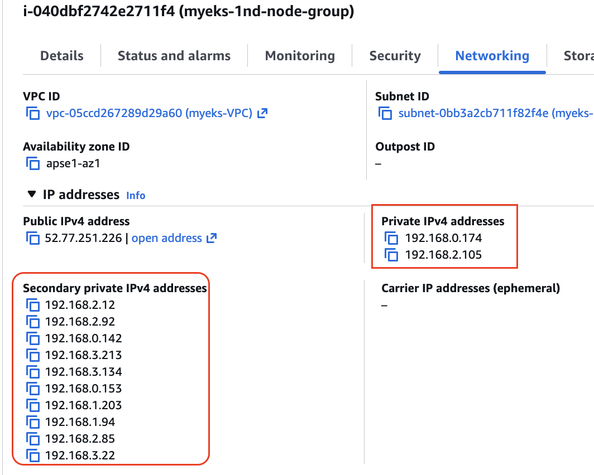

워커 노드의 인스턴스 네트워크 정보에서 프라이빗 IP 2개와 Secondary 프라이빗 IP 10개가 확인됩니다. 

- 보조 IPv4 주소를 coredns 파드가 사용하는지 확인 ⇒ coredns 파드가 배치되지 않은 워커 노드에 ENI 갯수 확인!

```Bash
# coredns 파드 IP 정보 확인
# 3개 중 2개 노드에만 Coredns 배치, 배치되지 않은 워커 노드도 ENI 갯수 2개로 동일 (설정에 따라 미리 ENI 추가)
kubectl get pod -n kube-system -l k8s-app=kube-dns -owide
NAME                       READY   STATUS    RESTARTS   AGE   IP              NODE                                               NOMINATED NODE   READINESS GATES
coredns-7d7954875f-55tcc   1/1     Running   0          46m   192.168.11.99   ip-192-168-9-205.ap-southeast-1.compute.internal   <none>           <none>
coredns-7d7954875f-pv7rs   1/1     Running   0          49m   192.168.2.12    ip-192-168-0-174.ap-southeast-1.compute.internal   <none>           <none>

# 노드의 라우팅 정보 확인 
# EC2 네트워크 정보의 '보조 프라이빗 IPv4 주소'에 있는 IP가 확인됨
for i in $N1 $N2 $N3; do echo ">> node $i <<"; ssh ec2-user@$i sudo ip -c route; echo; done
>> node 52.77.251.226 <<
default via 192.168.0.1 dev ens5 proto dhcp src 192.168.0.174 metric 512 
192.168.0.0/22 dev ens5 proto kernel scope link src 192.168.0.174 metric 512 
192.168.0.1 dev ens5 proto dhcp scope link src 192.168.0.174 metric 512 
192.168.0.2 dev ens5 proto dhcp scope link src 192.168.0.174 metric 512 
192.168.2.12 dev eni4d2fe644677 scope link 
192.168.3.22 dev enia7cc107bbb9 scope link 

# IpamD debugging commands
# https://github.com/aws/amazon-vpc-cni-k8s/blob/master/docs/troubleshooting.md
for i in $N1 $N2 $N3; do echo ">> node $i <<"; ssh ec2-user@$i curl -s http://localhost:61679/v1/enis | jq; echo; done
```

### 3.2. Network-Multitool 디플로이먼트 생성 

Network-Multitool: https://github.com/Praqma/Network-MultiTool

```Bash
# [터미널1~3] 노드 모니터링
ssh ec2-user@$N1
watch -d "ip link | egrep 'ens|eni' ;echo;echo "[ROUTE TABLE]"; route -n | grep eni"

ssh ec2-user@$N2
watch -d "ip link | egrep 'ens|eni' ;echo;echo "[ROUTE TABLE]"; route -n | grep eni"

ssh ec2-user@$N3
watch -d "ip link | egrep 'ens|eni' ;echo;echo "[ROUTE TABLE]"; route -n | grep eni"

# Network-Multitool 디플로이먼트 생성
cat <<EOF | kubectl apply -f -
apiVersion: apps/v1
kind: Deployment
metadata:
  name: netshoot-pod
spec:
  replicas: 3
  selector:
    matchLabels:
      app: netshoot-pod
  template:
    metadata:
      labels:
        app: netshoot-pod
    spec:
      containers:
      - name: netshoot-pod
        image: praqma/network-multitool
        ports:
        - containerPort: 80
        - containerPort: 443
        env:
        - name: HTTP_PORT
          value: "80"
        - name: HTTPS_PORT
          value: "443"
      terminationGracePeriodSeconds: 0
EOF

# 파드 이름 변수 지정
PODNAME1=$(kubectl get pod -l app=netshoot-pod -o jsonpath='{.items[0].metadata.name}')
PODNAME2=$(kubectl get pod -l app=netshoot-pod -o jsonpath='{.items[1].metadata.name}')
PODNAME3=$(kubectl get pod -l app=netshoot-pod -o jsonpath='{.items[2].metadata.name}')
echo $PODNAME1 $PODNAME2 $PODNAME3

# 파드 확인
kubectl get pod -o wide
kubectl get pod -o=custom-columns=NAME:.metadata.name,IP:.status.podIP
NAME                           IP
netshoot-pod-64fbf7fb5-bpj4v   192.168.6.161
netshoot-pod-64fbf7fb5-qg4zl   192.168.3.22
netshoot-pod-64fbf7fb5-z7l4v   192.168.10.66

# 노드에 라우팅 정보 확인
for i in $N1 $N2 $N3; do echo ">> node $i <<"; ssh ec2-user@$i sudo ip -c route; echo; done

# 파드가 생성되면, 워커 노드에 eniY@ifN 추가되고 라우팅 테이블에도 정보가 추가된다
# 노드3에서 네트워크 인터페이스 정보 확인
ssh ec2-user@$N3
----------------
ip -br -c addr show
ip -c link
ip -c addr
ip route # 혹은 route -n
default via 192.168.4.1 dev ens5 proto dhcp src 192.168.6.86 metric 512 
192.168.0.2 via 192.168.4.1 dev ens5 proto dhcp src 192.168.6.86 metric 512 
192.168.4.0/22 dev ens5 proto kernel scope link src 192.168.6.86 metric 512 
192.168.4.1 dev ens5 proto dhcp scope link src 192.168.6.86 metric 512 
192.168.6.161 dev eniea85eb048a4 scope link 

# 네임스페이스 정보 출력 -t net(네트워크 타입)
sudo lsns -t net
        NS TYPE NPROCS   PID USER     NETNSID NSFS                                                COMMAND
4026531840 net     115     1 root  unassigned                                                     /usr/li
4026532207 net       3 14985 65535          0 /run/netns/cni-86002c17-e81e-c751-593a-a7ee7971bfd7 /pause

# 테스트용 파드 접속(exec) 후 Shell 실행
kubectl exec -it $PODNAME1 -- bash

# 아래부터는 pod-1 Shell 에서 실행 : 네트워크 정보 확인
----------------------------
ip -c addr
1: lo: <LOOPBACK,UP,LOWER_UP> mtu 65536 qdisc noqueue state UNKNOWN group default qlen 1000
    link/loopback 00:00:00:00:00:00 brd 00:00:00:00:00:00
    inet 127.0.0.1/8 scope host lo
       valid_lft forever preferred_lft forever
    inet6 ::1/128 scope host 
       valid_lft forever preferred_lft forever
3: eth0@if3: <BROADCAST,MULTICAST,UP,LOWER_UP> mtu 9001 qdisc noqueue state UP group default 
    link/ether 2a:0c:7b:0f:9c:45 brd ff:ff:ff:ff:ff:ff link-netnsid 0
    inet 192.168.6.161/32 scope global eth0
       valid_lft forever preferred_lft forever
    inet6 fe80::280c:7bff:fe0f:9c45/64 scope link 
       valid_lft forever preferred_lft forever

ip -c route
route -n
ping -c 1 <pod-2 IP>
ps
cat /etc/resolv.conf
----------------------------

# 파드2 Shell 실행
kubectl exec -it $PODNAME2 -- ip -c addr

# 파드3 Shell 실행
kubectl exec -it $PODNAME3 -- ip -br -c addr

```

### 3.3. Pod 간 통신 테스트

```Bash
# 파드 IP 변수 지정
PODIP1=$(kubectl get pod -l app=netshoot-pod -o jsonpath='{.items[0].status.podIP}')
PODIP2=$(kubectl get pod -l app=netshoot-pod -o jsonpath='{.items[1].status.podIP}')
PODIP3=$(kubectl get pod -l app=netshoot-pod -o jsonpath='{.items[2].status.podIP}')
echo $PODIP1 $PODIP2 $PODIP3

# 파드1 Shell 에서 파드2로 ping 테스트
kubectl exec -it $PODNAME1 -- ping -c 2 $PODIP2
kubectl exec -it $PODNAME1 -- curl -s http://$PODIP2
kubectl exec -it $PODNAME1 -- curl -sk https://$PODIP2

# 파드2 Shell 에서 파드3로 ping 테스트
kubectl exec -it $PODNAME2 -- ping -c 2 $PODIP3

# 파드3 Shell 에서 파드1로 ping 테스트
kubectl exec -it $PODNAME3 -- ping -c 2 $PODIP1

# 3건 ping 테스트 모두 VPC 내부 통신이 진행됨

# 워커 노드 EC2 : TCPDUMP 확인
# For Pod to external (outside VPC) traffic, we will program iptables to SNAT using Primary IP address on the Primary ENI.
sudo tcpdump -i any -nn icmp
sudo tcpdump -i ens5 -nn icmp
sudo tcpdump -i ens6 -nn icmp
sudo tcpdump -i eniYYYYYYYY -nn icmp

[워커 노드1]
# routing policy database management 확인
ip rule

# routing table management 확인
ip route show table local
ip route show table main
ip route show table 2
```

---

### 3.4. Pod에서 외부 통신 (NAT 포함)

VPC CNI에서 iptable의 SNAT를 통하여 노드의 ENI IP로 변경되어 외부와 통신합니다.
- 파드 shell 실행 후 외부로 ping 테스트 & 워커 노드에서 tcpdump 및 iptables 정보 확인
```Bash
# pod-1 Shell 에서 외부로 ping
kubectl exec -it $PODNAME1 -- ping -c 1 www.google.com
kubectl exec -it $PODNAME1 -- ping -i 0.1 www.google.com
kubectl exec -it $PODNAME1 -- ping -i 0.1 8.8.8.8

# 워커 노드 EC2 : TCPDUMP 확인
sudo tcpdump -i any -nn icmp
sudo tcpdump -i ens5 -nn icmp

# 퍼블릭IP 확인
for i in $N1 $N2 $N3; do echo ">> node $i <<"; ssh ec2-user@$i curl -s ipinfo.io/ip; echo; echo; done

# 작업용 EC2 : pod-1 Shell 에서 외부 접속 확인 - 공인IP는 어떤 주소인가?
# The right way to check the weather - 링크
for i in $PODNAME1 $PODNAME2 $PODNAME3; do echo ">> Pod : $i <<"; kubectl exec -it $i -- curl -s ipinfo.io/ip; echo; echo; done
kubectl exec -it $PODNAME1 -- curl -s wttr.in/seoul
kubectl exec -it $PODNAME1 -- curl -s wttr.in/seoul?format=3
kubectl exec -it $PODNAME1 -- curl -s wttr.in/Moon
kubectl exec -it $PODNAME1 -- curl -s wttr.in/:help


# 워커 노드 EC2
# 출력된 결과를 보고 어떻게 빠져나가는지 고민해보자!
ip rule
0:      from all lookup local
512:    from all to 192.168.2.12 lookup main
512:    from all to 192.168.3.22 lookup main
512:    from all to 192.168.2.92 lookup main
1024:   from all fwmark 0x80/0x80 lookup main
1536:   from 192.168.3.22 lookup 2
32765:  from 192.168.2.105 lookup 2
32766:  from all lookup main
32767:  from all lookup default

ip route show table main
default via 192.168.0.1 dev ens5 proto dhcp src 192.168.0.174 metric 512 
192.168.0.0/22 dev ens5 proto kernel scope link src 192.168.0.174 metric 512 
192.168.0.1 dev ens5 proto dhcp scope link src 192.168.0.174 metric 512 
192.168.0.2 dev ens5 proto dhcp scope link src 192.168.0.174 metric 512 
192.168.2.12 dev eni4d2fe644677 scope link 
192.168.2.92 dev eniae154f58f13 scope link 
192.168.3.22 dev enia7cc107bbb9 scope link 

sudo iptables -L -n -v -t nat
Chain PREROUTING (policy ACCEPT 0 packets, 0 bytes)
 pkts bytes target     prot opt in     out     source               destination         
   74  5132 KUBE-SERVICES  all  --  *      *       0.0.0.0/0            0.0.0.0/0            /* kubernetes service portals */
    7   587 AWS-CONNMARK-CHAIN-0  all  --  eni+   *       0.0.0.0/0            0.0.0.0/0            /* AWS, outbound connections */
   66  4587 CONNMARK   all  --  *      *       0.0.0.0/0            0.0.0.0/0            /* AWS, CONNMARK */ CONNMARK restore mask 0x80

Chain INPUT (policy ACCEPT 0 packets, 0 bytes)
 pkts bytes target     prot opt in     out     source               destination         

Chain OUTPUT (policy ACCEPT 0 packets, 0 bytes)
 pkts bytes target     prot opt in     out     source               destination         
22285 1376K KUBE-SERVICES  all  --  *      *       0.0.0.0/0            0.0.0.0/0            /* kubernetes service portals */

Chain POSTROUTING (policy ACCEPT 0 packets, 0 bytes)
 pkts bytes target     prot opt in     out     source               destination         
22334 1379K KUBE-POSTROUTING  all  --  *      *       0.0.0.0/0            0.0.0.0/0            /* kubernetes postrouting rules */
22284 1375K AWS-SNAT-CHAIN-0  all  --  *      *       0.0.0.0/0            0.0.0.0/0            /* AWS SNAT CHAIN */

Chain AWS-CONNMARK-CHAIN-0 (1 references)
 pkts bytes target     prot opt in     out     source               destination         
    6   527 RETURN     all  --  *      *       0.0.0.0/0            192.168.0.0/16       /* AWS CONNMARK CHAIN, VPC CIDR */
    1    60 CONNMARK   all  --  *      *       0.0.0.0/0            0.0.0.0/0            /* AWS, CONNMARK */ CONNMARK or 0x80

Chain AWS-SNAT-CHAIN-0 (1 references)
 pkts bytes target     prot opt in     out     source               destination         
 5474  337K RETURN     all  --  *      *       0.0.0.0/0            192.168.0.0/16       /* AWS SNAT CHAIN */
11491  719K SNAT       all  --  *      !vlan+  0.0.0.0/0            0.0.0.0/0            /* AWS, SNAT */ ADDRTYPE match dst-type !LOCAL to:192.168.0.174 random-fully

Chain KUBE-EXT-V7WHPSTR7G6YHTBY (2 references)
 pkts bytes target     prot opt in     out     source               destination         
    0     0 KUBE-MARK-MASQ  all  --  *      *       0.0.0.0/0            0.0.0.0/0            /* masquerade traffic for game-2048/service-2048 external destinations */
    0     0 KUBE-SVC-V7WHPSTR7G6YHTBY  all  --  *      *       0.0.0.0/0            0.0.0.0/0           

Chain KUBE-KUBELET-CANARY (0 references)
 pkts bytes target     prot opt in     out     source               destination         

Chain KUBE-MARK-MASQ (12 references)
 pkts bytes target     prot opt in     out     source               destination         
    0     0 MARK       all  --  *      *       0.0.0.0/0            0.0.0.0/0            MARK or 0x4000

Chain KUBE-NODEPORTS (1 references)
 pkts bytes target     prot opt in     out     source               destination         
    0     0 KUBE-EXT-V7WHPSTR7G6YHTBY  tcp  --  *      *       0.0.0.0/0            127.0.0.0/8          /* game-2048/service-2048 */ tcp dpt:31248 nfacct-name  localhost_nps_accepted_pkts
    0     0 KUBE-EXT-V7WHPSTR7G6YHTBY  tcp  --  *      *       0.0.0.0/0            0.0.0.0/0            /* game-2048/service-2048 */ tcp dpt:31248

Chain KUBE-POSTROUTING (1 references)
 pkts bytes target     prot opt in     out     source               destination         
  594 36879 RETURN     all  --  *      *       0.0.0.0/0            0.0.0.0/0            mark match ! 0x4000/0x4000
    0     0 MARK       all  --  *      *       0.0.0.0/0            0.0.0.0/0            MARK xor 0x4000
    0     0 MASQUERADE  all  --  *      *       0.0.0.0/0            0.0.0.0/0            /* kubernetes service traffic requiring SNAT */ random-fully

Chain KUBE-PROXY-CANARY (0 references)
 pkts bytes target     prot opt in     out     source               destination         

Chain KUBE-SEP-6RLR7GMXHKSBV5ON (1 references)
 pkts bytes target     prot opt in     out     source               destination         
    0     0 KUBE-MARK-MASQ  all  --  *      *       192.168.2.92         0.0.0.0/0            /* game-2048/service-2048 */
    0     0 DNAT       tcp  --  *      *       0.0.0.0/0            0.0.0.0/0            /* game-2048/service-2048 */ tcp to:192.168.2.92:80

Chain KUBE-SEP-6VXGQ24C3CRAPW4U (1 references)
 pkts bytes target     prot opt in     out     source               destination         
    0     0 KUBE-MARK-MASQ  all  --  *      *       192.168.2.12         0.0.0.0/0            /* kube-system/kube-dns:metrics */
    0     0 DNAT       tcp  --  *      *       0.0.0.0/0            0.0.0.0/0            /* kube-system/kube-dns:metrics */ tcp to:192.168.2.12:9153

Chain KUBE-SEP-AUWR7JB63E235DP3 (1 references)
 pkts bytes target     prot opt in     out     source               destination         
    0     0 KUBE-MARK-MASQ  all  --  *      *       192.168.2.135        0.0.0.0/0            /* default/kubernetes:https */
    0     0 DNAT       tcp  --  *      *       0.0.0.0/0            0.0.0.0/0            /* default/kubernetes:https */ tcp to:192.168.2.135:443

Chain KUBE-SEP-BA2VDASIQ3OMVE5M (1 references)
 pkts bytes target     prot opt in     out     source               destination         
    0     0 KUBE-MARK-MASQ  all  --  *      *       192.168.2.12         0.0.0.0/0            /* kube-system/kube-dns:dns */
    0     0 DNAT       udp  --  *      *       0.0.0.0/0            0.0.0.0/0            /* kube-system/kube-dns:dns */ udp to:192.168.2.12:53

Chain KUBE-SEP-CSVG4NHGS2XS6TPF (1 references)
 pkts bytes target     prot opt in     out     source               destination         
    0     0 KUBE-MARK-MASQ  all  --  *      *       192.168.11.99        0.0.0.0/0            /* kube-system/kube-dns:dns */
    5   365 DNAT       udp  --  *      *       0.0.0.0/0            0.0.0.0/0            /* kube-system/kube-dns:dns */ udp to:192.168.11.99:53

Chain KUBE-SEP-MODOG75MZ4OT3F2O (1 references)
 pkts bytes target     prot opt in     out     source               destination         
    0     0 KUBE-MARK-MASQ  all  --  *      *       192.168.11.99        0.0.0.0/0            /* kube-system/kube-dns:metrics */
    0     0 DNAT       tcp  --  *      *       0.0.0.0/0            0.0.0.0/0            /* kube-system/kube-dns:metrics */ tcp to:192.168.11.99:9153

Chain KUBE-SEP-OH65GRJIPEG4MHBH (1 references)
 pkts bytes target     prot opt in     out     source               destination         
    0     0 KUBE-MARK-MASQ  all  --  *      *       192.168.11.99        0.0.0.0/0            /* kube-system/kube-dns:dns-tcp */
    0     0 DNAT       tcp  --  *      *       0.0.0.0/0            0.0.0.0/0            /* kube-system/kube-dns:dns-tcp */ tcp to:192.168.11.99:53

Chain KUBE-SEP-P5OO4RRMV7356ZII (1 references)
 pkts bytes target     prot opt in     out     source               destination         
    0     0 KUBE-MARK-MASQ  all  --  *      *       192.168.4.161        0.0.0.0/0            /* game-2048/service-2048 */
    0     0 DNAT       tcp  --  *      *       0.0.0.0/0            0.0.0.0/0            /* game-2048/service-2048 */ tcp to:192.168.4.161:80

Chain KUBE-SEP-WEOD54USIFEM72PZ (1 references)
 pkts bytes target     prot opt in     out     source               destination         
    0     0 KUBE-MARK-MASQ  all  --  *      *       192.168.2.12         0.0.0.0/0            /* kube-system/kube-dns:dns-tcp */
    0     0 DNAT       tcp  --  *      *       0.0.0.0/0            0.0.0.0/0            /* kube-system/kube-dns:dns-tcp */ tcp to:192.168.2.12:53

Chain KUBE-SEP-XTO6GIYGMJXUIOZH (1 references)
 pkts bytes target     prot opt in     out     source               destination         
    0     0 KUBE-MARK-MASQ  all  --  *      *       192.168.9.109        0.0.0.0/0            /* default/kubernetes:https */
    0     0 DNAT       tcp  --  *      *       0.0.0.0/0            0.0.0.0/0            /* default/kubernetes:https */ tcp to:192.168.9.109:443

Chain KUBE-SEP-XYDDOFWXZXQGZRSQ (1 references)
 pkts bytes target     prot opt in     out     source               destination         
    0     0 KUBE-MARK-MASQ  all  --  *      *       172.0.32.0           0.0.0.0/0            /* kube-system/eks-extension-metrics-api:metrics-api */
    0     0 DNAT       tcp  --  *      *       0.0.0.0/0            0.0.0.0/0            /* kube-system/eks-extension-metrics-api:metrics-api */ tcp to:172.0.32.0:10443

Chain KUBE-SERVICES (2 references)
 pkts bytes target     prot opt in     out     source               destination         
    0     0 KUBE-SVC-NPX46M4PTMTKRN6Y  tcp  --  *      *       0.0.0.0/0            10.100.0.1           /* default/kubernetes:https cluster IP */ tcp dpt:443
    0     0 KUBE-SVC-I7SKRZYQ7PWYV5X7  tcp  --  *      *       0.0.0.0/0            10.100.199.240       /* kube-system/eks-extension-metrics-api:metrics-api cluster IP */ tcp dpt:443
    5   365 KUBE-SVC-TCOU7JCQXEZGVUNU  udp  --  *      *       0.0.0.0/0            10.100.0.10          /* kube-system/kube-dns:dns cluster IP */ udp dpt:53
    0     0 KUBE-SVC-ERIFXISQEP7F7OF4  tcp  --  *      *       0.0.0.0/0            10.100.0.10          /* kube-system/kube-dns:dns-tcp cluster IP */ tcp dpt:53
    0     0 KUBE-SVC-JD5MR3NA4I4DYORP  tcp  --  *      *       0.0.0.0/0            10.100.0.10          /* kube-system/kube-dns:metrics cluster IP */ tcp dpt:9153
    0     0 KUBE-SVC-V7WHPSTR7G6YHTBY  tcp  --  *      *       0.0.0.0/0            10.100.159.184       /* game-2048/service-2048 cluster IP */ tcp dpt:80
  138  8280 KUBE-NODEPORTS  all  --  *      *       0.0.0.0/0            0.0.0.0/0            /* kubernetes service nodeports; NOTE: this must be the last rule in this chain */ ADDRTYPE match dst-type LOCAL

Chain KUBE-SVC-ERIFXISQEP7F7OF4 (1 references)
 pkts bytes target     prot opt in     out     source               destination         
    0     0 KUBE-SEP-OH65GRJIPEG4MHBH  all  --  *      *       0.0.0.0/0            0.0.0.0/0            /* kube-system/kube-dns:dns-tcp -> 192.168.11.99:53 */ statistic mode random probability 0.50000000000
    0     0 KUBE-SEP-WEOD54USIFEM72PZ  all  --  *      *       0.0.0.0/0            0.0.0.0/0            /* kube-system/kube-dns:dns-tcp -> 192.168.2.12:53 */

Chain KUBE-SVC-I7SKRZYQ7PWYV5X7 (1 references)
 pkts bytes target     prot opt in     out     source               destination         
    0     0 KUBE-SEP-XYDDOFWXZXQGZRSQ  all  --  *      *       0.0.0.0/0            0.0.0.0/0            /* kube-system/eks-extension-metrics-api:metrics-api -> 172.0.32.0:10443 */

Chain KUBE-SVC-JD5MR3NA4I4DYORP (1 references)
 pkts bytes target     prot opt in     out     source               destination         
    0     0 KUBE-SEP-MODOG75MZ4OT3F2O  all  --  *      *       0.0.0.0/0            0.0.0.0/0            /* kube-system/kube-dns:metrics -> 192.168.11.99:9153 */ statistic mode random probability 0.50000000000
    0     0 KUBE-SEP-6VXGQ24C3CRAPW4U  all  --  *      *       0.0.0.0/0            0.0.0.0/0            /* kube-system/kube-dns:metrics -> 192.168.2.12:9153 */

Chain KUBE-SVC-NPX46M4PTMTKRN6Y (1 references)
 pkts bytes target     prot opt in     out     source               destination         
    0     0 KUBE-SEP-AUWR7JB63E235DP3  all  --  *      *       0.0.0.0/0            0.0.0.0/0            /* default/kubernetes:https -> 192.168.2.135:443 */ statistic mode random probability 0.50000000000
    0     0 KUBE-SEP-XTO6GIYGMJXUIOZH  all  --  *      *       0.0.0.0/0            0.0.0.0/0            /* default/kubernetes:https -> 192.168.9.109:443 */

Chain KUBE-SVC-TCOU7JCQXEZGVUNU (1 references)
 pkts bytes target     prot opt in     out     source               destination         
    5   365 KUBE-SEP-CSVG4NHGS2XS6TPF  all  --  *      *       0.0.0.0/0            0.0.0.0/0            /* kube-system/kube-dns:dns -> 192.168.11.99:53 */ statistic mode random probability 0.50000000000
    0     0 KUBE-SEP-BA2VDASIQ3OMVE5M  all  --  *      *       0.0.0.0/0            0.0.0.0/0            /* kube-system/kube-dns:dns -> 192.168.2.12:53 */

Chain KUBE-SVC-V7WHPSTR7G6YHTBY (2 references)
 pkts bytes target     prot opt in     out     source               destination         
    0     0 KUBE-SEP-6RLR7GMXHKSBV5ON  all  --  *      *       0.0.0.0/0            0.0.0.0/0            /* game-2048/service-2048 -> 192.168.2.92:80 */ statistic mode random probability 0.50000000000
    0     0 KUBE-SEP-P5OO4RRMV7356ZII  all  --  *      *       0.0.0.0/0            0.0.0.0/0            /* game-2048/service-2048 -> 192.168.4.161:80 */


sudo iptables -t nat -S
-P PREROUTING ACCEPT
-P INPUT ACCEPT
-P OUTPUT ACCEPT
-P POSTROUTING ACCEPT
-N AWS-CONNMARK-CHAIN-0
-N AWS-SNAT-CHAIN-0
-N KUBE-EXT-V7WHPSTR7G6YHTBY
-N KUBE-KUBELET-CANARY
-N KUBE-MARK-MASQ
-N KUBE-NODEPORTS
-N KUBE-POSTROUTING
-N KUBE-PROXY-CANARY
-N KUBE-SEP-6RLR7GMXHKSBV5ON
-N KUBE-SEP-6VXGQ24C3CRAPW4U
-N KUBE-SEP-AUWR7JB63E235DP3
-N KUBE-SEP-BA2VDASIQ3OMVE5M
-N KUBE-SEP-CSVG4NHGS2XS6TPF
-N KUBE-SEP-MODOG75MZ4OT3F2O
-N KUBE-SEP-OH65GRJIPEG4MHBH
-N KUBE-SEP-P5OO4RRMV7356ZII
-N KUBE-SEP-WEOD54USIFEM72PZ
-N KUBE-SEP-XTO6GIYGMJXUIOZH
-N KUBE-SEP-XYDDOFWXZXQGZRSQ
-N KUBE-SERVICES
-N KUBE-SVC-ERIFXISQEP7F7OF4
-N KUBE-SVC-I7SKRZYQ7PWYV5X7
-N KUBE-SVC-JD5MR3NA4I4DYORP
-N KUBE-SVC-NPX46M4PTMTKRN6Y
-N KUBE-SVC-TCOU7JCQXEZGVUNU
-N KUBE-SVC-V7WHPSTR7G6YHTBY
-A PREROUTING -m comment --comment "kubernetes service portals" -j KUBE-SERVICES
-A PREROUTING -i eni+ -m comment --comment "AWS, outbound connections" -j AWS-CONNMARK-CHAIN-0
-A PREROUTING -m comment --comment "AWS, CONNMARK" -j CONNMARK --restore-mark --nfmask 0x80 --ctmask 0x80
-A OUTPUT -m comment --comment "kubernetes service portals" -j KUBE-SERVICES
-A POSTROUTING -m comment --comment "kubernetes postrouting rules" -j KUBE-POSTROUTING
-A POSTROUTING -m comment --comment "AWS SNAT CHAIN" -j AWS-SNAT-CHAIN-0
-A AWS-CONNMARK-CHAIN-0 -d 192.168.0.0/16 -m comment --comment "AWS CONNMARK CHAIN, VPC CIDR" -j RETURN
-A AWS-CONNMARK-CHAIN-0 -m comment --comment "AWS, CONNMARK" -j CONNMARK --set-xmark 0x80/0x80
-A AWS-SNAT-CHAIN-0 -d 192.168.0.0/16 -m comment --comment "AWS SNAT CHAIN" -j RETURN
-A AWS-SNAT-CHAIN-0 ! -o vlan+ -m comment --comment "AWS, SNAT" -m addrtype ! --dst-type LOCAL -j SNAT --to-source 192.168.0.174 --random-fully
-A KUBE-EXT-V7WHPSTR7G6YHTBY -m comment --comment "masquerade traffic for game-2048/service-2048 external destinations" -j KUBE-MARK-MASQ
-A KUBE-EXT-V7WHPSTR7G6YHTBY -j KUBE-SVC-V7WHPSTR7G6YHTBY
-A KUBE-MARK-MASQ -j MARK --set-xmark 0x4000/0x4000
-A KUBE-NODEPORTS -d 127.0.0.0/8 -p tcp -m comment --comment "game-2048/service-2048" -m tcp --dport 31248 -m nfacct --nfacct-name  localhost_nps_accepted_pkts -j KUBE-EXT-V7WHPSTR7G6YHTBY
-A KUBE-NODEPORTS -p tcp -m comment --comment "game-2048/service-2048" -m tcp --dport 31248 -j KUBE-EXT-V7WHPSTR7G6YHTBY
-A KUBE-POSTROUTING -m mark ! --mark 0x4000/0x4000 -j RETURN
-A KUBE-POSTROUTING -j MARK --set-xmark 0x4000/0x0
-A KUBE-POSTROUTING -m comment --comment "kubernetes service traffic requiring SNAT" -j MASQUERADE --random-fully
-A KUBE-SEP-6RLR7GMXHKSBV5ON -s 192.168.2.92/32 -m comment --comment "game-2048/service-2048" -j KUBE-MARK-MASQ
-A KUBE-SEP-6RLR7GMXHKSBV5ON -p tcp -m comment --comment "game-2048/service-2048" -m tcp -j DNAT --to-destination 192.168.2.92:80
-A KUBE-SEP-6VXGQ24C3CRAPW4U -s 192.168.2.12/32 -m comment --comment "kube-system/kube-dns:metrics" -j KUBE-MARK-MASQ
-A KUBE-SEP-6VXGQ24C3CRAPW4U -p tcp -m comment --comment "kube-system/kube-dns:metrics" -m tcp -j DNAT --to-destination 192.168.2.12:9153
-A KUBE-SEP-AUWR7JB63E235DP3 -s 192.168.2.135/32 -m comment --comment "default/kubernetes:https" -j KUBE-MARK-MASQ
-A KUBE-SEP-AUWR7JB63E235DP3 -p tcp -m comment --comment "default/kubernetes:https" -m tcp -j DNAT --to-destination 192.168.2.135:443
-A KUBE-SEP-BA2VDASIQ3OMVE5M -s 192.168.2.12/32 -m comment --comment "kube-system/kube-dns:dns" -j KUBE-MARK-MASQ
-A KUBE-SEP-BA2VDASIQ3OMVE5M -p udp -m comment --comment "kube-system/kube-dns:dns" -m udp -j DNAT --to-destination 192.168.2.12:53
-A KUBE-SEP-CSVG4NHGS2XS6TPF -s 192.168.11.99/32 -m comment --comment "kube-system/kube-dns:dns" -j KUBE-MARK-MASQ
-A KUBE-SEP-CSVG4NHGS2XS6TPF -p udp -m comment --comment "kube-system/kube-dns:dns" -m udp -j DNAT --to-destination 192.168.11.99:53
-A KUBE-SEP-MODOG75MZ4OT3F2O -s 192.168.11.99/32 -m comment --comment "kube-system/kube-dns:metrics" -j KUBE-MARK-MASQ
-A KUBE-SEP-MODOG75MZ4OT3F2O -p tcp -m comment --comment "kube-system/kube-dns:metrics" -m tcp -j DNAT --to-destination 192.168.11.99:9153
-A KUBE-SEP-OH65GRJIPEG4MHBH -s 192.168.11.99/32 -m comment --comment "kube-system/kube-dns:dns-tcp" -j KUBE-MARK-MASQ
-A KUBE-SEP-OH65GRJIPEG4MHBH -p tcp -m comment --comment "kube-system/kube-dns:dns-tcp" -m tcp -j DNAT --to-destination 192.168.11.99:53
-A KUBE-SEP-P5OO4RRMV7356ZII -s 192.168.4.161/32 -m comment --comment "game-2048/service-2048" -j KUBE-MARK-MASQ
-A KUBE-SEP-P5OO4RRMV7356ZII -p tcp -m comment --comment "game-2048/service-2048" -m tcp -j DNAT --to-destination 192.168.4.161:80
-A KUBE-SEP-WEOD54USIFEM72PZ -s 192.168.2.12/32 -m comment --comment "kube-system/kube-dns:dns-tcp" -j KUBE-MARK-MASQ
-A KUBE-SEP-WEOD54USIFEM72PZ -p tcp -m comment --comment "kube-system/kube-dns:dns-tcp" -m tcp -j DNAT --to-destination 192.168.2.12:53
-A KUBE-SEP-XTO6GIYGMJXUIOZH -s 192.168.9.109/32 -m comment --comment "default/kubernetes:https" -j KUBE-MARK-MASQ
-A KUBE-SEP-XTO6GIYGMJXUIOZH -p tcp -m comment --comment "default/kubernetes:https" -m tcp -j DNAT --to-destination 192.168.9.109:443
-A KUBE-SEP-XYDDOFWXZXQGZRSQ -s 172.0.32.0/32 -m comment --comment "kube-system/eks-extension-metrics-api:metrics-api" -j KUBE-MARK-MASQ
-A KUBE-SEP-XYDDOFWXZXQGZRSQ -p tcp -m comment --comment "kube-system/eks-extension-metrics-api:metrics-api" -m tcp -j DNAT --to-destination 172.0.32.0:10443
-A KUBE-SERVICES -d 10.100.0.1/32 -p tcp -m comment --comment "default/kubernetes:https cluster IP" -m tcp --dport 443 -j KUBE-SVC-NPX46M4PTMTKRN6Y
-A KUBE-SERVICES -d 10.100.199.240/32 -p tcp -m comment --comment "kube-system/eks-extension-metrics-api:metrics-api cluster IP" -m tcp --dport 443 -j KUBE-SVC-I7SKRZYQ7PWYV5X7
-A KUBE-SERVICES -d 10.100.0.10/32 -p udp -m comment --comment "kube-system/kube-dns:dns cluster IP" -m udp --dport 53 -j KUBE-SVC-TCOU7JCQXEZGVUNU
-A KUBE-SERVICES -d 10.100.0.10/32 -p tcp -m comment --comment "kube-system/kube-dns:dns-tcp cluster IP" -m tcp --dport 53 -j KUBE-SVC-ERIFXISQEP7F7OF4
-A KUBE-SERVICES -d 10.100.0.10/32 -p tcp -m comment --comment "kube-system/kube-dns:metrics cluster IP" -m tcp --dport 9153 -j KUBE-SVC-JD5MR3NA4I4DYORP
-A KUBE-SERVICES -d 10.100.159.184/32 -p tcp -m comment --comment "game-2048/service-2048 cluster IP" -m tcp --dport 80 -j KUBE-SVC-V7WHPSTR7G6YHTBY
-A KUBE-SERVICES -m comment --comment "kubernetes service nodeports; NOTE: this must be the last rule in this chain" -m addrtype --dst-type LOCAL -j KUBE-NODEPORTS
-A KUBE-SVC-ERIFXISQEP7F7OF4 -m comment --comment "kube-system/kube-dns:dns-tcp -> 192.168.11.99:53" -m statistic --mode random --probability 0.50000000000 -j KUBE-SEP-OH65GRJIPEG4MHBH
-A KUBE-SVC-ERIFXISQEP7F7OF4 -m comment --comment "kube-system/kube-dns:dns-tcp -> 192.168.2.12:53" -j KUBE-SEP-WEOD54USIFEM72PZ
-A KUBE-SVC-I7SKRZYQ7PWYV5X7 -m comment --comment "kube-system/eks-extension-metrics-api:metrics-api -> 172.0.32.0:10443" -j KUBE-SEP-XYDDOFWXZXQGZRSQ
-A KUBE-SVC-JD5MR3NA4I4DYORP -m comment --comment "kube-system/kube-dns:metrics -> 192.168.11.99:9153" -m statistic --mode random --probability 0.50000000000 -j KUBE-SEP-MODOG75MZ4OT3F2O
-A KUBE-SVC-JD5MR3NA4I4DYORP -m comment --comment "kube-system/kube-dns:metrics -> 192.168.2.12:9153" -j KUBE-SEP-6VXGQ24C3CRAPW4U
-A KUBE-SVC-NPX46M4PTMTKRN6Y -m comment --comment "default/kubernetes:https -> 192.168.2.135:443" -m statistic --mode random --probability 0.50000000000 -j KUBE-SEP-AUWR7JB63E235DP3
-A KUBE-SVC-NPX46M4PTMTKRN6Y -m comment --comment "default/kubernetes:https -> 192.168.9.109:443" -j KUBE-SEP-XTO6GIYGMJXUIOZH
-A KUBE-SVC-TCOU7JCQXEZGVUNU -m comment --comment "kube-system/kube-dns:dns -> 192.168.11.99:53" -m statistic --mode random --probability 0.50000000000 -j KUBE-SEP-CSVG4NHGS2XS6TPF
-A KUBE-SVC-TCOU7JCQXEZGVUNU -m comment --comment "kube-system/kube-dns:dns -> 192.168.2.12:53" -j KUBE-SEP-BA2VDASIQ3OMVE5M
-A KUBE-SVC-V7WHPSTR7G6YHTBY -m comment --comment "game-2048/service-2048 -> 192.168.2.92:80" -m statistic --mode random --probability 0.50000000000 -j KUBE-SEP-6RLR7GMXHKSBV5ON
-A KUBE-SVC-V7WHPSTR7G6YHTBY -m comment --comment "game-2048/service-2048 -> 192.168.4.161:80" -j KUBE-SEP-P5OO4RRMV7356ZII

# 파드가 외부와 통신시에는 아래 처럼 'AWS-SNAT-CHAIN-0' 룰(rule)에 의해서 SNAT 되어서 외부와 통신!
# 참고로 뒤 IP는 eth0(ENI 첫번째)의 IP 주소이다
# --random-fully 동작 - 링크1  링크2
sudo iptables -t nat -S | grep 'A AWS-SNAT-CHAIN'
-A AWS-SNAT-CHAIN-0 ! -d 192.168.0.0/16 -m comment --comment "AWS SNAT CHAIN" -j RETURN
-A AWS-SNAT-CHAIN-0 ! -o vlan+ -m comment --comment "AWS, SNAT" -m addrtype ! --dst-type LOCAL -j SNAT --to-source 192.168.1.251 --random-fully

# 아래 'mark 0x4000/0x4000' 매칭되지 않아서 RETURN 됨!
-A KUBE-POSTROUTING -m mark ! --mark 0x4000/0x4000 -j RETURN
-A KUBE-POSTROUTING -j MARK --set-xmark 0x4000/0x0
-A KUBE-POSTROUTING -m comment --comment "kubernetes service traffic requiring SNAT" -j MASQUERADE --random-fully
...

# 카운트 확인 시 AWS-SNAT-CHAIN-0에 매칭되어, 목적지가 192.168.0.0/16 아니고 외부 빠져나갈때 SNAT 192.168.1.251(EC2 노드1 IP) 변경되어 나간다!
sudo iptables -t filter --zero; sudo iptables -t nat --zero; sudo iptables -t mangle --zero; sudo iptables -t raw --zero
watch -d 'sudo iptables -v --numeric --table nat --list AWS-SNAT-CHAIN-0; echo ; sudo iptables -v --numeric --table nat --list KUBE-POSTROUTING; echo ; sudo iptables -v --numeric --table nat --list POSTROUTING'

# conntrack 확인 : EC2 메타데이터 주소(169.254.169.254) 제외 출력
for i in $N1 $N2 $N3; do echo ">> node $i <<"; ssh ec2-user@$i sudo conntrack -L -n |grep -v '169.254.169'; echo; done
conntrack v1.4.6 (conntrack-tools): 46 flow entries have been shown.
tcp      6 7 TIME_WAIT src=192.168.0.174 dst=15.221.12.224 sport=55226 dport=443 src=15.221.12.224 dst=192.168.0.174 sport=443 dport=50089 [ASSURED] mark=128 secctx=system_u:object_r:unlabeled_t:s0 use=1

```

---
### 3.5. AWS VPC CNI 주요 설정값 튜닝

**현재 설정 확인하기**

kubectl 명령어 또는 AWS 콘솔의 add-on 추가 정보에서 확인할 수 있습니다. 

1) kubectl
```Bash
kubectl get ds aws-node -n kube-system -o json | jq '.spec.template.spec.containers[0].env'
 {
    "name": "WARM_ENI_TARGET",
    "value": "1"
  },
```

2) AWS 콘솔 내 Add-on 정보
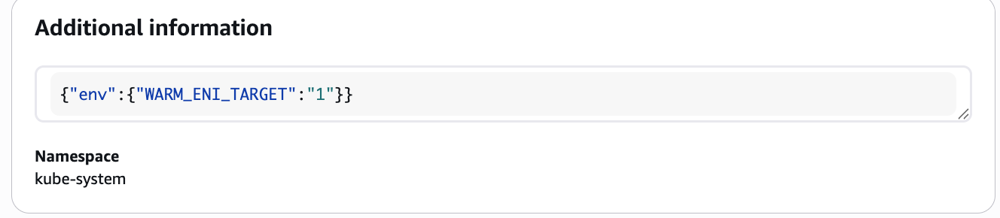

```Bash

# 노드 정보 확인 : 노드 중 1대는 eni 가 1개만 배치됨!
for i in $N1 $N2 $N3; do echo ">> node $i <<"; ssh ec2-user@$i sudo ip -c addr; echo; done
for i in $N1 $N2 $N3; do echo ">> node $i <<"; ssh ec2-user@$i sudo ip -c route; echo; done

# IpamD debugging commands  https://github.com/aws/amazon-vpc-cni-k8s/blob/master/docs/troubleshooting.md
for i in $N1 $N2 $N3; do echo ">> node $i <<"; ssh ec2-user@$i curl -s http://localhost:61679/v1/enis | jq; echo; done
s
```

**설정 변경 적용하기**

실습 코드에 있는 eks.tf 파일 내 add-on 부분을 수정합니다. 

WARM_IP_TARGET  = "5", MINIMUM_IP_TARGET   = "10" 주석 해제을 해제하였습니다.

```Bash
# add-on
addons = {
  coredns = {
    most_recent = true
  }
  kube-proxy = {
    most_recent = true
  }
  vpc-cni = {
    most_recent = true
    before_compute = true
    configuration_values = jsonencode({
      env = {
        WARM_ENI_TARGET = "1" # 현재 ENI 외에 여유 ENI 1개를 항상 확보
        WARM_IP_TARGET  = "5" # 현재 사용 중인 IP 외에 여유 IP 5개를 항상 유지, 설정 시 WARM_ENI_TARGET 무시됨
        MINIMUM_IP_TARGET   = "10" # 노드 시작 시 최소 확보해야 할 IP 총량 10개
        #ENABLE_PREFIX_DELEGATION = "true" 
        #WARM_PREFIX_TARGET = "1" # PREFIX_DELEGATION 사용 시, 1개의 여유 대역(/28) 유지
      }
    })
  }
}
```

**CNI 설정 변경 적용**

```
# 모니터링
watch -d kubectl get pod -n kube-system -l k8s-app=aws-node # aws-node 데몬셋 파드 확인
watch -d eksctl get addon --cluster myeks # addon 확인

# 적용
terraform plan
terraform apply -auto-approve
```

- 적용 전
    - 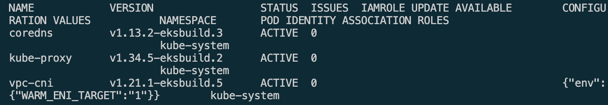

- 적용 후
    - 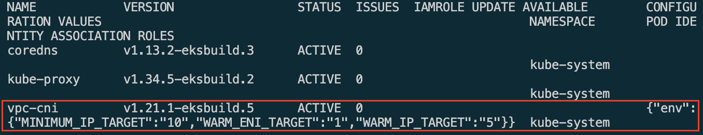
    - 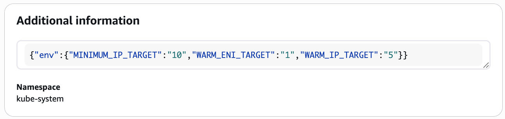

**변경 확인**

```Bash
# 파드 재생성 확인
kubectl get pod -n kube-system -l k8s-app=aws-node
NAME             READY   STATUS    RESTARTS   AGE
aws-node-4jcw4   2/2     Running   0          5m20s
aws-node-4msh9   2/2     Running   0          5m24s
aws-node-p5xvd   2/2     Running   0          5m28s

# addon 확인
NAME            VERSION                 STATUS  ISSUES  IAMROLE UPDATE AVAILABLE        CONFIGURATION VALUES                                     NAMESPACE        POD IDENTITY ASSOCIATION ROLES
coredns         v1.13.2-eksbuild.3      ACTIVE  0                                                                                                kube-system
kube-proxy      v1.34.5-eksbuild.2      ACTIVE  0                                                                                                kube-system
vpc-cni         v1.21.1-eksbuild.5      ACTIVE  0                                       **{"env":{"MINIMUM_IP_TARGET":"10","WARM_ENI_TARGET":"1","WARM_IP_TARGET":"5"}}**     kube-system

# aws-node DaemonSet의 env 확인
kubectl get ds aws-node -n kube-system -o json | jq '.spec.template.spec.containers[0].env'
kubectl describe ds aws-node -n kube-system | grep -E "WARM_IP_TARGET|MINIMUM_IP_TARGET"

# 노드 정보 확인 : (hostNetwork 제외) 파드가 없는 노드에도 ENI 추가 확인!
for i in $N1 $N2 $N3; do echo ">> node $i <<"; ssh ec2-user@$i sudo ip -c addr; echo; done
for i in $N1 $N2 $N3; do echo ">> node $i <<"; ssh ec2-user@$i sudo ip -c route; echo; done

# cni log 확인
for i in $N1 $N2 $N3; do echo ">> node $i <<"; ssh ec2-user@$i tree /var/log/aws-routed-eni ; echo; done
for i in $N1 $N2 $N3; do echo ">> node $i <<"; ssh ec2-user@$i sudo cat /var/log/aws-routed-eni/plugin.log | jq ; echo; done
for i in $N1 $N2 $N3; do echo ">> node $i <<"; ssh ec2-user@$i sudo cat /var/log/aws-routed-eni/ipamd.log | jq ; echo; done

# IpamD debugging commands  https://github.com/aws/amazon-vpc-cni-k8s/blob/master/docs/troubleshooting.md
for i in $N1 $N2 $N3; do echo ">> node $i <<"; ssh ec2-user@$i curl -s http://localhost:61679/v1/enis | jq; echo; done
```


---
## 4. AWS LBC with L4(NLB)

- AWS LBC(파드)가 AWS Service 를 이용하는 방법 4가지
  - 방안1(IRSA)
  - 방안2(Pod Identity)
  - 방안3(EC2 Instance Profile - 비권장)
  - 방안4(Static credentials - 보안 취약, 금지)

### 4.1. IRSA

OIDC Provider는 사용자 인증을 수행하고 사용자의 신원을 담은 토큰을 발행하는 인증 서버입니다.
EKS에서 IRSA(IAM Roles for Service Accounts) 설정 시 AWS가 OIDC Provider 역할을 하여 Kubenetes 서비스 계정에 IAM 역할을 부여합니다.

- **사전 확인**
  


```Bash
aws iam list-open-id-connect-providers    
{
    "OpenIDConnectProviderList": [
        {
            "Arn": "arn:aws:iam::{AccountID}:oidc-provider/oidc.eks.ap-southeast-1.amazonaws.com/id/F077EF3C6046F7E7513BA007BFA218F2"
        },
        {
            "Arn": "arn:aws:iam::{AccountID}:oidc-provider/token.actions.githubusercontent.com"
        }
    ]
}

aws eks describe-cluster --name myeks \
  --query "cluster.identity.oidc.issuer" \
  --output text
https://oidc.eks.ap-southeast-1.amazonaws.com/id/F077EF3C6046F7E7513BA007BFA218F2

# public subnet 찾기
aws ec2 describe-subnets --filters "Name=tag:kubernetes.io/role/elb,Values=1" --output table

# private subnet 찾기
aws ec2 describe-subnets --filters "Name=tag:kubernetes.io/role/internal-elb,Values=1" --output table
```

**IAM Policy 생성** [Link](https://docs.aws.amazon.com/ko_kr/eks/latest/userguide/lbc-helm.html)

```Bash
# IAM Policy json 파일 다운로드 : Download an IAM policy for the AWS Load Balancer Controller that allows it to make calls to AWS APIs on your behalf.
curl -o aws_lb_controller_policy.json https://raw.githubusercontent.com/kubernetes-sigs/aws-load-balancer-controller/refs/heads/main/docs/install/iam_policy.json
cat aws_lb_controller_policy.json | jq

# AWSLoadBalancerControllerIAMPolicy 생성 : Create an IAM policy using the policy downloaded in the previous step.
aws iam create-policy \
    --policy-name AWSLoadBalancerControllerIAMPolicy \
    --policy-document file://aws_lb_controller_policy.json

# 확인
ACCOUNT_ID=$(aws sts get-caller-identity --query "Account" --output text)
aws iam get-policy --policy-arn arn:aws:iam::$ACCOUNT_ID:policy/AWSLoadBalancerControllerIAMPolicy | jq
{
  "Policy": {
    "PolicyName": "AWSLoadBalancerControllerIAMPolicy",
    "PolicyId": "ANPAWQOUVOKAH2TKR6DCA",
    "Arn": "arn:aws:iam::{AccountID}:policy/AWSLoadBalancerControllerIAMPolicy",
    "Path": "/",
    "DefaultVersionId": "v1",
    "AttachmentCount": 1,
    "PermissionsBoundaryUsageCount": 0,
    "IsAttachable": true,
    "CreateDate": "2025-07-28T05:54:46+00:00",
    "UpdateDate": "2025-07-28T05:54:46+00:00",
    "Tags": []
  }
}
```

**IRSA 생성**
```Bash
# IRSA 생성 : cloudforamtion 를 통해 IAM Role 생성 (eksctl 커맨드 입력시 )
CLUSTER_NAME=myeks
eksctl get iamserviceaccount --cluster $CLUSTER_NAME
kubectl get serviceaccounts -n kube-system aws-load-balancer-controller

eksctl create iamserviceaccount \
  --cluster=$CLUSTER_NAME \
  --namespace=kube-system \
  --name=aws-load-balancer-controller \
  --attach-policy-arn=arn:aws:iam::$ACCOUNT_ID:policy/AWSLoadBalancerControllerIAMPolicy \
  --override-existing-serviceaccounts \
  --approve

eksctl get iamserviceaccount --cluster $CLUSTER_NAME
NAMESPACE       NAME                            ROLE ARN
kube-system     aws-load-balancer-controller    arn:aws:iam::{AccountID}:role/eksctl-myeks-addon-iamserviceaccount-kube-sys-Role1-UEBpugfNE9IV

# kube-system 네임스페이스에서 'aws-load-balancer-controller'라는 이름을 가진 serviceaccounts(sa)를 조회하여 YAML output으로 출력합니다.
kubectl get serviceaccounts -n kube-system aws-load-balancer-controller -o yaml
apiVersion: v1
kind: ServiceAccount
metadata:
  annotations:
    eks.amazonaws.com/role-arn: arn:aws:iam::{AccountID}:role/eksctl-myeks-addon-iamserviceaccount-kube-sys-Role1-UEBpugfNE9IV
  creationTimestamp: "2026-03-26T04:50:39Z"
  labels:
    app.kubernetes.io/managed-by: eksctl
  name: aws-load-balancer-controller
  namespace: kube-system
  resourceVersion: "111146"
  uid: a4292da1-2eab-44f0-8042-002be7e28b25
```

**IAM Role 콘솔에서도 확인 가능**
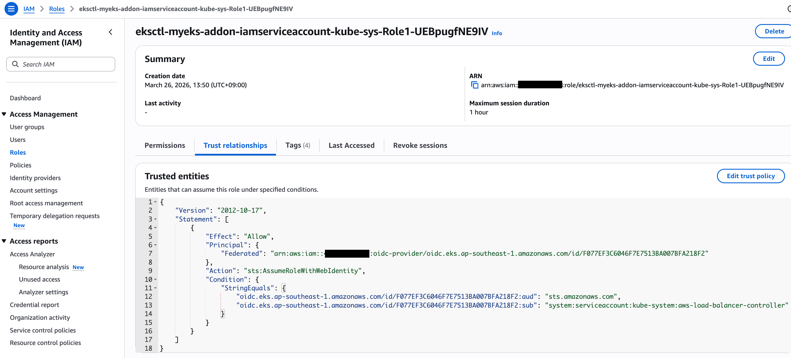

**Trusted Relationship 의미**

```Bash
{
    "Version": "2012-10-17",
    "Statement": [
        {
            "Effect": "Allow",
            "Principal": {
                "Federated": "arn:aws:iam::{AccountID}:oidc-provider/oidc.eks.ap-southeast-1.amazonaws.com/id/F077EF3C6046F7E7513BA007BFA218F2" #ap-southeast-1 리전의 EKS 클러스터 전용 OIDC 엔드포인트를 신뢰대상으로 등록
            },
            "Action": "sts:AssumeRoleWithWebIdentity", #웹 ID(OIDC토큰)를 사용하여 이 역할을 수임(Assume)하는 것을 허용
            "Condition": {
                "StringEquals": {
                    "oidc.eks.ap-southeast-1.amazonaws.com/id/F077EF3C6046F7E7513BA007BFA218F2:aud": "sts.amazonaws.com", #토큰 수신자가 AWS STS 서비스여야함
                    "oidc.eks.ap-southeast-1.amazonaws.com/id/F077EF3C6046F7E7513BA007BFA218F2:sub": "system:serviceaccount:kube-system:aws-load-balancer-controller" #kube-system 네임스페이스에 있는 aws-load-balancer-controller라는 이름의 ServiceAccount만 이 역할을 수행할 수 있음
                }
            }
        }
    ]
}
```

### 4.2. LBC 설치

[Helm 설치](https://github.com/aws/eks-charts/tree/master/stable/aws-load-balancer-controller), [공식 Docs](https://kubernetes-sigs.github.io/aws-load-balancer-controller/latest/deploy/installation/), [Values](https://github.com/aws/eks-charts/blob/master/stable/aws-load-balancer-controller/values.yaml)

```Bash
# Helm Chart Repository 추가
helm repo add eks https://aws.github.io/eks-charts
helm repo update

"eks" has been added to your repositories
Hang tight while we grab the latest from your chart repositories...
...Successfully got an update from the "eks" chart repository
...Successfully got an update from the "geek-cookbook" chart repository
Update Complete. ⎈Happy Helming!⎈

# Helm Chart - AWS Load Balancer Controller 설치
# https://artifacthub.io/packages/helm/aws/aws-load-balancer-controller
# https://github.com/aws/eks-charts/blob/master/stable/aws-load-balancer-controller/values.yaml
helm install aws-load-balancer-controller eks/aws-load-balancer-controller -n kube-system --version 3.1.0 \
  --set clusterName=$CLUSTER_NAME \
  --set serviceAccount.name=aws-load-balancer-controller \
  --set serviceAccount.create=false

NAME: aws-load-balancer-controller
LAST DEPLOYED: Thu Mar 26 14:23:36 2026
NAMESPACE: kube-system
STATUS: deployed
REVISION: 1
DESCRIPTION: Install complete
TEST SUITE: None
NOTES:
AWS Load Balancer controller installed!

# 확인
helm list -n kube-system
NAME                              NAMESPACE        REVISION UPDATED                                  STATUS   CHART                                    APP VERSION
aws-load-balancer-controller    kube-system      1               2026-03-26 14:23:36.997844 +0900 KST    deployed aws-load-balancer-controller-3.1.0      v3.1.0     

# 파드 상태 실패 확인

kubectl get pod -n kube-system -l app.kubernetes.io/name=aws-load-balancer-controller                                                           ✔ │ myeks ○ │ 02:24:16 PM 
NAME                                            READY   STATUS             RESTARTS      AGE
aws-load-balancer-controller-7875649799-ctmqf   0/1     CrashLoopBackOff   3 (25s ago)   96s
aws-load-balancer-controller-7875649799-nsxtl   0/1     CrashLoopBackOff   3 (29s ago)   96s


# 파드가 IMDS를 통해 자신이 속한 VPC ID를 조회하는데 실패한 것이 로그에서 확인됨
# failed to get VPC ID: failed to fetch VPC ID from instance metadata: error in fetching vpc id through ec2 metadata: get mac metadata: operation error ec2imds: GetMetadata, canceled, context deadline exceeded
kubectl logs -n kube-system deployment/aws-load-balancer-controller
Found 2 pods, using pod/aws-load-balancer-controller-7875649799-ctmqf
{"level":"info","ts":"2026-03-26T05:30:03Z","msg":"version","GitVersion":"v3.1.0","GitCommit":"250024dbcc7a428cfd401c949e04de23c167d46e","BuildDate":"2026-02-24T18:21:40+0000"}
{"level":"error","ts":"2026-03-26T05:30:08Z","logger":"setup","msg":"unable to initialize AWS cloud","error":"failed to get VPC ID: failed to fetch VPC ID from instance metadata: error in fetching vpc id through ec2 metadata: get mac metadata: operation error ec2imds: GetMetadata, canceled, context deadline exceeded"}
```

**LBC 파드 생성 실패 원인**

AWS Load Balancer Controller 파드가 ALB를 생성할 때, 자신이 속한 리전과 VPC ID가 지정되어 있지 않다면 알아내기 위해 기본적으로 EC2 내부 메타데이터 서버(IMDS)를 조회합니다.
최근 AWS의 보안 강화로 인해 EC2 인스턴스들은 메타데이터 서비스 버전 2(IMDSv2)를 기본으로 사용하는 경우가 많으며, IMDSv2는 보안을 위해 기본적으로 네트워크 홉(Hop) 제한을 1로 설정합니다.

aws-node나 kube-proxy 같은 시스템 파드는 호스트의 네트워크(hostNetwork: true)를 그대로 사용하므로 호스트에서 바로 패킷이 출발합니다. 따라서 추가 라우팅 없이 메타데이터 서버에 도달할 수 있어 TTL(Hop Limit)이 1이어도 충분합니다.
> 반면, 일반 Pod 내부에서 출발한 패킷은 가상 네트워크를 통해 호스트로 나가고, 호스트 커널에서 외부로 나가기 위해 라우팅을 1번(1 홉) 거쳐야 합니다. 따라서 중간에 패킷이 수명(TTL) 만료로 버려지지 않고 목적지까지 도달하려면, 초기 TTL(Hop Limit) 설정값이 2 이상이어야 합니다.

- 해결방안 1: helm 설치 시 파라미터 설정 - [values](https://github.com/aws/eks-charts/blob/master/stable/aws-load-balancer-controller/values.yaml)
    - 파드가 메타데이터를 조회할 필요가 없도록 배포 시 `vpcId`와 `region` 값을 추가합니다.
    - `-set region=region-code`
    - `-set vpcId=vpc-xxxxxxxx`
    - ```Bash
      # (참고) vpc id 확인
      terraform state show 'module.vpc.aws_vpc.this[0]'
      terraform state show 'module.vpc.aws_vpc.this[0]' | grep '    id'
      terraform show -json | jq -r '.values.root_module.child_modules[] | select(.address == "module.vpc") | .resources[] | select(.address == "module.vpc.aws_vpc.this[0]") | .values.id'
      vpc-0db6bf1bbadee777d

      # (참고) 
      helm install aws-load-balancer-controller eks/aws-load-balancer-controller -n kube-system --version 3.1.0 \
        --set clusterName=myeks \
        --set serviceAccount.name=aws-load-balancer-controller \
        --set serviceAccount.create=false \
        --set region=ap-northeast-2 \
        --set vpcId=vpc-0db6bf1bbadee777d

      spec:
        containers:
        - args:
          - --cluster-name=my-cluster
          - --vpc-id=vpc-0a1b2c3d4e5f6g7h8  # 이 줄을 추가
          # ...
      ```
- 해결방안 2: EC2 노드 그룹의 IMDS 홉 제한 늘리기 (1 → 2 로 변경)
    - AWS CLI: 
        - ```Bash
          aws ec2 modify-instance-metadata-options \
          --instance-id <노드의_EC2_인스턴스_ID> \
          --http-put-response-hop-limit 2 \
          --http-endpoint enabled
          ```
    - AWS Console: 
        - 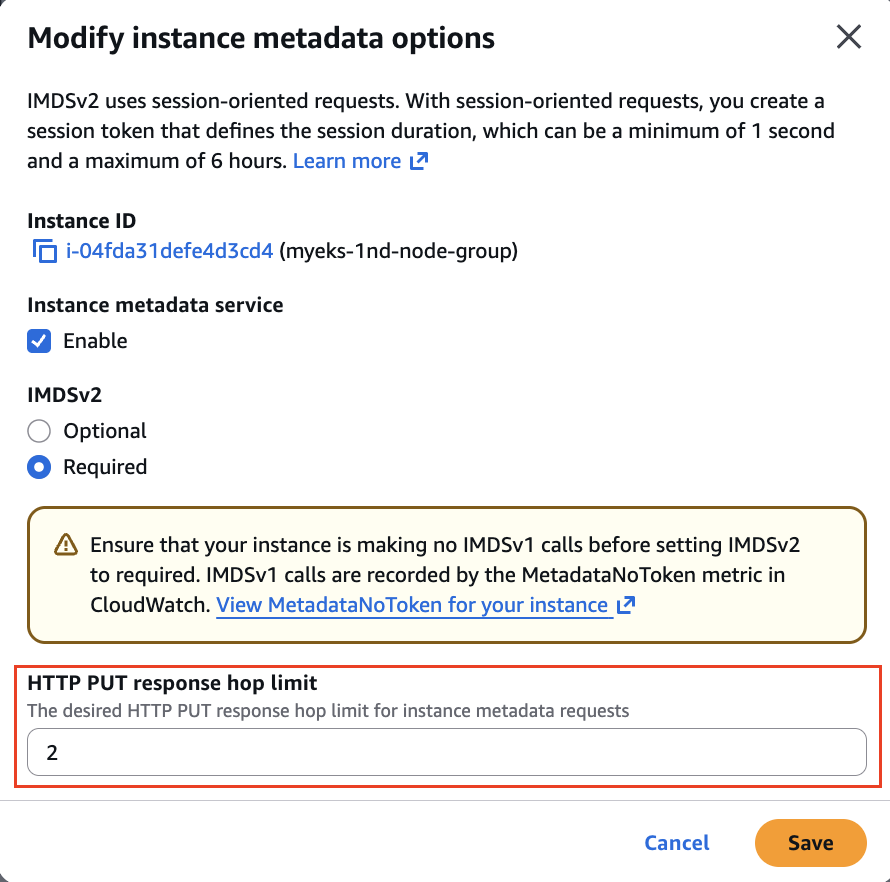

### 4.3. 도전과제: eks 모듈로 배포 시, 관리형 노드 그룹에 시작 템플릿에 imds hop limit = 2 적용 설정 해보기

EKS Managed Node Group을 사용하는 경우, 시작 템플릿(Launch Template)에서 인스턴스 메타데이터 옵션에서 '메타데이터 응답 홉 제한(Metadata response hop limit)'을 2로 변경하여 노드 그룹을 업데이트해야 합니다.

실습에서는 Terraform EKS 모듈로 배포하였으므로 Terraform에서 hop limit을 변경해보겠습니다.

```Terraform
# EKS Managed Node Group(s)
eks_managed_node_groups = {
  # 1st 노드 그룹
  primary = {
    name             = "${var.ClusterBaseName}-1nd-node-group"
    use_name_prefix  = false
    instance_types   = ["${var.WorkerNodeInstanceType}"]
    desired_size     = var.WorkerNodeCount
    max_size         = var.WorkerNodeCount + 2
    min_size         = var.WorkerNodeCount - 1
    disk_size        = var.WorkerNodeVolumesize
    subnets          = module.vpc.public_subnets
    key_name         = "${var.KeyName}"
    vpc_security_group_ids = [aws_security_group.node_group_sg.id]
    
    # node label
    labels = {
      tier = "primary"
    }

    metadata_options = {
      http_put_response_hop_limit = 2 # 이 줄 추가!
    }
```


- 테라폼 변경 전 시작 템플릿 조회: 
    - 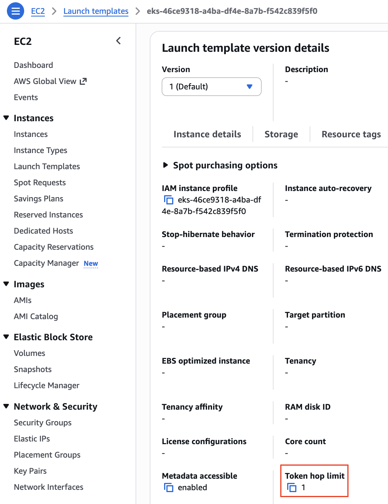

```Bash
Apply 후 Managed Node Group에 의해 새로운 버전의 시작 템플릿으로 롤링 업데이트가 진행됩니다.
k get node 
NAME                                               STATUS   ROLES    AGE   VERSION
ip-192-168-0-186.ap-southeast-1.compute.internal   Ready    <none>   2m   v1.34.4-eks-f69f56f
ip-192-168-11-63.ap-southeast-1.compute.internal   Ready    <none>   2m   v1.34.4-eks-f69f56f
ip-192-168-4-233.ap-southeast-1.compute.internal   Ready    <none>   2m   v1.34.4-eks-f69f56f
```

- Terraform Apply 후 시작 템플릿 버전 2:
    - 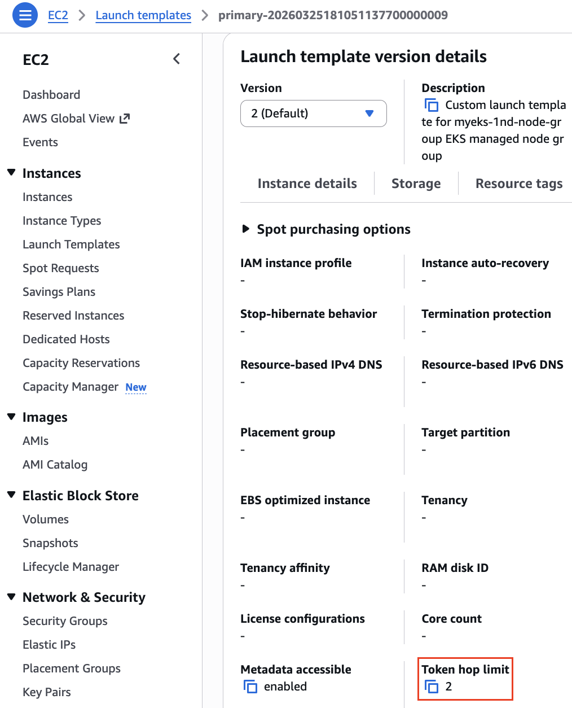
- 노드 그룹에서 사용하는 시작 템플릿 버전:
    - 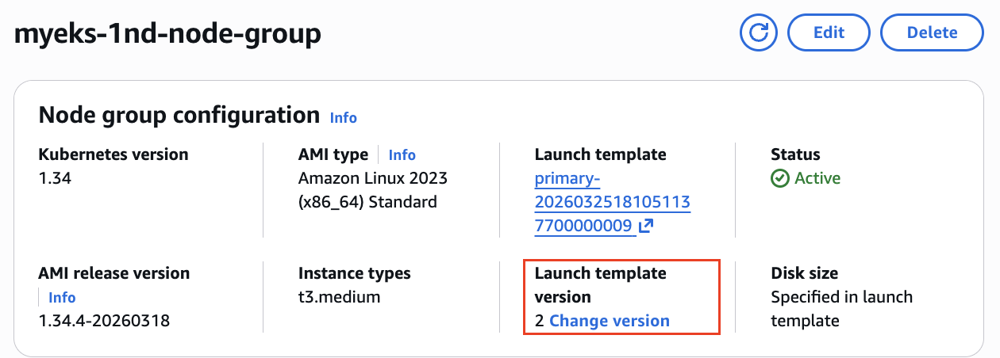


**LBC 재시작**

```Bash
# Deployment 재시작 (콘솔 또는 CLI를 사용한 경우)
kubectl rollout restart -n kube-system deploy aws-load-balancer-controller

# 파드 상태 확인
kubectl get pod -n kube-system -l app.kubernetes.io/name=aws-load-balancer-controller
NAME                                            READY   STATUS    RESTARTS   AGE
aws-load-balancer-controller-769c84f77c-8ssrd   1/1     Running   0          5m20s
aws-load-balancer-controller-769c84f77c-9l7t9   1/1     Running   0          5m39s

# ELB 관련 crd(Custom Resource Definition) 확인
kubectl get crd | grep -E 'elb|gateway'
albtargetcontrolconfigs.elbv2.k8s.aws           2026-03-26T05:23:36Z
ingressclassparams.elbv2.k8s.aws                2026-03-26T05:23:36Z
listenerruleconfigurations.gateway.k8s.aws      2026-03-26T05:23:36Z
loadbalancerconfigurations.gateway.k8s.aws      2026-03-26T05:23:36Z
targetgroupbindings.elbv2.k8s.aws               2026-03-26T05:23:36Z
targetgroupconfigurations.gateway.k8s.aws       2026-03-26T05:23:36Z

# 각 crd의 스페 정보 확인
kubectl explain ingressclassparams.elbv2.k8s.aws
kubectl explain ingressclassparams.elbv2.k8s.aws.spec
kubectl explain ingressclassparams.elbv2.k8s.aws.spec.listeners
kubectl explain targetgroupbindings.elbv2.k8s.aws.spec
kubectl explain albtargetcontrolconfigs.elbv2.k8s.aws.spec

# AWS Load Balancer Controller 확인
kubectl get deployment -n kube-system aws-load-balancer-controller
kubectl describe deploy -n kube-system aws-load-balancer-controller
kubectl describe deploy -n kube-system aws-load-balancer-controller | grep 'Service Account'
  Service Account:  aws-load-balancer-controller
 
# 클러스터롤, 롤 확인 (AWS의 IAM Policy같은 역할)
kubectl describe clusterrolebindings.rbac.authorization.k8s.io aws-load-balancer-controller-rolebinding
kubectl describe clusterroles.rbac.authorization.k8s.io aws-load-balancer-controller-role


```

### 4.4. NLB로 서비스/파드 배포하기

```
# 모니터링
watch -d kubectl get pod,svc,ep,endpointslices

# 디플로이먼트 & 서비스 생성
cat << EOF > echo-service-nlb.yaml
apiVersion: apps/v1
kind: Deployment
metadata:
  name: deploy-echo
spec:
  replicas: 2
  selector:
    matchLabels:
      app: deploy-websrv
  template:
    metadata:
      labels:
        app: deploy-websrv
    spec:
      terminationGracePeriodSeconds: 0
      containers:
      - name: aews-websrv
        image: k8s.gcr.io/echoserver:1.10  # open https://registry.k8s.io/v2/echoserver/tags/list
        ports:
        - containerPort: 8080
---
apiVersion: v1
kind: Service
metadata:
  name: svc-nlb-ip-type
  annotations:
    service.beta.kubernetes.io/aws-load-balancer-nlb-target-type: ip # Pod IP에 바로 전달
    service.beta.kubernetes.io/aws-load-balancer-scheme: internet-facing
    service.beta.kubernetes.io/aws-load-balancer-healthcheck-port: "8080"
    service.beta.kubernetes.io/aws-load-balancer-cross-zone-load-balancing-enabled: "true"
spec:
  allocateLoadBalancerNodePorts: false  # K8s 1.24+ 무의미한 NodePort 할당 차단
  ports:
    - port: 80
      targetPort: 8080
      protocol: TCP
  type: LoadBalancer
  selector:
    app: deploy-websrv
EOF

kubectl apply -f echo-service-nlb.yaml
```

**NLB 생성 후 확인**

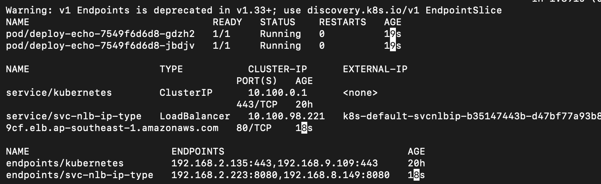

```Bash
aws elbv2 describe-load-balancers --query 'LoadBalancers[*].State.Code' --output text
kubectl get deploy,pod
kubectl get svc,ep,ingressclassparams,targetgroupbindings
kubectl get targetgroupbindings -o json
```

- NLB에서 Pod의 IP로 바로 트래픽이 전달되는 것이 확인됨.
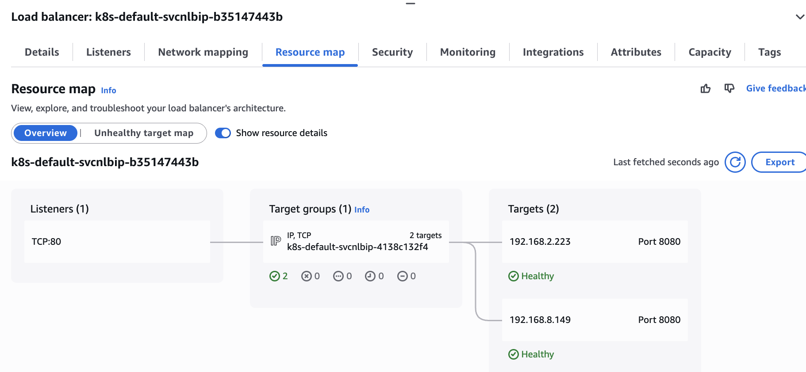


**LBC가 주체가 되어 ELB 관리하기**

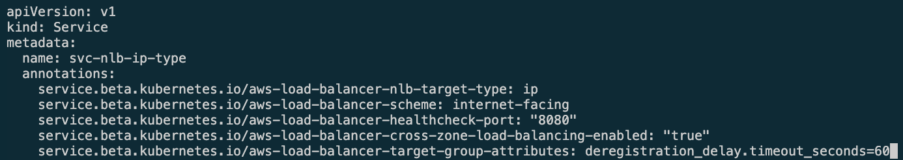

NLB 서비스를 배포한 echo-service-nlb.yaml 파일에서 등록취소지연 속성 60초로 설정

```Bash
apiVersion: v1
kind: Service
metadata:
  name: svc-nlb-ip-type
  annotations:
    service.beta.kubernetes.io/aws-load-balancer-nlb-target-type: ip
    service.beta.kubernetes.io/aws-load-balancer-scheme: internet-facing
    service.beta.kubernetes.io/aws-load-balancer-healthcheck-port: "8080"
    service.beta.kubernetes.io/aws-load-balancer-cross-zone-load-balancing-enabled: "true"
    service.beta.kubernetes.io/aws-load-balancer-target-group-attributes: deregistration_delay.timeout_seconds=60
...
kubectl apply -f echo-service-nlb.yaml
```

```Bash
# AWS ELB(NLB) 정보 확인
aws elbv2 describe-load-balancers | jq
aws elbv2 describe-load-balancers --query 'LoadBalancers[*].State.Code' --output text
ALB_ARN=$(aws elbv2 describe-load-balancers --query 'LoadBalancers[?contains(LoadBalancerName, `k8s-default-svcnlbip`) == `true`].LoadBalancerArn' | jq -r '.[0]')
aws elbv2 describe-target-groups --load-balancer-arn $ALB_ARN | jq
TARGET_GROUP_ARN=$(aws elbv2 describe-target-groups --load-balancer-arn $ALB_ARN | jq -r '.TargetGroups[0].TargetGroupArn')
aws elbv2 describe-target-health --target-group-arn $TARGET_GROUP_ARN | jq
{
  "TargetHealthDescriptions": [
    {
      "Target": {
        "Id": "192.168.2.153",
        "Port": 8080,
        "AvailabilityZone": "ap-northeast-2b"
      },
      "HealthCheckPort": "8080",
      "TargetHealth": {
        "State": "initial",
        "Reason": "Elb.RegistrationInProgress",
        "Description": "Target registration is in progress"
      }
    },
...

# 웹 접속 주소 확인
kubectl get svc svc-nlb-ip-type -o jsonpath='{.status.loadBalancer.ingress[0].hostname}' | awk '{ print "Pod Web URL = http://"$1 }'

# 파드 로깅 모니터링
kubectl logs -l app=deploy-websrv -f
혹은
kubectl stern -l  app=deploy-websrvç

# 분산 접속 확인
NLB=$(kubectl get svc svc-nlb-ip-type -o jsonpath='{.status.loadBalancer.ingress[0].hostname}')
curl -s $NLB
for i in {1..100}; do curl -s $NLB | grep Hostname ; done | sort | uniq -c | sort -nr
  52 Hostname: deploy-echo-55456fc798-2w65p
  48 Hostname: deploy-echo-55456fc798-cxl7z

# 지속적인 접속 시도 : 아래 상세 동작 확인 시 유용(패킷 덤프 등)
while true; do curl -s --connect-timeout 1 $NLB | egrep 'Hostname|client_address'; echo "----------" ; date "+%Y-%m-%d %H:%M:%S" ; sleep 1; done
```

```Bash
# (신규 터미널) 모니터링
while true; do aws elbv2 describe-target-health --target-group-arn $TARGET_GROUP_ARN --output text; echo; done

# 작업용 EC2 - 파드 1개 설정 
kubectl scale deployment deploy-echo --replicas=1

# 확인
kubectl get deploy,pod,svc,ep
NLB=$(kubectl get svc svc-nlb-ip-type -o jsonpath='{.status.loadBalancer.ingress[0].hostname}')
curl -s $NLB
for i in {1..100}; do curl -s --connect-timeout 1 $NLB | grep Hostname ; done | sort | uniq -c | sort -nr

# 파드 3개 설정
kubectl scale deployment deploy-echo --replicas=3

# 확인 : NLB 대상 타켓이 아직 initial 일 때 100번 반복 접속 시 어떻게 되는지 확인해보자!
kubectl get deploy,pod,svc,ep
NLB=$(kubectl get svc svc-nlb-ip-type -o jsonpath='{.status.loadBalancer.ingress[0].hostname}')
curl -s $NLB
for i in {1..100}; do curl -s --connect-timeout 1 $NLB | grep Hostname ; done | sort | uniq -c | sort -nr

# sa 확인
kubectl describe deploy -n kube-system aws-load-balancer-controller | grep -i 'Service Account'
  Service Account:  aws-load-balancer-controller

# [AWS LB Ctrl] 클러스터 롤 바인딩 정보 확인
kubectl describe clusterrolebindings.rbac.authorization.k8s.io aws-load-balancer-controller-rolebinding

# [AWS LB Ctrl] 클러스터롤 확인 
kubectl describe clusterroles.rbac.authorization.k8s.io aws-load-balancer-controller-role
```

<!-- #### NLB PPv2 활용하기 -->

---

## 5. Ingress with L7(ALB)

### 5.1. 서비스/파드 배포 테스트 with Ingress(ALB)

```Bash
# 게임 파드와 Service, Ingress 배포
cat <<EOF | kubectl apply -f -
apiVersion: v1
kind: Namespace
metadata:
  name: game-2048
---
apiVersion: apps/v1
kind: Deployment
metadata:
  namespace: game-2048
  name: deployment-2048
spec:
  selector:
    matchLabels:
      app.kubernetes.io/name: app-2048
  replicas: 2
  template:
    metadata:
      labels:
        app.kubernetes.io/name: app-2048
    spec:
      containers:
      - image: public.ecr.aws/l6m2t8p7/docker-2048:latest
        imagePullPolicy: Always
        name: app-2048
        ports:
        - containerPort: 80
---
apiVersion: v1
kind: Service
metadata:
  namespace: game-2048
  name: service-2048 # 서비스명 매치
spec:
  ports:
    - port: 80
      targetPort: 80
      protocol: TCP
  type: NodePort
  selector:
    app.kubernetes.io/name: app-2048
---
apiVersion: networking.k8s.io/v1
kind: Ingress
metadata:
  namespace: game-2048
  name: ingress-2048
  annotations:
    alb.ingress.kubernetes.io/scheme: internet-facing
    alb.ingress.kubernetes.io/target-type: ip
spec:
  ingressClassName: alb
  rules:
    - http:
        paths:
        - path: /
          pathType: Prefix
          backend:
            service:
              name: service-2048 # 서비스명 매치
              port:
                number: 80
EOF

# 모니터링
watch -d kubectl get pod,ingress,svc,ep,endpointslices -n game-2048

# 생성 확인
kubectl get ingressclass
kubectl get ingress,svc,ep,pod -n game-2048
kubectl get-all -n game-2048
kubectl get targetgroupbindings -n game-2048

# ALB 생성 확인
aws elbv2 describe-load-balancers --query 'LoadBalancers[?contains(LoadBalancerName, `k8s-game2048`) == `true`]' | jq
ALB_ARN=$(aws elbv2 describe-load-balancers --query 'LoadBalancers[?contains(LoadBalancerName, `k8s-game2048`) == `true`].LoadBalancerArn' | jq -r '.[0]')
aws elbv2 describe-target-groups --load-balancer-arn $ALB_ARN
TARGET_GROUP_ARN=$(aws elbv2 describe-target-groups --load-balancer-arn $ALB_ARN | jq -r '.TargetGroups[0].TargetGroupArn')
aws elbv2 describe-target-health --target-group-arn $TARGET_GROUP_ARN | jq

# Ingress 확인
kubectl describe ingress -n game-2048 ingress-2048
kubectl get ingress -n game-2048 ingress-2048 -o jsonpath="{.status.loadBalancer.ingress[*].hostname}{'\n'}"
k8s-game2048-ingress2-70d50ce3fd-365299319.ap-southeast-1.elb.amazonaws.com

# 게임 접속 : ALB 주소로 웹 접속
kubectl get ingress -n game-2048 ingress-2048 -o jsonpath='{.status.loadBalancer.ingress[0].hostname}' | awk '{ print "Game URL = http://"$1 }'
Game URL = http://k8s-game2048-ingress2-70d50ce3fd-365299319.ap-southeast-1.elb.amazonaws.com

# 파드 IP 확인
kubectl get pod -n game-2048 -owide
NAME                               READY   STATUS    RESTARTS   AGE    IP              NODE                                               NOMINATED NODE   READINESS GATES
deployment-2048-7bf64bccb7-knc42   1/1     Running   0          128m   192.168.10.31   ip-192-168-11-63.ap-southeast-1.compute.internal   <none>           <none>
deployment-2048-7bf64bccb7-tfhfl   1/1     Running   0          134m   192.168.2.167   ip-192-168-0-186.ap-southeast-1.compute.internal   <none>           <none>

```

- 대상에 파드 IP가 그대로 등록되어 있다. (노드의 Secondary IP), ALB에서 파드 IP로 직접 트래픽 전달
    - 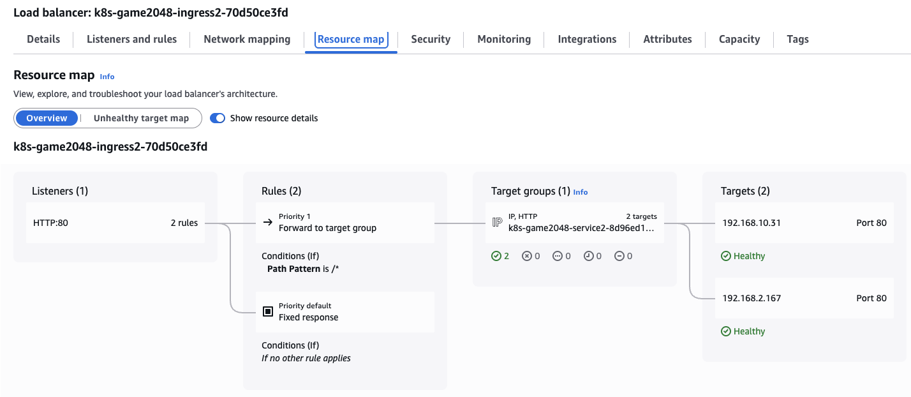
    - 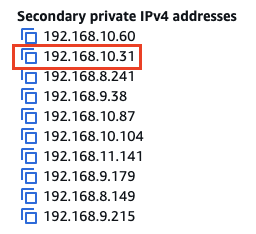

**파드 수 조절하기**
```Bash

# 터미널1 (모니터링))
watch kubectl get pod -n game-2048
while true; do aws elbv2 describe-target-health --target-group-arn $TARGET_GROUP_ARN --output text; echo; done

# 파드 2개에서 3개로 늘리기

kubectl scale deployment -n game-2048 deployment-2048 --replicas 3
deployment.apps/deployment-2048 scaled

NAME                               READY   STATUS    RESTARTS   AGE
deployment-2048-7bf64bccb7-knc42   1/1     Running   0          139m
deployment-2048-7bf64bccb7-mq2gt   1/1     Running   0          73s
deployment-2048-7bf64bccb7-tfhfl   1/1     Running   0          145m

# 파드 1개로 줄이기
kubectl scale deployment -n game-2048 deployment-2048 --replicas 1
deployment.apps/deployment-2048 scaled


TARGETHEALTHDESCRIPTIONS        80
ADMINISTRATIVEOVERRIDE  No override is currently active on target       AdministrativeOverride.NoOverride       no_override
TARGET  ap-southeast-1a 192.168.2.167   80
TARGETHEALTH    healthy
TARGETHEALTHDESCRIPTIONS        80
ADMINISTRATIVEOVERRIDE  No override is currently active on target       AdministrativeOverride.NoOverride       no_override
TARGET  ap-southeast-1b 192.168.5.238   80
TARGETHEALTH    Target deregistration is in progress    Target.DeregistrationInProgress draining
TARGETHEALTHDESCRIPTIONS        80
ADMINISTRATIVEOVERRIDE  No override is currently active on target       AdministrativeOverride.NoOverride       no_override
TARGET  ap-southeast-1c 192.168.10.31   80
TARGETHEALTH    Target deregistration is in progress    Target.DeregistrationInProgress draining

NAME                               READY   STATUS    RESTARTS   AGE
deployment-2048-7bf64bccb7-tfhfl   1/1     Running   0          146m

# 리소스 삭제
kubectl delete ingress ingress-2048 -n game-2048
kubectl delete svc service-2048 -n game-2048 && kubectl delete deploy deployment-2048 -n game-2048 && kubectl delete ns game-2048

```
<!-- 
**ALB Li**
ALB 리스너와 Target Group의 CRD가 분리되어있다. 

Target Group CRD를 가지고, EKS 업그레이드할 때 Target Group과 ALB를 분리하여 업그레이드하는 패턴이 있음. -->

---

## 6. ExternalDNS

### 6.1. ExternalDNS 설치

**IRSA 생성하기**

```Bash
# 정책 파일 작성
cat << EOF > externaldns_controller_policy.json
{
  "Version": "2012-10-17",
  "Statement": [
    {
      "Effect": "Allow",
      "Action": [
        "route53:ChangeResourceRecordSets",
        "route53:ListResourceRecordSets",
        "route53:ListTagsForResources"
      ],
      "Resource": [
        "arn:aws:route53:::hostedzone/*"
      ]
    },
    {
      "Effect": "Allow",
      "Action": [
        "route53:ListHostedZones"
      ],
      "Resource": [
        "*"
      ]
    }
  ]
}
EOF

# IAM 정책 생성
aws iam create-policy \
  --policy-name ExternalDNSControllerPolicy \
  --policy-document file://externaldns_controller_policy.json

# 확인
ACCOUNT_ID=$(aws sts get-caller-identity --query "Account" --output text)
aws iam get-policy --policy-arn arn:aws:iam::$ACCOUNT_ID:policy/ExternalDNSControllerPolicy | jq
{
  "Policy": {
    "PolicyName": "ExternalDNSControllerPolicy",
    "PolicyId": "ANPAWQOUVOKADAJHAJN52",
    "Arn": "arn:aws:iam::{AccountID}:policy/ExternalDNSControllerPolicy",
    "Path": "/",
    "DefaultVersionId": "v1",
    "AttachmentCount": 0,
    "PermissionsBoundaryUsageCount": 0,
    "IsAttachable": true,
    "CreateDate": "2026-03-26T15:39:01+00:00",
    "UpdateDate": "2026-03-26T15:39:01+00:00",
    "Tags": []
  }
}

# IRSA 생성 : cloudformation(eksctl)을 통해 IAM Role 생성
CLUSTER_NAME=myeks

eksctl create iamserviceaccount \
  --cluster=$CLUSTER_NAME \
  --namespace=kube-system \
  --name=external-dns \
  --attach-policy-arn=arn:aws:iam::$ACCOUNT_ID:policy/ExternalDNSControllerPolicy \
  --override-existing-serviceaccounts \
  --approve

2026-03-27 00:40:00 [ℹ]  1 existing iamserviceaccount(s) (kube-system/aws-load-balancer-controller) will be excluded
2026-03-27 00:40:00 [ℹ]  1 iamserviceaccount (kube-system/external-dns) was included (based on the include/exclude rules)
2026-03-27 00:40:00 [!]  metadata of serviceaccounts that exist in Kubernetes will be updated, as --override-existing-serviceaccounts was set
2026-03-27 00:40:00 [ℹ]  1 task: { 
    2 sequential sub-tasks: { 
        create IAM role for serviceaccount "kube-system/external-dns",
        create serviceaccount "kube-system/external-dns",
    } }2026-03-27 00:40:00 [ℹ]  building iamserviceaccount stack "eksctl-myeks-addon-iamserviceaccount-kube-system-external-dns"
2026-03-27 00:40:00 [ℹ]  deploying stack "eksctl-myeks-addon-iamserviceaccount-kube-system-external-dns"
2026-03-27 00:40:01 [ℹ]  waiting for CloudFormation stack "eksctl-myeks-addon-iamserviceaccount-kube-system-external-dns"
2026-03-27 00:40:31 [ℹ]  waiting for CloudFormation stack "eksctl-myeks-addon-iamserviceaccount-kube-system-external-dns"

# 확인
eksctl get iamserviceaccount --cluster $CLUSTER_NAME
NAMESPACE       NAME                            ROLE ARN
kube-system     aws-load-balancer-controller    arn:aws:iam::{AccountID}:role/eksctl-myeks-addon-iamserviceaccount-kube-sys-Role1-UEBpugfNE9IV
kube-system     external-dns                    arn:aws:iam::{AccountID}:role/eksctl-myeks-addon-iamserviceaccount-kube-sys-Role1-0NmRWXtmFizR

# k8s 에 SA 확인
# Inspecting the newly created Kubernetes Service Account, we can see the role we want it to assume in our pod.
kubectl get serviceaccounts -n kube-system external-dns -o yaml
apiVersion: v1
kind: ServiceAccount
metadata:
  annotations:
    eks.amazonaws.com/role-arn: arn:aws:iam::{AccountID}:role/eksctl-myeks-addon-iamserviceaccount-kube-sys-Role1-0NmRWXtmFizR
  creationTimestamp: "2026-03-26T15:40:32Z"
  labels:
    app.kubernetes.io/managed-by: eksctl
  name: external-dns
  namespace: kube-system
  resourceVersion: "228784"
  uid: 6459ac30-92b0-49e1-8d68-0e5fb545df30


```

### 6.2. ExternalDNS 배포하기

```Bash
# 자신의 도메인 변수 지정 
MyDomain=<자신의 도메인>
MyDomain=siyoung.cloud

# 설정 파일 작성
cat << EOF > external-dns-values.yaml
provider: aws
serviceAccount: # 위에서 생성한 ServiceAccount와의 연동
  create: false
  name: external-dns
domainFilters: # 특정 도메인만 관리하도록 제한
  - $MyDomain
policy: sync  # 실습이니 sync로 진행, 쿠버네티스에서 삭제되면 Route 53에서도 삭제함. prod에서는 upsert-only
sources: # 리소스 감지 대상
  - service
  - ingress
txtOwnerId: "stduy-myeks-cluster"
registry: txt
logLevel: info
EOF

# Helm 레포지토리 추가 및 업데이트
helm repo add external-dns https://kubernetes-sigs.github.io/external-dns/
helm repo update

# 차트 설치
helm install external-dns external-dns/external-dns \
  -n kube-system \
  -f external-dns-values.yaml
  
NAME: external-dns
LAST DEPLOYED: Fri Mar 27 01:44:03 2026
NAMESPACE: kube-system
STATUS: deployed
REVISION: 1
DESCRIPTION: Install complete
TEST SUITE: None
NOTES:
***********************************************************************
* External DNS                                                        *
***********************************************************************
  Chart version: 1.20.0
  App version:   0.20.0
  Image tag:     registry.k8s.io/external-dns/external-dns:v0.20.0
***********************************************************************
<!-- 🚧 DEPRECATIONS 🚧

The following features, functions, or methods are deprecated and no longer recommended for use.

❗❗❗ DEPRECATED ❗❗❗ The legacy 'provider: <name>' configuration is in use. Support will be removed in future releases. -->

# hube-system 네임스페이스 내 설치된 helm 패키지 확인
helm list -n kube-system
NAME                            NAMESPACE       REVISION        UPDATED                                 STATUS          CHART                                   APP VERSION
aws-load-balancer-controller    kube-system     1               2026-03-26 14:23:36.997844 +0900 KST    deployed        aws-load-balancer-controller-3.1.0      v3.1.0     
external-dns                    kube-system     1               2026-03-27 01:44:03.347352 +0900 KST    deployed        external-dns-1.20.0                     0.20.0     
kube-ops-view                   kube-system     1               2026-03-26 11:50:53.533044 +0900 KST    deployed        kube-ops-view-1.2.2                     20.4.0     

# external-dns 파드의 상태 확인
kubectl get pod -l app.kubernetes.io/name=external-dns -n kube-system
NAME                            READY   STATUS    RESTARTS   AGE
external-dns-756c9d56cb-rs28z   1/1     Running   0          10m

# 로그 모니터링
kubectl logs deploy/external-dns -n kube-system -f
```

### 6.3. NLB + ExternalDNS 도메인 연동
```Bash
# 터미널1 (모니터링)
watch -d 'kubectl get pod,svc'
kubectl logs deploy/external-dns -n kube-system -f
혹은
kubectl stern -l app.kubernetes.io/name=external-dns -n kube-system

# 테트리스 디플로이먼트 배포
cat <<EOF | kubectl apply -f -
apiVersion: apps/v1
kind: Deployment
metadata:
  name: tetris
  labels:
    app: tetris
spec:
  replicas: 1
  selector:
    matchLabels:
      app: tetris
  template:
    metadata:
      labels:
        app: tetris
    spec:
      containers:
      - name: tetris
        image: bsord/tetris
---
apiVersion: v1
kind: Service
metadata:
  name: tetris
  annotations:
    service.beta.kubernetes.io/aws-load-balancer-nlb-target-type: ip
    service.beta.kubernetes.io/aws-load-balancer-scheme: internet-facing
    service.beta.kubernetes.io/aws-load-balancer-cross-zone-load-balancing-enabled: "true"
    service.beta.kubernetes.io/aws-load-balancer-backend-protocol: "http"
    #service.beta.kubernetes.io/aws-load-balancer-healthcheck-port: "80"
spec:
  selector:
    app: tetris
  ports:
  - port: 80
    protocol: TCP
    targetPort: 80
  type: LoadBalancer
EOF

# 배포 확인
kubectl get deploy,svc,ep tetris

NAME                     READY   UP-TO-DATE   AVAILABLE   AGE
deployment.apps/tetris   1/1     1            1           43s

NAME             TYPE           CLUSTER-IP      EXTERNAL-IP                                                                       PORT(S)        AGE
service/tetris   LoadBalancer   10.100.87.152   k8s-default-tetris-fd2d6718ea-6004ab8abc1791cc.elb.ap-southeast-1.amazonaws.com   80:31116/TCP   43s

NAME               ENDPOINTS          AGE
endpoints/tetris   192.168.2.223:80   43s

# NLB에 ExternanDNS 로 도메인 연결
MyDnzHosedZoneId={내 Route53 Hosted Zone ID}

kubectl annotate service tetris "external-dns.alpha.kubernetes.io/hostname=tetris.$MyDomain"
while true; do aws route53 list-resource-record-sets --hosted-zone-id "${MyDnzHostedZoneId}" --query "ResourceRecordSets[?Type == 'A']" | jq ; date ; echo ; sleep 1; done

service/tetris annotated
[
  {
    "Name": "tetris.siyoung.cloud.",
    "Type": "A",
    "AliasTarget": {
      "HostedZoneId": "ZKVM4W9LS7TM",
      "DNSName": "k8s-default-tetris-fd2d6718ea-6004ab8abc1791cc.elb.ap-southeast-1.amazonaws.com.",
      "EvaluateTargetHealth": true
    }
  }


# Route53에 A레코드 확인
aws route53 list-resource-record-sets --hosted-zone-id "${MyDnzHostedZoneId}" --query "ResourceRecordSets[?Type == 'A']" | jq

# 확인
dig +short tetris.$MyDomain @8.8.8.8
dig +short tetris.$MyDomain
52.221.64.176
13.229.168.204
47.130.118.23

# 도메인 체크
echo -e "My Domain Checker Site1 = https://www.whatsmydns.net/#A/tetris.$MyDomain"
echo -e "My Domain Checker Site2 = https://dnschecker.org/#A/tetris.$MyDomain"
My Domain Checker Site1 = https://www.whatsmydns.net/#A/tetris.siyoung.cloud
My Domain Checker Site2 = https://dnschecker.org/#A/tetris.siyoung.cloud

# 웹 접속 주소 확인 및 접속
echo -e "Tetris Game URL = http://tetris.$MyDomain"
Tetris Game URL = http://tetris.siyoung.cloud
```

- 웹사이트 접속 확인
    - 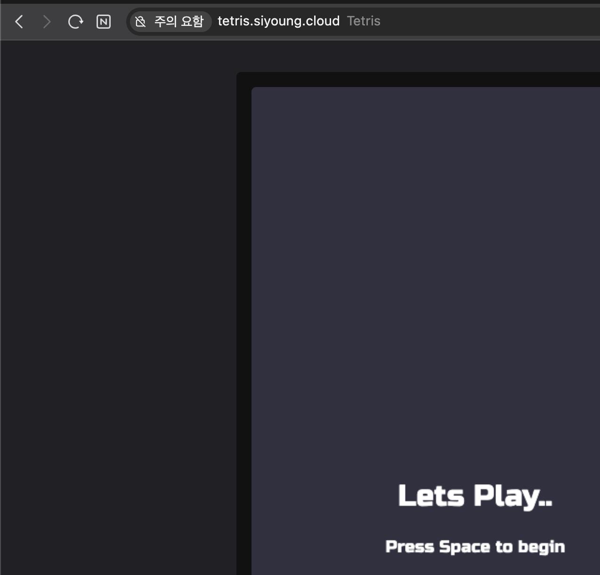
- 리소스 삭제: `kubectl delete deploy,svc tetris` (위에서 정의한 sync 정책으로 연결된 리소스 삭제시 Route53 A레코드 함께 삭제)

### 6.4. 도전과제: Service(NLB + TLS) + 도메인 연동(ExternalDNS)

```Bash
# 환경 변수 지정
MyDomain=<자신의 도메인>
MyDomain=siyoung.cloud

# 해당 도메인의 ACM ARN을 임시 변수에 저장
export ACMARN=$(aws acm list-certificates \
    --certificate-statuses ISSUED \
    --query "CertificateSummaryList[?DomainName=='$MyDomain'].CertificateArn" \
    --output text)
    
# 설정 파일 작성
cat <<EOF | kubectl apply -f -
apiVersion: apps/v1
kind: Deployment
metadata:
  name: tetris
  labels:
    app: tetris
spec:
  replicas: 1
  selector:
    matchLabels:
      app: tetris
  template:
    metadata:
      labels:
        app: tetris
    spec:
      containers:
      - name: tetris
        image: bsord/tetris
---
apiVersion: v1
kind: Service
metadata:
  name: tetris
  annotations:
    service.beta.kubernetes.io/aws-load-balancer-nlb-target-type: ip
    service.beta.kubernetes.io/aws-load-balancer-scheme: internet-facing
    service.beta.kubernetes.io/aws-load-balancer-cross-zone-load-balancing-enabled: "true"
    service.beta.kubernetes.io/aws-load-balancer-backend-protocol: "http"
    #service.beta.kubernetes.io/aws-load-balancer-healthcheck-port: "80"

    service.beta.kubernetes.io/aws-load-balancer-ssl-ports: "443" # 443번 포트에 대해 SSL/TLS 암호화를 적용
    service.beta.kubernetes.io/aws-load-balancer-protocol: "tls" # NLB 리스너의 프로토콜을 TLS 타입으로 생성
    service.beta.kubernetes.io/aws-load-balancer-ssl-cert: "$ACMARN" # ACM 인증서 ARN 
    external-dns.alpha.kubernetes.io/hostname: "tetris.$MyDomain" # Route 53에 자동으로 등록할 도메인 주소
spec:
  selector:
    app: tetris
  ports:
  - port: 443
    protocol: TCP
    targetPort: 80
  type: LoadBalancer
EOF
```

- 웹사이트 HTTPS 접속 확인
    - 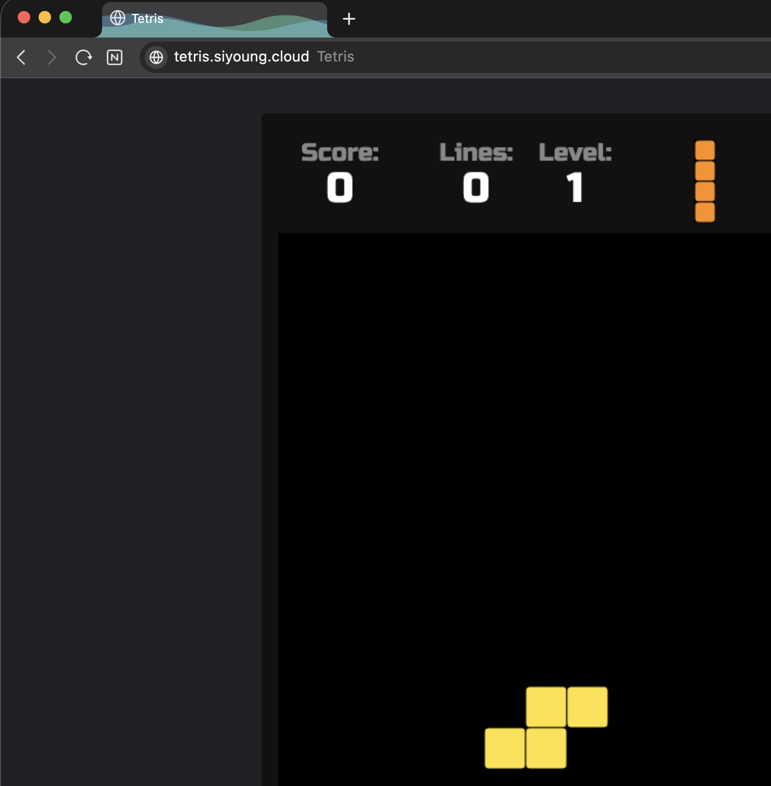

---

## 7. Gateway API

### 7.1. Gateway API 설치

**사전 준비**

```Bash
# 최소 v2.13.0 버전 이상의 LBC 사용
kubectl describe pod -n kube-system -l app.kubernetes.io/name=aws-load-balancer-controller | grep Image: | uniq
    Image:         public.ecr.aws/eks/aws-load-balancer-controller:v3.1.0


# Gateway API CRDs 설치 필요 (K8s 공식)
# --server-side=true
# [REQUIRED] # Standard Gateway API CRDs
kubectl apply -f https://github.com/kubernetes-sigs/gateway-api/releases/download/v1.3.0/standard-install.yaml   
# [OPTIONAL: Used for L4 Routes] # Experimental Gateway API CRDs 
kubectl apply -f https://github.com/kubernetes-sigs/gateway-api/releases/download/v1.3.0/experimental-install.yaml 

kubectl get crd  | grep gateway.networking
backendtlspolicies.gateway.networking.k8s.io          2026-03-26T18:20:05Z
gatewayclasses.gateway.networking.k8s.io              2026-03-26T18:19:28Z
gateways.gateway.networking.k8s.io                    2026-03-26T18:19:29Z
grpcroutes.gateway.networking.k8s.io                  2026-03-26T18:19:30Z
httproutes.gateway.networking.k8s.io                  2026-03-26T18:19:30Z
referencegrants.gateway.networking.k8s.io             2026-03-26T18:19:31Z
tcproutes.gateway.networking.k8s.io                   2026-03-26T18:20:09Z
tlsroutes.gateway.networking.k8s.io                   2026-03-26T18:20:09Z
udproutes.gateway.networking.k8s.io                   2026-03-26T18:20:10Z
xbackendtrafficpolicies.gateway.networking.x-k8s.io   2026-03-26T18:20:10Z
xlistenersets.gateway.networking.x-k8s.io             2026-03-26T18:20:11Z

kubectl api-resources | grep gateway.networking
backendtlspolicies                  btlspolicy        gateway.networking.k8s.io/v1alpha3     true         BackendTLSPolicy
gatewayclasses                      gc                gateway.networking.k8s.io/v1           false        GatewayClass
gateways                            gtw               gateway.networking.k8s.io/v1           true         Gateway
grpcroutes                                            gateway.networking.k8s.io/v1           true         GRPCRoute
httproutes                                            gateway.networking.k8s.io/v1           true         HTTPRoute
referencegrants                     refgrant          gateway.networking.k8s.io/v1beta1      true         ReferenceGrant
tcproutes                                             gateway.networking.k8s.io/v1alpha2     true         TCPRoute
tlsroutes                                             gateway.networking.k8s.io/v1alpha2     true         TLSRoute
udproutes                                             gateway.networking.k8s.io/v1alpha2     true         UDPRoute
xbackendtrafficpolicies             xbtrafficpolicy   gateway.networking.x-k8s.io/v1alpha1   true         XBackendTrafficPolicy
xlistenersets                       lset              gateway.networking.x-k8s.io/v1alpha1   true         XListenerSet


# yaml에 명세하는 spec 확인, -required-는 필수로 설정이 필요한 항목
kubectl explain gatewayclasses.gateway.networking.k8s.io.spec
kubectl explain gateways.gateway.networking.k8s.io.spec
kubectl explain httproutes.gateway.networking.k8s.io.spec


# LBC Gateway API specific CRDs 설치 (AWS 전용, 추가설정 관리)
kubectl apply -f https://raw.githubusercontent.com/kubernetes-sigs/aws-load-balancer-controller/refs/heads/main/config/crd/gateway/gateway-crds.yaml

kubectl get crd | grep gateway.k8s.aws
listenerruleconfigurations.gateway.k8s.aws            2026-03-26T05:23:36Z
loadbalancerconfigurations.gateway.k8s.aws            2026-03-26T05:23:36Z
targetgroupconfigurations.gateway.k8s.aws             2026-03-26T05:23:36Z

kubectl api-resources | grep gateway.k8s.aws
listenerruleconfigurations                            gateway.k8s.aws/v1beta1                true         ListenerRuleConfiguration
loadbalancerconfigurations                            gateway.k8s.aws/v1beta1                true         LoadBalancerConfiguration
targetgroupconfigurations                             gateway.k8s.aws/v1beta1                true         TargetGroupConfiguration

kubectl explain loadbalancerconfigurations.gateway.k8s.aws.spec
kubectl explain listenerruleconfigurations.gateway.k8s.aws.spec
kubectl explain targetgroupconfigurations.gateway.k8s.aws.spec
```

**LBC에 Gateway API 활성화**


```Bash
# 설치 정보 확인
helm list -n kube-system 
helm get values -n kube-system aws-load-balancer-controller # helm values 에 Args 및 활성화 값이 현재는 없어 직접 수정 필요함.
kubectl describe deploy -n kube-system aws-load-balancer-controller | grep Args: -A2
    Args:
      --cluster-name=myeks
      --ingress-class=alb

# 모니터링
kubectl get pod -n kube-system -l app.kubernetes.io/name=aws-load-balancer-controller --watch

# 나노 에디터로 LBC Deployment를 수정함.
# deployment 에 feature flag를 활성화 : By default, the LBC will not listen to Gateway API CRDs.
KUBE_EDITOR="nano" kubectl edit deploy -n kube-system aws-load-balancer-controller
...
      - args:
        - --cluster-name=myeks
        - --ingress-class=alb
        - --feature-gates=NLBGatewayAPI=true,ALBGatewayAPI=true
...

# 확인
kubectl describe deploy -n kube-system aws-load-balancer-controller | grep Args: -A3
    Args:
      --cluster-name=myeks
      --ingress-class=alb
      --feature-gates=NLBGatewayAPI=true,ALBGatewayAPI=true
```

**ExternalDNS에 Gateway API 지원 설정**
```
# deployment에 gateway api 지원 설정 : external-dns-values.yaml 파일 편집 -> 아래 추가
--------------------------
# 리소스 감지 대상
sources:
  - service
  - ingress
  - gateway-httproute
  - gateway-grpcroute
  - gateway-tlsroute
  - gateway-tcproute
  - gateway-udproute
--------------------------

# ExternalDNS 에 gateway api 지원 설정
helm upgrade -i external-dns external-dns/external-dns -n kube-system -f external-dns-values.yaml

# 확인
kubectl describe deploy -n kube-system external-dns | grep Args: -A15
    Args:
      --log-level=info
      --log-format=text
      --interval=1m
      --source=service
      --source=ingress
      --source=gateway-httproute
      --source=gateway-grpcroute
      --source=gateway-tlsroute
      --source=gateway-tcproute
      --source=gateway-udproute
      --policy=sync
      --registry=txt
      --txt-owner-id=stduy-myeks-cluster
      --domain-filter=gasida.link
      --provider=aws
```

### 7.2. 샘플 애플리케이션 배포

**모니터링**

```Bash
# 로그 모니터링
kubectl logs -l app.kubernetes.io/name=aws-load-balancer-controller -n kube-system -f
혹은
kubectl stern -l app.kubernetes.io/name=aws-load-balancer-controller -n kube-system
```

**loadbalancerconfigurations - [Docs](https://kubernetes-sigs.github.io/aws-load-balancer-controller/latest/guide/gateway/loadbalancerconfig/)**
```Bash
# 기본 설정은 internal이므로 internet-facing으로 변경
# loadbalancerconfigurations 생성
kubectl explain loadbalancerconfigurations.gateway.k8s.aws.spec
...
  scheme        <string>
  enum: internal, internet-facing
    scheme defines the type of LB to provision. If unspecified, it will be
    automatically inferred.
...

cat << EOF | kubectl apply -f -
apiVersion: gateway.k8s.aws/v1beta1
kind: LoadBalancerConfiguration
metadata:
  name: lbc-config
  namespace: default
spec:
  scheme: internet-facing
EOF

# 확인
kubectl get loadbalancerconfiguration -owide
NAME         AGE
lbc-config   21s
```

**gatewayclasses**

```Bash
# controllerName 필수
# gatewayclasses 생성
kubectl explain gatewayclasses.spec
kubectl explain gatewayclasses.spec.parametersRef
cat << EOF | kubectl apply -f -
apiVersion: gateway.networking.k8s.io/v1
kind: GatewayClass
metadata:
  name: aws-alb
spec:
  controllerName: gateway.k8s.aws/alb
  parametersRef:
    group: gateway.k8s.aws
    kind: LoadBalancerConfiguration
    name: lbc-config # aws-alb라는 gatewayclass를 생성할 때 위에서 만든 lbc-config 참조
    namespace: default
EOF

# gatewayclasses 확인 : 약어 gc
kubectl get gatewayclasses -o wide  # 약어 = k get gc
NAME      CONTROLLER            ACCEPTED   AGE   DESCRIPTION
aws-alb   gateway.k8s.aws/alb   True       10s  
```

**gateway**
```Bash
# gateways 생성
kubectl explain gateways.spec
cat << EOF | kubectl apply -f -
apiVersion: gateway.networking.k8s.io/v1
kind: Gateway
metadata:
  name: alb-http
spec:
  gatewayClassName: aws-alb # 위에서 만든 gc 사용
  listeners:
  - name: http
    protocol: HTTP
    port: 80
EOF

# gateways 확인 : 약어 gtw
kubectl get gateways  # k get gtw
NAME       CLASS     ADDRESS                                                                      PROGRAMMED   AGE
alb-http   aws-alb   k8s-default-albhttp-b5a9f3dbc4-1257241845.ap-southeast-1.elb.amazonaws.com   Unknown      22s

# ALB 생성 확인
aws elbv2 describe-load-balancers | jq 
aws elbv2 describe-target-groups # 대상그룹은 비어있음

# 로그 모니터링
kubectl logs -l app.kubernetes.io/name=aws-load-balancer-controller -n kube-system -f
혹은
kubectl stern -l app.kubernetes.io/name=aws-load-balancer-controller -n kube-system
```

- 생성된 ALB 인바운드 규칙에 http 80 확인
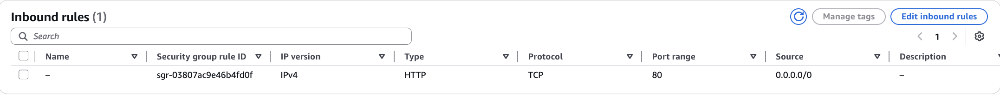

**샘플 애플리케이션 배포**
```Bash
# 게임 파드와 Service 배포
cat <<EOF | kubectl apply -f -
apiVersion: apps/v1
kind: Deployment
metadata:
  name: deployment-2048
spec:
  selector:
    matchLabels:
      app.kubernetes.io/name: app-2048
  replicas: 2
  template:
    metadata:
      labels:
        app.kubernetes.io/name: app-2048
    spec:
      containers:
      - image: public.ecr.aws/l6m2t8p7/docker-2048:latest
        imagePullPolicy: Always
        name: app-2048
        ports:
        - containerPort: 80
---
apiVersion: v1
kind: Service
metadata:
  name: service-2048
spec:
  ports:
    - port: 80
      targetPort: 80
      protocol: TCP
  type: ClusterIP
  selector:
    app.kubernetes.io/name: app-2048
EOF

# 모니터링
watch -d kubectl get pod,ingress,svc,ep,endpointslices

# 생성 확인
kubectl get svc,ep,pod
```

**TargetGroupConfiguration** - [Docs](https://kubernetes-sigs.github.io/aws-load-balancer-controller/latest/guide/gateway/targetgroupconfig/)

```Bash
# TagetType의 기본 값이 instance이므로 ip로 변경
# TargetGroupConfiguration 생성
kubectl explain httproutes.gateway.k8s.aws.spec
kubectl explain targetgroupconfigurations.gateway.k8s.aws.spec.defaultConfiguration 

cat << EOF | kubectl apply -f -
apiVersion: gateway.k8s.aws/v1beta1
kind: TargetGroupConfiguration
metadata:
  name: backend-tg-config
spec:
  targetReference:
    name: service-2048
  defaultConfiguration:
    targetType: ip
    protocol: HTTP
EOF

# 확인
kubectl get targetgroupconfigurations -owide
NAME                SERVICE-NAME   AGE
backend-tg-config   service-2048   6s

# ALB 확인
aws elbv2 describe-load-balancers | jq 
aws elbv2 describe-target-groups | jq # 대상 그룹 아직 비어있음
```

**httproute**
```Bash
# 서비스 도메인명 변수 지정
GWMYDOMAIN=<각자 자신의 도메인명>
GWMYDOMAIN=gwapi.siyoung.cloud

# httproute 생성
kubectl explain httproutes.spec
kubectl explain httproutes.spec.parentRefs
kubectl explain httproutes.spec.hostnames
kubectl explain httproutes.spec.rules

cat << EOF | kubectl apply -f -
apiVersion: gateway.networking.k8s.io/v1
kind: HTTPRoute
metadata:
  name: alb-http-route
spec:
  parentRefs:
  - group: gateway.networking.k8s.io
    kind: Gateway
    name: alb-http
    sectionName: http
  hostnames:
  - $GWMYDOMAIN
  rules:
  - backendRefs:
    - name: service-2048
      port: 80
EOF

# 확인
kubectl get httproute       
NAME             HOSTNAMES                 AGE
alb-http-route   ["gwapi.siyoung.cloud"]   51s

# ALB 확인
aws elbv2 describe-load-balancers | jq 
aws elbv2 describe-target-groups | jq

# 로그 모니터링
kubectl logs -l app.kubernetes.io/name=aws-load-balancer-controller -n kube-system -f
혹은
kubectl stern -l app.kubernetes.io/name=aws-load-balancer-controller -n kube-system
```

- AWS 콘솔상 ALB 리소스맵 확인
    - 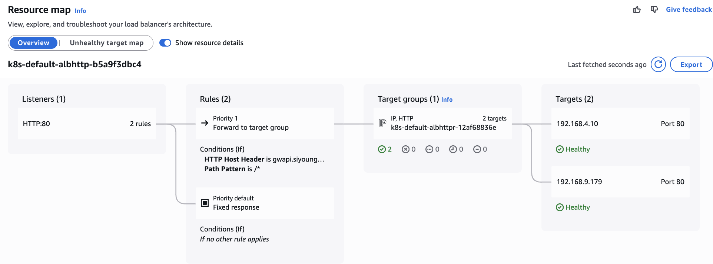

**접속 테스트**

```
# 확인
dig +short $GWMYDOMAIN @8.8.8.8
dig +short $GWMYDOMAIN

# 도메인 체크
echo -e "My Domain Checker Site1 = https://www.whatsmydns.net/#A/$GWMYDOMAIN"
echo -e "My Domain Checker Site2 = https://dnschecker.org/#A/$GWMYDOMAIN"

# 웹 접속 주소 확인 및 접속
echo -e "GW Api Sample URL = http://$GWMYDOMAIN"
```

- 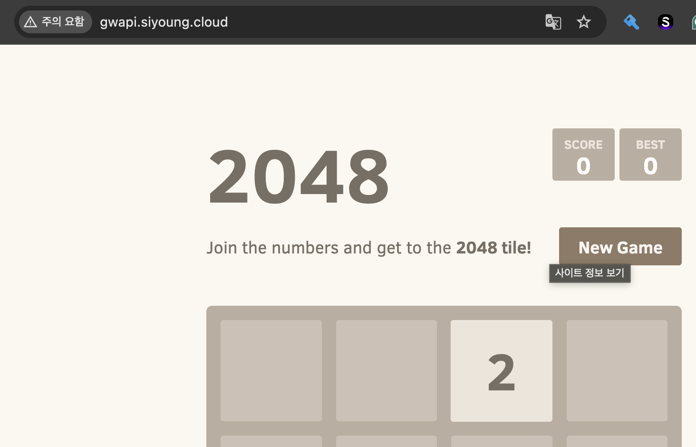

- 리소스 삭제: `kubectl delete httproute,targetgroupconfigurations,Gateway,GatewayClass --all`

---

## 8. 자원 삭제

```Bash
# IRSA 설정 삭제
CLUSTER_NAME=myeks
eksctl delete iamserviceaccount --cluster=$CLUSTER_NAME --namespace=kube-system --name=external-dns
eksctl delete iamserviceaccount --cluster=$CLUSTER_NAME --namespace=kube-system --name=aws-load-balancer-controller

# 확인
eksctl get iamserviceaccount --cluster $CLUSTER_NAME

# 테라폼 리소스 삭제
terraform destroy -auto-approve && rm -rf ~/.kube/config

```

---
<!-- 
## 9. 2주차 도전 과제

- `도전과제` 두 번째 관리형 노드 추가 하여, **노드 부트스트랩 과정에 kubelet maxPods 110개 적용** 후 해당 노드에 **디플로이먼트 배포** by 테라폼 - [참고](https://kkamji.net/posts/eks-max-pod-limit/)
- `도전과제` Custom Networking 설정 및 동작 확인 해보기 by 테라폼 - [Docs](https://docs.aws.amazon.com/ko_kr/eks/latest/best-practices/custom-networking.html) , [Workshop](https://www.eksworkshop.com/docs/networking/vpc-cni/custom-networking/)
    - Automating custom networking to solve IPv4 exhaustion in Amazon EKS - [Link](https://aws.amazon.com/blogs/containers/automating-custom-networking-to-solve-ipv4-exhaustion-in-amazon-eks/)
- `도전과제` eks 모듈로 배포 시, 관리형 노드 그룹에 시작 템플릿에 `imds hop limit = 2` 적용 설정 해보기
- `도전과제` Amazon EKS 멀티 클러스터 로드밸런싱으로 고가용성 애플리케이션 구성하기 - [Link](https://aws.amazon.com/ko/blogs/tech/build-highly-available-application-with-amazon-eks-multi-cluster-loadbalancing/)
    - AWS LB Controller 에서 Service(NLB)와 Ingress(ALB)를 MultiCluster Target Groups 사용 - [Docs](https://kubernetes-sigs.github.io/aws-load-balancer-controller/v2.11/guide/use_cases/multi_cluster/)
    - A deeper look at Ingress Sharing and Target Group Binding in AWS Load Balancer Controller - [링크](https://aws.amazon.com/blogs/containers/a-deeper-look-at-ingress-sharing-and-target-group-binding-in-aws-load-balancer-controller/)
- `도전과제` Service(NLB + **TLS**) + 도메인 연동(ExternalDNS)
- `도전과제` Ingress(**ALB** + **HTTPS**) + 도메인 연동(ExternalDNS)
- `도전과제` AWS LBC를 통해서 Gateway API 의 HTTPRoute 사용 시, 아래 기능들 적용 해보기 - [Docs](https://kubernetes-sigs.github.io/aws-load-balancer-controller/latest/guide/gateway/l7gateway/#examples)
    - Modifying Request Headers : 요청 헤더 조작
    - HTTP Header Matching : 헤더 매칭을 통한 백엔드 라우팅
    - Source IP Condition : 요청 소스 IP 통제
- `도전과제` AWS LBC를 통해서 Gateway API 의 TLSRoute 를 적용 해보기 - [Docs](https://kubernetes-sigs.github.io/aws-load-balancer-controller/latest/guide/gateway/l4gateway/)
- `도전과제` CoreDNS 모니터링 및 최적화 가이드 내용으로 실습 환경 구성 및 테스트 해보기 - [Github](https://devfloor9.github.io/engineering-playbook/docs/infrastructure-optimization/coredns-monitoring-optimization)
    
    ```bash
    .:53 {
      kubernetes cluster.local in-addr.arpa ip6.arpa {
        pods insecure
        fallthrough in-addr.arpa ip6.arpa
        **ttl 30**           # Service/POD 레코드 TTL
      }
    
      **cache 30 {         # 최대 30초 보존
        success 10000 30 # capacity 10k, maxTTL 30s
        denial 2000 10   # negative cache 2k, maxTTL 10s
        prefetch 5 60s   # 동일 질의 5회↑면 60s 전에 갱신
      }**
    
      forward . /etc/resolv.conf {
        **max_concurrent 2000**
        prefer_udp
      }
    
      prometheus :9153
      health {
        **lameduck 30s**
      }
      ready
      reload
      log
    }
    ```
 -->
