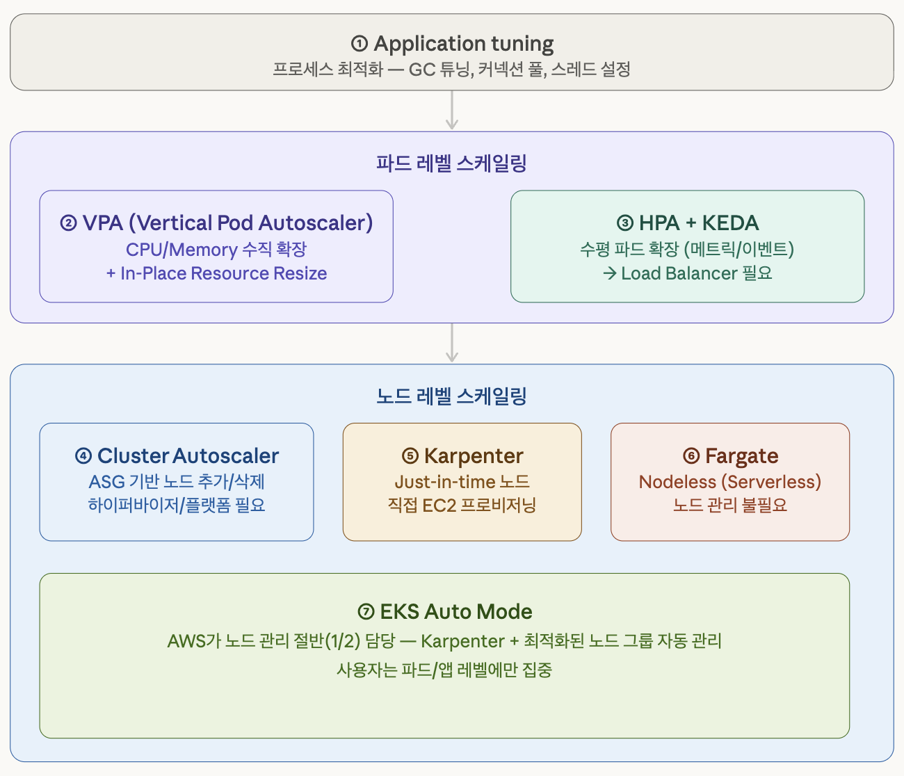
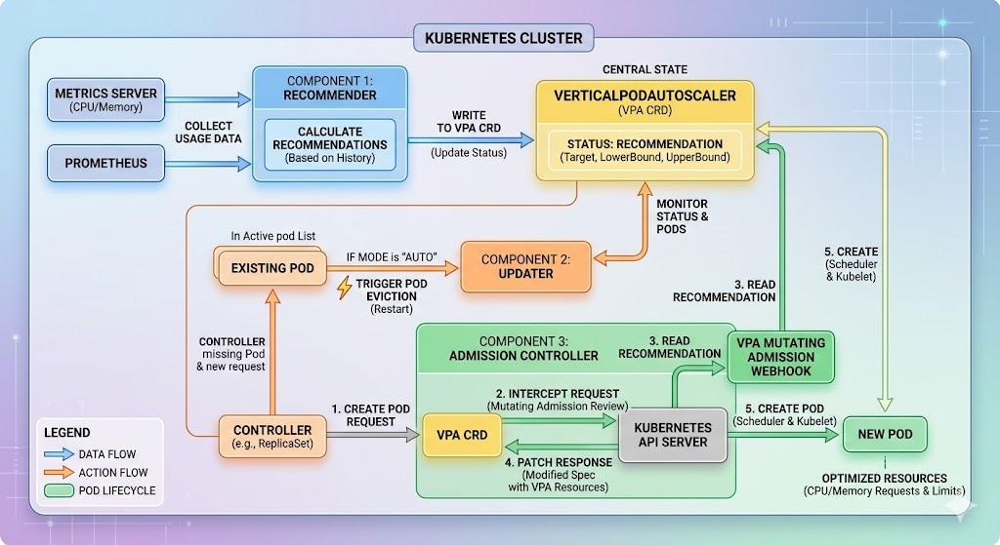
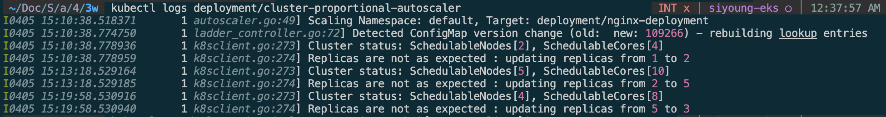

> *CloudNet 팀의 [2026년 AWS EKS Workshop Study 4기](https://gasidaseo.notion.site/26-AWS-EKS-Hands-on-Study-4-31a50aec5edf804b8294d8d512c43370) 3주차 학습 내용을 담고 있습니다.*


## **1. Kubernetes의 Scaling 기법**



AWS EKS 스케일링은 크게 파드 레벨과 노드 레벨로 나눌 수 있습니다.

> 애플리케이션 병목이 해결 되지 않은 상태에서 파드와 노드만 스케일링한다면 인프라 비용이 비효율적으로 증가하게 됩니다. 트래픽 증가가 예상되는 경우 스케일링 작업 이전, 진행되는 이벤트의 성격에 맞게 애플리케이션 튜닝 작업을 진행하는 것이 좋습니다. 

1. 파드 레벨 스케일링
      1. VPA(Vertical Pod Autoscaler): 기존 파드에 CPU/Memory를 더 많이 주는 방식으로 `requests`와 `limits` 값을 자동으로 조정
      2. HPA(Horizontal Pod Autoscaler): `kubectl top`이 수집하는 CPU/Memory 메트릭 기반 파드 수 조정
      3. HPA + KEDA: 특정 이벤트 기반으로 파드 수 조정 
      4. CPA(Cluster Propotional Autoscaler): 노드 개수에 비례하여 파드 수 조정
2. 노드 레벨 스케일링
      1. CA/CAS(Cluster Autoscaler): AWS의 Auto Scaling Group을 제어하여 파드 Pending 상태 또는 노드 활용률에 따라 노드를 동적으로 추가/삭제
      2. Karpenter: Just-in-Time Nodes, EC2 Fleet API를 직접 호출하여 노드 프로비저닝이 빠르며 파드 요구사항에 따라 실시간으로 최적의 노드 타입 할당
      3. 노드 그룹 자동관리: 
         1. Fargate: 노드를 전혀 관리하지 않고 파드 단위로 인프라를 프로비저닝하는 방식, 파드 1개 = Firecracker 기반 전용 마이크로 VM
         2. EKS Auto Model: AWS가 노드 관리의 절반을 담당

- 참고자료
    - [EKS 스케일링 전략 종합 가이드 Link](https://devfloor9.github.io/engineering-playbook/docs/eks-best-practices/resource-cost/karpenter-autoscaling#%EC%A0%91%EA%B7%BC%EB%B2%95-3-%EC%95%84%ED%82%A4%ED%85%8D%EC%B2%98%EC%A0%81-%EB%B3%B5%EC%9B%90%EB%A0%A5)
    - Hands-on 코드 자료: https://github.com/gasida/aews.git


## 2. HPA(Horizontal Pod Autoscaler)

HPA는 `kube-controller-manager`에 내장된 쿠버네티스의 네이티브 컨트롤러입니다.

**파드의 리소스 메트릭 관찰을 통해 `.spec.replicas`를 조정**하여 Deployment, Replicaset, Statefulset과 같은 `scale` 서브 리소스를 가진 리소스의 파드 복제본 수를 자동으로 조절하는 하는 역할을 합니다. 

예: 50%의 CPU 사용률이 목표인 경우 평균 사용률이 50%를 초과할 때 복제본을 추가하고, 50% 이하로 떨어지면 복제본을 제거합니다.

### 2.1. 동작 방식

HPA는 Kubernetes 컨트롤 플레인의 kube-controller-manager 내에서 실행되는 스레드입니다. 이 컨트롤러는 기본적으로 15초마다( --horizontal-pod-autoscaler-sync-period) 루프를 돌며 파드의 상태를 관측하고 스케일링 여부를 결정합니다.

전체적인 제어 루프는 **관측(Observe) → 계산(Calculate) → 결정(Decide) → 실행(Act)**의 4단계로 이루어집니다.

- 1단계(관측):
    - HPA 컨트롤러가 Metrics API(metrics-server 또는 Custom Metrics API)에 질의하여 현재 설정된 메트릭 값을 수집
    - CPU `averageUtilization` 기준 HPA의 사용률은 **노드 전체 CPU가 아니라 대상 워크로드에 속한 모든 Ready 상태 파드의 `requests` 대비 사용률**
- 2단계(계산): 
    - 수집된 메트릭을 기반으로 필요한 파드 수(Desired Replica)를 도출합니다.
- 3단계(결정): 
    - HPA가 Deployment의 `replicas` 필드를 업데이트
- 4단계(배치):
    - 컨트롤 플레인이 파드를 생성하여 노드에 배치

**기타 제어 로직**

- 다중 메트릭 처리: 
    - HPA는 `autoscaling/v2`에서 다중 메트릭을 사용할 수 있으며, 각 메트릭으로 계산된 desired replica 중 **가장 큰 값**을 선택합니다.
- 기타 설정(`behavior` 필드): 
    - tolerance(허용 오차 설정): 목표치의 ±10% 이내의 변동은 무시
    - scale-up/down stabilization window: 기본적으로 5분 이상 트래픽이 감소할 경우 파드 스케일 다운

### 2.2. 스케일링 계산 공식

```text
desired_replicas = ceil(current_replicas × (current_metric / target_metric))

예시:
    현재 replica: 5
    현재 CPU 평균 사용률: 80%
    목표 CPU 평균 사용률: 50%
    desired_replicas = ceil(5 × (80/50)) = ceil(5 × 1.6) = 8
    desired_replicas = 8
    → 파드 수 8개로 조정
```

### 2.3. 메트릭 종류


| 메트릭 유형 (Type) | 대상 (Target) 평가 방식 (Metric Source) | 주요 활용 사례 | 수집 소스 및 비고 |
|---|---|---|---|
| Resource | Pod 내 컨테이너 리소스 사용량 (CPU, Memory) | 일반적인 시스템 부하 관리 (CPU 60% 이상 시 확장) | Metrics Server |
| Object | K8s의 특정 오브젝트(예: Ingress, Service 등)메트릭 | Ingress의 RPS(초당 요청 수)에 따른 스케일링 | Custom Metrics API </br>(예: Prometheus Adapter) |
| Pods | 대상 모든 Pod의 전체 평균 | 앱 내부 TPS, 동시 접속자 수 평균 기반 확장 | Custom Metrics API </br>(예: App 소스 내 Prometheus Exporter) |
| External | K8s 클러스터 외부 리소스 (SQS, Kafka 등) | 외부 메시지 큐 대기열 수에 따른 워커 확장 | External Metrics API </br>(예: CloudWatch, Datadog, Kafka 등 외부 API) |

### 2.4. 주의사항

- HPA CPU 스케일링은 pod spec의 `resources.requests.cpu` 필드 기준으로 사용률을 계산하므로, HPA가 정상적으로 동작하려면 해당값이 설정되어야 합니다.
- Ready 상태가 된 파드만 HPA 계산에 포함되므로, readinessProbe를 설정하여 준비되지 않은 파드가 트래픽을 받지 않도록 해야 합니다.

<!-- - CPU/Memory는 현재 부하에는 민감하지만, **미래의 이벤트 폭증**은 직접 보지 못합니다.
- 큐 깊이, 주문 대기 수, 외부 API 호출량 같 지표는 기본 HPA만으로 표현하기 어렵습니다.
- 시작 직후의 워밍업 구간, GC 폭증, 캐시 적재처럼 일시적인 피크가 있으면 잘못된 스케일링이 나올 수 있습니다.
- HPA의 한계: CPU/Memory 메트릭은 "지금 바쁜지"는 알지만, "얼마나 더 바빠질지"는 모릅니다. 메시지 큐에 100만 개가 쌓이고 있어도 CPU가 낮으면 HPA는 스케일 아웃하지 않습니다.
- KEDA (Kubernetes Event-Driven Autoscaling): 이 문제를 해결하는 CNCF 프로젝트로 AWS EKS에서 공식 지원합니다. SQS 큐 깊이, Kafka lag, CloudWatch 메트릭, DynamoDB 스트림 등 70+ 개의 외부 소스를 트리거로 사용 가능합니다. 내부적으로 ScaledObject를 생성하면 HPA를 자동으로 만들어 관리합니다. 트래픽이 0일 때 파드를 0개로 줄이는 scale-to-zero도 지원합니다 (HPA는 최소 1개). -->

### 2.5. HPA 설정 예시

**다중 메트릭 예시 YAML**

‼️‼️ 여러 개의 메트릭이 정의되어 있을 경우, 각 메트릭 별로 필요한 Replicas 수를 계산한 뒤 그 중 가장 높은 값을 선택합니다.

```yaml
apiVersion: autoscaling/v2
kind: HorizontalPodAutoscaler
metadata:
  name: advanced-hpa
spec:
  scaleTargetRef:
    apiVersion: apps/v1
    kind: Deployment
    name: my-web-service
  minReplicas: 2
  maxReplicas: 20
  metrics:
  # [Resource] CPU 사용량이 평균 60%를 넘을 때
  - type: Resource
    resource:
      name: cpu
      target:
        type: Utilization
        averageUtilization: 60
  # [Object] Ingress의 초당 요청수가 1,000을 넘을 때
  - type: Object
    object:
      describedObject:
        kind: Ingress
        name: main-ingress
      metric:
        name: requests-per-second
      target:
        type: Value
        value: 1k
  # [Pods:] 각 파드별 '초당 처리 요청수'의 평균이 500개일 때 
  # 모든 파드의 값을 합산해 현재 파드 수로 나눈 평균값을 타겟(500)과 비교합니다.
  - type: Pods
    pods:
      metric:
        name: http_requests_per_second
      target:
        type: AverageValue
        averageValue: 500
  # [External] 외부 메시지 큐(예: SQS)에 대기 메시지가 많을 때
  - type: External
    external:
      metric:
        name: queue_messages_ready
      target:
        type: AverageValue
        averageValue: 50
  # [External] AWS RDS CPU 사용률 기반 (CloudWatch Adapter 사용 시)
  - type: External
    external:
      metric:
        name: cloudwatch_rds_cpu_utilization_average
        selector:
          matchLabels:
            DBInstanceIdentifier: my-production-db
      target:
        type: Value
        value: 80  # RDS CPU가 80%를 넘으면 서버 확장 준비
  # [External] Datadog 지표 기반 (Datadog Cluster Agent 사용 시)
  # 예: 전체 시스템의 에러율(error_rate)이 높아질 때 확장
  - type: External
    external:
      metric:
        name: datadog.metric.my_app.request_error_rate
      target:
        type: Value
        value: 5   # 에러율이 5%를 넘으면 확장
  behavior:
    scaleUp:
      selectPolicy: Max # Max/Min/Disabled 중 선택, 기본값 Max
      stabilizationWindowSeconds: 0
      policies:
      - type: Percent
        value: 100 # 한 번에 현재 replica 수의 100% 만큼 스케일 아웃 가능
        periodSeconds: 15
    scaleDown:
      # 스케일인은 5분 대기 후 한 번에 최대 10%씩만
      stabilizationWindowSeconds: 300
      selectPolicy: Max
      policies:
      - type: Percent
        value: 10
        periodSeconds: 60
```

## 3. VPA (Vertical Pod Autoscaler)

VPA는 파드가 실제로 사용하는 자원 패턴을 분석하여 컨테이너의 requests와 limits 값을 자동으로 최적화합니다. 

### 3.1. Requests vs Limits

VPA가 무엇을 조작하는지 이해하기 위해서는 먼저 쿠버네티스의 리소스 관리 기준인 `requests`와 `limits`의 차이를 알 필요가 있습니다.

- **Requests (요청량) = 스케줄러용**
    - 파드 초기 실행 시, 파드가 정상적으로 실행되기 위해 보장되어야 하는 최소한의 리소스를 요청하는 값입니다.
    - kube-scheduler는 각 노드의 여유 리소스를 확인하고, 파드의 `requests`를 수용할 수 있는 노드에만 파드를 배치(스케줄링)합니다.
    - **초과시 동작**: 파드가 `Pending` 상태로 생성되지 않습니다.
    - **HPA의 기준점:** HPA에서 CPU 사용률을 50%로 설정했다면, 이 50%는 실제 노드의 전체 CPU가 아니라 **파드의 CPU `requests` 값 대비 50%**를 의미합니다.

* **Limits (제한량): 리소스 사용 상한선(cgroup용)**
    * 파드가 노드에 배치된 후 파드가 사용할 수 있는 리소스의 최대 한계치입니다. 이 값은 컨테이너 런타임을 통해 호스트 OS의 c은 비즈니스groups 설정으로 변환되어 커널이 리소스 사용을 통제합니다. 노드에 자원이 남더라도 파드는 이 설정값을 초과해서 사용할 수 없습니다. 
    * **초과 시 동작:**
        * CPU: CPU는 압축 가능한(Compressible) 리소스이므로 초과 시 컨테이너가 종료되지는 않습니다. 설정된 Limit 이상의 자원 사용 시 커널이 CPU 할당 시간을 제한합니다. 이로 인해 CPU Throttling이 발생하여 프로세스가 종료되지는 않지만 애플리케이션의 응답 속도가 느려집니다. 
        * Memory: 메모리는 압축할 수 없는(Incompressible) 리소스이므로, Limits를 초과하면 리눅스 커널은 시스템 전체가 마비되는 것을 막기 위해 파드를 강제 종료합니다. = OOMKilled (Out Of Memory) 상태가 됩니다.

> **Best Practice:** <br/>CPU는 Requests와 Limits를 동일하게 주어 Guaranteed QoS 클래스를 보장하거나 Limits를 아예 해제하기도 하지만, 메모리의 경우 메모리 누수로 인한 노드 전체의 장애를 막기 위해 Limits를 반드시 설정하는 것이 권장됩니다. <br/> 1. 일반적인 웹/API 서버 (Burstable): CPU Requests 설정 + CPU Limits 해제 + Memory Requests/Limits 동일하게 설정 <br/>2. 민감한 핵심 워크로드 (Guaranteed): CPU & Memory 모두 Requests = Limits 로 동일하게 설정


### 3.2. **VPA 동작 방식**



- **동작 방식**:
    - Recommender가 과거 리소스 사용 이력을 분석 → VerticalPodAutoscaler 오브젝트에 권장값 작성 → Updater가 파드를 재시작하면서 새 값 적용 → Admission Controller가 신규 파드 생성 시 권장값 자동 주입.
<!-- - **계산방식**:
    - 기준값 + 마진 -->

| 컴포넌트 | 주요 역할 | 데이터 소스 | 핵심 동작 |
| :--- | :--- | :--- | :--- |
| **Recommender** | 파드의 리소스 사용량 분석 및 최적의 권장량(CPU/Memory) 산출 | Metrics Server<br>Prometheus | 계산된 권장값(Target, Min, Max)을 **VPA CRD**의 상태(Status) 필드에 지속적으로 기록 |
| **Updater** | 현재 파드의 할당량과 권장값의 차이를 모니터링하여 파드 재시작 유도 | **VPA CRD** (권장값)<br>현재 실행 중인 파드의 리소스 스펙 | 차이가 크고 모드가 `Auto`일 경우, 기존 파드를 축출(Evict)하여 상위 컨트롤러를 통한 재생성 유도 |
| **Admission Controller**<br>(Mutating Webhook) | 새로 생성되는 파드의 생성 요청을 가로채어 최적화된 리소스 값을 자동 주입 | **VPA CRD** (최신 Target 권장값) | API 서버의 파드 생성 요청을 Intercept 후, 권장 리소스가 주입(Patch)된 스펙을 API 서버로 반환하여 파드 생성 |


### 3.3. **VPA 업데이트 모드**

> Auto 모드와 InplaceOrRecreate는 상황에 따라 파드를 재시작할 수 있어 다운타임 발생의 위험이 있습니다. 프로덕션 환경에서는 Off, Initial을 사용하거나, 반드시 자동으로 스케일업이 수행되어야 한다면 파드를 여러 대 띄우고 PDB를 필수적으로 설정하는 것이 좋습니다. 

- `Off` 모드
    - 권장사항만 제공
    - 관리자가 수동으로 적용하거나, 외부 CD 툴 사용하여 롤링 업데이트 시 사용 가능
- `Initial` 모드 
    - 파드가 처음 스케줄링 될 때 딱 한 번만 개입하여 권장값 주입
    - 이미 실행되어 서비스 중인 파드는 권장값과 차이가 발생하더라도 절대 축출되지 않음
- `Auto` 모드
    - 초기 생성 시 권장값을 주입하고, 실행중인 파드 모두 VPA 권장값과 크게 차이 나면 파드를 축출하고 신규 파드 생성
- `InPlaceOrRecreate` 모드
    - 기존에는 리소스 변경 시 파드 재시작이 필수였으나, 1.33 GA 버전 이후 기능이 도입되어 재시작 없이 실행 중인 파드의 CPU/Memory를 변경 가능
    - 1순위 동작 (In-place Update): 파드를 축출(Evict)하는 대신 Kubernetes API의 `resize` 하위 리소스를 호출하여 컨테이너 런타임이 백그라운드에서 Linux cgroup 설정만 변경
    - 2순위 동작 (Fallback to Recreate): 현재 파드가 떠 있는 노드에 리소스가 부족하거나, OS 제약으로 메모리를 줄이는 것이 불가한 경우 파드를 종료하고 새로운 노드에 생성
    - CPU와 메모리만 In-place로 변경 가능, Windows 노드 미지원

### 3.4. **VPA + HPA 함께 사용하기**

HPA와 동시 사용 시 동일한 리소스 지표를 바라본다면 다음과 같은 충돌이 발생할 수 있습니다. 

- targetCPUUtilizationPercentage 기반 HPA + VPA
    - VPA가 CPU requests를 올리면 HPA의 스케일링 기준이 변경되어 스케일 인 발생 → 파드 수가 줄어들어 각 파드에 대한 부하 상승 → VPC가 다시 CPU Request 샹항 조정 → 무한 루프 발생

**권장 사용 방법**

1. VPA를 `updateMode: "Off"`, 또는 `updateMode: "Initial"` 설정으로 사용
2. VPA와 HPA가 서로 다른 지표를 모니터링 <br/>예: VPA는 파드의 CPU/Memory 기반으로 Requests/Limits 최적화하고, HPA를 리소스 메트릭 대신 RPS, Active Connections, Queue length 또는 KEDA를 통한 이벤트 기반의 스케일 인/아웃 수행
3. Goldilocks 사용

<!-- **적합한 워크로드**

- 적합한 워크로드: 단일 인스턴스로 충분하지만 리소스 예측이 어려운 경우 (ML 학습 잡, 배치 처리, StatefulSet). -->


## 4. KEDA

KEDA(Kubernetes Event-Driven Autoscaling)는 리소스 사용량 대신, 외부 이벤트 소스의 메트릭(예: SQS의 큐 길이, 메시지 적재량 등)을 기반으로 파드를 스케일링하는 역할을 합니다.

HPA는 CPU/메모리를 기반으로 파드를 스케일링 하므로 메시지 큐에 100만 개가 쌓여있더라도 CPU 리소스 사용량이 적으면 파드 수를 늘리지 않습니다. KEDA + HPA를 사용 시 이벤트 기반으로 파드를 스케일링할 수 있습니다.

> Scale to Zero: HPA는 최소 1개의 파드를 남겨둬야 하지만, KEDA는 이벤트가 없으면 파드를 0개로 완전히 줄였다가(`minReplicaCount`=0), 이벤트가 들어오는 즉시 1개(또는 설정값)를 생성할 수 있습니다.

### 4.1. KEDA의 구조

**KEDA의 주요 세 가지 컴포넌트**:

1. KEDA Operator: 
      1. `ScaledObject` 및 `ScaledJob`과 같은 커스텀 리소스(CRD)를 감시하고 관리
      2. 이벤트가 발생하지 않을 때 Deployment를 0으로 스케일링하거나, 첫 번째 이벤트가 들어왔을 때 1로 활성화하는 역할을 담당
2. Metrics Adapter: 
      1. 외부 이벤트 소스(SQS, Kafka, Prometheus 등)로부터 수집한 지표를 쿠버네티스 External Metrics API로 노출
      2. HPA는 이 어댑터를 통해 지표를 조회하여 1개 이상의 파드 상태에서 스케일링을 결정
3. Scaler: 
      1. 특정 외부 시스템과 통신하여 지표를 가져오는 어댑터 라이브러리
      2. AWS SQS, Azure Monitor, GCP Pub/Sub, Redis, Kafka, PostgreSQL 등 60개 이상의 스케일러 지원

### 4.2. HPA와의 관계

- ScaledObject: Deployment, StatefulSet 등을 스케일링할 때 사용합니다. 지속적으로 실행되어야 하는 워커 서비스에 적합합니다.
- ScaledJob: 각 이벤트마다 별도의 Kubernetes Job을 띄울 때 사용합니다. 긴 시간이 걸리는 배치 작업이나, 각 메시지마다 독립적인 실행 환경이 필요한 경우에 유리합니다.

### 4.3. ScaledObject vs ScaledJob

- 배치/워커형 workload처럼 입력 이벤트가 쌓일 때만 많이 확장해야 하는 경우
- CPU는 낮지만 큐 깊이는 급격히 증가하는 비동기 처리 시스템
- 특정 시간대나 외부 시스템 상태에 따라 scale-up/down을 제어하고 싶은 경우

### 4.4. 주의사항

- AWS 서비스와 연동할 때는 IRSA(IAM Roles for Service Accounts)를 사용합니다. 
- 장기 실행 작업에서는 scale-down 시 현재 처리 중인 작업이 중단될 수 있으므로 종료 처리와 `terminationGracePeriodSeconds`를 함께 설계해야 합니다.
- 메트릭 캐싱, polling interval, activation threshold를 적절히 조정해야 합니다.
- KEDA가 ScaledObject를 바탕으로 HPA를 자동 생성하므로 동일한 Deployment에 수동으로 HPA를 생성하면 충돌이 발생할 수 있습니다.
- 파드만 스케일링 하므로, `maxReplicaCount`를 설정할 때 클러스터의 전체 노드 자원과 쿼터를 확인하지 않으면 노드 부족으로 인한 Pending 상태가 될 수 있습니다.
<!-- - 임계값(Threshold) 설정: queueLength를 결정할 때 파드 하나가 처리할 수 있는 최대 동시성(Concurrency)을 고려해야 합니다. 너무 낮게 잡으면 불필요한 파드가 너무 많이 생성(Thrashing)될 수 있습니다.
- 지표 지연(Lag): 폴링 주기(`pollingInterval`)가 너무 길면 급격한 트래픽 유입에 대응이 늦어질 수 있고, 너무 짧으면 외부 API(예: AWS CloudWatch) 비용이 증가할 수 있습니다. 보통 15~30초가 적당합니다. -->

<!-- - 기존의 **HPA**(Horizontal Pod Autoscaler)는 리소스(CPU, Memory) 메트릭을 기반으로 스케일 여부를 결정하게 됩니다.
- 반면에 **KEDA**는 **특정 이벤트를 기반으로 스케일 여부를 결정**할 수 있습니다.
- 예를 들어 airflow는 metadb를 통해 현재 실행 중이거나 대기 중인 task가 얼마나 존재하는지 알 수 있습니다.
- 이러한 이벤트를 활용하여 worker의 scale을 결정한다면 queue에 task가 많이 추가되는 시점에 더 빠르게 확장할 수 있습니다. -->

### 4.5. KEDA 설정 예시

```yaml
apiVersion: keda.sh/v1alpha1
kind: ScaledObject
metadata:
  name: advanced-sqs-scaler
spec:
  scaleTargetRef:
    name: heavy-worker
  pollingInterval: 30  # 외부 소스를 확인하는 주기(초)
  cooldownPeriod:  300 # 마지막 이벤트 후 0으로 줄이기 전 대기 시간(초)
  idleReplicaCount: 0  # 이벤트 없을 시 유지할 파드 수
  minReplicaCount: 1   # (옵션) 0으로 줄이지 않고 최소 1개 유지할 경우
  maxReplicaCount: 100
  advanced:
    restoreToOriginalReplicaCount: true # ScaledObject 삭제 시 원래 replica 수로 복구
    horizontalPodAutoscalerConfig:
      behavior: # HPA 스케일링 속도 제어
        scaleDown:
          stabilizationWindowSeconds: 300
          policies:
          - type: Percent
            value: 10
            periodSeconds: 60
  triggers:
  - type: aws-sqs-queue
    authenticationRef:
      name: keda-aws-auth # TriggerAuthentication 리소스 참조
    metadata:
      queueURL: [https://sqs.ap-northeast-2.amazonaws.com/12345/my-queue](https://sqs.ap-northeast-2.amazonaws.com/12345/my-queue)
      queueLength: "5" # 메시지 5개당 파드 1개 추가 생성 시도
```


## 5. CPA(Cluster Proportional Autoscaler)

CPA는 클러스터의 코어 수 또는 노드 수 증가에 비례하여 특정 파드 수를 조정하는 오토스케일러입니다. `CoreDNS`와 같은 노드가 많을 수록 더 많은 replica가 필요해지는 서비스에 적합합니다. 

### 5.1. 동작 방식

- **1. Linear Mode (선형 모드)**
가장 많이 사용되는 방식으로, 코어 수나 노드 수에 따라 일정한 비율로 파드를 늘립니다. 계산식은 다음과 같습니다.
> Replicas = max([cores x 1 / coresPerReplica], [nodes x 1 / nodesPerReplica])
- 설정 변수: 
    - `coresPerReplica`: 파드 1개당 할당될 코어 수 (예: 16코어당 파드 1개)
    - `nodesPerReplica`: 파드 1개당 할당될 노드 수 (예: 2노드당 파드 1개)
    - `min`: 최소 파드 수
    - `max`: 최대 파드 수
    - `preventSinglePointFailure`: 노드가 2개 이상일 때 파드도 최소 2개 이상 유지할지 여부
    - 예시: 만약 nodesPerReplica가 2이고 현재 노드가 10대라면, CPA는 10 / 2 = 5개의 파드를 유지


- **2. Ladder Mode (계단형 모드)**
특정 구간(Step)에 따라 파드 수를 고정적으로 할당하는 방식입니다.
- 설정 방식: 테이블 형태로 구간을 정의합니다.
    - 노드 1~3개 → 파드 2개
    - 노드 4~10개 → 파드 5개
    - 노드 11개 이상 → 파드 10개
- 코어 수에 따라 파드 할당 예시
```yaml
 "coresToReplicas":
      [
        [ 1, 1 ],
        [ 64, 3 ],
        [ 512, 5 ],
        [ 1024, 7 ],
        [ 2048, 10 ],
        [ 4096, 15 ]
      ],
```
- 노드 수에 따라 파드 할당 예시
```yaml
    nodesToReplicas:
      - [1, 1]
      - [2, 2]
      - [3, 3]
      - [4, 3]
      - [5, 5]
```

### 5.3. Hands-on
```bash
#
helm repo add cluster-proportional-autoscaler https://kubernetes-sigs.github.io/cluster-proportional-autoscaler

# CPA규칙을 설정하고 helm차트를 릴리즈 필요
helm upgrade --install cluster-proportional-autoscaler cluster-proportional-autoscaler/cluster-proportional-autoscaler

# nginx 디플로이먼트 배포
cat <<EOT > cpa-nginx.yaml
apiVersion: apps/v1
kind: Deployment
metadata:
  name: nginx-deployment
spec:
  replicas: 1
  selector:
    matchLabels:
      app: nginx
  template:
    metadata:
      labels:
        app: nginx
    spec:
      containers:
      - name: nginx
        image: nginx:latest
        resources:
          limits:
            cpu: "100m"
            memory: "64Mi"
          requests:
            cpu: "100m"
            memory: "64Mi"
        ports:
        - containerPort: 80
EOT
kubectl apply -f cpa-nginx.yaml

# CPA 규칙 설정
cat <<EOF > cpa-values.yaml
config:
  ladder:
    nodesToReplicas:
      - [1, 1]
      - [2, 2]
      - [3, 3]
      - [4, 3]
      - [5, 5]
options:
  namespace: default
  target: "deployment/nginx-deployment"
EOF
kubectl describe cm cluster-proportional-autoscaler

# 모니터링
watch -d kubectl get pod

# helm 업그레이드
helm upgrade --install cluster-proportional-autoscaler -f cpa-values.yaml cluster-proportional-autoscaler/cluster-proportional-autoscaler

# 노드 5개로 증가
export ASG_NAME=$(aws autoscaling describe-auto-scaling-groups --query "AutoScalingGroups[? Tags[? (Key=='eks:cluster-name') && Value=='siyoung-eks']].AutoScalingGroupName" --output text)

aws autoscaling update-auto-scaling-group --auto-scaling-group-name ${ASG_NAME} --min-size 5 --desired-capacity 5 --max-size 5
aws autoscaling describe-auto-scaling-groups --query "AutoScalingGroups[? Tags[? (Key=='eks:cluster-name') && Value=='siyoung-eks']].[AutoScalingGroupName, MinSize, MaxSize,DesiredCapacity]" --output table

# 노드 4개로 축소
aws autoscaling update-auto-scaling-group --auto-scaling-group-name ${ASG_NAME} --min-size 4 --desired-capacity 4 --max-size 4
aws autoscaling describe-auto-scaling-groups --query "AutoScalingGroups[? Tags[? (Key=='eks:cluster-name') && Value=='siyoung-eks']].[AutoScalingGroupName, MinSize, MaxSize,DesiredCapacity]" --output table

# 삭제
helm uninstall cluster-proportional-autoscaler 
kubectl delete -f cpa-nginx.yaml  
```



### 5.3. 도전과제

- `도전과제` EKS addon 중 coredns 를 테라폼 배포 시, autoscaling 정책을 적용해보자

<!-- - ConfigMap: 스케일링 정책 (Ladder/Linear) 정의
- ServiceAccount: CPA가 사용할 계정
- ClusterRole & Binding: 노드 정보를 읽고 CoreDNS를 수정할 권한
- Deployment: CPA 로직을 실행하는 파드 -->


EKS에서 제공되는 CoreDNS add-on은 내부적으로 CPA를 사용합니다. Optional Configuration settings에서 Auto Scaling 사용 여부를 활성화할 수 있습니다.

테라폼 실습 코드에 configuration_values를 추가해주었습니다.

1. 테라폼 코드 예시
```Terraform
    coredns = {
      most_recent = true
      configuration_values = jsonencode({
        "autoScaling": {
          "enabled": true,
          "minReplicas": 2,
          "maxReplicas": 10
        }
      })
    }s
```

<!-- **도전과제**

- `도전과제` K8S 관련 노드/파드에 대한 **전체 Scaling 기술에 대한 비교 정리** 해보기!
- `도전과제` 테라폼으로 eks addon 에 **external-dns 배포 시, extraArgs** 에 `policy=sync` 적용 해보기
- `도전과제` kube-prometheus-stack helm 배포 시, **eks etcd 메트릭**을 가져올 수 있게 프로메테우스에 설정해보기
- `도전과제` kube-prometheus-stack helm 배포 시, eks controlplane metrics 가져올 수 있게 프로메테우스에 **clusterrole 추가 해서 배포**되게 해보기
- `도전과제` kube-prometheus-stack helm 배포 시, **그라파나에 대시보드(kcm, scheduler 등) 링크를 추가**해서 배포되게 해보기
- `도전과제` Bottlerocket 노드 그룹 배포해보기
- `도전과제` EKS Best Practices Guide 에 Auto Scaling 관련 문서 정독 후 정리해보기 - [Docs](https://docs.aws.amazon.com/eks/latest/best-practices/introduction.html)
    - [Cluster Autoscaling] Karpenter - [Docs](https://docs.aws.amazon.com/eks/latest/best-practices/karpenter.html)
    - [Cluster Autoscaling] Cluster Autoscaler - [Docs](https://docs.aws.amazon.com/eks/latest/best-practices/cas.html)
    - [Reliability] Applications - [Docs](https://docs.aws.amazon.com/eks/latest/best-practices/application.html)
    - [Reliability] Control Plane - [Docs](https://docs.aws.amazon.com/eks/latest/best-practices/control-plane.html)
    - [Reliability] Data Plane - [Docs](https://docs.aws.amazon.com/eks/latest/best-practices/data-plane.html)
    - [Scalability] Control Plane - [Docs](https://docs.aws.amazon.com/eks/latest/best-practices/scale-control-plane.html)
    - [Scalability] Data Plane - [Docs](https://docs.aws.amazon.com/eks/latest/best-practices/scale-data-plane.html)
    - [Scalability] Workloads - [Docs](https://docs.aws.amazon.com/eks/latest/best-practices/scale-workloads.html)
    - [Scalability] Kubernetes Scaling Theory - [Docs](https://docs.aws.amazon.com/eks/latest/best-practices/kubernetes_scaling_theory.html)
    - [Scalability] Control Plane Monitoring - [Docs](https://docs.aws.amazon.com/eks/latest/best-practices/control_plane_monitoring.html)
    - [Scalability] Node and Workload Efficiency - [Docs](https://docs.aws.amazon.com/eks/latest/best-practices/node_and_workload_efficiency.html)
    - [Scalability] Known Limits and Service Quotas - [Docs](https://docs.aws.amazon.com/eks/latest/best-practices/known_limits_and_service_quotas.html)
- `도전과제` HPA : Autoscaling on **multiple** metrics and **custom metrics** - [링크](https://kubernetes.io/docs/tasks/run-application/horizontal-pod-autoscale-walkthrough/#autoscaling-on-multiple-metrics-and-custom-metrics) , [Blog](https://medium.com/@api.test9989/aews-5%EC%A3%BC%EC%B0%A8-eks-autoscaling-4f68154a02a8)
- `도전과제` VPA 컨트롤러 설치 후 실습 진행 및 정리 + In-Place Pod Resource Resize (CPU) 적용 해보기
- `도전과제` KEDA 활용 : Karpenter + KEDA로 특정 시간에 AutoScaling - [링크](https://jenakim47.tistory.com/90) , [Youtube](https://youtu.be/FPlCVVrCD64) , [Airflow](https://swalloow.github.io/airflow-worker-keda-autoscaler/) , [Blog](https://dev.to/vinod827/scale-your-apps-using-keda-in-kubernetes-4i3h)
- `도전과제` KEDA HTTP Add-on 사용해보기 - [Docs](https://kedacore.github.io/http-add-on/scope.html) , [Github](https://github.com/kedacore/http-add-on)
- `도전과제` EKS addon 중 coredns 를 테라폼 배포 시, autoscaling 정책을 적용해보자
- `도전과제` Cluster Over-Provisioning : 여유 노드를 미리 프로비저닝 - [Workshop](https://www.eksworkshop.com/docs/autoscaling/compute/cluster-autoscaler/overprovisioning/) , [Blog1](https://freesunny.tistory.com/57) , [Blog2](https://tommypagy.tistory.com/373) , [Blog3](https://haereeroo.tistory.com/24)
    - Spare capacity with cluster autoscaling
        
        
        
        - 노드를 수동으로 추가하는 것에 비해 노드를 **자동으로 확장하는 것의 단점** 중 하나는 때때로 자동 확장기가 너무 잘 조정되어 **여분의 용량이 없을 수 있다**는 점입니다.
        - 이는 비용을 낮추는 데 도움이 될 수 있지만, **포드를 시작하기 전에 용량을 프로비저닝해야 하므로 새 포드를 시작하는 속도가 느려집**니다.
        - 새로운 노드를 추가한 후 포드를 시작하는 것은 기존 노드에 새로운 포드를 추가하는 것보다 느립니다.
        - 노드를 프로비저닝하고 부팅해야 하는 반면, 기존 노드로 예약된 포드는 컨테이너를 당겨 부팅하기만 하면 됩니다. 컨테이너가 이미 캐시에 있는 경우 바로 부팅을 시작할 수도 있습니다.
        - 그림 6.2에 표시된 바와 같이, 새로 예약된 Pod는 부팅을 시작하기 전에 용량이 프로비저닝될 때까지 기다려야 합니다.
        - 오토스케일러를 유지하면서 이 두 가지 문제를 해결하는 한 가지 방법은 **우선순위가 낮은 플레이스홀더 포드**를 사용하는 것입니다.
        - 이 포드는 예비 용량(추가 노드를 계속 대기 상태로 유지하고 실행하는 것) 외에는 아무것도 하지 않습니다.
        - 이 Pod의 우선순위가 낮기 때문에 워크로드가 확장되면 이 Pod를 선점하고 노드 용량을 사용할 수 있습니다(그림 6.3).
        - 원문
            
            ```bash
            One of the drawbacks of autoscaling nodes compared to manually adding nodes is that sometimes the autoscaler can tune things a little too well and result in no spare capacity.
            
            This can be great for keeping costs down, but it makes it slower to start new Pods, as capacity needs to be provisioned before the Pod can start up.
            
            Adding new nodes and then starting the Pod is slower than adding new Pods to existing nodes.
            
            Nodes have to be provisioned and booted, while Pods that get scheduled onto existing nodes just have to pull the container and boot—and if the container is already in the cache, they can even start booting right away.
            
            As shown in figure 6.2, the newly scheduled Pod must wait for capacity to be provisioned before it can begin booting.
            
            One way to solve both of these problems while still keeping your autoscaler is to use a low-priority placeholder Pod.
            
            This Pod does nothing itself other than reserve capacity (keeping additional nodes up and running on standby).
            
            This Pod’s priority is low, so when your own workloads scale up, they can preempt this Pod and use the node capacity (figure 6.3).
            ```
            
        
        
        
        - placeholder Pod deployment 를 만들려면 먼저 PriorityClass가 필요합니다.
        - 이 우선순위 클래스는 다음 목록과 같이 0보다 낮은 우선순위를 가져야 합니다(다른 모든 우선순위 클래스가 우선순위를 선점하기를 원합니다).
            
            ```bash
            apiVersion: scheduling.k8s.io/v1
            kind: **PriorityClass**
            metadata:
              name: placeholder-priority
            **value: -10**
            **preemptionPolicy: Never**
            globalDefault: false
            description: "Placeholder Pod priority."
            ```
            
        - 이제 다음 목록과 같이 **"아무것도 하지 않는" 컨테이너 배포**를 만들 수 있습니다.
            
            ```bash
            apiVersion: apps/v1
            kind: **Deployment**
            metadata:
              name: **placeholder**
            spec:
              **replicas: 10** # How many replicas do you want? This, with the CPU and memory requests, determines the size of the headroom capacity provided by the placeholder Pod.
              selector:    # 몇 개의 복제본을 원하십니까? 이는 CPU 및 메모리 요청을 통해 플레이스홀더 포드가 제공하는 헤드룸 용량의 크기를 결정합니다.
                matchLabels:
                  pod: placeholder-pod
              template:
                metadata:
                  labels:
                    pod: placeholder-pod
                spec:
                  **priorityClassName**: placeholder-priority # Uses the priority class we just created
                  **terminationGracePeriodSeconds**: 0 # We want this Pod to shut down immediately with no grace period.
                  containers: 
                  - name: ubuntu
                    image: **ubuntu**
                    command: ["sleep"]
                    args: ["infinity"]
                    resources:
                      **requests:** # The resources that will be reserved by the placeholder Pod. This should be equal to the largest Pod you wish to replace this Pod.
                        **cpu: 200m** # 플레이스홀더 포드가 예약할 리소스입니다. 이는 이 포드를 대체하려는 가장 큰 포드와 같아야 합니다.
                        **memory: 250Mi**
            
            ```
            
        - 직접 만들 때 필요한 복제본 수와 각 복제본의 크기(메모리 및 CPU 요청)를 고려하세요.
        - **크기는 가장 큰 일반 포드 크기 이상**이어야 하며, 그렇지 않으면 **플레이스홀더 포드가 선점될 때 작업량이 공간에 맞지 않을 수** 있습니다.
        - 동시에 크기를 너무 크게 늘리지 말고, 추가 용량을 예약하려면 표준 워크로드인 포드보다 훨씬 큰 복제본보다 더 많은 복제본을 사용하는 것이 좋습니다.
        - 이러한 자리 표시자 포드가 예약한 다른 포드에 의해 선점되기 위해서는 **해당 포드가 더 높은 값을 가지면서도 절대 선점 정책이 없는 우선순위 클래**스를 가져야 합니다.
        - 다행히도 기본 우선순위 클래스의 값은 0이고 선점 정책은 PrememptLowerPriority이므로 **기본적으로 다른 모든 포드가 자리 표시자 포드를 대체**합니다.
        - Kubernetes 기본값을 자체 우선순위 클래스로 나타내려면 6.11을 나열하는 것처럼 보입니다.
        - 기본값을 실제로 변경할 필요가 없으므로 설정할 필요가 없습니다.
        - 하지만 자신만의 우선순위 클래스를 만드는 경우 이 목록을 참조로 사용할 수 있습니다(실제 의도가 아니라면 globalDefault를 true로 설정하지 마세요).
        - 다시 한 번, 자리 표시자 포드 선점이 작동하려면 preemptionPolicy을 Never 로 설정하지 않도록 주의하세요.
            
            ```bash
            apiVersion: scheduling.k8s.io/v1
            kind: **PriorityClass**
            metadata:
              name: default-priority
            **value: 0** # Priority value higher than the placeholder Pods
            **preemptionPolicy: PreemptLowerPriority** # Will preempt other Pods
            **globalDefault: true** # Set as the default so other Pods will Will preempt other Pods preempt the placeholder Pods.
            description: "The global default priority. Will preempt the placeholder Pods."
            ```
            
        - 이와 같은 배포 환경에 캡슐화된 플레이스홀더 포드는 일정한 확장 공간을 제공하는 데 유용하며, 빠른 스케줄링을 위해 정해진 용량을 준비할 수 있습니다.
        - 또는 일회성 용량 프로비저닝을 위해 Job에 캡슐화하거나, 일정에 따라 용량을 프로비저닝하도록 CronJob에 캡슐화하거나, 독립형 포드로 실행할 수도 있습니다.
- `도전과제` (추천) 카펜터 심화 워크숍 따라해보기 : Karpenter Workshop - [Link](https://catalog.workshops.aws/karpenter/en-US)
    - Basic NodePool - [Link](https://catalog.workshops.aws/karpenter/en-US/basic-nodepool)
        - Limit Resources - [Link](https://catalog.workshops.aws/karpenter/en-US/basic-nodepool/limit)
        - Disruption - [Link](https://catalog.workshops.aws/karpenter/en-US/basic-nodepool/ttlsecondsafterempty)
        - RightSizing - [Link](https://catalog.workshops.aws/karpenter/en-US/basic-nodepool/rightsizing)
        - Drift - [Link](https://catalog.workshops.aws/karpenter/en-US/basic-nodepool/drift)
    - Multi NodePools - [Link](https://catalog.workshops.aws/karpenter/en-US/multi-nodepools)
        - Team Based NodePool - [Link](https://catalog.workshops.aws/karpenter/en-US/multi-nodepools/team-based-nodepool)
        - Weighting NodePool - [Link](https://catalog.workshops.aws/karpenter/en-US/multi-nodepools/weighting-nodepool)
    - Cost Optimization - [Link](https://catalog.workshops.aws/karpenter/en-US/cost-optimization)
        - Restrict Instance Type - [Link](https://catalog.workshops.aws/karpenter/en-US/cost-optimization/instance-type)
        - Using Graviton - [Link](https://catalog.workshops.aws/karpenter/en-US/cost-optimization/graviton)
        - Using Spot Instance - [Link](https://catalog.workshops.aws/karpenter/en-US/cost-optimization/spot)
        - On-Demand & Spot Ratio Split - [Link](https://catalog.workshops.aws/karpenter/en-US/cost-optimization/ratio-split)
        - Consolidation - [Link](https://catalog.workshops.aws/karpenter/en-US/cost-optimization/consolidation)
    - Scheduling Constraints - [Link](https://catalog.workshops.aws/karpenter/en-US/scheduling-constraints)
    - Disruption Control - [Link](https://catalog.workshops.aws/karpenter/en-US/disruption-control)
    - Control Pod Density - [Link](https://catalog.workshops.aws/karpenter/en-US/pod-density)
    - EC2 Node Class - [Link](https://catalog.workshops.aws/karpenter/en-US/node-templates)
    - Observability - [Link](https://catalog.workshops.aws/karpenter/en-US/observability)
    - Migrating from Cluster Autoscaler - [Link](https://catalog.workshops.aws/karpenter/en-US/migrating-cas-to-karpenter)
    
- `도전과제` **KVM**이 지원되는 Linux 환경에서 **Firecracker** 설치 후 **MicroVM**을 배포 확인 해보자 - [Github](https://github.com/firecracker-microvm/firecracker) ,[Install](https://github.com/firecracker-microvm/firecracker/blob/main/docs/getting-started.md) -->