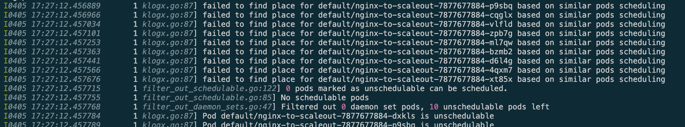
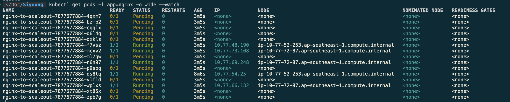
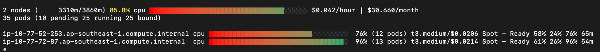
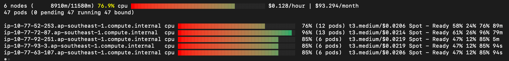
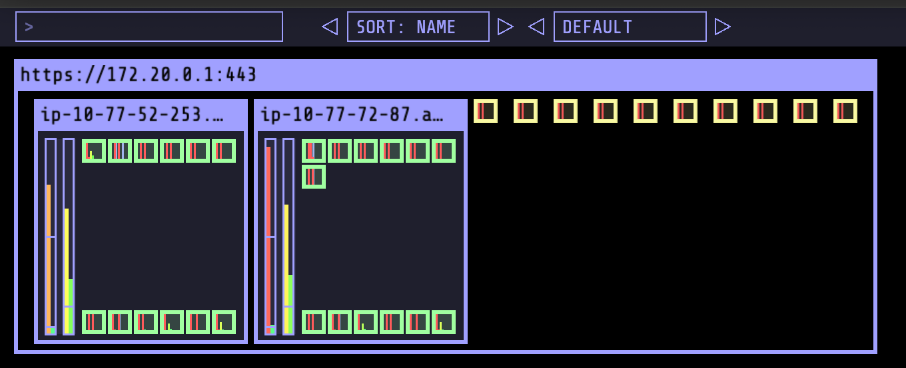
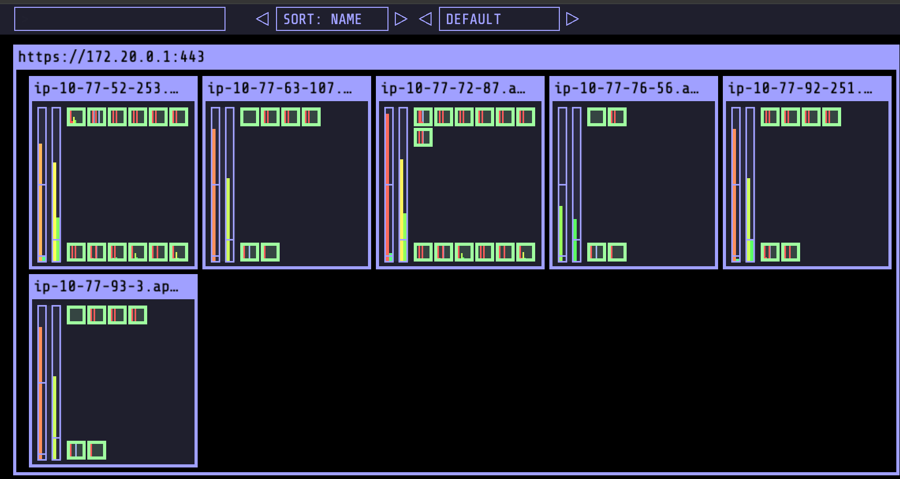

> *CloudNet 팀의 [2026년 AWS EKS Workshop Study 4기](https://gasidaseo.notion.site/26-AWS-EKS-Hands-on-Study-4-31a50aec5edf804b8294d8d512c43370) 3주차 학습 내용을 담고 있습니다.*


## 1. CA/CAS(Cluster Autoscaler)

CA는 AWS ASG(Auto Scaling Group)와 연동되는, 레거시하지만 여전히 널리 검증된 클러스터 노드 자동 확장 방식입니다.
CPU, Memory, GPU 리소스는 Launch Configuration 또는 Launch Template에 명세된 인스턴스 타입을 기반으로 결정됩니다. 

### 1.1. 동작방식

- Cluster Autoscaler는 Kubernetes 기본 API가 아니라 선택적으로 설치하는 컴포넌트입니다.
- 목적은 두 가지입니다.
  - Pending 파드가 생기면 노드를 늘립니다.
  - 장시간 저활용 노드는 줄여서 비용을 낮춥니다.
- AWS에서는 주로 ASG를 대상으로 동작하며, 일반적으로 `kube-system`의 Deployment로 배포합니다. 다음의 네 가지 배포 옵션 중에서 선택할 수 있습니다.
    - 단일 Auto Scaling group
    - 다중 Auto Scaling groups
    - Auto-Discovery [Link](https://github.com/kubernetes/autoscaler/tree/master/cluster-autoscaler/cloudprovider/aws)
    - Control-plane Node setup

### 1.2. Expander 알고리즘

여러 노드 그룹이 있을 때 어떤 그룹을 확장할지 결정하는 로직입니다. `--expander` 플래그로 지정합니다.

- `least-waste`: 파드 배치 후 남는 리소스(CPU/Memory)가 가장 적은 그룹 선택(비용 효율적)
- `priority`: 사전 정의 우선순위에 따라 선택(On-Demand와 Spot 혼합 시 유용)
- `random`: 무작위 선택(기본값)

### 1.3. 스케일인 조건

노드가 제거되려면 아래 조건이 충족되어야 합니다.

- 노드 사용률이 임계치 이하일 것(기본 50%, 설정 가능)
- 노드에 있는 모든 파드를 다른 노드로 재배치할 수 있을 것
- 시스템 파드가 없거나, 있더라도 PDB(`PodDisruptionBudget`) 설정이 되어있을 것

즉, 겉으로 비어 보여도 PDB, 로컬 스토리지, 스케줄링 제약 때문에 축소되지 않을 수 있습니다.

### 1.4. EKS Auto-Discovery 사전 확인

Auto-Discovery는 EKS에서 가장 일반적인 CA 구성 방식입니다. 

활성화하려면 `--node-group-auto-discovery` 에서 값을 받아올 수 있도록 태그 키를 인수로 제공할 수 있어야합니다. 

1. ASG/노드에 아래 태그가 있는지 확인
   - `k8s.io/cluster-autoscaler/enabled=true`
   - `k8s.io/cluster-autoscaler/<cluster-name>=owned`
2. CA 인자에서 같은 태그 키로 검색하도록 설정
   - `--node-group-auto-discovery=asg:tag=k8s.io/cluster-autoscaler/enabled,k8s.io/cluster-autoscaler/<cluster-name>`

태그 확인 예시:

```bash
aws ec2 describe-instances \
  --filters Name=tag:Name,Values=myeks-ng-1 \
  --query "Reservations[*].Instances[*].Tags[*]" \
  --output yaml
```

ASG 범위 확인/수정 예시:

```bash
aws autoscaling describe-auto-scaling-groups \
  --query "AutoScalingGroups[? Tags[? (Key=='eks:cluster-name') && Value=='myeks']].[AutoScalingGroupName, MinSize, MaxSize,DesiredCapacity]" \
  --output table

export ASG_NAME=$(aws autoscaling describe-auto-scaling-groups \
  --query "AutoScalingGroups[? Tags[? (Key=='eks:cluster-name') && Value=='myeks']].AutoScalingGroupName" \
  --output text)

aws autoscaling update-auto-scaling-group \
  --auto-scaling-group-name ${ASG_NAME} \
  --min-size 3 \
  --desired-capacity 3 \
  --max-size 6
```


### 1.5. Cluster Autoscaler 배포/검증

```bash
curl -s -O https://raw.githubusercontent.com/kubernetes/autoscaler/master/cluster-autoscaler/cloudprovider/aws/examples/cluster-autoscaler-autodiscover.yaml
sed -i -e "s|<YOUR CLUSTER NAME>|myeks|g" cluster-autoscaler-autodiscover.yaml
kubectl apply -f cluster-autoscaler-autodiscover.yaml

# 확인
kubectl get pod -n kube-system | grep cluster-autoscaler
kubectl describe deployments.apps -n kube-system cluster-autoscaler
kubectl describe deployments.apps -n kube-system cluster-autoscaler | grep node-group-auto-discovery

# (옵션) cluster-autoscaler 파드가 동작하는 워커 노드가 퇴출(evict) 되지 않게 설정
kubectl -n kube-system annotate deployment.apps/cluster-autoscaler cluster-autoscaler.kubernetes.io/safe-to-evict="false"
```

Cluster Autoscaler 핵심 플래그 정리:

| 분류 | 플래그 | 기본값 | 실무 적용 및 목적 |
| --- | --- | --- | --- |
| **비용 최적화** | `--expander` | `random` | `least-waste`(자원 낭비 최소화)나 `priority`(우선순위)를 주로 사용 |
| **비용 최적화** | `--scale-down-utilization-threshold` | `0.5` | 노드 사용률이 이 값 미만이면 삭제 검토. 공격적인 비용 절감 시 `0.6~0.7`로 상향 |
| **시간 조절** | `--scale-down-unneeded-time` | `10m` | 노드가 유휴 상태가 된 후 실제 삭제까지 대기하는 시간 |
| **시간 조절** | `--scale-down-delay-after-add` | `10m` | 노드 증설 후, 안정화를 위해 일정 시간 동안 삭제 검사를 유예 |
| **강제 삭제** | `--skip-nodes-with-local-storage` | `true` | `false` 설정 시, `emptyDir` 사용 파드가 있는 노드도 삭제 가능하게 함 |
| **강제 삭제** | `--skip-nodes-with-system-pods` | `true` | `false` 설정 시, `kube-system` 파드가 있는 노드도 삭제 가능하게 함 |
| **성능/주기** | `--scan-interval` | `10s` | CA가 스케일링 필요 여부를 검사하는 주기. 클러스터 규모에 따라 조정 |
| **성능/주기** | `--max-node-provision-time` | `15m` | 클라우드에서 노드가 뜨기까지 기다리는 최대 시간. 초과 시 노드 그룹 생성 실패로 간주 |

(옵션) CA 파드 축출 방지 어노테이션:

```bash
kubectl -n kube-system annotate deployment.apps/cluster-autoscaler \
  cluster-autoscaler.kubernetes.io/safe-to-evict="false"
```

### 1.6. Scale Out/Scale In 실습 흐름

```bash
# 모니터링 
kubectl get nodes -w
while true; do kubectl get node; echo "------------------------------" ; date ; sleep 1; done
while true; do aws ec2 describe-instances --query "Reservations[*].Instances[*].{PrivateIPAdd:PrivateIpAddress,InstanceName:Tags[?Key=='Name']|[0].Value,Status:State.Name}" --filters Name=instance-state-name,Values=running --output text ; echo "------------------------------"; date; sleep 1; done

```

`requests`가 명시된 워크로드를 확장해 Pending을 유도하면 CA가 ASG를 확장합니다.

```bash
cat << EOF > nginx.yaml
apiVersion: apps/v1
kind: Deployment
metadata:
  name: nginx-to-scaleout
spec:
  replicas: 1
  selector:
    matchLabels:
      app: nginx
  template:
    metadata:
      labels:
        app: nginx
    spec:
      containers:
      - image: nginx
        name: nginx-to-scaleout
        resources:
          limits:
            cpu: 500m
            memory: 512Mi
          requests:
            cpu: 500m
            memory: 512Mi
EOF

kubectl apply -f nginx.yaml
kubectl scale --replicas=15 deployment/nginx-to-scaleout
kubectl -n kube-system logs -f deployment/cluster-autoscaler
```


확인 포인트:
- `deployment/cluser-autoscaler` 로그
    - 

<details><summary>Scale-out 로그 펼쳐보기</summary>

```bash
I0405 17:44:49.931812       1 filter_out_schedulable.go:122] 0 pods marked as unschedulable can be scheduled.
I0405 17:44:49.931896       1 filter_out_schedulable.go:85] No schedulable pods
I0405 17:44:49.931928       1 filter_out_daemon_sets.go:47] Filtered out 0 daemon set pods, 7 unschedulable pods left
I0405 17:44:49.931979       1 klogx.go:87] Pod default/nginx-to-scaleout-7877677884-vlfld is unschedulable
I0405 17:44:49.931998       1 klogx.go:87] Pod default/nginx-to-scaleout-7877677884-ml7qw is unschedulable
I0405 17:44:49.932031       1 klogx.go:87] Pod default/nginx-to-scaleout-7877677884-xt85x is unschedulable
I0405 17:44:49.932061       1 klogx.go:87] Pod default/nginx-to-scaleout-7877677884-zpb7g is unschedulable
I0405 17:44:49.932079       1 klogx.go:87] Pod default/nginx-to-scaleout-7877677884-dxkls is unschedulable
I0405 17:44:49.932096       1 klogx.go:87] Pod default/nginx-to-scaleout-7877677884-cqglx is unschedulable
I0405 17:44:49.932122       1 klogx.go:87] Pod default/nginx-to-scaleout-7877677884-p9sbq is unschedulable
I0405 17:44:49.932493       1 orchestrator.go:110] Upcoming 0 nodes
I0405 17:44:49.934001       1 waste.go:55] Expanding Node Group eks-siyoung-eks-ng-1-f4ceae24-9e3f-cd52-d804-1dcc94922d00 would waste 41.67% CPU, 68.84% Memory, 55.26% Blended
I0405 17:44:49.934119       1 orchestrator.go:185] Best option to resize: eks-siyoung-eks-ng-1-f4ceae24-9e3f-cd52-d804-1dcc94922d00
I0405 17:44:49.934152       1 orchestrator.go:189] Estimated 3 nodes needed in eks-siyoung-eks-ng-1-f4ceae24-9e3f-cd52-d804-1dcc94922d00
I0405 17:44:49.934217       1 orchestrator.go:254] Final scale-up plan: [{eks-siyoung-eks-ng-1-f4ceae24-9e3f-cd52-d804-1dcc94922d00 3->6 (max: 6)}]
I0405 17:44:49.934294       1 executor.go:166] Scale-up: setting group eks-siyoung-eks-ng-1-f4ceae24-9e3f-cd52-d804-1dcc94922d00 size to 6
I0405 17:44:49.934548       1 auto_scaling_groups.go:267] Setting asg eks-siyoung-eks-ng-1-f4ceae24-9e3f-cd52-d804-1dcc94922d00 size to 6
I0405 17:44:49.934733       1 event_sink_logging_wrapper.go:48] Event(v1.ObjectReference{Kind:"ConfigMap", Namespace:"kube-system", Name:"cluster-autoscaler-status", UID:"c677631a-0fcf-4f9d-9c69-d4e0f01afa70", APIVersion:"v1", ResourceVersion:"144536", FieldPath:""}): type: 'Normal' reason: 'ScaledUpGroup' Scale-up: setting group eks-siyoung-eks-ng-1-f4ceae24-9e3f-cd52-d804-1dcc94922d00 size to 6 instead of 3 (max: 6)
I0405 17:44:50.080557       1 eventing_scale_up_processor.go:47] Skipping event processing for unschedulable pods since there is a ScaleUp attempt this loop
I0405 17:44:50.080585       1 event_sink_logging_wrapper.go:48] Event(v1.ObjectReference{Kind:"ConfigMap", Namespace:"kube-system", Name:"cluster-autoscaler-status", UID:"c677631a-0fcf-4f9d-9c69-d4e0f01afa70", APIVersion:"v1", ResourceVersion:"144536", FieldPath:""}): type: 'Normal' reason: 'ScaledUpGroup' Scale-up: group eks-siyoung-eks-ng-1-f4ceae24-9e3f-cd52-d804-1dcc94922d00 size set to 6 instead of 3 (max: 6)
I0405 17:44:50.086194       1 event_sink_logging_wrapper.go:48] Event(v1.ObjectReference{Kind:"Pod", Namespace:"default", Name:"nginx-to-scaleout-7877677884-vlfld", UID:"62f794bb-cac4-4c75-a162-c73d78e9b536", APIVersion:"v1", ResourceVersion:"143900", FieldPath:""}): type: 'Normal' reason: 'TriggeredScaleUp' pod triggered scale-up: [{eks-siyoung-eks-ng-1-f4ceae24-9e3f-cd52-d804-1dcc94922d00 3->6 (max: 6)}]
I0405 17:44:50.091862       1 event_sink_logging_wrapper.go:48] Event(v1.ObjectReference{Kind:"Pod", Namespace:"default", Name:"nginx-to-scaleout-7877677884-ml7qw", UID:"b075b3be-20e9-4801-a6a4-a3c98f7c6425", APIVersion:"v1", ResourceVersion:"143907", FieldPath:""}): type: 'Normal' reason: 'TriggeredScaleUp' pod triggered scale-up: [{eks-siyoung-eks-ng-1-f4ceae24-9e3f-cd52-d804-1dcc94922d00 3->6 (max: 6)}]
I0405 17:44:50.097813       1 event_sink_logging_wrapper.go:48] Event(v1.ObjectReference{Kind:"Pod", Namespace:"default", Name:"nginx-to-scaleout-7877677884-xt85x", UID:"c1eee654-a071-4930-8cf4-7462a7ce6e16", APIVersion:"v1", ResourceVersion:"143911", FieldPath:""}): type: 'Normal' reason: 'TriggeredScaleUp' pod triggered scale-up: [{eks-siyoung-eks-ng-1-f4ceae24-9e3f-cd52-d804-1dcc94922d00 3->6 (max: 6)}]
I0405 17:44:50.102944       1 event_sink_logging_wrapper.go:48] Event(v1.ObjectReference{Kind:"Pod", Namespace:"default", Name:"nginx-to-scaleout-7877677884-zpb7g", UID:"a04bcfdd-3d9d-461a-9f28-09e86e0a953e", APIVersion:"v1", ResourceVersion:"143904", FieldPath:""}): type: 'Normal' reason: 'TriggeredScaleUp' pod triggered scale-up: [{eks-siyoung-eks-ng-1-f4ceae24-9e3f-cd52-d804-1dcc94922d00 3->6 (max: 6)}]
I0405 17:44:50.108402       1 event_sink_logging_wrapper.go:48] Event(v1.ObjectReference{Kind:"Pod", Namespace:"default", Name:"nginx-to-scaleout-7877677884-dxkls", UID:"e56372d1-2423-44cc-8ea1-df50eba5003e", APIVersion:"v1", ResourceVersion:"143902", FieldPath:""}): type: 'Normal' reason: 'TriggeredScaleUp' pod triggered scale-up: [{eks-siyoung-eks-ng-1-f4ceae24-9e3f-cd52-d804-1dcc94922d00 3->6 (max: 6)}]
I0405 17:44:50.113422       1 event_sink_logging_wrapper.go:48] Event(v1.ObjectReference{Kind:"Pod", Namespace:"default", Name:"nginx-to-scaleout-7877677884-cqglx", UID:"ef99ba74-71cf-49f4-8475-dc602eefe02c", APIVersion:"v1", ResourceVersion:"143909", FieldPath:""}): type: 'Normal' reason: 'TriggeredScaleUp' pod triggered scale-up: [{eks-siyoung-eks-ng-1-f4ceae24-9e3f-cd52-d804-1dcc94922d00 3->6 (max: 6)}]
I0405 17:44:50.118716       1 event_sink_logging_wrapper.go:48] Event(v1.ObjectReference{Kind:"Pod", Namespace:"default", Name:"nginx-to-scaleout-7877677884-p9sbq", UID:"d2fbc1d5-aa55-442c-9bba-a67ed1df311f", APIVersion:"v1", ResourceVersion:"143910", FieldPath:""}): type: 'Normal' reason: 'TriggeredScaleUp' pod triggered scale-up: [{eks-siyoung-eks-ng-1-f4ceae24-9e3f-cd52-d804-1dcc94922d00 3->6 (max: 6)}]
I0405 17:45:00.092924       1 static_autoscaler.go:274] Starting main loop
I0405 17:45:00.094503       1 aws_manager.go:188] Found multiple availability zones for ASG "eks-siyoung-eks-ng-1-f4ceae24-9e3f-cd52-d804-1dcc94922d00"; using ap-southeast-1a for failure-domain.beta.kubernetes.io/zone label
I0405 17:45:00.095763       1 filter_out_schedulable.go:65] Filtering out schedulables
I0405 17:45:00.095963       1 klogx.go:87] Pod default/nginx-to-scaleout-7877677884-vlfld can be moved to template-node-for-eks-siyoung-eks-ng-1-f4ceae24-9e3f-cd52-d804-1dcc94922d00-2780578173937211289-upcoming-1
I0405 17:45:00.096095       1 klogx.go:87] Pod default/nginx-to-scaleout-7877677884-ml7qw can be moved to template-node-for-eks-siyoung-eks-ng-1-f4ceae24-9e3f-cd52-d804-1dcc94922d00-2780578173937211289-upcoming-0
I0405 17:45:00.096194       1 klogx.go:87] Pod default/nginx-to-scaleout-7877677884-xt85x can be moved to template-node-for-eks-siyoung-eks-ng-1-f4ceae24-9e3f-cd52-d804-1dcc94922d00-2780578173937211289-upcoming-0
I0405 17:45:00.096338       1 klogx.go:87] Pod default/nginx-to-scaleout-7877677884-zpb7g can be moved to template-node-for-eks-siyoung-eks-ng-1-f4ceae24-9e3f-cd52-d804-1dcc94922d00-2780578173937211289-upcoming-0
I0405 17:45:00.096493       1 klogx.go:87] Pod default/nginx-to-scaleout-7877677884-dxkls can be moved to template-node-for-eks-siyoung-eks-ng-1-f4ceae24-9e3f-cd52-d804-1dcc94922d00-2780578173937211289-upcoming-1
I0405 17:45:00.096587       1 klogx.go:87] Pod default/nginx-to-scaleout-7877677884-cqglx can be moved to template-node-for-eks-siyoung-eks-ng-1-f4ceae24-9e3f-cd52-d804-1dcc94922d00-2780578173937211289-upcoming-2
I0405 17:45:00.096709       1 klogx.go:87] Pod default/nginx-to-scaleout-7877677884-p9sbq can be moved to template-node-for-eks-siyoung-eks-ng-1-f4ceae24-9e3f-cd52-d804-1dcc94922d00-2780578173937211289-upcoming-1
I0405 17:45:00.096763       1 filter_out_schedulable.go:122] 7 pods marked as unschedulable can be scheduled.
I0405 17:45:00.096814       1 filter_out_schedulable.go:77] Schedulable pods present
I0405 17:45:00.096856       1 filter_out_daemon_sets.go:47] Filtered out 0 daemon set pods, 0 unschedulable pods left
I0405 17:45:00.096932       1 static_autoscaler.go:532] No unschedulable pods
I0405 17:45:00.097004       1 static_autoscaler.go:555] Calculating unneeded nodes
I0405 17:45:00.097181       1 eligibility.go:163] Node ip-10-77-52-253.ap-southeast-1.compute.internal unremovable: cpu requested (75.6477% of allocatable) is above the scale-down utilization threshold
I0405 17:45:00.097274       1 eligibility.go:163] Node ip-10-77-72-87.ap-southeast-1.compute.internal unremovable: cpu requested (95.8549% of allocatable) is above the scale-down utilization threshold
I0405 17:45:00.097343       1 eligibility.go:163] Node ip-10-77-92-251.ap-southeast-1.compute.internal unremovable: cpu requested (85.4922% of allocatable) is above the scale-down utilization threshold
I0405 17:45:00.097461       1 static_autoscaler.go:598] Scale down status: lastScaleUpTime=2026-04-05 17:44:49.783655628 +0000 UTC m=+30.601566469 lastScaleDownDeleteTime=2026-04-05 16:44:39.779903062 +0000 UTC m=-3579.402186090 lastScaleDownFailTime=2026-04-05 16:44:39.779903062 +0000 UTC m=-3579.402186090 scaleDownForbidden=false scaleDownInCooldown=true
I0405 17:45:10.110230       1 static_autoscaler.go:274] Starting main loop
I0405 17:45:10.111652       1 aws_manager.go:188] Found multiple availability zones for ASG "eks-siyoung-eks-ng-1-f4ceae24-9e3f-cd52-d804-1dcc94922d00"; using ap-southeast-1a for failure-domain.beta.kubernetes.io/zone label
I0405 17:45:10.113276       1 filter_out_schedulable.go:65] Filtering out schedulables
I0405 17:45:10.113646       1 klogx.go:87] Pod default/nginx-to-scaleout-7877677884-vlfld can be moved to template-node-for-eks-siyoung-eks-ng-1-f4ceae24-9e3f-cd52-d804-1dcc94922d00-3437564924848331692-upcoming-0
I0405 17:45:10.113913       1 klogx.go:87] Pod default/nginx-to-scaleout-7877677884-ml7qw can be moved to template-node-for-eks-siyoung-eks-ng-1-f4ceae24-9e3f-cd52-d804-1dcc94922d00-3437564924848331692-upcoming-0
I0405 17:45:10.114040       1 klogx.go:87] Pod default/nginx-to-scaleout-7877677884-xt85x can be moved to template-node-for-eks-siyoung-eks-ng-1-f4ceae24-9e3f-cd52-d804-1dcc94922d00-3437564924848331692-upcoming-2
I0405 17:45:10.114115       1 klogx.go:87] Pod default/nginx-to-scaleout-7877677884-zpb7g can be moved to template-node-for-eks-siyoung-eks-ng-1-f4ceae24-9e3f-cd52-d804-1dcc94922d00-3437564924848331692-upcoming-0
I0405 17:45:10.114183       1 klogx.go:87] Pod default/nginx-to-scaleout-7877677884-dxkls can be moved to template-node-for-eks-siyoung-eks-ng-1-f4ceae24-9e3f-cd52-d804-1dcc94922d00-3437564924848331692-upcoming-1
I0405 17:45:10.114266       1 klogx.go:87] Pod default/nginx-to-scaleout-7877677884-cqglx can be moved to template-node-for-eks-siyoung-eks-ng-1-f4ceae24-9e3f-cd52-d804-1dcc94922d00-3437564924848331692-upcoming-1
I0405 17:45:10.114328       1 klogx.go:87] Pod default/nginx-to-scaleout-7877677884-p9sbq can be moved to template-node-for-eks-siyoung-eks-ng-1-f4ceae24-9e3f-cd52-d804-1dcc94922d00-3437564924848331692-upcoming-1
I0405 17:45:10.114338       1 filter_out_schedulable.go:122] 7 pods marked as unschedulable can be scheduled.
I0405 17:45:10.114354       1 filter_out_schedulable.go:77] Schedulable pods present
I0405 17:45:10.114362       1 filter_out_daemon_sets.go:47] Filtered out 0 daemon set pods, 0 unschedulable pods left
I0405 17:45:10.114417       1 static_autoscaler.go:532] No unschedulable pods
I0405 17:45:10.114445       1 static_autoscaler.go:598] Calculating unneeded nodes
I0405 17:45:10.114734       1 eligibility.go:163] Node ip-10-77-52-253.ap-southeast-1.compute.internal unremovable: cpu requested (75.6477% of allocatable) is above the scale-down utilization threshold
I0405 17:45:10.114783       1 eligibility.go:163] Node ip-10-77-72-87.ap-southeast-1.compute.internal unremovable: cpu requested (95.8549% of allocatable) is above the scale-down utilization threshold
I0405 17:45:10.114820       1 eligibility.go:163] Node ip-10-77-92-251.ap-southeast-1.compute.internal unremovable: cpu requested (85.4922% of allocatable) is above the scale-down utilization threshold
I0405 17:45:10.114871       1 static_autoscaler.go:598] Scale down status: lastScaleUpTime=2026-04-05 17:44:49.783655628 +0000 UTC m=+30.601566469 lastScaleDownDeleteTime=2026-04-05 16:44:39.779903062 +0000 UTC m=-3579.402186090 lastScaleDownFailTime=2026-04-05 16:44:39.779903062 +0000 UTC m=-3579.402186090 scaleDownForbidden=false scaleDownInCooldown=true
I0405 17:45:20.125393       1 static_autoscaler.go:274] Starting main loop
I0405 17:45:20.127785       1 aws_manager.go:188] Found multiple availability zones for ASG "eks-siyoung-eks-ng-1-f4ceae24-9e3f-cd52-d804-1dcc94922d00"; using ap-southeast-1a for failure-domain.beta.kubernetes.io/zone label
I0405 17:45:20.130180       1 filter_out_schedulable.go:65] Filtering out schedulables
I0405 17:45:20.130348       1 klogx.go:87] Pod default/nginx-to-scaleout-7877677884-ml7qw can be moved to template-node-for-eks-siyoung-eks-ng-1-f4ceae24-9e3f-cd52-d804-1dcc94922d00-6428459807185474889-upcoming-2
I0405 17:45:20.130466       1 klogx.go:87] Pod default/nginx-to-scaleout-7877677884-xt85x can be moved to template-node-for-eks-siyoung-eks-ng-1-f4ceae24-9e3f-cd52-d804-1dcc94922d00-6428459807185474889-upcoming-0
I0405 17:45:20.130562       1 klogx.go:87] Pod default/nginx-to-scaleout-7877677884-zpb7g can be moved to template-node-for-eks-siyoung-eks-ng-1-f4ceae24-9e3f-cd52-d804-1dcc94922d00-6428459807185474889-upcoming-0
I0405 17:45:20.130665       1 klogx.go:87] Pod default/nginx-to-scaleout-7877677884-dxkls can be moved to template-node-for-eks-siyoung-eks-ng-1-f4ceae24-9e3f-cd52-d804-1dcc94922d00-6428459807185474889-upcoming-0
I0405 17:45:20.130746       1 klogx.go:87] Pod default/nginx-to-scaleout-7877677884-cqglx can be moved to template-node-for-eks-siyoung-eks-ng-1-f4ceae24-9e3f-cd52-d804-1dcc94922d00-6428459807185474889-upcoming-1
I0405 17:45:20.130836       1 klogx.go:87] Pod default/nginx-to-scaleout-7877677884-p9sbq can be moved to template-node-for-eks-siyoung-eks-ng-1-f4ceae24-9e3f-cd52-d804-1dcc94922d00-6428459807185474889-upcoming-2
I0405 17:45:20.130944       1 klogx.go:87] Pod default/nginx-to-scaleout-7877677884-vlfld can be moved to template-node-for-eks-siyoung-eks-ng-1-f4ceae24-9e3f-cd52-d804-1dcc94922d00-6428459807185474889-upcoming-1
I0405 17:45:20.130956       1 filter_out_schedulable.go:122] 7 pods marked as unschedulable can be scheduled.
I0405 17:45:20.130970       1 filter_out_schedulable.go:77] Schedulable pods present
I0405 17:45:20.130977       1 filter_out_daemon_sets.go:47] Filtered out 0 daemon set pods, 0 unschedulable pods left
I0405 17:45:20.131029       1 static_autoscaler.go:532] No unschedulable pods
I0405 17:45:20.131059       1 static_autoscaler.go:555] Calculating unneeded nodes
```
</details>

- `kubectl get pods -l app=nginx -o wide --watch`
    - 
- `kubectl get nodes` (노드 자동 증가 확인)
- `aws autoscaling describe-auto-scaling-groups \
    --query "AutoScalingGroups[? Tags[? (Key=='eks:cluster-name') && Value=='myeks']].[AutoScalingGroupName, MinSize, MaxSize,DesiredCapacity]" \
    --output table`
- `eks-node-viewer --resources cpu,memory`
    - 
    - 
- kubeopsview
    - 
    - 


Deployment 삭제

```bash
# 디플로이먼트 삭제
kubectl delete -f nginx.yaml && date

# 터미널1
watch -d kubectl get node
```

워크로드 삭제 후 스케일 인은 기본적으로 즉시가 아니라 지연 후 진행됩니다(기본 10분). 

아래의 flag로 시간 수정이 가능합니다.

- `--scale-down-delay-after-add`
- `--scale-down-delay-after-delete`
- `--scale-down-delay-after-failure`
- 예: `--scale-down-delay-after-add=5m`

### 1.7. Over-Provisioning

CA가 지나치게 효율적으로 동작하면 여유 용량이 사라져 신규 파드 시작 지연이 커질 수 있습니다. 이를 줄이기 위해 낮은 우선순위의 placeholder 파드로 헤드룸을 예약할 수 있습니다.

PriorityClass:

```yaml
apiVersion: scheduling.k8s.io/v1
kind: PriorityClass
metadata:
  name: placeholder-priority
value: -10
preemptionPolicy: Never
globalDefault: false
description: "Placeholder Pod priority."
```

Placeholder Deployment:

```yaml
apiVersion: apps/v1
kind: Deployment
metadata:
  name: placeholder
spec:
  replicas: 10
  selector:
    matchLabels:
      pod: placeholder-pod
  template:
    metadata:
      labels:
        pod: placeholder-pod
    spec:
      priorityClassName: placeholder-priority
      terminationGracePeriodSeconds: 0
      containers:
      - name: ubuntu
        image: ubuntu
        command: ["sleep"]
        args: ["infinity"]
        resources:
          requests:
            cpu: 200m
            memory: 250Mi
```

설계 시 주의사항:

- placeholder 1개 크기보다 replica 개수로 헤드룸을 조절하는 편이 안전함
- 실제 대체 대상 워크로드보다 너무 작은 requests를 잡으면 선점 후에도 배치 실패 가능
- 일반 워크로드(기본 우선순위 0)는 placeholder(-10)를 선점 가능

### 1.8. CA/CAS의 구조적 한계

CA + ASG 조합에서 자주 체감하는 한계:

- 제어면 분리: Kubernetes 의도와 ASG 상태 간 불일치 가능
- 확장 지연: CA -> ASG -> EC2 반영 경로로 반응이 느려질 수 있음
- 축소 제어 난이도: 특정 노드를 우선 제거하는 정책이 제한적
- 폴링 방식으로, 너무 짧은 주기로 확인하는 경우 API 호출량 증가로 인해 API 제한에 도달할 수 있음
- requests 중심 판단: Request를 낮게 설정한다면 실제 리소스 사용량이 높더라도 스케줄링이 가능하기 때문에 스케일 아웃 미진행. 반대로, Requests를 초과하여 할당한다면 실제로 리소스가 사용되지 않더라도 스케일 아웃이 진행됨

실무적으로는 requests/limits 설계가 가장 중요합니다. 설정이 어긋나면

- 실제 부하는 낮아도 Pending으로 확장되거나
- 실제 부하는 높아도 확장이 안 되는

상반된 상황이 발생합니다.

### 1.9. 실습 리소스 정리

```bash
kubectl delete -f nginx.yaml

aws autoscaling update-auto-scaling-group \
  --auto-scaling-group-name ${ASG_NAME} \
  --min-size 3 \
  --desired-capacity 3 \
  --max-size 3

kubectl delete -f cluster-autoscaler-autodiscover.yaml
```

### 1.10. 트러블슈팅 빠른 체크리스트

CA가 동작하지 않을 때는 아래 순서로 점검하면 대부분 원인을 빠르게 찾을 수 있습니다.

1. Pending 파드가 실제로 존재하는가?

```bash
kubectl get pods -A --field-selector=status.phase=Pending
kubectl describe pod <pending-pod-name>
```

2. 파드 이벤트에 `Insufficient cpu/memory` 또는 `node(s) didn't match`가 보이는가?

3. ASG 태그가 정확한가?

- `k8s.io/cluster-autoscaler/enabled=true`
- `k8s.io/cluster-autoscaler/<cluster-name>=owned`

4. CA 로그에 스케일링 관련 메시지가 보이는가?

```bash
kubectl -n kube-system logs deployment/cluster-autoscaler | grep -E "scale|expand|No node group"
```

5. ASG `max-size` 상한에 이미 도달하지 않았는가?

<!-- 실무에서는 2~5번에서 막히는 경우가 가장 많습니다. -->

## 2. Karpenter (Just-In-Time Nodes)


Karpenter는 쿠버네티스 클러스터의 Scheduling과 Provisioning을 통합하여 처리하는 오픈소스 노드 오토스케일러입니다. 기존 Cluster Autoscaler(이하 CA)가 ASG(Auto Scaling Group)를 간접 제어하며 발생하는 지연을 해결하기 위해, Karpenter는 EC2 Fleet API를 직접 호출하여 수 초 내에 최적의 인스턴스를 선택/생성합니다.

**주요 특점:**

- CA보다 빠른 프로비저닝: 수초 내 컴퓨팅 리소스 제공
- 통합 스케줄링: 쿠버네티스 스케줄러와 협력하여 동작
- 자동 최적화: Consolidation, Disruption, Drift 감지를 통해 클러스터를 항상 비용 효율적으로 유지
- 높은 유연성: 여러 구입 옵션(On-Demand, Spot), 아키텍처(AMD, Graviton) 지원

### 2.1. 핵심 CRD

**NodePool**: 어떤 조건의 노드를 만들지 정의하는 정책입니다.

- 아키텍처(amd64, arm64), OS(linux, windows), capacity-type(on-demand, spot)
- instance-category(c, m, r), instance-size, instance-generation 등
- 리소스 한계(cpu, memory), Disruption 정책

**EC2NodeClass**: 어떤 AWS 자원으로 노드를 만들지 정의합니다.

- IAM Role, VPC subnet/security group 선택 (태그 기반 자동 검색)
- AMI 선택 (alias: "al2023@latest", "bottlerocket@latest")
- 환경 변수, 블록 디바이스 설정

### 2.2. 예시

#### 2.2.1. On-Demand AMD64:

가장 기본적인 AMD64 아키텍처의 온디맨드 노드 설정입니다.

```yaml
apiVersion: karpenter.sh/v1
kind: NodePool
metadata:
  name: default
spec:
  template:
    spec:
      requirements:
        - key: kubernetes.io/arch
          operator: In
          values: ["amd64"]
        - key: karpenter.sh/capacity-type
          operator: In
          values: ["on-demand"]
        - key: karpenter.k8s.aws/instance-category
          operator: In
          values: ["c", "m", "r"]
      nodeClassRef:
        group: karpenter.k8s.aws
        kind: EC2NodeClass
        name: default
      expireAfter: 720h
  limits:
    cpu: 1000
  disruption:
    consolidationPolicy: WhenEmptyOrUnderutilized
    consolidateAfter: 1m
---
apiVersion: karpenter.k8s.aws/v1
kind: EC2NodeClass
metadata:
  name: default
spec:
  role: "KarpenterNodeRole-mycluster"
  amiSelectorTerms:
    - alias: "al2023@latest"
  subnetSelectorTerms:
    - tags:
        karpenter.sh/discovery: "mycluster"
  securityGroupSelectorTerms:
    - tags:
        karpenter.sh/discovery: "mycluster"
```

#### 2.2.2. 예시 2: 비용 최적화 혼합 설정 (On-Demand + Spot + Graviton)

비용 절감을 위해 Spot 인스턴스와 ARM 아키텍처를 적극적으로 활용하는 설정입니다.

```yaml
apiVersion: karpenter.sh/v1
kind: NodePool
metadata:
  name: cost-optimized
spec:
  template:
    spec:
      requirements:
        # 다중 아키텍처: AMD64와 Graviton(ARM) 모두 사용
        - key: kubernetes.io/arch
          operator: In
          values: ["amd64", "arm64"]
        # 온디맨드와 스팟 혼합 (스팟이 비용 효율적)
        - key: karpenter.sh/capacity-type
          operator: In
          values: ["on-demand", "spot"]
        # 다양한 인스턴스 타입 (빈 패킹 효율 향상, 낙찰 위험 분산)
        - key: karpenter.k8s.aws/instance-family
          operator: In
          values: ["t3", "t4g", "c5", "c6g", "m5", "m6g", "r5", "r6g"]
        - key: karpenter.k8s.aws/instance-size
          operator: In
          values: ["medium", "large", "xlarge", "2xlarge"]
      nodeClassRef:
        group: karpenter.k8s.aws
        kind: EC2NodeClass
        name: cost-optimized
      expireAfter: 720h # 30일 후 자동 교체
  limits:
    cpu: 2000
    memory: 2000Gi
  # 비용 기준 인스턴스 선호 순서
  disruption:
    consolidationPolicy: WhenEmptyOrUnderutilized
    consolidateAfter: 30s
    expireAfter: 720h
    expireBefore: 10s
    budgets:
    - nodes: "10%"  # 한 번에 최대 10%의 노드만 중단 허용 (안정성)
---
apiVersion: karpenter.k8s.aws/v1
kind: EC2NodeClass
metadata:
  name: cost-optimized
spec:
  role: "KarpenterNodeRole-mycluster"
  # Graviton (t4g, c6g, m6g, r6g) 및 x86 (t3, c5, m5, r5) AMI 모두 지원
  amiSelectorTerms:
    - alias: "al2023@latest"
  subnetSelectorTerms:
    - tags:
        karpenter.sh/discovery: "mycluster"
  securityGroupSelectorTerms:
    - tags:
        karpenter.sh/discovery: "mycluster"
  # EBS 최적화, 상세 모니터링 활성화
  ebsOptimized: true
  detailedMonitoring: true
```

**주의사항:**

- **Graviton 도입 전제**: 애플리케이션 및 컨테이너 이미지가 ARM64 아키텍처를 지원해야 함
- **멀티 아키텍처 이미지**: Docker manifest list를 사용하여 amd64/arm64 모두 포함된 이미지 빌드 필요
- **선택적 확대**: 기존 워크로드는 amd64만, 신규 워크로드는 멀티 아키텍처 이미지로 점진적 도입 권장
- 

### 2.3. 동작 방식

**스케줄링 및 프로비저닝 흐름:**

1. Pending 파드 감지 (쿠버네티스 스케줄러의 실패)
2. Consolidation 윈도우 (1~10초): 여러 Pending 파드를 단일 배치로 묶음
3. 빈 패킹(Bin Packing) 알고리즘: 요구 사항을 만족하는 최소 리소스의 인스턴스 선택
4. EC2 Fleet API 호출: 다양한 인스턴스 타입으로 프로비저닝 시도

**인스턴스 선택 전략:**

- On-Demand: **lowest-price** (가장 저렴한 것)
- Spot: **price-capacity-optimized** (저렴 + 중단 위험 낮음)

### 2.4. 지속적 최적화(Disruption)

Karpenter는 다음 세 가지 방식으로 클러스터 비용을 지속적으로 최적화합니다.

**Consolidation**: 노드 통합 및 자동 최적화

- **목표**: 파드를 더 적은 수의 노드로 재배치하여 유휴 노드 제거
- **알고리즘**: 
  1. Consolidation poll 주기동안 대기
  2. 대상 노드 그룹 식별 (e.g., 각 노드가 80% 미사용)
        1.  `do-not-consolidate` 어노테이션이 미설정된 노드 
        2.  Consolidation 기능이 활성화 된 Provisioner에 의해 구동된 노드
        3.  초기화가 완료되었으며, reports Ready이며, 모든 확장 리소스가 등록된 노드
  3. 해당 파드들을 다른 노드로 이전 가능한지 시뮬레이션 (PodDisruptionBudget 준수)
  4. **중단 비용 최소화**: 제거할 노드를 선택할 때 다음을 고려
     - 노드 수명: 최근에 생성된 노드 우선 제거 (AMI/설정 최신)
     - 파드 재배치 비용: 상태 저장 파드(stateful) 제거로 인한 지연 최소화
     - 파드 삭제 비용: 오래 실행된 Job 갑작스러운 중단 방지
     - 중단 영향도: 높은 우선순위 파드 보호 (PodDisruptionBudget 엄격히 적용)
  5. 비용 대비 이득이 최대인 노드부터 순차 제거
- **예시**: 20% 활용 중인 큰 노드 1개를 없애기 위해 같은 리소스의 작은 노드 3개로 통합하면, 비용 약 30~40% 절감
- **Consolidation 설정** (NodePool spec):
  ```yaml
  disruption:
    consolidationPolicy: WhenEmptyOrUnderutilized  # 활성화
    consolidateAfter: 30s  # 30초 대기 후 시도 (배치 효율)
  ```

**Drift Detection**: 설정 변경사항 감지 및 반영
- NodePool 또는 EC2NodeClass 설정이 변경되면 감지
- 기존 노드를 점진적으로 새 스펙의 노드로 교체 (Rolling Update)
- EKS 제어 플레인 업그레이드 시 AMI 자동 업데이트

**Expiration**: 노드 수명 기반 자동 교체
- 기본값: 720시간(30일) 후 자동 갱신
- 정기적인 노드 갱신으로 항상 최신 AMI 사용

### 2.5. Karpenter 운영 로그 분석

Karpenter 컨트롤러 로그를 통해 프로비저닝 흐름을 파악할 수 있습니다.

- `launched nodeclaim`: 새로운 노드 프로비저닝이 시작됨
  - instance-type, zone, capacity-type 확인 가능
- `disrupting nodeclaim`: Consolidation/Drift/Expiration 판단 시작
  - reason 필드에서 이유 확인 (empty, underutilized, drifted, expired)
- `tainted node` -> `deleted node` -> `deleted nodeclaim`: 축소 완료 순서
  - 파드 안전 축출(eviction) 후 노드 정리

실시간 로그 모니터링:

```bash
# JSON 포맷으로 정렬된 로그 출력
kubectl logs -f -n kube-system -l app.kubernetes.io/name=karpenter -c controller | jq '.'

# 특정 키워드만 필터링
kubectl logs -n kube-system -l app.kubernetes.io/name=karpenter -c controller | grep 'launched nodeclaim' | jq '.'
```

### 2.6. 운영 시 고려사항

**Over-Provisioning 필요성:**

- EC2 인스턴스가 시작되고 DaemonSet이 모두 설치되는데 1~2분 소요
- 급작스러운 대규모 스케일 아웃 시 여유 용량 부족 가능
- 해법: 낮은 우선순위(`PriorityClass`)의 placeholder 파드로 미리 노드 여유 용량 확보
  ```yaml
  apiVersion: scheduling.k8s.io/v1
  kind: PriorityClass
  metadata:
    name: overprovisioning
  value: -10
  preemptionPolicy: Never
  globalDefault: false
  ```

**비용 최적화 전략:**

**1. 인스턴스 조합 다각화**

- Spot 인스턴스와 On-Demand 혼합 (비용 50~70% 절감, 중단 위험 감소)
- 다양한 인스턴스 타입 15개 이상 정의 가능(낙찰 실패 및 한 타입 품절 대비)
- 멀티 아키텍처 이미지 사용 시 Graviton(ARM)과 x86 아키텍처를 혼합하여 사용 가능

**2. Consolidation 동작 튜닝**

- `consolidateAfter: 30s`로 설정 (짧게: 반응성↑, 길게: 배치 효율↑)
- `consolidationPolicy: WhenEmptyOrUnderutilized` 활성화
- 대여 비용이 낮은 Spot 인스턴스는 더 비용효율적인 조합이 있다면 적극적 제거 가능

**3. Disruption 제어로 안정성 확보**

- 중요 파드는 `PodDisruptionBudget` 으로 최소 가용성 보장
- `budgets` 필드로 동시 중단 노드 개수 제한
- EventBridge 규칙으로 중단 이벤트 모니터링 및 경고

**4. 리소스 요청(requests) 정확성**

- 과도한 requests는 불필요한 노드 프로비저닝 초래
- Requests 과소 설정은 OOM/CPU 스로틀링 위험
- Karpenter의 빈 패킹이 효과적으로 함수하려면 요청값 정확성 필수


### 2.7. 사례: 무신사 Karpenter 운영 전략

참고 영상:
- [영상 22] 오픈 소스 Karpenter를 활용한 Amazon EKS 확장 운영 전략 | 신재현, 무신사
- YouTube: https://www.youtube.com/watch?v=FPlCVVrCD64

**작동 방식 (핵심 루프)**

- Provisioning: 모니터링 -> 스케줄링 실패 Pod 발견 -> Pod 스펙 평가 -> 적합 노드 생성
- Deprovisioning: 모니터링 -> 비어있거나 저활용 노드 발견 -> 노드 제거

**NodePool(구 Provisioner) 운영 포인트**

- 시작 템플릿 없이도 대부분의 노드 생성 정책을 선언적으로 관리 가능
- 필수 인프라 조건: 보안그룹(Security Group), 서브넷(Subnet)
- 리소스 선택 방식: 태그 기반 자동 검색 또는 리소스 ID 직접 명시
- 인스턴스 타입은 가드레일 방식으로 선언 가능
  - Spot 우선 + On-Demand 혼합
  - x86 + Graviton(ARM) 혼합
  - 포함/제외 인스턴스 타입 제어
- 스케줄 가능한 후보 중 비용 효율이 높은 인스턴스를 우선 선택해 증설

**스토리지/배치 최적화 포인트**

- 자동으로 PV가 존재하는 서브넷에 노드를 생성하여, PV 때문에 단일 서브넷 노드그룹을 만들 필요가 없음
- Karpenter가 볼륨 토폴로지 조건을 반영하여 적절한 서브넷/가용영역에 노드를 생성

**자동 정리/만료 전략 (구버전 Provisioner 기준 개념)**

- `ttlSecondsAfterEmpty`: DaemonSet 제외 일반 Pod가 없는 빈 노드를 일정 시간 후 자동 정리
- `ttlSecondsUntilExpired`: 노드 수명 만료 시 cordon/drain 후 교체
- 노드가 주기적으로 정리되면
  - 여유 노드로 재배치가 진행되어 리소스 효율 상승
  - 최신 AMI 반영 주기 유지에 도움
- 반대로 drain이 지연되면 비효율 노드가 오래 남을 수 있어 모니터링 필요

**Consolidation 효과**

- 노드를 줄여도 다른 노드에 여유가 충분하면 자동 정리
- 큰 노드 1대가 작은 노드 여러 대보다 유리한 경우 자동 병합 시도
- 결과적으로 과거 "느린 확장" 때문에 보수적으로 크게 운영하던 패턴을 완화

**오버 프로비저닝 + KEDA 전략**

- Karpenter를 써도 EC2 기동 + DaemonSet 안착까지 1~2분이 필요
- 따라서 placeholder(깡통) Pod로 여유 용량을 선확보하는 패턴이 유효
- 대규모 증설이 예상되는 경우 KEDA와 연계해 선제적으로 오버 프로비저닝 Pod를 확대

**무신사 Cluster Autoscaler -> Karpenter 마이그레이션 요약**

[Youtube 영상 Link](https://www.youtube.com/watch?v=yMOaOlPvrgY&t=717s)

- 기존: ASG 기반 CA 사용
  - 노드 사이즈를 보수적으로 오버 프로비저닝(12xlarge 노드 6대)
  - 프로비저닝 속도가 느려 spike성 트래픽 대응 어려움
- 전환: Karpenter로 마이그레이션
  - 노드 크기 최적화: 12xlarge 노드 6대 -> 8xlarge 노드 6대
  - 노드 개수/활용률 최적화: elastic 운영 노드 18개 -> 6개로 축소, requests 기준 노드당 리소스 할당량 40% -> 90%로 상승

### 2.8. Hands-on: Getting Started with Karpenter

공식 가이드와 워크숍을 기반으로, 실제 운영 관찰 포인트를 추가한 실습 흐름입니다.

- Docs: https://karpenter.sh/docs/getting-started/getting-started-with-karpenter/
- Workshop: https://catalog.workshops.aws/karpenter/en-US

#### 2.8.1. 사전 준비

필수 유틸리티:
- AWS CLI
- kubectl
- eksctl (권장: v0.202.0 이상)
- helm
- eks-node-viewer (옵션)

```bash
aws --version
kubectl version --client
eksctl version
helm version
```

#### 2.8.2. 환경 변수 설정

```bash
cd ..
mkdir -p karpenter
cd karpenter

export KARPENTER_NAMESPACE="kube-system"
export KARPENTER_VERSION="1.10.0"
export K8S_VERSION="1.34"
export AWS_PARTITION="aws"
export CLUSTER_NAME="${USER}-karpenter-demo"
export AWS_DEFAULT_REGION="ap-southeast-1"
export AWS_ACCOUNT_ID="$(aws sts get-caller-identity --query Account --output text)"
export TEMPOUT="$(mktemp)"
export ALIAS_VERSION="$(aws ssm get-parameter --name "/aws/service/eks/optimized-ami/${K8S_VERSION}/amazon-linux-2023/x86_64/standard/recommended/image_id" --query Parameter.Value --output text | xargs aws ec2 describe-images --query 'Images[0].Name' --image-ids --output text | sed -E 's/^.*(v[0-9]+).*$/\1/')"

echo "${KARPENTER_NAMESPACE}" "${KARPENTER_VERSION}" "${K8S_VERSION}" "${CLUSTER_NAME}" "${AWS_DEFAULT_REGION}" "${AWS_ACCOUNT_ID}" "${TEMPOUT}" "${ALIAS_VERSION}"
```

#### 2.8.3. CloudFormation + EKS 클러스터 생성

```bash
# CloudFormation 스택으로 Karpenter용 IAM/Queue/Event 리소스 생성
curl -fsSL https://raw.githubusercontent.com/aws/karpenter-provider-aws/v"${KARPENTER_VERSION}"/website/content/en/preview/getting-started/getting-started-with-karpenter/cloudformation.yaml > "${TEMPOUT}"

aws cloudformation deploy \
  --stack-name "Karpenter-${CLUSTER_NAME}" \
  --template-file "${TEMPOUT}" \
  --capabilities CAPABILITY_NAMED_IAM \
  --parameter-overrides "ClusterName=${CLUSTER_NAME}"
```

```bash
# EKS 클러스터 생성 (약 15분) *eksctl = CFN 스택 생성됨
eksctl create cluster -f - <<EOF
apiVersion: eksctl.io/v1alpha5
kind: ClusterConfig
metadata:
  name: ${CLUSTER_NAME}
  region: ${AWS_DEFAULT_REGION}
  version: "${K8S_VERSION}"
  tags:
    karpenter.sh/discovery: ${CLUSTER_NAME}

iam:
  withOIDC: true
  podIdentityAssociations:
  - namespace: "${KARPENTER_NAMESPACE}"
    serviceAccountName: karpenter
    roleName: ${CLUSTER_NAME}-karpenter
    permissionPolicyARNs:
    - arn:${AWS_PARTITION}:iam::${AWS_ACCOUNT_ID}:policy/KarpenterControllerNodeLifecyclePolicy-${CLUSTER_NAME}
    - arn:${AWS_PARTITION}:iam::${AWS_ACCOUNT_ID}:policy/KarpenterControllerIAMIntegrationPolicy-${CLUSTER_NAME}
    - arn:${AWS_PARTITION}:iam::${AWS_ACCOUNT_ID}:policy/KarpenterControllerEKSIntegrationPolicy-${CLUSTER_NAME}
    - arn:${AWS_PARTITION}:iam::${AWS_ACCOUNT_ID}:policy/KarpenterControllerInterruptionPolicy-${CLUSTER_NAME}
    - arn:${AWS_PARTITION}:iam::${AWS_ACCOUNT_ID}:policy/KarpenterControllerResourceDiscoveryPolicy-${CLUSTER_NAME}

iamIdentityMappings:
- arn: arn:${AWS_PARTITION}:iam::${AWS_ACCOUNT_ID}:role/KarpenterNodeRole-${CLUSTER_NAME}
  username: system:node:{{EC2PrivateDNSName}}
  groups:
  - system:bootstrappers
  - system:nodes

managedNodeGroups:
- name: ${CLUSTER_NAME}-ng
  instanceType: m5.large
  amiFamily: AmazonLinux2023
  desiredCapacity: 2
  minSize: 1
  maxSize: 10

addons:
- name: eks-pod-identity-agent
EOF
```

eks 배포 검증:

```bash
eksctl get cluster
eksctl get nodegroup --cluster ${CLUSTER_NAME}
eksctl get iamidentitymapping --cluster ${CLUSTER_NAME}
eksctl get iamserviceaccount --cluster ${CLUSTER_NAME}
eksctl get addon --cluster ${CLUSTER_NAME}

# config rename-context
kubectl ctx
kubectl config rename-context "<각자 자신의 IAM User>@<자신의 Nickname>-karpenter-demo.ap-southeast-1.eksctl.io" "karpenter-demo"
kubectl config rename-context "admin@gasida-karpenter-demo.ap-southeast-1.eksctl.io" "karpenter-demo"

kubectl ns default
kubectl cluster-info
kubectl get node --label-columns=node.kubernetes.io/instance-type,eks.amazonaws.com/capacityType,topology.kubernetes.io/zone
kubectl get pod -n kube-system -o wide
kubectl get pdb -A
kubectl describe cm -n kube-system aws-auth

# EC2 Spot Fleet의 service-linked-role 확인 이미 생성되어 있으면 오류 메시지가 나오며 정상
aws iam create-service-linked-role --aws-service-name spot.amazonaws.com || true
```

#### 2.8.4. Karpenter 설치

```bash
helm registry logout public.ecr.aws

export CLUSTER_ENDPOINT="$(aws eks describe-cluster --name "${CLUSTER_NAME}" --query "cluster.endpoint" --output text)"
export KARPENTER_IAM_ROLE_ARN="arn:${AWS_PARTITION}:iam::${AWS_ACCOUNT_ID}:role/${CLUSTER_NAME}-karpenter"
echo "${CLUSTER_ENDPOINT} ${KARPENTER_IAM_ROLE_ARN}"

helm upgrade --install karpenter oci://public.ecr.aws/karpenter/karpenter \
  --version "${KARPENTER_VERSION}" \
  --namespace "${KARPENTER_NAMESPACE}" \
  --create-namespace \
  --set "settings.clusterName=${CLUSTER_NAME}" \
  --set "settings.interruptionQueue=${CLUSTER_NAME}" \
  --set controller.resources.requests.cpu=1 \
  --set controller.resources.requests.memory=1Gi \
  --set controller.resources.limits.cpu=1 \
  --set controller.resources.limits.memory=1Gi \
  --wait

helm list -n ${KARPENTER_NAMESPACE}
kubectl get crd | grep karpenter
kubectl get all -n ${KARPENTER_NAMESPACE}
```

Karpenter 태그 키(매핑/추적):
- `karpenter.sh/managed-by`
- `karpenter.sh/nodepool`
- `kubernetes.io/cluster/${CLUSTER_NAME}`

#### 2.8.5. 관찰 도구 설치


실습 동작 확인을 위한 kube-ops-view 설치:

```bash
# kube-ops-view
helm repo add geek-cookbook https://geek-cookbook.github.io/charts/
helm install kube-ops-view geek-cookbook/kube-ops-view \
  --version 1.2.2 \
  --set service.main.type=LoadBalancer \
  --set env.TZ="Asia/Seoul" \
  --namespace kube-system

echo "http://$(kubectl get svc -n kube-system kube-ops-view -o jsonpath='{.status.loadBalancer.ingress[0].hostname}'):8080/#scale=1.5"
```

프로메테우스 / 그라파나 설치 - [Docs](https://karpenter.sh/docs/getting-started/getting-started-with-karpenter/#monitoring-with-grafana-optional)

```bash
# Prometheus/Grafana 
# Karpeter 공식 문서 가이드대로 설치 시 스택이 아닌 prometheus와 grafana를 별도 설치
helm repo add grafana-charts https://grafana.github.io/helm-charts
helm repo add prometheus-community https://prometheus-community.github.io/helm-charts
helm repo update
kubectl create namespace monitoring

# 프로메테우스 설치
curl -fsSL https://raw.githubusercontent.com/aws/karpenter-provider-aws/v"${KARPENTER_VERSION}"/website/content/en/preview/getting-started/getting-started-with-karpenter/prometheus-values.yaml | envsubst | tee prometheus-values.yaml
helm install --namespace monitoring prometheus prometheus-community/prometheus --values prometheus-values.yaml

# 프로메테우스 얼럿매니저 미사용으로 삭제
kubectl delete sts -n monitoring prometheus-alertmanager || true

# 그라파나 설치
curl -fsSL https://raw.githubusercontent.com/aws/karpenter-provider-aws/v"${KARPENTER_VERSION}"/website/content/en/preview/getting-started/getting-started-with-karpenter/grafana-values.yaml | tee grafana-values.yaml
helm install --namespace monitoring grafana grafana-charts/grafana --values grafana-values.yaml

# admin 암호
kubectl get secret --namespace monitoring grafana -o jsonpath="{.data.admin-password}" | base64 --decode ; echo
17JUGSjgxK20m4NEnAaG7GzyBjqAMHMFxRnXItLj

# 그라파나 접속
kubectl port-forward --namespace monitoring svc/grafana 3000:80 &
open http://127.0.0.1:3000

```

#### 2.8.6. NodePool/EC2NodeClass 생성

```bash
echo ${ALIAS_VERSION}

cat <<EOF | envsubst | kubectl apply -f -
apiVersion: karpenter.sh/v1
kind: NodePool
metadata:
  name: default
spec:
  template:
    spec:
      requirements:
      - key: kubernetes.io/arch
        operator: In
        values: ["amd64"]
      - key: kubernetes.io/os
        operator: In
        values: ["linux"]
      - key: karpenter.sh/capacity-type
        operator: In
        values: ["on-demand"]
      - key: karpenter.k8s.aws/instance-category
        operator: In
        values: ["c", "m", "r"]
      - key: karpenter.k8s.aws/instance-generation
        operator: Gt
        values: ["2"]
      nodeClassRef:
        group: karpenter.k8s.aws
        kind: EC2NodeClass
        name: default
      expireAfter: 720h
  limits:
    cpu: 1000
  disruption:
    consolidationPolicy: WhenEmptyOrUnderutilized
    consolidateAfter: 1m
---
apiVersion: karpenter.k8s.aws/v1
kind: EC2NodeClass
metadata:
  name: default
spec:
  role: KarpenterNodeRole-${CLUSTER_NAME}
  amiSelectorTerms:
  - alias: al2023@${ALIAS_VERSION}
  subnetSelectorTerms:
  - tags:
      karpenter.sh/discovery: ${CLUSTER_NAME}
  securityGroupSelectorTerms:
  - tags:
      karpenter.sh/discovery: ${CLUSTER_NAME}
EOF

kubectl get nodepool,ec2nodeclass,nodeclaims
```

#### 2.8.7. Scale Out 실습

```bash
# scale 대상 워크로드 생성
# # pause 파드 1개에 CPU 1개 최소 보장 할당할 수 있게 디플로이먼트 배포
cat <<EOF | kubectl apply -f -
apiVersion: apps/v1
kind: Deployment
metadata:
  name: inflate
spec:
  replicas: 0
  selector:
    matchLabels:
      app: inflate
  template:
    metadata:
      labels:
        app: inflate
    spec:
      terminationGracePeriodSeconds: 0
      securityContext:
        runAsUser: 1000
        runAsGroup: 3000
        fsGroup: 2000
      containers:
      - name: inflate
        image: public.ecr.aws/eks-distro/kubernetes/pause:3.7
        resources:
          requests:
            cpu: 1
        securityContext:
          allowPrivilegeEscalation: false
EOF

# 모니터링
eks-node-viewer --resources cpu,memory --node-selector "karpenter.sh/registered=true" --extra-labels eks-node-viewer/node-age

# scale out
kubectl scale deployment inflate --replicas 5
kubectl get pods -l app=inflate -o wide
kubectl get nodeclaims
kubectl describe nodeclaims

# 확인
kubectl logs -f -n "${KARPENTER_NAMESPACE}" -l app.kubernetes.io/name=karpenter -c controller
kubectl logs -f -n "${KARPENTER_NAMESPACE}" -l app.kubernetes.io/name=karpenter -c controller | jq '.'
kubectl logs -n "${KARPENTER_NAMESPACE}" -l app.kubernetes.io/name=karpenter -c controller | grep 'launched nodeclaim' | jq '.'


# scale out 2 (Optional)
kubectl scale deployment inflate --replicas 30
kubectl logs -f -n "${KARPENTER_NAMESPACE}" -l app.kubernetes.io/name=karpenter -c controller | jq '.'

```

포인트:

```bash
kubectl get node -l karpenter.sh/registered=true -o jsonpath="{.items[0].metadata.labels}" | jq '.'
```

- `launched nodeclaim`
- `instance-type`, `capacity-type`, `zone`
- 노드 label `karpenter.sh/initialized`,`karpenter.sh/nodepool`, `karpenter.sh/registered=true`

#### 2.8.8. Scale Down + Consolidation 실습

```bash
# deployment 삭제 
kubectl delete deployment inflate && date

# 로그 확인
kubectl logs -f -n "${KARPENTER_NAMESPACE}" -l app.kubernetes.io/name=karpenter -c controller | jq '.'

#
kubectl get nodeclaims
```

체크 키워드:
- `disrupting nodeclaim(s) ... reason: underutilized|empty`
- `tainted node`
- `deleted node`
- `deleted nodeclaim`

CloudTrail 검증 포인트:
- `CreateFleet`
- `TerminateInstances`

#### 2.8.9. Disruption (구 Consolidation) : Expiration , Drift , Consolidation -  [Workshop](https://www.eksworkshop.com/docs/fundamentals/compute/karpenter/consolidation) , [Docs](https://karpenter.sh/docs/concepts/disruption/) , [Spot-to-Spot](https://aws.amazon.com/ko/blogs/compute/applying-spot-to-spot-consolidation-best-practices-with-karpenter/)


```bash
# 기존 노드 풀 삭제
kubectl delete nodepool,ec2nodeclass default

# 모니터링
kubectl logs -f -n "${KARPENTER_NAMESPACE}" -l app.kubernetes.io/name=karpenter -c controller | jq '.'
eks-node-viewer --resources cpu,memory --node-selector "karpenter.sh/registered=true" --extra-labels eks-node-viewer/node-age
watch -d "kubectl get nodes -L karpenter.sh/nodepool -L node.kubernetes.io/instance-type -L karpenter.sh/capacity-type"

# 신규 카펜터 NodePool/EC2NodeClass생성
cat <<EOF | envsubst | kubectl apply -f -
apiVersion: karpenter.sh/v1
kind: NodePool
metadata:
  name: default
spec:
  template:
    spec:
      nodeClassRef:
        group: karpenter.k8s.aws
        kind: EC2NodeClass
        name: default
      requirements:
      - key: kubernetes.io/os
        operator: In
        values: ["linux"]
      - key: karpenter.sh/capacity-type
        operator: In
        values: ["spot"]
      - key: karpenter.k8s.aws/instance-category
        operator: In
        values: ["c", "m", "r"]
      - key: karpenter.k8s.aws/instance-size
        operator: NotIn
        values: ["nano", "micro", "small", "medium"]
      - key: karpenter.k8s.aws/instance-hypervisor
        operator: In
        values: ["nitro"]
      expireAfter: 1h # 노드 생성 1시간 뒤 자동 종료
  limits:
    cpu: "1000"
    memory: 1000Gi
  disruption:
    consolidationPolicy: WhenEmptyOrUnderutilized
    consolidateAfter: 1m
---
apiVersion: karpenter.k8s.aws/v1
kind: EC2NodeClass
metadata:
  name: default
spec:
  role: KarpenterNodeRole-${CLUSTER_NAME}
  amiSelectorTerms:
  - alias: bottlerocket@latest
  subnetSelectorTerms:
  - tags:
      karpenter.sh/discovery: ${CLUSTER_NAME}
  securityGroupSelectorTerms:
  - tags:
      karpenter.sh/discovery: ${CLUSTER_NAME}
EOF
```


확인:

```bash 
kubectl get nodepool,ec2nodeclass
```

샘플 워크로드 배포 및 확인:

```bash
cat <<EOF | kubectl apply -f -
apiVersion: apps/v1
kind: Deployment
metadata:
  name: inflate
spec:
  replicas: 5
  selector:
    matchLabels:
      app: inflate
  template:
    metadata:
      labels:
        app: inflate
    spec:
      terminationGracePeriodSeconds: 0
      securityContext:
        runAsUser: 1000
        runAsGroup: 3000
        fsGroup: 2000
      containers:
      - name: inflate
        image: public.ecr.aws/eks-distro/kubernetes/pause:3.7
        resources:
          requests:
            cpu: 1
            memory: 1.5Gi
        securityContext:
          allowPrivilegeEscalation: false
EOF

# 확인
kubectl get nodes -L karpenter.sh/nodepool -L node.kubernetes.io/instance-type -L karpenter.sh/capacity-type
kubectl get nodeclaims
kubectl describe nodeclaims
kubectl logs -f -n "${KARPENTER_NAMESPACE}" -l app.kubernetes.io/name=karpenter -c controller | jq '.'
kubectl logs -n "${KARPENTER_NAMESPACE}" -l app.kubernetes.io/name=karpenter -c controller | grep 'launched nodeclaim' | jq '.'
```


검증 :
```bash
# replicas 5에서 12로 확장, Karpenter가 추가 노드 프로비저닝하도록 유도
# deployment에 대한 메모리 요청이 총 12Gi로 변경됨
kubectl scale deployment/inflate --replicas 12
kubectl get nodeclaims

kubectl scale deployment/inflate --replicas 5
kubectl logs -f -n "${KARPENTER_NAMESPACE}" -l app.kubernetes.io/name=karpenter -c controller | jq '.'

kubectl scale deployment/inflate --replicas 1
kubectl get nodeclaims

# karpenter 로그 확인
kubectl logs -f -n "${KARPENTER_NAMESPACE}" -l app.kubernetes.io/name=karpenter -c controller | jq '.'

# Karpenter는 consolidate 기능으로 워크로드 변경에 대응하여 비용 효율적인 인스턴스 타입으로 변경
# 전체 메모리 요청이 약 1Gi가 되도록 deployment를 1로 축소
kubectl scale deployment/inflate --replicas 1

kubectl logs -f -n "${KARPENTER_NAMESPACE}" -l app.kubernetes.io/name=karpenter -c controller | jq '.'

kubectl get nodeclaims

# 삭제
kubectl delete deployment inflate
kubectl delete nodepool,ec2nodeclass default
```
<!-- 
(추가 실습) Spot-to-Spot Consolidation 실습 해보기 - [Workshop](https://catalog.workshops.aws/karpenter/en-US/cost-optimization/consolidation/spot-to-spot)
Spot 환경에서는 다양한 인스턴스 타입(권장: 15개 이상)을 열어야 중단 위험을 낮추면서 비용을 최적화할 수 있습니다.
```bash
# 모니터링
kubectl logs -f -n "${KARPENTER_NAMESPACE}" -l app.kubernetes.io/name=karpenter -c controller | jq '.'
eks-node-viewer --resources cpu,memory --node-selector "karpenter.sh/registered=true"

# Create a Karpenter NodePool and EC2NodeClass
cat <<EOF | envsubst | kubectl apply -f -
apiVersion: karpenter.sh/v1
kind: NodePool
metadata:
  name: default
spec:
  template:
    spec:
      nodeClassRef:
        group: karpenter.k8s.aws
        kind: EC2NodeClass
        name: default
      requirements:
        - key: kubernetes.io/os
          operator: In
          values: ["linux"]
        - key: karpenter.sh/capacity-type
          operator: In
          values: ["spot"]
        - key: karpenter.k8s.aws/instance-category
          operator: In
          values: ["c", "m", "r"]
        - key: karpenter.k8s.aws/instance-size
          operator: NotIn
          values: ["nano","micro","small","medium"]
        - key: karpenter.k8s.aws/instance-hypervisor
          operator: In
          values: ["nitro"]
      expireAfter: 1h # nodes are terminated automatically after 1 hour
  limits:
    cpu: "1000"
    memory: 1000Gi
  disruption:
    consolidationPolicy: WhenEmptyOrUnderutilized # policy enables Karpenter to replace nodes when they are either empty or underutilized
    consolidateAfter: 1m
---
apiVersion: karpenter.k8s.aws/v1
kind: EC2NodeClass
metadata:
  name: default
spec:
  role: "KarpenterNodeRole-${CLUSTER_NAME}" # replace with your cluster name
  amiSelectorTerms:
    - alias: "bottlerocket@latest"
  subnetSelectorTerms:
    - tags:
        karpenter.sh/discovery: "${CLUSTER_NAME}" # replace with your cluster name
  securityGroupSelectorTerms:
    - tags:
        karpenter.sh/discovery: "${CLUSTER_NAME}" # replace with your cluster name
EOF -->

# 확인 
kubectl get nodepool,ec2nodeclass

# Deploy a sample workload
cat <<EOF | kubectl apply -f -
apiVersion: apps/v1
kind: Deployment
metadata:
  name: inflate
spec:
  replicas: 5
  selector:
    matchLabels:
      app: inflate
  template:
    metadata:
      labels:
        app: inflate
    spec:
      terminationGracePeriodSeconds: 0
      securityContext:
        runAsUser: 1000
        runAsGroup: 3000
        fsGroup: 2000
      containers:
      - name: inflate
        image: public.ecr.aws/eks-distro/kubernetes/pause:3.7
        resources:
          requests:
            cpu: 1
            memory: 1.5Gi
        securityContext:
          allowPrivilegeEscalation: false
EOF

#
kubectl get nodes -L karpenter.sh/nodepool -L node.kubernetes.io/instance-type -L karpenter.sh/capacity-type
kubectl get nodeclaims
kubectl describe nodeclaims
kubectl logs -f -n "${KARPENTER_NAMESPACE}" -l app.kubernetes.io/name=karpenter -c controller | jq '.'
kubectl logs -n "${KARPENTER_NAMESPACE}" -l app.kubernetes.io/name=karpenter -c controller | grep 'launched nodeclaim' | jq '.'

# Scale the inflate workload from 5 to 12 replicas, triggering Karpenter to provision additional capacity
kubectl scale deployment/inflate --replicas 12

# This changes the total memory request for this deployment to around 12Gi, 
# which when adjusted to account for the roughly 600Mi reserved for the kubelet on each node means that this will fit on 2 instances of type m5.large:
kubectl get nodeclaims

# Scale down the workload back down to 5 replicas
kubectl scale deployment/inflate --replicas 5
kubectl get nodeclaims

# We can check the Karpenter logs to get an idea of what actions it took in response to our scaling in the deployment. Wait about 5-10 seconds before running the following command:
kubectl logs -f -n "${KARPENTER_NAMESPACE}" -l app.kubernetes.io/name=karpenter -c controller | jq '.'

# Karpenter can also further consolidate if a node can be replaced with a cheaper variant in response to workload changes. 
# This can be demonstrated by scaling the inflate deployment replicas down to 1, with a total memory request of around 1Gi:
kubectl scale deployment/inflate --replicas 1
kubectl logs -f -n "${KARPENTER_NAMESPACE}" -l app.kubernetes.io/name=karpenter -c controller | jq '.'
kubectl get nodeclaims

# 삭제
kubectl delete deployment inflate
kubectl delete nodepool,ec2nodeclass default
```

#### 2.8.10. 실습 리소스 삭제

```bash
helm uninstall karpenter --namespace "${KARPENTER_NAMESPACE}"
kubectl delete svc -n kube-system kube-ops-view || true

aws ec2 describe-launch-templates --filters "Name=tag:karpenter.k8s.aws/cluster,Values=${CLUSTER_NAME}" \
  | jq -r ".LaunchTemplates[].LaunchTemplateName" \
  | xargs -I{} aws ec2 delete-launch-template --launch-template-name {}

eksctl delete cluster --name "${CLUSTER_NAME}"
aws cloudformation delete-stack --stack-name "Karpenter-${CLUSTER_NAME}"
```

CloudFormation이 삭제 대기 상태로 오래 남으면 콘솔에서 직접 의존 리소스를 먼저 확인/삭제한 뒤 재시도합니다.

<!-- #### 2.8.11. 도전 과제

- Karpenter Workshop 심화: https://catalog.workshops.aws/karpenter/en-US
- Basic NodePool / Multi NodePools / Cost Optimization / Disruption Control 시나리오를 순차적으로 따라가면 운영 감각을 빠르게 익힐 수 있습니다. -->

## 3. AWS Fargate (Nodeless)

Fargate는 완전 관리형 컴퓨팅 엔진으로, 사용자가 노드를 직접 프로비저닝하거나 관리할 필요가 없습니다. 각 파드는 **Firecracker 마이크로VM** 내에서 독립적으로 실행되어 강력한 격리를 제공합니다.

**특징:**

- 노드 관리 불필요: 인스턴스 선택, 패치, 확장 자동 처리
- VM 수준 격리: 각 파드가 독립적인 마이크로VM에서 실행
- 자동 패칭: 주기적인 보안 업데이트 자동 적용
- 예측 가능한 비용: vCPU/Memory 조합 기반 청구

### 3.1. 리소스 산정 로직 (Rounding)

Fargate는 사용자가 요청한 requests를 AWS가 정의한 vCPU/Memory 조합 표에 맞춰 올림(Rounding) 처리합니다. **각 파드의 메모리 예약에 256MB를 추가**하여 Kubernetes 컴포넌트(kubelet, kube-proxy, containerd)에 할당합니다.

**예시:**

- 요청: 1 vCPU, 8 GB memory
- 실제 할당: 2 vCPU, 9 GB (256MB 추가로 인해 올림)

**Fargate 지원 vCPU/Memory 조합:**

| vCPU | Memory |
|------|--------|
| **0.25** | 0.5 GB, 1 GB, 2 GB |
| **0.5** | 1 GB, 2 GB, 3 GB, 4 GB |
| **1** | 2 GB, 3 GB, 4 GB, 5 GB, 6 GB, 7 GB, 8 GB |
| **2** | 4 GB ~ 16 GB (1GB 단위) |
| **4** | 8 GB ~ 30 GB (1GB 단위) |
| **8** | 16 GB ~ 60 GB (4GB 단위) |
| **16** | 32 GB ~ 120 GB (8GB 단위) |

비용 효율성을 위해 requests 값을 Fargate 규격에 맞춰 설계하는 것이 중요합니다.

### 3.2. Fargate 프로필 및 파드 배포

Fargate에서 파드가 실행되려면 **Fargate 프로필**을 정의해야 합니다. 프로필은 다음을 지정합니다:

**Fargate Profile 구성:**

- **Pod Execution Role**: kubelet이 ECR에서 이미지를 가져오고 CloudWatch에 로그를 쓸 수 있는 IAM 권한
- **Subnets**: 파드가 배포될 private 서브넷 (NAT Gateway 필수)
- **Selectors**: 파드 선택 기준
  - Namespace 지정 (필수)
  - 레이블 선택 (옵션) - 여러 label 조합 가능
  - Wildcard 지원: `prod*`, `*dev*` 등

예시:

```yaml
apiVersion: eksctl.io/v1alpha5
kind: ClusterConfig
metadata:
  name: my-cluster
  region: ap-southeast-1

fargate_profiles:
  study_wildcard:
    selectors:
      - namespace: "study-*"  # study-aews, study-demo 등 매칭
  kube_system:
    name: kube-system
    selectors:
      - namespace: "kube-system"
```

### 3.3. 네트워킹 및 보안

**VPC 통합:**

- 각 파드는 VPC 서브넷의 프라이빗 IP를 직접 할당받음 (ENI 당 1 파드)
- **Private 서브넷만 지원**: NAT Gateway 액세스 필수
- 공용 서브넷 사용 불가 (IGW 직접 경로 미지원)

**격리 및 보안:**

- VM 수준 격리: 노드 커널 공유 안 함 (컨테이너 탈출 방지)
- 다른 파드와 CPU, Memory, ENI 공유 안 함 (1 파드 = 1 MicroVM)
- 독립적인 securityContext 적용 가능

**제약사항:**

- HostNetwork, HostPID, HostIPC 미지원
- 특권 컨테이너(privileged) 미지원
- HostPort 미지원
- hostPath 볼륨 미지원

### 3.4. Fargate의 주요 제약사항 및 고려사항

**지원되지 않는 기능:**

- **DaemonSet 미지원**: 필요한 경우 파드의 sidecar로 변경
- **GPU 미지원**: GPU 워크로드는 EC2 nodegroup 사용 필수
- **Windows 지원 안 함**: Linux 컨테이너만 지원
- **Spot 미지원**: 비용 절감을 위해 On-Demand만 사용
- **EBS 볼륨 미지원**: EFS 정적 프로비저닝만 지원 (동적 프로비저닝 불가)
- **Arm 프로세서 미지원**: AMD64만 지원

**리소스 및 스토리지:**

- 임시 저장소: 기본 20 GiB (최대 175 GiB까지 늘릴 수 있음)
- 메모리 기본값: 256 MB 추가 예약 (Kubernetes 컴포넌트용)
- QoS 클래스: **Guaranteed 권장** (requests = limits)

**네트워킹 및 접근:**

- EC2 Instance Metadata Service(IMDS) 미지원
- 대신 IRSA(IAM Roles for Service Accounts) 사용으로 자격증명 처리
- ALB/NLB의 **IP target 모드만 지원** (Instance 모드 미지원)
- topologySpreadConstraints 미지원

**관리 및 운영:**

- SSH 접근 불가: 노드 OS에 접근할 수 없음
- 이미지 풀 오류 시 파드 자동 재배포
- 커스텀 AMI, CNI 플러그인 미사용
- 노드 부트스트랩 인자 미지원

### 3.5. Fargate 로깅 설정

Fargate는 **Fluent Bit 기반의 내장 로그 라우터**를 제공합니다. 별도의 sidecar 불필요하며, ConfigMap으로 설정하기만 하면 자동으로 로그를 수집합니다.

**로깅 활성화:**

1. `aws-observability` 네임스페이스 생성
2. ConfigMap 작성 (aws-logging)
3. 파드 실행 역할에 CloudWatch 권한 추가

예시 (CloudWatch 로깅):

```yaml
kind: Namespace
apiVersion: v1
metadata:
  name: aws-observability
  labels:
    aws-observability: enabled
---
kind: ConfigMap
apiVersion: v1
metadata:
  name: aws-logging
  namespace: aws-observability
data:
  flb_log_cw: "true"  # Fluent Bit 프로세스 로그도 수집
  filters.conf: |
    [FILTER]
        Name parser
        Match *
        Key_name log
        Parser crio
    [FILTER]
        Name kubernetes
        Match kube.*
        Merge_Log On
        Keep_Log Off
        Buffer_Size 0
        Kube_Meta_Cache_TTL 300s
  output.conf: |
    [OUTPUT]
        Name cloudwatch_logs
        Match kube.*
        region ap-southeast-1
        log_group_name /fargate/logs
        log_stream_prefix from-fargate-
        auto_create_group true
  parsers.conf: |
    [PARSER]
        Name crio
        Format Regex
        Regex ^(?<time>[^ ]+) (?<stream>stdout|stderr) (?<logtag>P|F) (?<log>.*)$
        Time_Key time
        Time_Format %Y-%m-%dT%H:%M:%S.%L%z
        Time_Keep On
```

**메모리 고려사항:**

- 로그 라우터는 최대 50 MB 메모리 계획
- 높은 처리량 애플리케이션: 최대 100 MB 계획

**ConfigMap 동적 구성 제약사항:**

- ConfigMap 변경은 **신규 파드에만 적용**됨
- 기존 파드에는 영향 없음
- 5300자 제한

### 3.6. 파드 OS 패칭 및 업데이트

Amazon EKS는 주기적으로 Fargate 노드의 OS를 패칭하여 보안 유지합니다.

**패칭 프로세스:**

- Kubernetes Eviction API로 안전하게 파드 축출
- PodDisruptionBudget 존중
- 축출 실패 시 EventBridge 이벤트 발행

**운영 팁:**

- **PodDisruptionBudget 설정**: 동시 축소 파드 개수 제한
  ```yaml
  apiVersion: policy/v1
  kind: PodDisruptionBudget
  metadata:
    name: my-pdb
  spec:
    minAvailable: 1  # 최소 1개 파드는 항상 실행
    selector:
      matchLabels:
        app: my-app
  ```
- EventBridge 규칙으로 패칭 이벤트 모니터링
- 중요 파드는 graceful shutdown 처리 강화

### 3.7. 비용 최적화 및 선택 기준

**Fargate가 적합한 경우:**

- 노드 운영 복잡도를 최소화하고 싶을 때
- 팀/서비스 간 강한 격리가 필요할 때
- 비용구조가 예측 가능 해야할 때

**EC2 Nodegroup/Karpenter가 나은 경우:**

- DaemonSet 사용이 필요한 경우 (모니터링, 로깅 에이전트 등)
- GPU, Graviton 등 특수 하드웨어 필요
- 노드 커널 튜닝 필요
- EBS 볼륨 직접 연결 필요
- 높은 처리량으로 비용 절감이 중요한 경우

### 3.8. Hands-on: Fargate에 애플리케이션 배포

#### 3.8.1. 기본 환경 확인

```bash
# Fargate profile 확인
kubectl get fargateprofile

# Fargate 노드 확인 (node 이름이 fargate-ip-로 시작)
kubectl get nodes -L eks.amazonaws.com/compute-type
kubectl describe node | grep eks.amazonaws.com/compute-type

# 기존 파드 중 Fargate에서 실행 중인 것 확인
kubectl get pods -A -o wide | grep fargate

# Fargate scheduler 확인
kubectl get pods -A -l app.kubernetes.io/name=fargate-scheduler
```

#### 3.8.2. 테스트용 네임스페이스 생성 및 파드 배포

```bash
# study-aews 네임스페이스 생성 (Fargate profile이 있어야 함)
kubectl create ns study-aews

# 간단한 네트워크 진단 도구 배포
kubectl apply -n study-aews -f - <<'EOF'
apiVersion: apps/v1
kind: Deployment
metadata:
  name: netshoot
spec:
  replicas: 1
  selector:
    matchLabels:
      app: netshoot
  template:
    metadata:
      labels:
        app: netshoot
    spec:
      containers:
      - name: netshoot
        image: nicolaka/netshoot
        command: ["tail"]
        args: ["-f", "/dev/null"]
        resources:
          requests:
            cpu: 500m
            memory: 500Mi
          limits:
            cpu: 2
            memory: 2Gi
      terminationGracePeriodSeconds: 0
EOF

# 파드 상태 확인 (모니터링)
watch -d "kubectl get pods -n study-aews -o wide"

# 파드가 Fargate에서 실행되는지 확인
kubectl get pods -n study-aews -o jsonpath='{.items[0].spec.nodeName}'

# 파드의 할당 용량 확인
kubectl get pod -n study-aews netshoot-* -o jsonpath='{.metadata.annotations.CapacityProvisioned}'
# 예상 출력: 0.5vCPU 1GB (requests 기반으로 자동 할당)
```

#### 3.8.3. Fargate 파드 상세 정보 확인

```bash
# 파드 상세 정보 확인
kubectl describe pod -n study-aews -l app=netshoot

# 주목할 점:
# - nodeName: fargate-ip-10-10-*로 시작
# - schedulerName: fargate-scheduler (일반 scheduler가 아님!)
# - Annotation "CapacityProvisioned": 실제 할당된 리소스
# - Logging 상태 확인 가능

# Fargate 파드의 spec 확인
kubectl get pod -n study-aews netshoot-* -o yaml | grep -A 20 "spec:"
```

#### 3.8.4. 웹 게임(2048) 배포 및 ALB Ingress 설정

```bash
# Deployment, Service, Ingress 배포
kubectl apply -n study-aews -f - <<'EOF'
apiVersion: apps/v1
kind: Deployment
metadata:
  name: game-2048
spec:
  replicas: 2
  selector:
    matchLabels:
      app: game-2048
  template:
    metadata:
      labels:
        app: game-2048
    spec:
      containers:
      - image: public.ecr.aws/l6m2t8p7/docker-2048:latest
        name: game-2048
        ports:
        - containerPort: 80
        resources:
          requests:
            cpu: 500m
            memory: 512Mi
          limits:
            cpu: 1
            memory: 1Gi
---
apiVersion: v1
kind: Service
metadata:
  name: game-2048-svc
spec:
  selector:
    app: game-2048
  ports:
  - port: 80
    targetPort: 80
    protocol: TCP
  type: ClusterIP
---
apiVersion: networking.k8s.io/v1
kind: Ingress
metadata:
  name: game-2048-ingress
  annotations:
    alb.ingress.kubernetes.io/scheme: internet-facing
    alb.ingress.kubernetes.io/target-type: ip
spec:
  ingressClassName: alb
  rules:
  - http:
      paths:
      - path: /
        pathType: Prefix
        backend:
          service:
            name: game-2048-svc
            port:
              number: 80
EOF

# 배포 상태 확인
kubectl get pods,svc,ingress -n study-aews

# ALB 주소 확인
GAME_URL=$(kubectl get ingress -n study-aews game-2048-ingress \
  -o jsonpath='{.status.loadBalancer.ingress[0].hostname}')
echo "게임 URL: http://$GAME_URL"

# ALB 생성 대기 (1~2분)
watch -d "kubectl get ingress -n study-aews"

# 게임 접속 확인 (curl 테스트)
curl -I http://$GAME_URL

# 파드 복제 증가
kubectl scale deployment game-2048 -n study-aews --replicas 4

# IP target 모드로 ALB가 바로 파드의 VPC IP로 연결되는지 확인
kubectl get pods -n study-aews -l app=game-2048 -o wide
aws ec2 describe-network-interfaces --region ap-southeast-1 \
  --filters "Name=description,Values=*game-2048*"
```

#### 3.8.5. Fargate의 격리 보장 확인 (보안 테스트)

```bash
# Fargate는 다음을 차단합니다:
# 1. HostNetwork, HostPID, HostIPC 사용 불가
# 2. Privileged 컨테이너 불가
# 3. hostPath 볼륨 불가

# 이를 시도하는 파드 생성
kubectl apply -n study-aews -f - <<'EOF'
apiVersion: v1
kind: Pod
metadata:
  name: privilege-escape-test
spec:
  containers:
  - image: alpine:3
    name: test
    securityContext:
      privileged: true
  hostNetwork: true
  hostPID: true
  hostIPC: true
  volumes:
  - name: hostroot
    hostPath:
      path: /
EOF

# 예상된 실패 메시지 확인
kubectl describe pod -n study-aews privilege-escape-test | grep -A 5 "Events:"
# 출력: "Pod not supported on Fargate: fields not supported: HostNetwork, 
#        HostPID, HostIPC, volumes not supported"

# 정상 동작확인 - 파드 삭제
kubectl delete pod -n study-aews privilege-escape-test
```

#### 3.8.6. Fargate 로깅 확인

```bash
# 로깅 설정이 변경되었으므로 신규 파드부터 적용됨
# 이미 배포된 파드는 로그 라우터가 동작 중

# 파드 로그 실시간 확인
kubectl logs -f -n study-aews deployment/game-2048

# 특정 파드 로그 확인
kubectl logs -n study-aews game-2048-xxxxxx

# CloudWatch 로그 그룹 확인 (AWS CLI 사용)
aws logs describe-log-groups --region ap-southeast-1 \
  --query 'logGroups[?contains(logGroupName, `fargate`)]' | head -20

# CloudWatch 로그 스트림 확인
aws logs describe-log-streams --region ap-southeast-1 \
  --log-group-name /fargate/logs \
  --max-items 5
```

#### 3.8.7. 파드 내부 네트워크 확인

```bash
# netshoot 파드에 접속하여 네트워크 확인
kubectl exec -it -n study-aews deployment/netshoot -- sh

# 파드 내부에서:
ip -c addr         # IP 주소 확인 (VPC의 Private Subnet IP)
cat /etc/resolv.conf  # DNS 설정 확인
curl ipinfo.io/ip   # 아웃바운드 경로 확인 (NAT Gateway IP로 표시됨)
ping -c 1 game-2048-svc  # 같은 namespace의 Service로 통신
lsblk               # 블록 디바이스 (EBS 없음, 임시 저장소만)
df -hT /            # 파일시스템 (20GB 임시 저장소)

exit                # 파드 내부 종료
```

#### 3.8.8. Fargate Job 실행

```bash
# TTL(Time-to-Live)이 있는 Job 배포
# Job 완료 후 60초 후 자동 정리
kubectl apply -n study-aews -f - <<'EOF'
apiVersion: batch/v1
kind: Job
metadata:
  name: sample-job
spec:
  template:
    spec:
      containers:
      - name: sample
        image: busybox
        command: ["/bin/sh", "-c"]
        args: ["echo 'Job running on Fargate'; sleep 10; echo 'Job completed'"]
      restartPolicy: Never
  ttlSecondsAfterFinished: 60  # 완료 후 60초 후 자동 삭제
---
apiVersion: batch/v1
kind: Job
metadata:
  name: failing-job
spec:
  template:
    spec:
      containers:
      - name: fail
        image: busybox
        command: ["/bin/sh", "-c", "sleep 5; exit 1"]
      restartPolicy: Never
EOF

# Job 상태 확인
kubectl get job -n study-aews -w

# Job 파드 로그 확인
kubectl logs -n study-aews job/sample-job

# TTL로 인한 자동 정리 확인 (60초 대기)
kubectl get job -n study-aews sample-job
# 60초 후 삭제됨
```

#### 3.8.9. 리소스 정리

```bash
# 게임 및 배포 삭제
kubectl delete ingress game-2048-ingress -n study-aews
kubectl delete svc game-2048-svc -n study-aews
kubectl delete deployment game-2048 -n study-aews

# netshoot 삭제
kubectl delete deployment netshoot -n study-aews

# 모든 Job 정리
kubectl delete job -n study-aews --all

# 네임스페이스 삭제 (선택사항)
kubectl delete ns study-aews
```

<!-- #### 3.8.10. 실습 중 핵심 관찰 사항

**리소스 할당의 자동 계산:**
```
요청 (requests): 500m CPU + 500Mi memory
→ Fargate 올림: 0.5 vCPU + 1 GB (256MB 추가 포함)
→ 실제 비용 청구: 0.5 vCPU + 1 GB 기준
```

**스케줄러 차이:**
```bash
# 일반 파드 확인
kubectl get pod -n kube-system deployment-coredns-* -o jsonpath='{.spec.schedulerName}'
# 출력: default-scheduler

# Fargate 파드 확인  
kubectl get pod -n study-aews game-2048-* -o jsonpath='{.spec.schedulerName}'
# 출력: fargate-scheduler
```

**격리 수준 확인:**
- Fargate 파드는 다른 파드와 노드 커널 공유 안 함
- 호스트 네임스페이스 접근 불가 (SSH 불가)
- 권한 제약이 자동으로 강제됨 -->