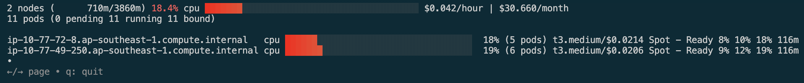
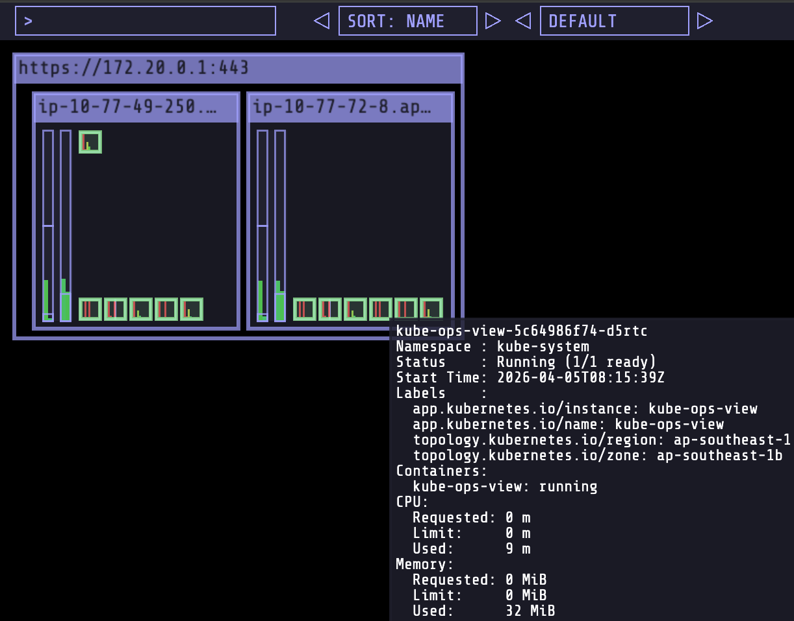
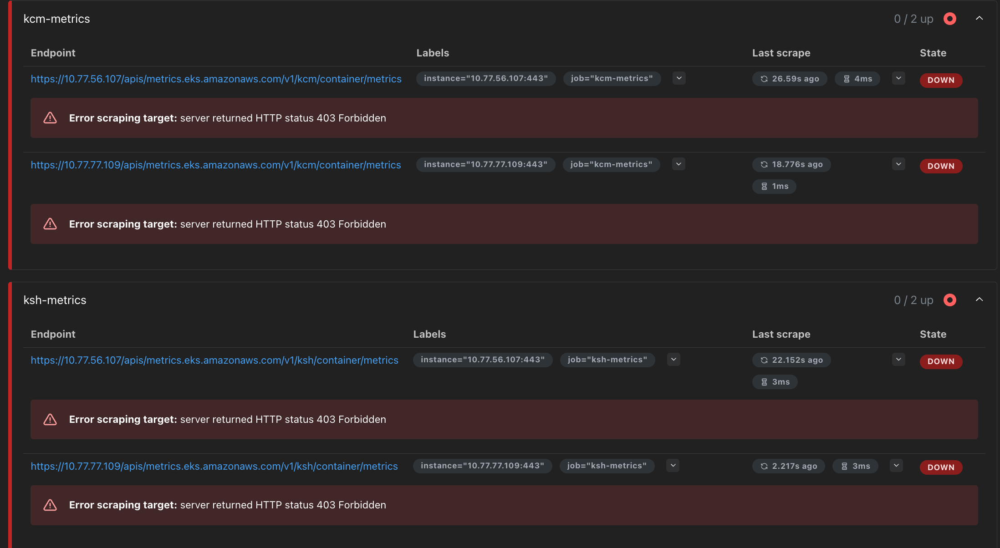
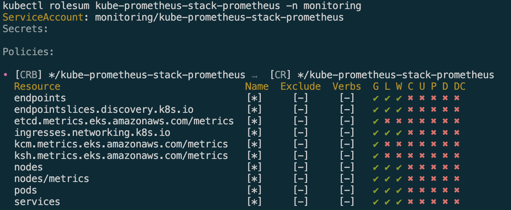

> *CloudNet 팀의 [2026년 AWS EKS Workshop Study 4기](https://gasidaseo.notion.site/26-AWS-EKS-Hands-on-Study-4-31a50aec5edf804b8294d8d512c43370) 3주차 학습 내용을 담고 있습니다.*


## 1. EKS Node Viewer 



`eks-node-viewer`는 EKS 클러스터의 각 노드 내 스케줄링된 파드의 request 값, 할당 가능한 용량을 표시하는 데 사용되는 도구입니다. 실제 Pod 리소스 사용량은 보여주지 않습니다. [Github](https://github.com/awslabs/eks-node-viewer)

- 동작
    - It displays the scheduled pod resource requests vs the allocatable capacity on the node.
    - It does not look at the actual pod resource usage.
    - 각 Node에서 할당 가능한 자원 용량과 스케줄링된 파드의 request 값을 표시
    - 아래 소스코드(/pkg/model/pod.go) 내에서 init containers를 제외한 컨테이너의 request 합을 반환하는 것이 확인됨
    - <details><summary>https://github.com/awslabs/eks-node-viewer/blob/main/pkg/model/pod.go#L82</summary>
```bash
// **Requested returns the sum of the resources requested by the pod**. **This doesn't include any init containers** as we
// are interested in the steady state usage of the pod
func (p *Pod) Requested() v1.ResourceList {
    p.mu.RLock()
    defer p.mu.RUnlock()
    requested := v1.ResourceList{}
    for _, c := range p.pod.Spec.Containers {
        for rn, q := range c.Resources.Requests {
            existing := requested[rn]
            existing.Add(q)
            requested[rn] = existing
        }
    }
    requested[v1.ResourcePods] = resource.MustParse("1")
    return requested
}
```
</details>

<details><summary>설치</summary>
    
```bash
# macOS 설치
brew tap aws/tap
brew install eks-node-viewer
2
# Windows 에 WSL2 (Ubuntu) 설치
sudo apt install golang-go
go install github.com/awslabs/eks-node-viewer/cmd/eks-node-viewer@latest  # 설치 시 2~3분 정도 소요
echo 'export PATH="$PATH:/root/go/bin"' >> /etc/profile

---
# 아래처럼 바이너리파일 다운로드 후 사용 가능 : 버전 체크
wget -O eks-node-viewer https://github.com/awslabs/eks-node-viewer/releases/download/v**0.7.4**/eks-node-viewer_Linux_x86_64
chmod +x eks-node-viewer
sudo mv -v eks-node-viewer /usr/local/bin
```
</details>

<details><summary>사용</summary>
    
```bash
# [신규 터미널] 모니터링 : eks 자격증명 필요

# Standard usage
**eks-node-viewer**

# Display both CPU and Memory Usage
eks-node-viewer --resources cpu,memory
**eks-node-viewer --resources cpu,memory** --extra-labels eks-node-viewer/node-age

****# Display extra labels, i.e. AZ : node 에 labels 사용 가능
**eks-node-viewer --extra-labels topology.kubernetes.io/zone
eks-node-viewer --extra-labels kubernetes.io/arch**

# Sort by CPU usage in descending order
**eks-node-viewer --node-sort=eks-node-viewer/node-cpu-usage=dsc**

# Karenter nodes only
**eks-node-viewer --node-selector "karpenter.sh/***provisioner-name***"**

# Specify a particular AWS profile and region
AWS_PROFILE=myprofile AWS_REGION=us-west-2

**Computed Labels** : --extra-labels
# eks-node-viewer/node-age - Age of the node
**eks-node-viewer --extra-labels** eks-node-viewer/node-age
**eks-node-viewer --extra-labels** topology.kubernetes.io/zone,eks-node-viewer/node-age

# eks-node-viewer/node-ephemeral-storage-usage - Ephemeral Storage usage (requests)
**eks-node-viewer --extra-labels** eks-node-viewer/node-ephemeral-storage-usage

# eks-node-viewer/node-cpu-usage - CPU usage (requests)
**eks-node-viewer --extra-labels** eks-node-viewer/node-cpu-usage
****
# eks-node-viewer/node-memory-usage - Memory usage (requests)
**eks-node-viewer --extra-labels** eks-node-viewer/node-memory-usage
****
# eks-node-viewer/node-pods-usage - Pod usage (requests)
**eks-node-viewer --extra-labels** eks-node-viewer/node-pods-usage
```
</details>

## 2. kube-ops-view 





<details><summary>설치</summary>

```bash
# kube-ops-view : NodePort 나 LoadBalancer Type 필요 없음, ClusterIP 사용하여 배포
helm repo add geek-cookbook https://geek-cookbook.github.io/charts/
helm install kube-ops-view geek-cookbook/kube-ops-view --version 1.2.2 --set service.main.type=ClusterIP --set env.TZ="Asia/Seoul" --namespace kube-system
</details>

<details><summary>확인</summary>
kubectl get deploy,pod,svc,ep -n kube-system -l app.kubernetes.io/instance=kube-ops-view


NAME                            READY   UP-TO-DATE   AVAILABLE   AGE
deployment.apps/kube-ops-view   1/1     1            1           96s

NAME                                 READY   STATUS    RESTARTS   AGE
pod/kube-ops-view-5c64986f74-d5rtc   1/1     Running   0          96s

NAME                    TYPE        CLUSTER-IP       EXTERNAL-IP   PORT(S)    AGE
service/kube-ops-view   ClusterIP   172.20.155.199   <none>        8080/TCP   96s

NAME                      ENDPOINTS           AGE
endpoints/kube-ops-view   **10.77.66.192:8080**   96s

# Endpoints 확인
k describe endpoints -l app.kubernetes.io/instance=kube-ops-view -n kube-system               ✔ │ siyoung-eks ○ │ 05:34:01 PM 
Name:         kube-ops-view
Namespace:    kube-system
Labels:       app.kubernetes.io/instance=kube-ops-view
              app.kubernetes.io/managed-by=Helm
              app.kubernetes.io/name=kube-ops-view
              app.kubernetes.io/version=20.4.0
              endpoints.kubernetes.io/managed-by=endpoint-controller
              helm.sh/chart=kube-ops-view-1.2.2
Annotations:  endpoints.kubernetes.io/last-change-trigger-time: 2026-04-05T08:15:50Z
Subsets:
  Addresses:          10.77.66.192
  NotReadyAddresses:  <none>
  Ports:
    Name  Port  Protocol
    ----  ----  --------
    http  8080  TCP

Events:  <none>
ㄴ
# 사용 리전의 인증서 ARN 변수 지정 : 정상 상태 확인(만료 상태면 에러 발생!)
CERT_ARN=$(aws acm list-certificates --query 'CertificateSummaryList[].CertificateArn[]' --output text)
echo $CERT_ARN

# 자신의 공인 도메인 변수 지정
MyDomain=<자신의 공인 도메인>
echo $MyDomain

MyDomain=siyoung.cloud
echo $MyDomain


# kubeopsview 용 Ingress 설정 : group 설정으로 1대의 ALB를 여러개의 ingress 에서 공용 사용
# kubeopsview.$MyDomain으로의 요청은 kube-ops-view 서비스에 8080포트로 연결
cat <<EOF | kubectl apply -f -
apiVersion: networking.k8s.io/v1
kind: Ingress
metadata:
  annotations:
    alb.ingress.kubernetes.io/certificate-arn: $CERT_ARN
    alb.ingress.kubernetes.io/group.name: study
    alb.ingress.kubernetes.io/listen-ports: '[{"HTTPS":443}, {"HTTP":80}]'
    alb.ingress.kubernetes.io/load-balancer-name: myeks-ingress-alb
    alb.ingress.kubernetes.io/scheme: internet-facing
    alb.ingress.kubernetes.io/ssl-redirect: "443"
    alb.ingress.kubernetes.io/success-codes: 200-399
    alb.ingress.kubernetes.io/target-type: ip
  labels:
    app.kubernetes.io/name: kubeopsview
  name: kubeopsview
  namespace: kube-system
spec:
  ingressClassName: alb
  rules:
  - host: kubeopsview.$MyDomain
    http:
      paths:
      - backend:
          service:
            name: kube-ops-view
            port:
              number: 8080
        path: /
        pathType: Prefix
EOF

# service, ep, ingress 확인
kubectl get ingress,svc,ep -n kube-system

NAME                                    CLASS   HOSTS                       ADDRESS                                                        PORTS   AGE
ingress.networking.k8s.io/kubeopsview   alb     kubeopsview.siyoung.cloud   myeks-ingress-alb-713402641.ap-southeast-1.elb.amazonaws.com   80      2m32s

NAME                                        TYPE        CLUSTER-IP       EXTERNAL-IP   PORT(S)                  AGE
service/aws-load-balancer-webhook-service   ClusterIP   172.20.50.244    <none>        443/TCP                  92m
service/eks-extension-metrics-api           ClusterIP   172.20.212.8     <none>        443/TCP                  127m
service/kube-dns                            ClusterIP   172.20.0.10      <none>        53/UDP,53/TCP,9153/TCP   121m
service/kube-ops-view                       ClusterIP   172.20.155.199   <none>        8080/TCP                 4m47s
service/metrics-server                      ClusterIP   172.20.29.73     <none>        443/TCP                  121m

NAME                                          ENDPOINTS                                                         AGE
endpoints/aws-load-balancer-webhook-service   10.77.54.232:9443,10.77.78.239:9443                               92m
endpoints/eks-extension-metrics-api           172.0.32.0:10443                                                  127m
endpoints/kube-dns                            10.77.48.197:9153,10.77.64.157:9153,10.77.48.197:53 + 3 more...   121m
**endpoints/kube-ops-view**                       **10.77.66.192:8080**                                                 4m47s
endpoints/metrics-server                      10.77.56.35:10251,10.77.69.28:10251                               121m

# Kube Ops View 접속 정보 확인 
echo -e "Kube Ops View URL = https://kubeopsview.$MyDomain/#scale=1.5"
open "https://kubeopsview.$MyDomain/#scale=1.5" # macOS


# (참고) 삭제 시
kubectl delete ingress -n kube-system kubeopsview
```

</details>

## 3. Prometheus and Grafana 

### 3.1. kube-prometheus-stack helm 배포

#### 3.1.1. 설치 및 접근

<details><summary>설치 및 접근</summary>

```bash
# repo 추가
helm repo add prometheus-community https://prometheus-community.github.io/helm-charts

# helm values 파일 생성 : additionalScrapeConfigs 는 아래 설명
cat <<EOT > monitor-values.yaml
prometheus:
  prometheusSpec:
    podMonitorSelectorNilUsesHelmValues: false
    serviceMonitorSelectorNilUsesHelmValues: false
    additionalScrapeConfigs:
      # apiserver metrics
      - job_name: apiserver-metrics
        kubernetes_sd_configs:
        - role: endpoints
        scheme: https
        tls_config:
          ca_file: /var/run/secrets/kubernetes.io/serviceaccount/ca.crt
          insecure_skip_verify: true
        bearer_token_file: /var/run/secrets/kubernetes.io/serviceaccount/token
        relabel_configs:
        - source_labels:
            [
              __meta_kubernetes_namespace,
              __meta_kubernetes_service_name,
              __meta_kubernetes_endpoint_port_name,
            ]
          action: keep
          regex: default;kubernetes;https
      # Scheduler metrics
      - job_name: 'ksh-metrics'
        kubernetes_sd_configs:
        - role: endpoints
        metrics_path: /apis/metrics.eks.amazonaws.com/v1/ksh/container/metrics
        scheme: https
        tls_config:
          ca_file: /var/run/secrets/kubernetes.io/serviceaccount/ca.crt
          insecure_skip_verify: true
        bearer_token_file: /var/run/secrets/kubernetes.io/serviceaccount/token
        relabel_configs:
        - source_labels:
            [
              __meta_kubernetes_namespace,
              __meta_kubernetes_service_name,
              __meta_kubernetes_endpoint_port_name,
            ]
          action: keep
          regex: default;kubernetes;https
      # Controller Manager metrics
      - job_name: 'kcm-metrics'
        kubernetes_sd_configs:
        - role: endpoints
        metrics_path: /apis/metrics.eks.amazonaws.com/v1/kcm/container/metrics
        scheme: https
        tls_config:
          ca_file: /var/run/secrets/kubernetes.io/serviceaccount/ca.crt
          insecure_skip_verify: true
        bearer_token_file: /var/run/secrets/kubernetes.io/serviceaccount/token
        relabel_configs:
        - source_labels:
            [
              __meta_kubernetes_namespace,
              __meta_kubernetes_service_name,
              __meta_kubernetes_endpoint_port_name,
            ]
          action: keep
          regex: default;kubernetes;https

  # Enable vertical pod autoscaler support for prometheus-operator
  #verticalPodAutoscaler:
  #  enabled: true

  ingress:
    enabled: true
    ingressClassName: alb
    hosts: 
      - prometheus.$MyDomain
    paths: 
      - /*
    annotations:
      alb.ingress.kubernetes.io/scheme: internet-facing
      alb.ingress.kubernetes.io/target-type: ip
      alb.ingress.kubernetes.io/listen-ports: '[{"HTTPS":443}, {"HTTP":80}]'
      alb.ingress.kubernetes.io/certificate-arn: $CERT_ARN
      alb.ingress.kubernetes.io/success-codes: 200-399
      alb.ingress.kubernetes.io/load-balancer-name: myeks-ingress-alb
      alb.ingress.kubernetes.io/group.name: study
      alb.ingress.kubernetes.io/ssl-redirect: '443'

grafana:
  defaultDashboardsTimezone: Asia/Seoul
  adminPassword: prom-operator

  ingress:
    enabled: true
    ingressClassName: alb
    hosts: 
      - grafana.$MyDomain
    paths: 
      - /*
    annotations:
      alb.ingress.kubernetes.io/scheme: internet-facing
      alb.ingress.kubernetes.io/target-type: ip
      alb.ingress.kubernetes.io/listen-ports: '[{"HTTPS":443}, {"HTTP":80}]'
      alb.ingress.kubernetes.io/certificate-arn: $CERT_ARN
      alb.ingress.kubernetes.io/success-codes: 200-399
      alb.ingress.kubernetes.io/load-balancer-name: myeks-ingress-alb
      alb.ingress.kubernetes.io/group.name: study
      alb.ingress.kubernetes.io/ssl-redirect: '443'

kubeControllerManager:
  enabled: false
kubeEtcd:
  enabled: false
kubeScheduler:
  enabled: false
prometheus-windows-exporter:
  prometheus:
    monitor:
      enabled: false
EOT
cat monitor-values.yaml

# 배포
helm install kube-prometheus-stack prometheus-community/kube-prometheus-stack --version 80.13.3 \
-f monitor-values.yaml --create-namespace --namespace monitoring


# 확인
helm list -n monitoring
kubectl get sts,ds,deploy,pod,svc,ep,ingress -n monitoring
kubectl get prometheus,servicemonitors -n monitoring
kubectl get crd | grep monitoring
kubectl get-all -n monitoring  # kubectl krew install get-all

# 프로메테우스 버전 확인
kubectl exec -it sts/prometheus-kube-prometheus-stack-prometheus -n monitoring -c prometheus -- prometheus --version
prometheus, version 3.1.0 (branch: HEAD, revision: 7086161a93b262aa0949dbf2aba15a5a7b13e0a3)
...

# 프로메테우스 웹 접속
echo -e "https://prometheus.$MyDomain"
open "https://prometheus.$MyDomain" # macOS

# 그라파나 웹 접속 : admin / prom-operator
echo -e "https://grafana.$MyDomain"
open "https://grafana.$MyDomain" # macOS


# (참고) 업그레이드 및 삭제 시
helm upgrade -i kube-prometheus-stack prometheus-community/kube-prometheus-stack --version 80.13.3 \
-f monitor-values.yaml --create-namespace --namespace monitoring

helm uninstall -n monitoring kube-prometheus-stack
```

</details>

#### 3.1.2. EKS 컨트롤 플레인 원시 지표

EKS 컨트롤 플레인 원시 지표(메트릭)을 Prometheus 형식으로 가져오기 - [Docs](https://docs.aws.amazon.com/ko_kr/eks/latest/userguide/view-raw-metrics.html) , [Blog](https://devfloor9.github.io/engineering-playbook/docs/eks-best-practices/control-plane-scaling/eks-control-plane-crd-scaling)




프로메테우스 스택 배포 후 바로 Target Health를 확인해보면, 컨트롤 플레인의 원시 메트릭을 기본적으로 가져오지 못하고 있습니다. 컨트롤 플레인은 AWS가 관리하는 별도의 VPC에서 실행되기 때문에 클러스터 내부 IP가 아닌 별도의 AWS API 엔드포인트(`metrics.eks.amazonaws.com`)로 접근하는데, 프로메테우스가 엔드포인트로 접근하여 메트릭을 조회할 `get` 권한을 가지고 있지 않아 발생하는 문제입니다. 

- kcm-metrics (kube-controller-manager)
- ksh-metrics (kube-scheduler) 

프로메테우스 스택 Service Account에 맵핑된 ClusterRole에 API를 호출할 권한을 추가하면 정상적으로 메트릭이 수집됩니다.

```bash
┌─────────────────────────────────────────────────────────────────────┐
│                 EKS Control Plane Observability                     │
├──────────────────┬──────────────────┬────────────────┬──────────────┤
│ ① CloudWatch     │ ② Prometheus    │ ③ Control      │ ④ Cluster   │
│    Vended Metrics│    Metrics       │    Plane       │    Insights  │
│                  │    Endpoint      │    Logging     │              │
├──────────────────┼──────────────────┼────────────────┼──────────────┤
│ AWS/EKS 네임스페이스│ KCM/KSH/etcd     │ API/Audit/     │ Upgrade      │
│ (자동, 무료)       │ (Prometheus      │ Auth/CM/Sched  │ Readiness    │
│                  │  호환 K8s API)    │ (CloudWatch    │ Health Issues│
│                  │                  │  Logs)         │ Addon Compat │
├──────────────────┼──────────────────┼────────────────┼──────────────┤
│ v1.28+ 자동       │ v1.28+ 수동       │ 모든 버전        │ 모든 버전 자동 │
└──────────────────┴──────────────────┴────────────────┴──────────────┘
```


```bash
# helm values 파일 생성 : additionalScrapeConfigs 다시 살펴보기!
helm get values -n monitoring kube-prometheus-stack
...
      job_name: ksh-metrics
      kubernetes_sd_configs:
      - role: endpoints
      metrics_path: /apis/metrics.eks.amazonaws.com/v1/ksh/container/metrics
...

# Metrics.eks.amazonaws.com의 컨트롤 플레인 지표 가져오기 : kube-scheduler , kube-controller-manager 지표
kubectl get --raw "/apis/metrics.eks.amazonaws.com/v1/ksh/container/metrics"
kubectl get --raw "/apis/metrics.eks.amazonaws.com/v1/kcm/container/metrics"
kubectl get svc,ep -n kube-system eks-extension-metrics-api
kubectl get apiservices |egrep '(AVAILABLE|metrics)'
NAME                              SERVICE                                 AVAILABLE   AGE
v1.metrics.eks.amazonaws.com      kube-system/eks-extension-metrics-api   True        75m
v1beta1.metrics.k8s.io            kube-system/metrics-server              True        68m


# 프로메테우스 파드 정보 확인
kubectl describe pod -n monitoring prometheus-kube-prometheus-stack-prometheus-0  | grep 'Service Account'
Service Account:  kube-prometheus-stack-prometheus

# 해당 SA에 권한이 없음!
kubectl rbac-tool lookup kube-prometheus-stack-prometheus # kubectl krew install rbac-tool
kubectl rolesum kube-prometheus-stack-prometheus -n monitoring # kubectl krew install rolesum
...
Policies:
• [CRB] */kube-prometheus-stack-prometheus ⟶  [CR] */kube-prometheus-stack-prometheus
  Resource                         Name  Exclude  Verbs  G L W C U P D DC  
  endpoints                        [*]     [-]     [-]   ✔ ✔ ✔ ✖ ✖ ✖ ✖ ✖   
  endpointslices.discovery.k8s.io  [*]     [-]     [-]   ✔ ✔ ✔ ✖ ✖ ✖ ✖ ✖   
  ingresses.networking.k8s.io      [*]     [-]     [-]   ✔ ✔ ✔ ✖ ✖ ✖ ✖ ✖   
  nodes                            [*]     [-]     [-]   ✔ ✔ ✔ ✖ ✖ ✖ ✖ ✖   
  nodes/metrics                    [*]     [-]     [-]   ✔ ✔ ✔ ✖ ✖ ✖ ✖ ✖   
  pods                             [*]     [-]     [-]   ✔ ✔ ✔ ✖ ✖ ✖ ✖ ✖   
  services                         [*]     [-]     [-]   ✔ ✔ ✔ ✖ ✖ ✖ ✖ ✖  

# 클러스터롤에 권한 추가
kubectl get clusterrole kube-prometheus-stack-prometheus
kubectl patch clusterrole kube-prometheus-stack-prometheus --type=json -p='[
  {
    "op": "add",
    "path": "/rules/-",
    "value": {
      "verbs": ["get"],
      "apiGroups": ["metrics.eks.amazonaws.com"],
      "resources": ["kcm/metrics", "ksh/metrics"]
    }
  }
]'

kubectl rolesum kube-prometheus-stack-prometheus -n monitoring
...
• [CRB] */kube-prometheus-stack-prometheus ⟶  [CR] */kube-prometheus-stack-prometheus
  Resource                               Name  Exclude  Verbs  G L W C U P D DC  
  ...
  kcm.metrics.eks.amazonaws.com/metrics  [*]     [-]     [-]   ✔ ✖ ✖ ✖ ✖ ✖ ✖ ✖   
  ksh.metrics.eks.amazonaws.com/metrics  [*]     [-]     [-]   ✔ ✖ ✖ ✖ ✖ ✖ ✖ ✖   
  ...
```

#### 3.1.2. 도전과제 

- `도전과제` kube-prometheus-stack helm 배포 시, **eks etcd 메트릭**을 가져올 수 있게 프로메테우스에 설정해보기
    - 
```yaml
# helm values 파일 `prometheus.prometheusSpec.additionalScrapeConfigs`필드에 아래 설정 추가:
# etcd metrics
      - job_name: 'etcd-metrics'
        kubernetes_sd_configs:
        - role: endpoints
        metrics_path: /apis/metrics.eks.amazonaws.com/v1/etcd/container/metrics
        scheme: https
        tls_config:
          ca_file: /var/run/secrets/kubernetes.io/serviceaccount/ca.crt
          insecure_skip_verify: true
        bearer_token_file: /var/run/secrets/kubernetes.io/serviceaccount/token
        relabel_configs:
        - source_labels: [__meta_kubernetes_namespace, __meta_kubernetes_service_name, __meta_kubernetes_endpoint_port_name]
          action: keep
          regex: default;kubernetes;https
```
- `도전과제` kube-prometheus-stack helm 배포 시, eks controlplane metrics 가져올 수 있게 프로메테우스에 **clusterrole 추가 해서 배포**되게 해보기
    - 
```yaml
# helm values 파일 `prometheus`필드에 아래 설정 추가:
prometheus:
  serviceAccount:
    create: true
  # 프로메테우스가 사용할 ClusterRole에 추가 규칙 정의
  additionalRulesForClusterRole:
    - apiGroups: ["metrics.eks.amazonaws.com"]
      resources: ["kcm/metrics", "ksh/metrics", "etcd/metrics"]
      verbs: ["get"]

```

    - 

<!-- - `도전과제` kube-prometheus-stack helm 배포 시, **그라파나에 대시보드(kcm, scheduler 등) 링크를 추가**해서 배포되게 해보기
    - 
```yaml
# helm values 파일 `grafana`필드에 아래 설정 추가:
grafana: 
  dashboards:
    default:
      # https://grafana.com/grafana/dashboards/16321 (EKS Control Plane 예시)
      eks-control-plane:
        gnetId: 16321
        revision: 1
        datasource: Prometheus
``` -->


- **최종 values 파일**
```yaml
cat <<EOT > monitor-values.yaml
prometheus:
  prometheusSpec:
    podMonitorSelectorNilUsesHelmValues: false
    serviceMonitorSelectorNilUsesHelmValues: false
    additionalScrapeConfigs:
      # apiserver metrics
      - job_name: apiserver-metrics
        kubernetes_sd_configs:
        - role: endpoints
        scheme: https
        tls_config:
          ca_file: /var/run/secrets/kubernetes.io/serviceaccount/ca.crt
          insecure_skip_verify: true
        bearer_token_file: /var/run/secrets/kubernetes.io/serviceaccount/token
        relabel_configs:
        - source_labels:
            [
              __meta_kubernetes_namespace,
              __meta_kubernetes_service_name,
              __meta_kubernetes_endpoint_port_name,
            ]
          action: keep
          regex: default;kubernetes;https
      # Scheduler metrics
      - job_name: 'ksh-metrics'
        kubernetes_sd_configs:
        - role: endpoints
        metrics_path: /apis/metrics.eks.amazonaws.com/v1/ksh/container/metrics
        scheme: https
        tls_config:
          ca_file: /var/run/secrets/kubernetes.io/serviceaccount/ca.crt
          insecure_skip_verify: true
        bearer_token_file: /var/run/secrets/kubernetes.io/serviceaccount/token
        relabel_configs:
        - source_labels:
            [
              __meta_kubernetes_namespace,
              __meta_kubernetes_service_name,
              __meta_kubernetes_endpoint_port_name,
            ]
          action: keep
          regex: default;kubernetes;https
      # Controller Manager metrics
      - job_name: 'kcm-metrics'
        kubernetes_sd_configs:
        - role: endpoints
        metrics_path: /apis/metrics.eks.amazonaws.com/v1/kcm/container/metrics
        scheme: https
        tls_config:
          ca_file: /var/run/secrets/kubernetes.io/serviceaccount/ca.crt
          insecure_skip_verify: true
        bearer_token_file: /var/run/secrets/kubernetes.io/serviceaccount/token
        relabel_configs:
        - source_labels:
            [
              __meta_kubernetes_namespace,
              __meta_kubernetes_service_name,
              __meta_kubernetes_endpoint_port_name,
            ]
          action: keep
          regex: default;kubernetes;https
      # etcd metrics
      - job_name: 'etcd-metrics'
        kubernetes_sd_configs:
        - role: endpoints
        metrics_path: /apis/metrics.eks.amazonaws.com/v1/etcd/container/metrics
        scheme: https
        tls_config:
          ca_file: /var/run/secrets/kubernetes.io/serviceaccount/ca.crt
          insecure_skip_verify: true
        bearer_token_file: /var/run/secrets/kubernetes.io/serviceaccount/token
        relabel_configs:
        - source_labels: [__meta_kubernetes_namespace, __meta_kubernetes_service_name, __meta_kubernetes_endpoint_port_name]
          action: keep
          regex: default;kubernetes;https

  # Enable vertical pod autoscaler support for prometheus-operator
  #verticalPodAutoscaler:
  #  enabled: true

  serviceAccount:
    create: true
  # 프로메테우스가 사용할 ClusterRole에 추가 규칙 정의
  additionalRulesForClusterRole:
    - apiGroups: ["metrics.eks.amazonaws.com"]
      resources: ["kcm/metrics", "ksh/metrics", "etcd/metrics"]
      verbs: ["get"]

  ingress:
    enabled: true
    ingressClassName: alb
    hosts: 
      - prometheus.$MyDomain
    paths: 
      - /*
    annotations:
      alb.ingress.kubernetes.io/scheme: internet-facing
      alb.ingress.kubernetes.io/target-type: ip
      alb.ingress.kubernetes.io/listen-ports: '[{"HTTPS":443}, {"HTTP":80}]'
      alb.ingress.kubernetes.io/certificate-arn: $CERT_ARN
      alb.ingress.kubernetes.io/success-codes: 200-399
      alb.ingress.kubernetes.io/load-balancer-name: myeks-ingress-alb
      alb.ingress.kubernetes.io/group.name: study
      alb.ingress.kubernetes.io/ssl-redirect: '443'

grafana:
  defaultDashboardsTimezone: Asia/Seoul
  adminPassword: prom-operator

  ingress:
    enabled: true
    ingressClassName: alb
    hosts: 
      - grafana.$MyDomain
    paths: 
      - /*
    annotations:
      alb.ingress.kubernetes.io/scheme: internet-facing
      alb.ingress.kubernetes.io/target-type: ip
      alb.ingress.kubernetes.io/listen-ports: '[{"HTTPS":443}, {"HTTP":80}]'
      alb.ingress.kubernetes.io/certificate-arn: $CERT_ARN
      alb.ingress.kubernetes.io/success-codes: 200-399
      alb.ingress.kubernetes.io/load-balancer-name: myeks-ingress-alb
      alb.ingress.kubernetes.io/group.name: study
      alb.ingress.kubernetes.io/ssl-redirect: '443'

kubeControllerManager:
  enabled: false
kubeEtcd:
  enabled: false
kubeScheduler:
  enabled: false
prometheus-windows-exporter:
  prometheus:
    monitor:
      enabled: false
EOT
```