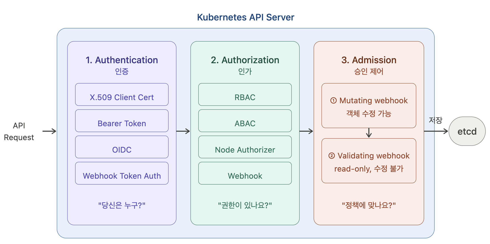
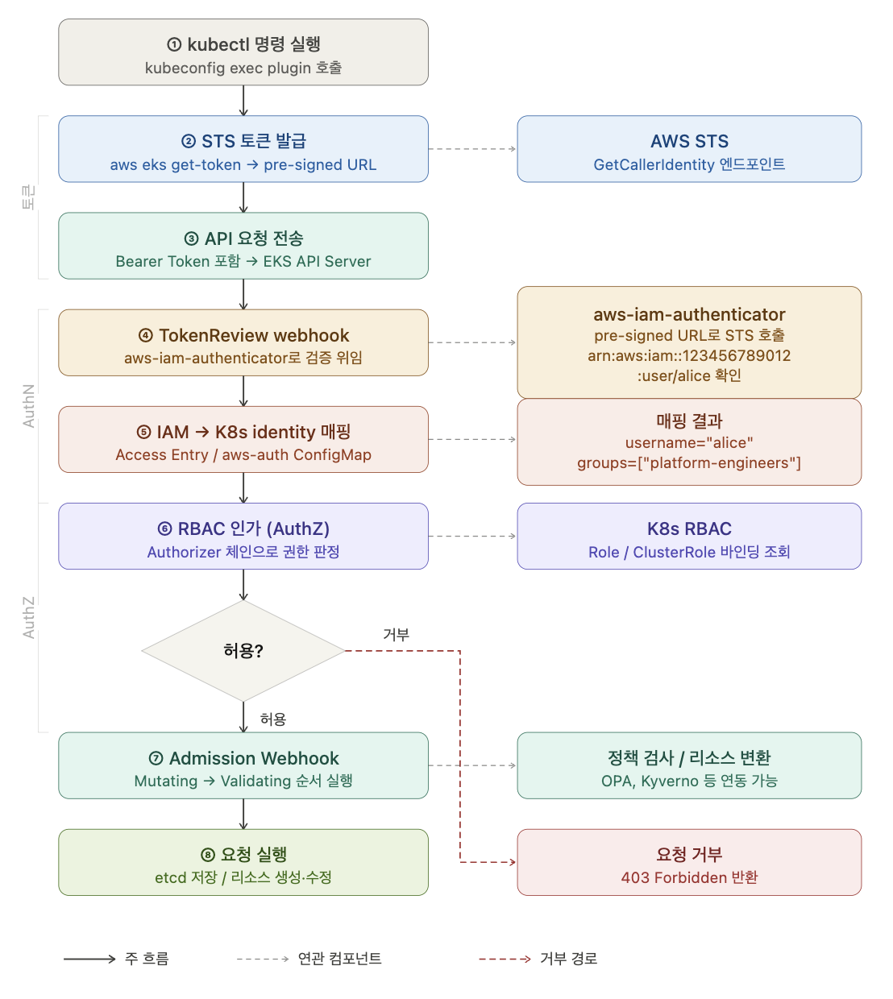
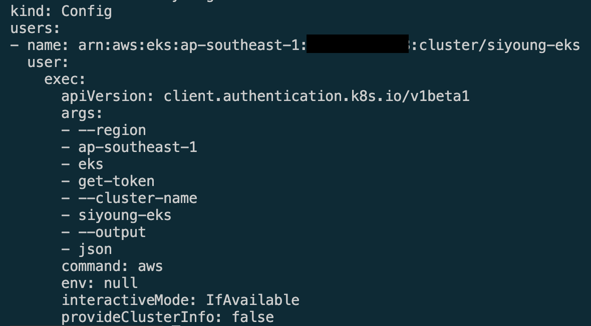
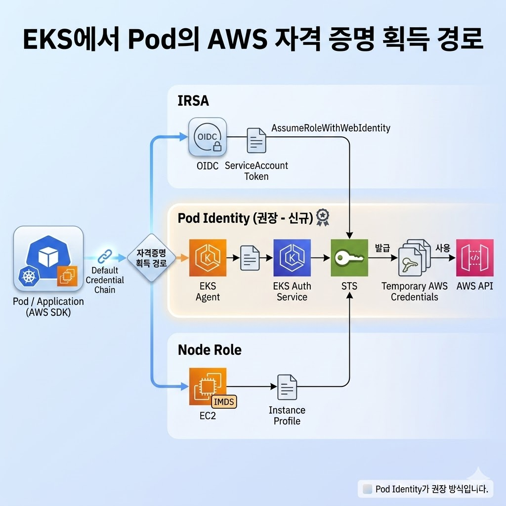
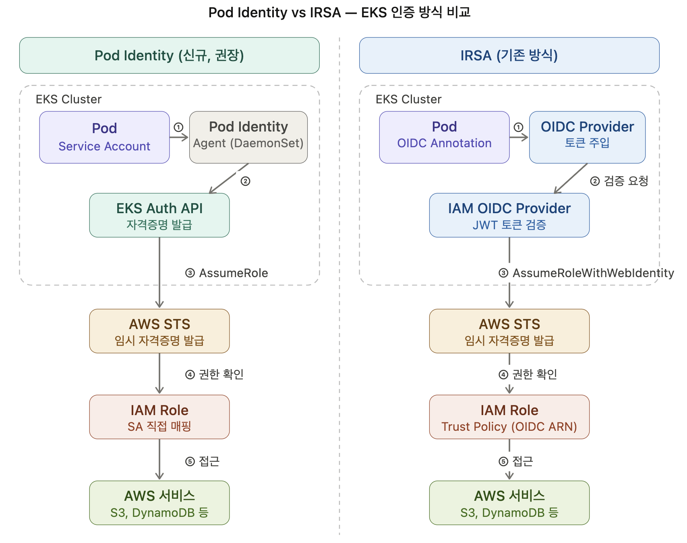
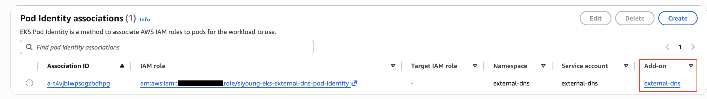
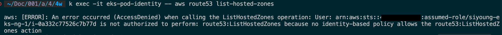
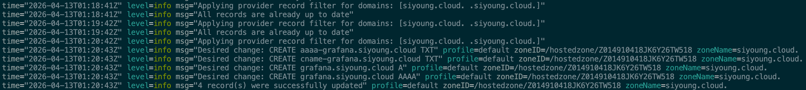

> *CloudNet 팀의 [2026년 AWS EKS Workshop Study 4기](https://gasidaseo.notion.site/26-AWS-EKS-Hands-on-Study-4-31a50aec5edf804b8294d8d512c43370) 4주차 학습 내용을 담고 있습니다.*

> **Key Takeaways**
> 
> * 운영용(IAM+RBAC)과 워크로드용(AWS API) 권한 체계
> * AWS IAM(신원 확인)과 K8s RBAC(권한 제어) 연동
> * IRSA 및 Pod Identity를 통한 Pod 단위의 권한 관리


## 1. 들어가며

EKS 운영 관점에서의 트래픽은 요청 경로에 따라 크게 두 가지로 나눌 수 있습니다.

1. 운영 트래픽 (Inbound: 클러스터 API 접근)
      1. 주체: 관리자·개발자·CI/CD 시스템 등
      2. 경로: 외부 → `kubectl` / `eksctl` / API 호출 → EKS Control Plane
      3. 특징: AWS IAM을 통해 '신원'을 먼저 확인(AuthN)한 후, 쿠버네티스 내부의 RBAC을 통해 '권한'을 결정(AuthZ)
2. 워크로드 트래픽 (Outbound: AWS API 호출)
      1. 주체: 클러스터 내부에서 실행 중인 Pod(애플리케이션)
      2. 경로: Pod → AWS API (S3, DynamoDB 등)
      3. IRSA(IAM Roles for Service Accounts)나 EKS Pod Identity 같은 자격 증명 경로를 통해 AWS 리소스에 접근

EKS는 AWS 인프라 위에서 동작하는 관리형 Kubernetes이기 때문에, Kubernetes API 접근이 AWS IAM 인증과 연결됩니다. 즉 운영자가 `kubectl`을 사용할 때는 보통 IAM 기반 토큰으로 먼저 인증되고, 그 다음 Kubernetes 권한 체계인 RBAC 기반의 인가가 진행됩니다.

반면 Pod가 AWS API를 호출할 때는 Kubernetes API 인증 체계가 아니라 AWS 자격증명 경로(IRSA, Pod Identity, Node Role)를 통해 IAM 권한이 평가됩니다.
이 차이점을 기준으로 EKS 인증/인가 구조를 정리해보겠습니다.

> Pod → Kubernetes API 경로는 ServiceAccount(AuthN) + RBAC(AuthZ)로 K8s 내부에서 동작하여 구조가 단순한 편입니다.

## 2. AuthN vs AuthZ


| 구분 | 질문 | EKS 예시 |
| --- | --- | --- |
| Authentication (AuthN) | "당신은 누구인가?" | IAM Principal 검증, STS Token 검증 |
| Authorization (AuthZ) | "당신은 무엇을 할 수 있는가?" | K8s RBAC, EKS access policy, IAM policy |

- **인증(Authentication)**: 요청자의 신원을 확인한다.
- **인가(Authorization)**: 인증된 요청자가 리소스/동작에 대한 권한을 가지는지 판정한다.
- **핵심 포인트**: EKS에서는 어느 시점의 어떤 API(K8s API vs AWS API)에 대한 인증/인가인지 문맥을 반드시 붙여야 의미가 생긴다.


> 인증에 성공했다고 해서 동작을 할 수 있는 것이 아니며, 로그인은 되는데 명령어가 거부(Forbidden)된다면 인가(AuthZ)의 문제입니다.

EKS 보안 모델은 호출 대상(K8s API vs AWS API)과 요청의 방향에 따라 인증·인가 주체가 완전히 달라집니다. 따라서 트러블슈팅 시에는 '누가(Identity)', '어떤 엔드포인트(API Server vs AWS Endpoint)'에 접근하는지를 정확히 특정해야 합니다.

**예시**

- EKS에서 `kubectl` 요청의 인증은 IAM 기반이다.
- Kubernetes 오브젝트에 대한 인가는 RBAC 또는 EKS access policy가 담당한다.
- Pod의 AWS API 호출 권한은 IRSA/Pod Identity/Node Role이 담당한다.


## 3. EKS 인증/인가

EKS에서는 IAM, Kubernetes RBAC, ServiceAccount, STS, OIDC 같은 용어가 등장합니다. 이들이 모두 "권한"과 관련 있어 보이지만, 실제로는 서로 다른 경로에서 서로 다른 질문에 답합니다. 아래 세 문장은 전부 독립적인 문제입니다. 

- 어떤 IAM 사용자/역할이 `kubectl`로 클러스터에 들어올 수 있는가 (인증) 
- 들어온 사용자가 `pods`, `deployments`, `secrets`에 대해 무엇을 할 수 있는가 (인가)
- 어떤 Pod가 `S3`, `DynamoDB`, `Route53` 같은 AWS API를 호출할 수 있는가 (워크로드의 AWS API 호출 권한)


### 3.1. EKS 인증/인가 세 개의 권한 영역

앞서 설명한 두 세계의 결합을 시스템 아키텍처 관점에서 보면, EKS의 인증/인가는 크게 3개의 영역(Layer)으로 나눌 수 있습니다.

#### 3.1.1. AWS IAM

- 주요 역할:
    - IAM User/Role/Policy 관리
    - STS를 통한 임시 자격증명 발급
    - 신뢰 정책(trust policy) 기반의 role assumption 제어
    - OIDC federation 또는 service principal 기반 위임

#### 3.1.2. EKS Control Plane

- 주요 역할:
    - Kubernetes API endpoint 제공
    - 인증된 IAM principal을 Kubernetes subject로 연결
    - Access Entry / access policy 관리
    - audit/authenticator 로그 제공
    - Pod Identity association 및 EKS Auth API 제공

#### 3.1.3. Kubernetes 인가 체계

- 주요 역할:
    - `Role` / `ClusterRole` 관리
    - `RoleBinding` / `ClusterRoleBinding` 관리
    - `ServiceAccount` 관리
    - Admission Controller 및 Webhook 작동

EKS는 이 세 계층을 엮어주는 서비스입니다. 따라서 권한 오류가 발생했을 때도 **어느 영역에서 막혔는가**를 먼저 구분하면 원인 파악이 빠릅니다. 이 흐름을 이해하면 다음과 같은 오해를 피할 수 있습니다.

- ❌ kubectl은 장기 토큰을 넣고 다니는 도구가 아니다. (STS를 통해 매번 단기 토큰을 발급받습니다.)
- ❌ 로그인 가능(AuthN)과 작업 가능(AuthZ)은 서로 다른 단계다.
- ❌ IAM 권한(AdministratorAccess 등)이 있다고 해서 Kubernetes 작업 권한까지 자동으로 생기지 않는다.

## 4. K8s API (사용자 → K8s API) 

Kubernetes의 모든 구성 요소(Control Plane, Worker Nodes, Users)는 **API Server(kube-apiserver)**를 통해서 소통합니다.

### 4.1. K8s API 리소스 구조 (Groups & Versions)

Kubernetes API는 모든 것이 리소스(Resource)로 추상화되어 있으며, 이를 효율적으로 관리하기 위해 계층적 구조를 가집니다.

**API 계층 구조**

- API Group: 논리적으로 연관된 기능들의 집합 (예: `apps`, `batch`, `networking.k8s.io`)
- Version: API의 성숙도 (예: `v1`, `v1beta1`, `v1alpha1`)
- Resource: 실제 조작 대상 (예: `pods`, `deployments`, `services`)
- Verb: 리소스에 대한 동작 (예: get, list, create, update, delete)
    - | Verbs (K8s 동작) | HTTP Method | 설명 |
| :--- | :--- | :--- |
| **get, watch, list** | GET | 리소스 조회 및 실시간 감시 |
| **create** | POST | 새로운 리소스 생성 |
| **patch** | PATCH | 리소스 일부 수정 |
| **update** | PUT | 리소스 전체 업데이트(교체) |
| **delete, deletecollection** | DELETE | 리소스 삭제 (단일/복수) | 

**REST API 경로 예시**

kubectl 명령은 내부적으로 다음과 같은 표준 HTTP REST 경로로 변환되어 API 서버에 도달합니다.

- Core Group:
    - (`/api/v1`): Pod, Service, Namespace 등 초기 핵심 리소스
    - `/api/v1/namespaces/{ns}/pods`
- Named Group"
    - (`/apis/$GROUP/$VERSION`): Deployment(`apps`), Job(`batch`) 등 특정 기능을 위한 확장 그룹
    - `/apis/apps/v1/namespaces/{ns}/deployments`

`kubectl api-resources` 명령어를 실행하면 현재 클러스터에 지원하는 모든 API 그룹과 버전을 확인할 수 있습니다. 나타나는 `APIVERSION` 열은 해당 리소스가 어떤 그룹과 버전(Alpha, Beta, Stable)에 속해 있는지를 명시하며, 이는 YAML 매니페스트 작성 시 apiVersion 필드의 기준이 됩니다.

<details><summary>kubectl api-resources -o wide</summary>

```bash
NAME                                SHORTNAMES   APIVERSION                        NAMESPACED   KIND                               VERBS                                                        CATEGORIES
bindings                                         v1                                true         Binding                            create                                                       
componentstatuses                   cs           v1                                false        ComponentStatus                    get,list                                                     
configmaps                          cm           v1                                true         ConfigMap                          create,delete,deletecollection,get,list,patch,update,watch   
endpoints                           ep           v1                                true         Endpoints                          create,delete,deletecollection,get,list,patch,update,watch   
events                              ev           v1                                true         Event                              create,delete,deletecollection,get,list,patch,update,watch   
limitranges                         limits       v1                                true         LimitRange                         create,delete,deletecollection,get,list,patch,update,watch   
namespaces                          ns           v1                                false        Namespace                          create,delete,get,list,patch,update,watch                    
nodes                               no           v1                                false        Node                               create,delete,deletecollection,get,list,patch,update,watch   
persistentvolumeclaims              pvc          v1                                true         PersistentVolumeClaim              create,delete,deletecollection,get,list,patch,update,watch   
persistentvolumes                   pv           v1                                false        PersistentVolume                   create,delete,deletecollection,get,list,patch,update,watch   
pods                                po           v1                                true         Pod                                create,delete,deletecollection,get,list,patch,update,watch   all
podtemplates                                     v1                                true         PodTemplate                        create,delete,deletecollection,get,list,patch,update,watch   
replicationcontrollers              rc           v1                                true         ReplicationController              create,delete,deletecollection,get,list,patch,update,watch   all
resourcequotas                      quota        v1                                true         ResourceQuota                      create,delete,deletecollection,get,list,patch,update,watch   
secrets                                          v1                                true         Secret                             create,delete,deletecollection,get,list,patch,update,watch   
serviceaccounts                     sa           v1                                true         ServiceAccount                     create,delete,deletecollection,get,list,patch,update,watch   
services                            svc          v1                                true         Service                            create,delete,deletecollection,get,list,patch,update,watch   all
challenges                                       acme.cert-manager.io/v1           true         Challenge                          delete,deletecollection,get,list,patch,create,update,watch   cert-manager,cert-manager-acme
orders                                           acme.cert-manager.io/v1           true         Order                              delete,deletecollection,get,list,patch,create,update,watch   cert-manager,cert-manager-acme
mutatingwebhookconfigurations                    admissionregistration.k8s.io/v1   false        MutatingWebhookConfiguration       create,delete,deletecollection,get,list,patch,update,watch   api-extensions
validatingadmissionpolicies                      admissionregistration.k8s.io/v1   false        ValidatingAdmissionPolicy          create,delete,deletecollection,get,list,patch,update,watch   api-extensions
validatingadmissionpolicybindings                admissionregistration.k8s.io/v1   false        ValidatingAdmissionPolicyBinding   create,delete,deletecollection,get,list,patch,update,watch   api-extensions
validatingwebhookconfigurations                  admissionregistration.k8s.io/v1   false        ValidatingWebhookConfiguration     create,delete,deletecollection,get,list,patch,update,watch   api-extensions
customresourcedefinitions           crd,crds     apiextensions.k8s.io/v1           false        CustomResourceDefinition           create,delete,deletecollection,get,list,patch,update,watch   api-extensions
apiservices                                      apiregistration.k8s.io/v1         false        APIService                         create,delete,deletecollection,get,list,patch,update,watch   api-extensions
controllerrevisions                              apps/v1                           true         ControllerRevision                 create,delete,deletecollection,get,list,patch,update,watch   
daemonsets                          ds           apps/v1                           true         DaemonSet                          create,delete,deletecollection,get,list,patch,update,watch   all
deployments                         deploy       apps/v1                           true         Deployment                         create,delete,deletecollection,get,list,patch,update,watch   all
replicasets                         rs           apps/v1                           true         ReplicaSet                         create,delete,deletecollection,get,list,patch,update,watch   all
statefulsets                        sts          apps/v1                           true         StatefulSet                        create,delete,deletecollection,get,list,patch,update,watch   all
selfsubjectreviews                               authentication.k8s.io/v1          false        SelfSubjectReview                  create                                                       
tokenreviews                                     authentication.k8s.io/v1          false        TokenReview                        create                                                       
localsubjectaccessreviews                        authorization.k8s.io/v1           true         LocalSubjectAccessReview           create                                                       
selfsubjectaccessreviews                         authorization.k8s.io/v1           false        SelfSubjectAccessReview            create                                                       
selfsubjectrulesreviews                          authorization.k8s.io/v1           false        SelfSubjectRulesReview             create                                                       
subjectaccessreviews                             authorization.k8s.io/v1           false        SubjectAccessReview                create                                                       
horizontalpodautoscalers            hpa          autoscaling/v2                    true         HorizontalPodAutoscaler            create,delete,deletecollection,get,list,patch,update,watch   all
cronjobs                            cj           batch/v1                          true         CronJob                            create,delete,deletecollection,get,list,patch,update,watch   all
jobs                                             batch/v1                          true         Job                                create,delete,deletecollection,get,list,patch,update,watch   all
certificaterequests                 cr,crs       cert-manager.io/v1                true         CertificateRequest                 delete,deletecollection,get,list,patch,create,update,watch   cert-manager
certificates                        cert,certs   cert-manager.io/v1                true         Certificate                        delete,deletecollection,get,list,patch,create,update,watch   cert-manager
clusterissuers                      ciss         cert-manager.io/v1                false        ClusterIssuer                      delete,deletecollection,get,list,patch,create,update,watch   cert-manager
issuers                             iss          cert-manager.io/v1                true         Issuer                             delete,deletecollection,get,list,patch,create,update,watch   cert-manager
certificatesigningrequests          csr          certificates.k8s.io/v1            false        CertificateSigningRequest          create,delete,deletecollection,get,list,patch,update,watch   
leases                                           coordination.k8s.io/v1            true         Lease                              create,delete,deletecollection,get,list,patch,update,watch   
eniconfigs                                       crd.k8s.amazonaws.com/v1alpha1    false        ENIConfig                          delete,deletecollection,get,list,patch,create,update,watch   
endpointslices                                   discovery.k8s.io/v1               true         EndpointSlice                      create,delete,deletecollection,get,list,patch,update,watch   
events                              ev           events.k8s.io/v1                  true         Event                              create,delete,deletecollection,get,list,patch,update,watch   
dnsendpoints                                     externaldns.k8s.io/v1alpha1       true         DNSEndpoint                        delete,deletecollection,get,list,patch,create,update,watch   
flowschemas                                      flowcontrol.apiserver.k8s.io/v1   false        FlowSchema                         create,delete,deletecollection,get,list,patch,update,watch   
prioritylevelconfigurations                      flowcontrol.apiserver.k8s.io/v1   false        PriorityLevelConfiguration         create,delete,deletecollection,get,list,patch,update,watch   
nodes                                            metrics.k8s.io/v1beta1            false        NodeMetrics                        get,list                                                     
pods                                             metrics.k8s.io/v1beta1            true         PodMetrics                         get,list                                                     
applicationnetworkpolicies          anp          networking.k8s.aws/v1alpha1       true         ApplicationNetworkPolicy           delete,deletecollection,get,list,patch,create,update,watch   
clusternetworkpolicies              cnp          networking.k8s.aws/v1alpha1       false        ClusterNetworkPolicy               delete,deletecollection,get,list,patch,create,update,watch   
clusterpolicyendpoints              cpe          networking.k8s.aws/v1alpha1       false        ClusterPolicyEndpoint              delete,deletecollection,get,list,patch,create,update,watch   
policyendpoints                                  networking.k8s.aws/v1alpha1       true         PolicyEndpoint                     delete,deletecollection,get,list,patch,create,update,watch   
ingressclasses                                   networking.k8s.io/v1              false        IngressClass                       create,delete,deletecollection,get,list,patch,update,watch   
ingresses                           ing          networking.k8s.io/v1              true         Ingress                            create,delete,deletecollection,get,list,patch,update,watch   
ipaddresses                         ip           networking.k8s.io/v1              false        IPAddress                          create,delete,deletecollection,get,list,patch,update,watch   
networkpolicies                     netpol       networking.k8s.io/v1              true         NetworkPolicy                      create,delete,deletecollection,get,list,patch,update,watch   
servicecidrs                                     networking.k8s.io/v1              false        ServiceCIDR                        create,delete,deletecollection,get,list,patch,update,watch   
runtimeclasses                                   node.k8s.io/v1                    false        RuntimeClass                       create,delete,deletecollection,get,list,patch,update,watch   
poddisruptionbudgets                pdb          policy/v1                         true         PodDisruptionBudget                create,delete,deletecollection,get,list,patch,update,watch   
clusterrolebindings                              rbac.authorization.k8s.io/v1      false        ClusterRoleBinding                 create,delete,deletecollection,get,list,patch,update,watch   
clusterroles                                     rbac.authorization.k8s.io/v1      false        ClusterRole                        create,delete,deletecollection,get,list,patch,update,watch   
rolebindings                                     rbac.authorization.k8s.io/v1      true         RoleBinding                        create,delete,deletecollection,get,list,patch,update,watch   
roles                                            rbac.authorization.k8s.io/v1      true         Role                               create,delete,deletecollection,get,list,patch,update,watch   
deviceclasses                                    resource.k8s.io/v1                false        DeviceClass                        create,delete,deletecollection,get,list,patch,update,watch   
resourceclaims                                   resource.k8s.io/v1                true         ResourceClaim                      create,delete,deletecollection,get,list,patch,update,watch   
resourceclaimtemplates                           resource.k8s.io/v1                true         ResourceClaimTemplate              create,delete,deletecollection,get,list,patch,update,watch   
resourceslices                                   resource.k8s.io/v1                false        ResourceSlice                      create,delete,deletecollection,get,list,patch,update,watch   
priorityclasses                     pc           scheduling.k8s.io/v1              false        PriorityClass                      create,delete,deletecollection,get,list,patch,update,watch   
csidrivers                                       storage.k8s.io/v1                 false        CSIDriver                          create,delete,deletecollection,get,list,patch,update,watch   
csinodes                                         storage.k8s.io/v1                 false        CSINode                            create,delete,deletecollection,get,list,patch,update,watch   
csistoragecapacities                             storage.k8s.io/v1                 true         CSIStorageCapacity                 create,delete,deletecollection,get,list,patch,update,watch   
storageclasses                      sc           storage.k8s.io/v1                 false        StorageClass                       create,delete,deletecollection,get,list,patch,update,watch   
volumeattachments                                storage.k8s.io/v1                 false        VolumeAttachment                   create,delete,deletecollection,get,list,patch,update,watch   
volumeattributesclasses             vac          storage.k8s.io/v1                 false        VolumeAttributesClass              create,delete,deletecollection,get,list,patch,update,watch   
cninodes                            cnd          vpcresources.k8s.aws/v1alpha1     false        CNINode                            delete,deletecollection,get,list,patch,create,update,watch   
securitygrouppolicies               sgp          vpcresources.k8s.aws/v1beta1      true         SecurityGroupPolicy                delete,deletecollection,get,list,patch,create,update,watch   
```

</details>

#### 4.1.1. K8s API 요청 처리 생명 주기

운영 트래픽은 컨트롤 플레인의 API server로 들어가며, 여기서 인증과 인가, 정책 검사가 수행됩니다. Pod 생성, ConfigMap 업데이트, Namespace 삭제 등의 K8s API server에 도달하는 모든 요청은 아래의 세 단계를 통과합니다.




- **Authentication**: "당신은 누구인가?"
    - 유효한 자격증명으로 요청 주체의 신원을 확인합니다. 인증 실패 시 401 에러가 발생합니다. 

- **Authorization**: "이 작업을 할 수 있는가?"
    - 인증된 주체가 해당 리소스와 동작에 대해 권한이 있는지 확인합니다. 허용 규칙이 없으면 403 에러가 발생합니다.

- **Admission**: "이 리소스를 받아들여도 되는가?"
    - 인증과 인가를 통과했더라도, 조직 정책에 맞지 않으면 최종적으로 거부할 수 있습니다.

#### 4.1.2. K8s의 신원 체계: User vs ServiceAccount

K8s는 요청 주체를 크게 두 가지로 구분합니다.

| 구분 | User | ServiceAccount |
| :--- | :--- | :--- |
| **K8s 리소스 유무** | **K8s 오브젝트로 존재하지 않음** | 특정 Namespace에 속하며 **K8s API 리소스로 존재 (Kind: ServiceAccount)** |
| **관리 방식** | 클러스터 외부 (EKS의 경우 IAM) | 클러스터 내부 (Kubernetes API) |
| **인증 방식** | 인증서, 외부 IDP, IAM 토큰 등 | API 서버가 발급한 JWT 토큰 |
| 대표 예시 | 운영자의 `kubectl` | `external-dns`, `cert-manager`, 앱 Pod |

- Kubernetes에는 일반적인 `User` 객체가 없습니다. 
- API server는 인증 결과를 `username`, `uid`, `groups` 형태의 `UserInfo`로 내부 표현합니다.
- EKS는 IAM principal을 이 `UserInfo`로 투영합니다.

"IAM role이 Kubernetes에서 User가 된다"는 말은, 실제 `User` 리소스가 생긴다는 뜻이 아니라 **요청 처리 문맥에서 그렇게 해석된다**는 의미입니다.

> **EKS에서의 활용**
> 
> * **User:** `kubectl`을 사용하는 운영자는 **User**로 취급됩니다. EKS Access Entry가 AWS IAM Role/User를 K8s 내부의 User 신원과 매핑해줍니다.
> * **ServiceAccount:** 클러스터 내부에서 실행되는 Pod는 **ServiceAccount**를 사용하여 K8s API에 접근하고 권한을 부여받습니다.


#### 4.1.3. AWS IAM과 K8s 두 인증/인가 체계의 결합

### 4.2. EKS kubectl 인증 흐름

EKS는 본질적으로 서로 다른 **AWS IAM 세계**와 **K8s 세계**를 연결합니다. 

| 구분 | AWS IAM 세계 | Kubernetes 세계 |
| --- | --- | --- |
| 인증 주체 | IAM User/Role | UserInfo, ServiceAccount |
| 인가 단위 | AWS API Action + ARN | Resource + Verb + Namespace |
| 대표 정책 | IAM Policy | Role/ClusterRole + RoleBinding |

EKS 운영에서는 **어느 세계에서 누구를 어떤 주체로 해석할지**를 고려하여 권한을 설정해야 합니다.

> K8s에는 User 리소스가 없습니다. UserInfo는 API 서버가 요청을 처리할 때 사용하는 가상의 신원 정보입니다. EKS는 IAM 자격 증명을 확인한 뒤, "이 IAM 유저는 K8s에서 alice라는 이름표(Username)를 가진다"라고 API 서버에 알려 RBAC과 연결합니다.


#### 4.2.1. EKS `kubectl` 명령어 실행 과정

일반적으로 EKS용 kubeconfig에는 아래와 비슷한 `exec` 설정이 들어갑니다.

```yaml
users:
  - name: my-cluster
    user:
      exec:
        apiVersion: client.authentication.k8s.io/v1beta1
        command: aws
        args:
          - eks
          - get-token
          - --cluster-name
          - my-cluster
```

즉 `kubectl`은 정적 토큰을 저장해두고 쓰는 방식이 아니라, 요청 시점마다 `aws eks get-token`을 실행해 **짧게 유효한 bearer token**을 생성합니다.

이 토큰은 사용자가 EKS에 AWS IAM principal로 인증(AuthN)할 수 있게 합니다. `kubectl` 명령어는 일반적으로 다음과 같이 처리됩니다. 



1. **Client에서 kubectl 명령어 실행**

2. **토큰 생성 및 요청 전송**
    1. Client`kubeconfig` 파일 내 정의된 exec plugin 실행 → `aws eks get-token` 명령 호출
    2. AWS STS GetCallerIdentity 호출을 위한 pre-signed URL을 기반으로 bearer token 생성
    3. 이 토큰을 `Authorization: Bearer <token>` 헤더에 담아 EKS API Server로 전달

3. **인증 위임 (Webhook)**
      1. EKS API server는 전달받은 bearer token을 Webhook 형태로 `aws-iam-authenticator`에 전달

4. **IAM 신원 확인(AuthN)**
      1. 토큰이 유효하다면 해당 IAM principal의 ARN이 반환됨(AuthN)

5. **K8s subject 맵핑**
      1. 인증된 IAM Principal의 ARN을 Access Entry 또는 aws-auth를 활용하여 K8s subject(username/groups)에 매핑
      2. IAM 사용자 'alice'는 K8s User 'alice', groups 'platform-engineers'라는 K8s 내부 신원을 획득

6. **RBAC 평가(AuthZ)**
      1. 매핑된 신원을 바탕으로 Authorizer 체인(RBAC 등)을 돌려 해당 API(get, list, watch 등)의 실행 권한을 판정 (AuthZ)

7. **Admission 및 실행**
      1.  Admission Webhook 단계에서 Policy 준수 여부를 확인
      2.  `etcd` 저장 및 요청 실행


#### 4.2.2. `aws eks get-token` 내부 로직

- `cat ~/.kube/config`
    - 

EKS용 kubeconfig를 확인하면 인증 섹션에 exec 명령어가 정의되어 있습니다. 이는 kubectl이 요청을 보낼 때마다 실시간으로 `aws eks get-token`으로 **AWS STS**를 통해 서명된 토큰을 생성함을 의미합니다.

이 토큰은 임의 문자열이 아니라, AWS STS `GetCallerIdentity` 호출을 사전 서명한 URL입니다. 내부적으로는 SigV4 서명 절차를 거쳐 생성됩니다.

1. **정규 요청(Canonical Request) 생성**
     - HTTP Method, Endpoint, Query, Header를 표준 형식으로 정규화합니다.
     - 특히 EKS에서는 `x-k8s-aws-id`(클러스터 식별자) 헤더가 서명에 포함됩니다.
     - 요청의 일부라도 바뀌면 해시값이 달라지므로 위변조 방지 기반이 됩니다.

2. **서명 문자열(String to Sign) 생성**
     - `AWS4-HMAC-SHA256`, 요청 시각, Credential Scope, Canonical Request 해시를 결합합니다.
     - Credential Scope는 `날짜/리전/서비스/aws4_request` 형식을 사용합니다.
     - 이 단계로 요청의 유효 범위(시간/리전/서비스)가 함께 고정됩니다.

3. **Signing Key 유도 및 서명 계산**
     - Secret Access Key를 직접 전송하지 않고, 날짜/리전/서비스 단위 하위 키를 단계적으로 유도합니다.
     - 최종 유도 키로 String to Sign을 HMAC 처리해 Signature를 계산합니다.

4. **Pre-signed URL 생성 후 토큰 변환**
     - STS URL에 `X-Amz-*` 서명 파라미터를 포함한 Pre-signed URL을 만듭니다.
     - 해당 URL을 인코딩한 뒤 `k8s-aws-v1.` 접두사를 붙여 Bearer Token 형식으로 사용합니다.

EKS API 서버는 이 토큰을 받아 STS 검증으로 요청자의 IAM principal(User/Role)을 확인합니다. 즉 EKS가 Secret Key를 직접 알 필요 없이, AWS 서명 검증 결과를 신원 확인 근거로 사용하게 됩니다.

- 핵심 포인트:
    - Secret Access Key를 API server에 직접 보내지 않습니다.
    - 요청 시각, 리전, 서비스, 헤더가 서명 재료에 포함됩니다.
    - 토큰은 짧게 유효하며 재사용 범위가 제한됩니다.


#### 4.2.3. EKS 인증 모드

EKS에서는 클러스터 인증 모드를 설정할 수 있습니다.

- `CONFIG_MAP`: 레거시 `aws-auth` 중심 (현재는 신규 클러스터 생성 시 선택이 불가합니다.)
- `API_AND_CONFIG_MAP`: 마이그레이션/혼용 구간
- `API`: Access Entry 중심


##### 4.2.3.1. `aws-auth ConfigMap` (deprecated)

초기 EKS에서는 `kube-system/aws-auth` ConfigMap이 IAM principal과 Kubernetes group 매핑의 중심이었습니다.

이 ConfigMap에서는 다음의 내용을 정의하였습니다.
- IAM principal(IAM User/Role)
- principal이 매핑될 Kubernetes group

**ConfigMap 예시**

```yaml
apiVersion: v1
kind: ConfigMap
metadata:
  name: aws-auth
  namespace: kube-system
data:
  mapRoles: |
    - rolearn: arn:aws:iam::123456789012:role/AdminRole
      username: admin
      groups:
        - system:masters
```

**ConfigMap의 문제점**

- 클러스터 진입 정책이 Kubernetes 내부 객체에 있음
- YAML 오타나 잘못된 apply로 운영자가 스스로 잠길 수 있음
- AWS IAM 거버넌스와 K8s 오브젝트 관리가 분리됨
- 대규모 운영에서 변경 추적과 일관성이 떨어짐


#### 4.2.4. Access Entry (표준)

EKS Access Entry는 클러스터 접근을 Kubernetes 내부 객체가 아니라 **AWS EKS API**로 관리합니다.

##### 4.2.4.1. aws auth vs Access Entry

| 항목 | `aws-auth ConfigMap` | Access Entry |
| --- | --- | --- |
| 관리 주체 | Kubernetes 내부 | AWS EKS API |
| 변경 도구 | `kubectl` | AWS CLI / Console / Terraform |
| 장애 리스크 | 잘못 수정 시 잠금 위험 | 상대적으로 안전 |
| 운영 모델 | 클러스터 내부 수작업 | IAM 거버넌스 / IaC 친화적 |


##### 4.2.4.2. Access Entry의 두 가지 권한 부여 방식

Access Entry는 IAM principal을 클러스터에 연결하고, 추가로 아래 두 방식 중 하나 또는 둘 다를 결합할 수 있습니다. 두 방식은 상호 보완 관계에 가깝습니다.

- 플랫폼 관리자/전역 운영자: Access Policy
- 팀 단위 namespace 위임: Kubernetes group + RBAC

###### 4.2.4.2.1. Access Policy 연결

AWS에서 미리 정의한 정책(AmazonEKSClusterAdminPolicy 등)을 IAM Principal에 직접 연결하여 K8s RBAC 설정 없이도 관리 권한을 부여할 수 있습니다. [AWS 공식문서 Link](https://docs.aws.amazon.com/eks/latest/userguide/access-policy-permissions.html)

장점:

- 빠르게 운영자 역할을 온보딩할 수 있습니다.
- AWS API/IaC 중심으로 관리하기 쉽습니다.
- 표준적인 관리자/읽기 전용 패턴을 만들기 쉽습니다.

한계:

- namespace 단위의 권한 제어는 RBAC가 필요합니다.

###### 4.2.4.2.2. Kubernetes group 매핑

IAM principal을 Kubernetes group으로 매핑하고, 실제 권한은 RBAC이 담당하게 합니다.

장점:

- namespace 단위로 매우 세밀한 제어가 가능합니다.
- 기존 RBAC 체계와 자연스럽게 통합됩니다.

한계:

- RBAC 설계 품질에 따라 운영 복잡도가 올라갑니다.


#### 4.2.5. 컨트롤 플레인 로그

보안 관점에서 운영자는 아래 로그를 통해 "누가 로그인했는가"와 "로그인 후 무엇을 했는가"를 확인할 수 있습니다. 

1. authenticator 계열 로그
      -  주로 "누가 어떤 자격으로 들어오려 했는가"를 보는 데 유용합니다.
2. audit 로그
      - 인증 이후 실제로 어떤 API call이 수행되었는지 추적할 수 있습니다.


#### 4.2.6. 요약

IAM Principal 관점의 EKS 인증/인가는 다음 한 줄로 요약할 수 있습니다.

> IAM으로 신원을 증명하고, EKS가 이를 Kubernetes 주체로 연결한 뒤, Access Policy와 RBAC이 실제 권한을 결정한다.

## 5. AWS API (Pod → AWS API) 

클러스터 안에서 실행중인 Pod가 S3, DynamoDB, Route53 같은 AWS 서비스 API를 호출할 때는 AWS 엔드포인트와 직접 통신합니다. (Kubernetes API server의 인증 체인을 사용하지 않습니다.)

이 통신의 핵심은 **Pod에 어떤 IAM 자격증명이 전달되는가**와 **그 자격증명을 AWS가 어떤 신뢰 관계로 받아들이는가**입니다.

### 5.1. 동작 방식



Pod 내의 애플리케이션(AWS SDK)은 자체적인 Default Credential Provider Chain을 통해 자격증명을 탐색하며, 설정된 환경에 따라 다음 세 가지 경로 중 하나로 임시 자격증명(Temporary Credentials)을 발급받아 AWS API를 호출합니다.

이 경로는 아래 세 단계로 볼 수 있습니다.

1. 신뢰 수립(Trust Relationship): AWS가 해당 Pod/토큰을 신뢰할 수 있는가
2. SA 매핑: 어떤 ServiceAccount가 어떤 IAM Role을 쓸 수 있는가
3. 최소 권한(IAM Policy): IAM Role에 어떤 AWS API 권한을 줄 것인가

> Trust Relationship은 이 Role을 누가 Assume 할 수 있는가, IAM Policy는 Assume 된 Role이 어떤 AWS API를 실행할 수 있는가를 정의합니다.

#### 5.1.1. 세 가지 인증 방법

- IRSA: ServiceAccount 토큰과 OIDC 신뢰를 이용해 STS `AssumeRoleWithWebIdentity`로 임시 자격증명을 발급
- Pod Identity: EKS 관리형 association을 통해 Pod에 IAM Role 자격증명을 전달
- Node IAM Role: 노드 역할을 Pod가 공유하는 단순 모델(Node 내의 모든 Pod가 동일한 권한을 갖게 되므로 최소 권한 원칙에 취약)

세 방식의 차이는 자격증 발급 주체와, 신뢰 경로, 권한 범위를 어디까지 줄 수 있는가에 있습니다.

| 방식 | 자격증명 발급 방식 | 신뢰 기반 | 포인트 |
| --- | --- | --- | --- |
| IRSA | ServiceAccount 토큰 + OIDC + STS | OIDC provider + IAM trust policy | 가장 널리 쓰이는 표준 방식 |
| Pod Identity | EKS managed association <br/>노드마다 실행되는 Daemonset 형태의 에이전트가 인증 | EKS 컨트롤 플레인이 백엔드에서 인증을 중개 | 설정이 단순하여 운영이 편리함 |
| Node IAM Role | 노드 인스턴스 프로파일 공유 | EC2 instance profile | 간단하지만 Pod 단위 분리가 어려움 <br/>최소 권한 원칙 취약 |

### 5.2. 권장하지 않는 호출 방식

IRSA, Pod Identity 외 아래 방법은 Pod 간 권한 격리 실패, 보안 감사 추적의 어려움의 이유로 사용을 권장하지 않습니다.

#### 5.2.1. Hardcoded Access Key

장기 자격 증명인 IAM Access Key/Secret Key를 Pod 설정의 env 섹션, Secret 객체, ConfigMap, CI/CD 파이프라인 환경 변수 설정 등의 방법으로 직접 Pod에 주입하는 방식입니다.

아래 이유로 권장하지 않는 방식입니다. 

- 만료되지 않는 장기 자격증명이 컨테이너 이미지나 Git에 노출될 가능성이 있어 보안 위험 증가
- 키 교체(rotation)가 수동으로 진행되어야 하므로 관리가 번거로움
- CloudTrail에서 호출 기록을 Pod 단위로 추적하기 어려움

#### 5.2.2. Node IAM Role

```text
Pod → IMDS(169.254.169.254) → Node Instance Profile credential 획득 → AWS API 호출
```

Pod가 떠 있는 Worker Node에 부여된 IAM 역할을 IMDS를 통해 수임하는 방식입니다. 만료 시간이 있는 임시 보안 자격 증명을 생성하므로 하드코딩된 액세스키보다는 보안 위험이 낮습니다. 하지만 아래 이유로 여전히 권장되지 않는 방식입니다.

- **권한 경계가 Node 단위**

권한 경계가 Pod가 아니라 노드라는 점이 문제가 됩니다. 같은 노드에 올라간 두 Pod는, 서로 다른 애플리케이션이어도 동일한 노드 역할 권한을 공유합니다. 

예를 들어:

- Pod A는 Route53 권한이 필요하다.
- Pod B는 단순 웹 애플리케이션이다.

그런데 두 Pod가 같은 노드에 있고, 노드 role에 `route53:*`가 있으면 Pod B도 그 권한을 우회적으로 볼 수 있게 됩니다.

- **보안 취약점**

취약한 컨테이너 하나가 IMDS를 통해 노드 role 자격증명을 탈취하면, 그 노드 role에 붙은 모든 AWS 권한이 노출됩니다.

- **감사 추적 불가**

CloudTrail에는 "노드 IAM Role이 호출했다"는 정보만 남고, "어떤 Pod가 호출했는가"는 식별하기 어렵습니다.


### 5.3. IRSA

IRSA(IAM Roles for Service Accounts)는 K8s가 발급한 토큰을 AWS IAM이 신뢰하도록 연결하는 구조입니다.

**한 줄 요약**: Kubernetes OIDC Provider를 AWS IAM에 신뢰 등록하고, Pod가 발급받은 JWT를 STS가 검증해 임시 자격증명으로 교환합니다.

#### 5.3.1. 두 개의 ServiceAccount 토큰

EKS에서 IRSA를 이해하려면 Pod에 마운트되는 토큰이 두 가지라는 점을 알아야 합니다.

| 토큰 | 경로 | `aud` | 용도 |
|---|---|---|---|
| 기본 K8s SA 토큰 | `/var/run/secrets/kubernetes.io/serviceaccount/token` | `https://kubernetes.default.svc` | K8s API 인증 |
| IRSA 전용 토큰 | `/var/run/secrets/eks.amazonaws.com/serviceaccount/token` | `sts.amazonaws.com` | AWS STS 인증 |

두 토큰은 `aud` 필드가 다르며, IRSA 토큰은 **AWS STS 전용**으로 발급됩니다. 

**IRSA 토큰 페이로드 예시**

```json
{
  "aud": [
    "sts.amazonaws.com"
  ],
  "iss": "https://oidc.eks.ap-northeast-2.amazonaws.com/id/032357E88E266F4AE7C2E8CF6F5EFEB0",
  "sub": "system:serviceaccount:default:my-sa",
  "kubernetes.io": {
    "namespace": "default",
    "pod": { "name": "eks-iam-test3" },
    "serviceaccount": { "name": "my-sa" }
  }
}
```

`iss`는 이 토큰을 발급한 주체(EKS OIDC Provider)이고, `sub`는 어떤 ServiceAccount인지를 나타냅니다. AWS STS는 이 두 필드를 trust policy와 대조해 검증합니다.

#### 5.3.2. MutatingWebhook이 주입하는 것

IRSA가 설정된 ServiceAccount를 사용하는 Pod가 생성될 때, `pod-identity-webhook`(MutatingWebhook)이 Pod spec을 수정해 다음을 자동으로 추가합니다.

```yaml
# 환경변수 (env)
- name: AWS_ROLE_ARN
  value: arn:aws:iam::123456789012:role/my-irsa-role
- name: AWS_WEB_IDENTITY_TOKEN_FILE
  value: /var/run/secrets/eks.amazonaws.com/serviceaccount/token

# 볼륨 마운트
volumeMounts:
  - mountPath: /var/run/secrets/eks.amazonaws.com/serviceaccount
    name: aws-iam-token
    readOnly: true

# 볼륨 (Projected SA Token, 24시간 만료)
volumes:
  - name: aws-iam-token
    projected:
      sources:
        - serviceAccountToken:
            audience: sts.amazonaws.com
            expirationSeconds: 86400
            path: token
```

AWS SDK는 `AWS_ROLE_ARN`과 `AWS_WEB_IDENTITY_TOKEN_FILE`을 읽어 자동으로 `AssumeRoleWithWebIdentity`를 호출하여, 코드에서 별도로 자격증명을 다루지 않아도 됩니다.

> 개발자는 boto3.client('s3')처럼 Default Credential Provider를 쓰기만 하면 SDK가 알아서 IRSA 토큰을 찾아 역할을 수임합니다.


#### 5.3.3. 검증 체인

```text
Pod JWT (iss, sub, aud 포함)
  → AWS STS (AssumeRoleWithWebIdentity 요청)
    → AWS IAM (trust policy 검사 + OIDC 검증 위임)
      → OIDC issuer의 JWKS URL에서 공개키 획득
        → JWT 서명 검증
          → 서명 통과 시 임시 자격증명 발급
```

IAM이 신뢰하는 대상은 OIDC issuer의 **공개키**입니다. EKS OIDC Provider와 K8s API server는 동일한 Private/Public Key 쌍을 공유하기 때문에, AWS는 공개키로 K8s가 발급한 JWT를 검증할 수 있습니다.

#### 5.3.4. Trust Policy 예시

```json
{
  "Version": "2012-10-17",
  "Statement": [
    {
      "Effect": "Allow",
      "Principal": {
        "Federated": "arn:aws:iam::123456789012:oidc-provider/oidc.eks.ap-northeast-2.amazonaws.com/id/ABCD1234"
      },
      "Action": "sts:AssumeRoleWithWebIdentity",
      "Condition": {
        "StringEquals": {
          "oidc.eks.ap-northeast-2.amazonaws.com/id/ABCD1234:aud": "sts.amazonaws.com",
          "oidc.eks.ap-northeast-2.amazonaws.com/id/ABCD1234:sub": "system:serviceaccount:default:my-sa"
        }
      }
    }
  ]
}
```

`sub` 조건은 "어느 클러스터의 어떤 namespace, 어떤 ServiceAccount만 이 role을 assume할 수 있는가"를 결정합니다. 이 조건을 느슨하게 두면(예: StringLike로 와일드카드) 보안 경계가 무너집니다.

#### 5.3.5. CloudTrail 확인

IRSA가 동작하면 CloudTrail에 `AssumeRoleWithWebIdentity` 이벤트가 기록됩니다.

```json
{
  "eventSource": "sts.amazonaws.com",
  "eventName": "AssumeRoleWithWebIdentity",
  "userIdentity": {
    "type": "WebIdentityUser",
    "userName": "system:serviceaccount:default:my-sa",
    "identityProvider": "arn:aws:iam::123456789012:oidc-provider/oidc.eks.ap-northeast-2.amazonaws.com/id/ABCD1234"
  }
}
```

이벤트에 `userName`으로 ServiceAccount가 찍히기 때문에, 노드 role 방식보다 훨씬 세밀하게 감사 추적이 가능합니다.

#### 5.3.6. IRSA의 운영 비용

- **OIDC Provider 관리**: 클러스터마다 IAM에 OIDC Provider를 등록해야 한다. **AWS 계정당 OIDC Provider 기본 한도는 100개**다. 멀티클러스터 환경에서 이 한도에 금방 도달할 수 있다.
- **Trust policy 복잡도**: 클러스터, namespace, ServiceAccount 수가 늘어날수록 trust policy의 Condition 블록이 길어지고 관리 포인트가 늘어나며, AWS의 trust policy는 2048자의 문자길이 한도(요청 시 4096자까지 증설 가능)가 있어 신뢰관계가 많아지면 하나의 IAM Role에서 정의하기 어렵다.
- **크로스 어카운트**: 다른 계정 리소스 접근 시 OIDC 신뢰와 role chaining을 함께 설계해야 한다.

#### 5.3.7. IRSA 주요 포인트

- Pod 내부에서 `AWS_WEB_IDENTITY_TOKEN_FILE` 경로와 파일 존재 여부
- 토큰 payload의 `iss`, `aud`, `sub`가 trust policy 조건과 정확히 일치하는지
- CloudTrail에 `AssumeRoleWithWebIdentity` 이벤트가 남는지
- 동일 ServiceAccount를 다른 namespace에서 썼을 때 거부되는지(경계 검증)

### 5.4. EKS Pod Identity

> **Key Takeaways**
  
> * Pod의 AWS API 호출 권한은 AWS IAM Trust Relationship/Policy가 인증/인가
> * Pod별 최소 권한 규칙을 구현하려면 Node IAM Role 공유 모델에서 ServiceAccount 단위 모델(IRSA, Pod Identity)로 이동 필요
> * Pod Identity 사용 시 OIDC 공급자를 클러스터마다 만들 필요가 없어 멀티클러스터 확장이 용이
> * 단, 모든 환경에서 사용할 수 있는 것은 아니며 Windows/Fargate 환경은 IRSA를 사용해야 함

EKS Pod Identity는 IRSA의 OIDC 신뢰 체인을 EKS 관리형 방식으로 대체합니다.

**한 줄 요약**: EKS가 중간에서 ServiceAccount ↔ IAM Role 연결(association)을 관리하고, 노드의 Pod Identity Agent가 자격증명 발급을 대리합니다.

#### 5.4.1. 구조 개요

```text
Pod
  → AWS SDK credential provider chain
    → AWS_CONTAINER_CREDENTIALS_FULL_URI (169.254.170.23:80/v1/credentials)
      → Pod Identity Agent (DaemonSet, hostNetwork)
        → EKS Auth API (AssumeRoleForPodIdentity)
          → 연결된 IAM Role로 임시 자격증명 발급
            → Pod로 전달
```

- IRSA와 주요 차이점: 
    - Pod가 직접 STS를 호출하지 않음
    - 노드의 Agent를 경유하고, Agent가 EKS Auth API와 통신(eks-pod-identity-agent) 
    - OIDC Fedearation 대신 projected token 검증 사용

#### 5.4.2. Pod Identity Agent

Pod Identity Agent는 `kube-system` namespace에 DaemonSet으로 배포됩니다.

```bash
kubectl -n kube-system get daemonset eks-pod-identity-agent
kubectl -n kube-system get pods -l app.kubernetes.io/name=eks-pod-identity-agent
```

Agent는 노드의 `hostNetwork`를 사용하며 **link-local 주소** `169.254.170.23`의 포트 80에서 대기합니다.

```bash
# 노드에서 확인
sudo ss -tnlp | grep eks-pod-identit
# LISTEN 0  4096  169.254.170.23:80   0.0.0.0:*  ("eks-pod-identit",...)
```

Pod 내에서 `AWS_CONTAINER_CREDENTIALS_FULL_URI=http://169.254.170.23/v1/credentials`로 접근합니다. AWS SDK의 ECS/container credential provider와 동일한 인터페이스를 사용합니다.

#### 5.4.3. MutatingWebhook이 주입하는 것

IRSA는 `AWS_ROLE_ARN`과 토큰 파일 경로를 주입하지만, Pod Identity는 다음 두 환경변수를 주입합니다.

```bash
# IRSA Pod의 환경변수
AWS_ROLE_ARN=arn:aws:iam::123456789012:role/my-irsa-role
AWS_WEB_IDENTITY_TOKEN_FILE=/var/run/secrets/eks.amazonaws.com/serviceaccount/token

# Pod Identity Pod의 환경변수
AWS_CONTAINER_CREDENTIALS_FULL_URI=http://169.254.170.23/v1/credentials
AWS_CONTAINER_AUTHORIZATION_TOKEN_FILE=/var/run/secrets/pods.eks.amazonaws.com/serviceaccount/eks-pod-identity-token
```

환경변수에서 IRSA는 Pod가 직접 STS를 호출하는 구조이고, Pod Identity는 Agent에 credential 요청을 위임하는 구조라는 차이를 확인할 수 있습니다.

#### 5.4.4. Pod Identity 토큰 페이로드

```json
{
  "aud": [
    "pods.eks.amazonaws.com"
  ],
  "iss": "https://oidc.eks.ap-northeast-2.amazonaws.com/id/032357E88E266F4AE7C2E8CF6F5EFEB0",
  "sub": "system:serviceaccount:default:s3-sa",
  "kubernetes.io": {
    "namespace": "default",
    "pod": { "name": "eks-pod-identity" },
    "serviceaccount": { "name": "s3-sa" }
  }
}
```

IRSA 토큰의 `aud: sts.amazonaws.com`과 달리 `aud: pods.eks.amazonaws.com`입니다. 이 토큰은 EKS Auth 서비스 전용이므로 STS에서는 사용할 수 없습니다.

#### 5.4.5. Trust Policy 예시

```json
{
  "Version": "2012-10-17",
  "Statement": [
    {
      "Effect": "Allow",
      "Principal": {
        "Service": "pods.eks.amazonaws.com"
      },
      "Action": [
        "sts:AssumeRole",
        "sts:TagSession"
      ]
    }
  ]
}
```


- IRSA와 비교했을 때 OIDC Provider ARN, `sub` 조건이 필요하지 않으며, 어떤 Pod가 이 role을 쓸 수 있는가는 Trust Relationship이 아닌 **EKS association**이 결정합니다.
- Pod Identity는 네이티브 세션 태그 기능이 있기 때문에 `sts:TagSession` 권한을 추가합니다. 임시 자격증명에 클러스터 이름, namespace, ServiceAccount 이름이 태그로 붙어 CloudTrail 분석과 ABAC 기반 정책 설계에 활용할 수 있습니다.

#### 5.4.6. Association 설정

```bash
eksctl create podidentityassociation \
  --cluster $CLUSTER_NAME \
  --namespace default \
  --service-account-name s3-sa \
  --role-name s3-eks-pod-identity-role \
  --permission-policy-arns arn:aws:iam::aws:policy/AmazonS3ReadOnlyAccess

# 확인
eksctl get podidentityassociation --cluster $CLUSTER_NAME
aws eks list-pod-identity-associations --cluster-name $CLUSTER_NAME | jq
```

ServiceAccount → IAM Role 연결이 K8s annotation이 아니라 EKS API 객체로 관리됩니다.

#### 5.4.7. CloudTrail 확인

Pod Identity로 권한을 수임할 시 `AssumeRoleForPodIdentity` 이벤트가 기록됩니다.
IRSA의 `sts.amazonaws.com`과 다르게 `eks-auth.amazonaws.com`에서 이벤트가 발생합니다. 

```json
{
  "eventSource": "eks-auth.amazonaws.com",
  "eventName": "AssumeRoleForPodIdentity",
  "userIdentity": {
    "type": "AssumedRole",
    "arn": "arn:aws:sts::123456789012:assumed-role/myeks-ng-1/i-0abc123"
  }
}
```

#### 5.4.8. Pod Identity 주요 포인트

- `kube-system`의 pod identity agent DaemonSet 상태와 Ready 개수
- Pod 내부 환경변수에 `AWS_CONTAINER_CREDENTIALS_FULL_URI` 주입 여부
- EKS association(ServiceAccount ↔ Role) 객체 존재 여부
- CloudTrail의 `AssumeRoleForPodIdentity` 이벤트와 세션 태그 사용 여부

#### 5.4.9. Pod Identity를 못 쓰는 환경

EKS Pod Identity는 노드에 배포되는 Pod Identity Agent(DaemonSet, hostNetwork) 동작을 전제로 합니다. 따라서 아래 환경에서는 현재 Pod Identity를 사용할 수 없고, IRSA를 사용해야 합니다.

- Windows 노드 기반 워크로드
- AWS Fargate 기반 워크로드

### 5.5. IRSA vs EKS Pod Identity 비교



| 항목 | IRSA | EKS Pod Identity |
|---|---|---|
| 인증 메커니즘 | OIDC + `AssumeRoleWithWebIdentity` | Agent + `AssumeRoleForPodIdentity` |
| OIDC Provider 등록 | 클러스터마다 필요 | 불필요 |
| Trust policy | 복잡 (OIDC ARN + sub 조건) | 단순 (`pods.eks.amazonaws.com`) |
| 토큰 `aud` | `sts.amazonaws.com` | `pods.eks.amazonaws.com` |
| Pod 주입 환경변수 | `AWS_ROLE_ARN`, `AWS_WEB_IDENTITY_TOKEN_FILE` | `AWS_CONTAINER_CREDENTIALS_FULL_URI`, `AWS_CONTAINER_AUTHORIZATION_TOKEN_FILE` |
| 멀티클러스터 | OIDC 한도 100개, trust policy 수정 필요 | role 재사용 가능, association만 추가 |
| 세션 태그 (ABAC) | 수동 설정 필요 | 네이티브 지원 (cluster, namespace, SA) |
| CloudTrail 이벤트 | `AssumeRoleWithWebIdentity` | `AssumeRoleForPodIdentity` |
| EKS 전용 여부 | EKS 외 환경(EKS Anywhere 등)도 사용 가능 | Amazon EKS 전용 |
| 최소 K8s 버전 | 지원 모든 버전 | EKS 1.24 이상 |


### 5.6. 사용 시나리오

**IRSA가 필요한 시나리오**

- 하이브리드/멀티 클라우드: EKS Anywhere, Self-managed K8s 등 AWS 관리형 서비스 밖에서 운영되는 경우
- 미지원: 
    - 1.24 미만의 EKS 클러스터를 운영
    - 레거시 애플리케이션에서 사용하는 오래된 AWS SDK로 인해 AssumeRoleForPodIdentity API 사용 불가한 경우
    - Windows 노드 또는 Fargate 워크로드를 운영하는 경우
- 특수 제약 환경: 보안 정책상 반드시 외부 OIDC Provider를 거쳐야 하는 엄격한 규정이 있는 경우

**EKS Pod Identity 우선 검토 시나리오**

- 운영 오버헤드 절감: 클러스터마다 OIDC Provider를 생성하고 IAM Trust Policy를 일일이 수정하는 관리 부담을 줄이고 싶은 경우
- IAM Role 재사용: 여러 클러스터에서 동일한 IAM Role을 그대로 사용하고 싶은 경우
- EKS Add-on 권한 관리: AWS Load Balancer Controller, EBS CSI Driver 등 핵심 애드온의 IAM 권한을 EKS API(Association) 중심의 현대적인 방식으로 통합 관리할 필요성이 있는 경우

**EKS 프로덕션 운영 전략**

- 이미 IRSA로 안정적으로 운영되는 기존 워크로드는 유지
- **신규 워크로드는 Pod Identity를 우선 검토**
- EKS 애드온 업데이트 시/클러스터 마이그레이션 시점에 맞춰 순차적으로 Pod Identity로 통합
- 중복된 IRSA용 IAM Role을 세션 태그 기반의 공통 Role로 통합

### 5.7. Pod Identity 트러블슈팅 매트릭스

| 증상 | 먼저 볼 것 | 가장 흔한 원인 |
|---|---|---|
| Pod에서 AWS API 403 | IAM permission policy | Action/Resource 범위 누락 |
| Pod에서 credential 조회 실패 | Pod 환경변수/토큰 파일 | IRSA annotation 또는 Pod Identity association 누락 |
| IRSA만 실패 | OIDC provider, trust condition | `aud`, `sub`, `iss` 불일치 |
| Pod Identity만 실패 | pod identity agent, eks-auth 이벤트 | agent 비정상 또는 association 오설정 |
| 특정 namespace만 실패 | ServiceAccount/Role 매핑 | namespace 경계 조건 누락 또는 잘못된 SA 참조 |

### 5.8. 요약

| 방식 | 격리 수준 | 설정 복잡도 | 권장 여부 |
|---|---|---|---|
| Hardcoded Access Key | 없음 | 낮음 | ❌ 사용 금지 |
| Node IAM Role | 노드 단위 | 낮음 | ❌ 최소화 권고 |
| IRSA | ServiceAccount 단위 | 중간 | ✅ |
| EKS Pod Identity | ServiceAccount 단위 | 낮음 | ✅ 신규 워크로드 우선 검토 |

### 5.9. RBAC

Kubernetes RBAC은 아래 네 객체의 조합입니다.

- `Role`
- `ClusterRole`
- `RoleBinding`
- `ClusterRoleBinding`

#### 5.9.1. RBAC 구성 요소

| 객체명 | 역할 |
| :--- | :--- | 
| **Role / ClusterRole** | 수행 가능한 **'행위(Action)'**의 정의 | 
| **Subject** | 권한을 부여받는 **'대상'** (User, Group, ServiceAccount) | 
| **Binding** | 대상과 권한을 **'연결'**하는 고리 | 

#### 5.9.2. Role vs ClusterRole 

| 구분 | Role | ClusterRole |
| :--- | :--- | :--- |
| **적용 범위** | 특정 Namespace 내에 국한됨 | 클러스터 전체 리소스에 적용 가능 |
| **리소스 유형** | Pod, Service, ConfigMap 등 (Namespaced) | Node, PV, Namespace 등 (Non-namespaced) |
| **사용 사례** | 특정 팀이나 프로젝트의 접근 제어 | 클러스터 관리, 모니터링, 전사 공용 권한 정의 |
| **바인딩 도구** | `RoleBinding` 사용 | `ClusterRoleBinding` 또는 `RoleBinding` |

#### 5.9.3. Binding

| 바인딩 조합 | 권한 범위 | 설명 |
| :--- | :--- | :--- |
| **Role + RoleBinding** | 특정 Namespace 내 한정 | 가장 표준적인 형태. 특정 팀에게 해당 Namespace 권한만 부여할 때 사용 |
| **ClusterRole + ClusterRoleBinding** | 클러스터 전체 (All Namespaces) | 관리자 권한이나 클러스터 전역 리소스(Node 등)를 제어할 때 사용 |
| **ClusterRole + RoleBinding** | 특정 Namespace 내 한정 (권한 재사용) | 공용 권한(예: view)을 정의해두고, 개별 Namespace에 할당할 때 사용 |

**예시1: team-a 네임스페이스의 읽기 권한 부여**

Access Entry는 IAM role을 `eks:team-a-readonly` 같은 group으로 연결하고, 실제 권한은 RBAC이 해석합니다.

```yaml
apiVersion: rbac.authorization.k8s.io/v1
kind: Role
metadata:
  name: view-pods
  namespace: team-a
rules:
  - apiGroups: [""]
    resources: ["pods"]
    verbs: ["get", "list", "watch"]
---
apiVersion: rbac.authorization.k8s.io/v1
kind: RoleBinding
metadata:
  name: team-a-readers
  namespace: team-a
subjects:
  - kind: Group
    name: eks:team-a-readonly
roleRef:
  apiGroup: rbac.authorization.k8s.io
  kind: Role
  name: view-pods
```

## 6. 요약 및 트러블슈팅 가이드

EKS 보안은 AWS IAM과 K8s RBAC의 조합입니다. 두 세계의 차이를 명확히 인지하고, 어느 계층의 문제인지 문맥을 파악하는 것이 중요합니다.

| 문제 상황 | 레이어 | 확인 사항 | 
|---|---|---|
| Unauthorized </br>(401) | 인증 </br>(AuthN) | `aws sts get-caller-identity`, </br>Access Entry(또는 `aws-auth`) 매핑 확인<br/>`kubeconfig` 클러스터 정보 확인 | 
| Forbidden </br>(403) | 인가</br>(AuthZ) | `kubectl auth can-i ...` 명령아로 권한 확인 <br/> Role/ClusterRole, </br>RoleBinding/ClusterRoleBinding, </br>Access Entry 매핑 확인 |
| Admission Denied | 입장 제어 | ResourceQuota 부족, <br/>LimitRange 위반, <br/>OPA/Kyverno 같은 정책 엔진 로그 확인 |
| Pod의 AWS API Error | 워크로드 권한 | ServiceAccount 매핑(IRSA/Pod Identity), </br>IAM Role의 Trust Relationship/IAM Policy 확인 | 


## 7. 도전과제

- 테라폼으로 EKS 모듈로 addon ExternalDNS 배포 시, ExternalDNS를 위한 Pod Identity 설정을 같이 배포해보기

- **pod-identity.tf 파일 추가**

```yaml
# 1. ExternalDNS를 위한 IAM Role 생성
resource "aws_iam_role" "external_dns_pod_identity" {
  name = "${var.ClusterBaseName}-external-dns-pod-identity"

  # OIDC가 아니라 EKS Pod Identity 서비스를 신뢰해야 함
  assume_role_policy = jsonencode({
    Version = "2012-10-17"
    Statement = [
      {
        Action = [
          "sts:AssumeRole",
          "sts:TagSession" # Pod Identity는 TagSession 권한 필수
        ]
        Effect = "Allow"
        Principal = {
          Service = "pods.eks.amazonaws.com"
        }
      }
    ]
  })
}

# 2. Route53 권한 정책 연결

resource "aws_iam_role_policy_attachment" "external_dns_attach" {
  policy_arn = aws_iam_policy.external_dns_policy.arn
  role       = aws_iam_role.external_dns_pod_identity.name
}

# 3. EKS 클러스터에 Pod Identity 연결
resource "aws_eks_pod_identity_association" "external_dns" {
  cluster_name    = var.ClusterBaseName # EKS 클러스터 이름
  namespace       = "kube-system"           # ExternalDNS 배포 네임스페이스
  service_account = "external-dns"          # ExternalDNS가 사용할 SA 이름
  role_arn        = aws_iam_role.external_dns_pod_identity.arn
}
```


- **실습 코드 eks.tf 파일 업데이트**

```yaml
# Node IAM Role Policy 삭제
module "eks" {
...
  # EKS Managed Node Group(s)
  eks_managed_node_groups = {
....
      iam_role_additional_policies = {
        #"${var.ClusterBaseName}AWSLoadBalancerControllerPolicy" = aws_iam_policy.aws_lb_controller_policy.arn
        # "${var.ClusterBaseName}ExternalDNSPolicy" = aws_iam_policy.external_dns_policy.arn
        AmazonSSMManagedInstanceCore = "arn:aws:iam::aws:policy/AmazonSSMManagedInstanceCore"
      }
...
# externaldns add-on 필드 업데이트
 addons = {
    external-dns = {
      most_recent = true
      configuration_values = jsonencode({
        txtOwnerId = var.ClusterBaseName
        policy     = "sync"
      })
      pod_identity_association = [
        {
        role_arn = aws_iam_role.external_dns_pod_identity.arn
        service_account = "external-dns"
      }
      ] 
    }
....

```

- Terraform Apply 후 EKS 콘솔에서 Pod Identity가 external-dns Add-on에 연결된 것을 확인할 수 있습니다.
    - 
- Node IAM Role에서 ExternalDNS 정책 제거하여 다른 Pod에서는 route53 ListHostedZones API 호출이 불가합니다.
    - 
- `kubectl logs -n external-dns <pod 이름>`
    - 
    - 권한 문제 없이 DNS 레코드가 업데이트되는 것이 확인됩니다.