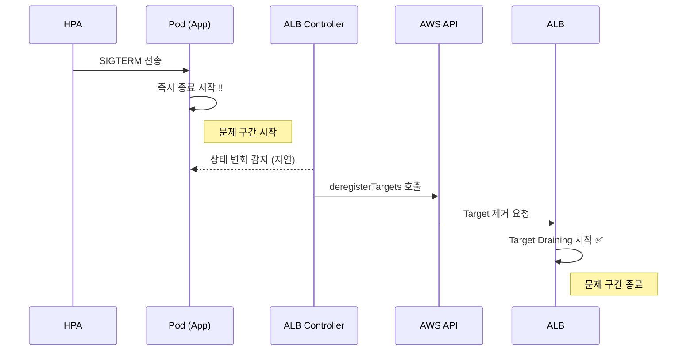
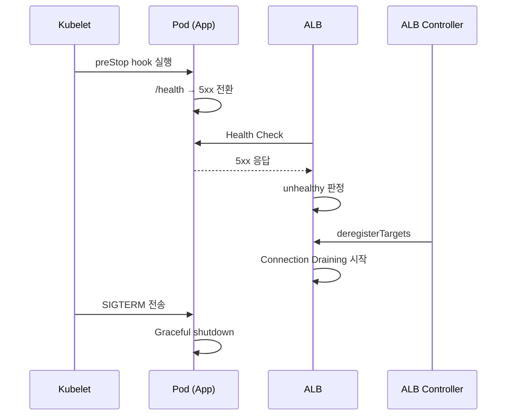
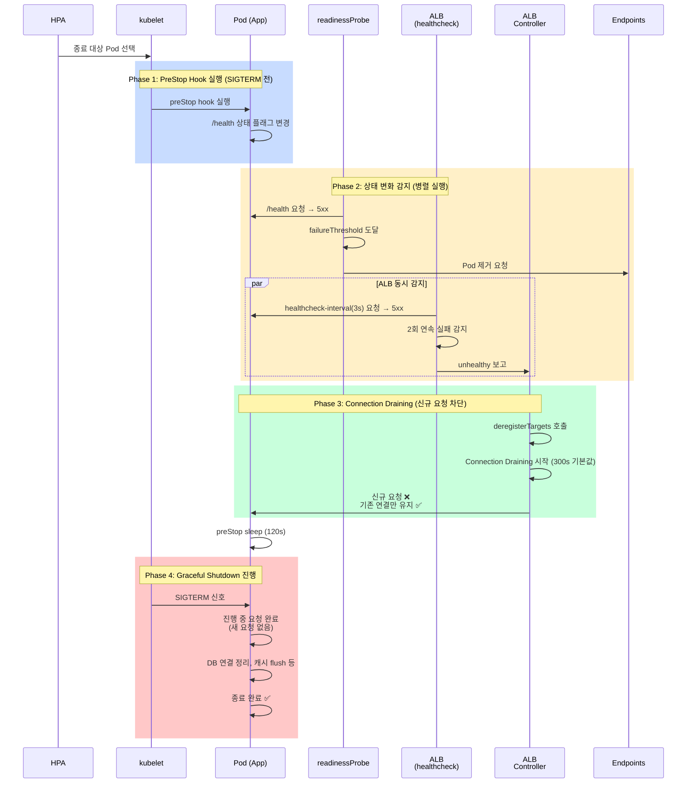

> *CloudNet 팀의 [2026년 AWS EKS Workshop Study 4기](https://gasidaseo.notion.site/26-AWS-EKS-Hands-on-Study-4-31a50aec5edf804b8294d8d512c43370) 5주차 과제 작성내용입니다.*


## 1. EKS ELB 스케일 다운 시 트래픽 손실 문제와 해결

!!! info "AWS 공식 블로그 글 [How to rapidly scale your application with ALB on EKS (without losing traffic)](https://aws.amazon.com/ko/blogs/containers/how-to-rapidly-scale-your-application-with-alb-on-eks-without-losing-traffic/)의 내용을 정리하였습니다."

### 1.1. K8s Probe와 ALB Health Check의 독립성

K8s Probe와 ALB Health Check는 서로의 결과를 공유하지 않고 완전히 독립적으로 동작합니다. 

- **K8s Probe**: kubelet이 노드 내부에서 Pod으로 직접 요청 (localhost)
- **ALB Health Check**: AWS 인프라의 외부 스펙에서 Pod IP로 요청 (네트워크 레벨)

**4가지 Health Check 메커니즘 비교표** (출처: [Link](https://devfloor9.github.io/engineering-playbook/slides/eks-debugging/))

| 구분 | K8s Probe | ALB Health Check | NLB Health Check | Ingress-NGINX |
| :--- | :--- | :--- | :--- | :--- |
| **실행 주체** | kubelet | AWS ALB | AWS NLB | nginx process |
| **체크 위치** | 노드 내부 → Pod | 외부 → Pod IP | 외부 → Pod IP | L7 프록시 내부 |
| **실패 시 동작** | Endpoints 제거 | TG deregister | TG deregister | upstream 제거+재시도 |
| **체크 방식** | HTTP/TCP/exec | HTTP(S) | TCP or HTTP | 실제 트래픽 결과 |
| **설정 위치** | Pod spec | Service/Ingress | Service annotation | Ingress annotation |

AWS ALB는 기본 설정으로 15초 간격으로 헬스체크를 수행하며, 2~3회 연속 실패 시 Target을 unhealthy로 판정합니다. 이후 **연결 draining** (기본 300초)을 시작하여 진행 중인 요청을 마친 후 Target을 제거(deregister)합니다.

그러나 K8s가 Pod를 종료할 때는 이러한 ALB의 draining 과정을 기다리지 않습니다. 따라서 **Health Check 불일치**로 인해 아래와 같은 4가지 전형적인 장애 패턴이 발생합니다: 

| 에러 코드 | 원인 | 발생 상황 |
| :--- | :--- | :--- |
| **503 Service Unavailable** | Probe는 성공이나 ALB HC는 실패 | 경로 불일치, Security Group 차단 등 |
| **502 Bad Gateway** | Graceful Shutdown 타이밍 불일치 | 종료 중인(SIGTERM) Pod에 트래픽 전송 |
| **일시적 503** | Rolling Update 중 새 Pod 미준비 | ALB HC 통과 전 트래픽 수신 |
| **504 Timeout** | Ingress/ALB timeout과 백엔드 불일치 | 파일 업로드, 대용량 배치 API 처리 시 Timeout 발생 |

표 출처: [Link](https://devfloor9.github.io/engineering-playbook/slides/eks-debugging/)

### 1.2. Scale-In Flow (문제 시나리오)

EKS에서 HPA는 아래 순서로 Pod를 Scale-In 합니다.



**문제 분석:**

HPA에 의해 스케일 다운이 결정되면, kubelet은 **즉시** SIGTERM 신호를 Pod에 전송합니다. 하지만 이 시점에서 ALB는 아직 이 Pod가 종료될 것임을 모릅니다. 

ALB Controller가 Pod의 상태 변화를 감지하고 Target Group에서 deregister하는 데는 **수 초에서 수십 초의 지연**이 발생합니다. 이 지연 구간 동안 ALB는 이미 종료된 Pod로 트래픽을 계속 전달하며, 이 요청들은 502 Bad Gateway 또는 504 Timeout 에러로 응답됩니다.

**근본 원인:**

- ALB와 K8s 간 상태 동기화 메커니즘 부재
- ALB의 기본 헬스체크 간격(15초)이 너무 길어서 Pod 종료 신호를 빠르게 감지하지 못함
- Pod가 graceful shutdown 처리를 시작하기도 전에 ALB 요청을 받음

### 1.3. 해결 방법

AWS 블로그에서는 아래 세 가지 방법을 제시합니다.

1. 전용 헬스체크 엔드포인트 — Pod 종료 신호 시 ALB에 전달
2. ALB Health Check Interval 조정 — 상태 변화를 빠르게 감지
3. PreStop hook + Readiness Probe 연동 — SIGTERM 전에 ALB deregister 완료 대기

#### 1.3.1. 상태확인 전용 엔드포인트 설정

비즈니스 로직과 분리된 상태확인 전용 엔드포인트(`/health`)를 만들어, Pod가 종료 중일 때만 이 엔드포인트가 500를 반환하도록 구현합니다.

**동작 원리:**
1. 정상 상태: `/health` → HTTP 200 반환
2. 종료 신호 수신: `/health` → HTTP 500 반환


```python
# Python Signal 핸들러를 사용한 상태확인 기능 간단한 구현 예시
import signal
import os

shutdown_requested = False

def signal_handler(sig, frame):
    global shutdown_requested
    shutdown_requested = True  # 종료 신호 플래그 설정
    print("Shutdown signal received")

signal.signal(signal.SIGTERM, signal_handler)

def health(request):
    if shutdown_requested:
        return HttpResponse("shutting down", status=500)  # Sigterm 수신 시 ALB에 unhealthy 신호
    return HttpResponse("healthy", status=200)
```

이 방식으로 `/health`가 5xx를 반환하면, ALB는 unhealthy threshold를 넘기는 즉시 Pod를 unhealthy로 판정하고 draining을 시작합니다.

#### 1.3.2. ALB Health Check Interval 조정

ALB와 readiness probe 모두 상태확인 전용 엔드포인트를 바라보도록 설정하고, ALB가 Pod의 상태 변화를 빠르게 감지할 수 있도록 헬스체크 간격을 기본값 15초에서 3초로 조정합니다. 

```yaml
# Kubernetes Ingress spec 예시
kind: Ingress
metadata:
  name: order-api-ingress
  annotations:
    kubernetes.io/ingress.class: alb
    alb.ingress.kubernetes.io/healthcheck-path: /health        # 비즈니스 경로와 분리
    alb.ingress.kubernetes.io/success-codes: '200-301'
    alb.ingress.kubernetes.io/healthcheck-interval-seconds: '3' # 기본 15초 → 3초 단축
    alb.ingress.kubernetes.io/healthy-threshold-count: '2'      # unhealthy 2회 감지 시 deregister
    alb.ingress.kubernetes.io/unhealthy-threshold-count: '2'    
```

**왜 간격을 3초로 설정하나?** 

- 기본 15초는 Pod 종료 시 최대 15초까지 대기
- 3초로 설정하면 Pod 종료 신호 후 3-6초 내 ALB가 unhealthy를 감지
- readinessProbe의 주기(아래 1.3.3)와 동일하게 맞춰야 함

#### 1.3.3. PreStop hook + Readiness Probe 설정

PreStop hook은 **SIGTERM 신호 전에** kubelet이 실행합니다. 이를 이용해 ALB에게 먼저 상태를 알린 후, SIGTERM 처리를 진행합니다.

```yaml
# Kubernetes deployment spec 예시
spec:
  terminationGracePeriodSeconds: 150  # preStop(120초) 완료 대기 시간 설정
  containers:
    - name: order-api
      lifecycle:
        preStop:
          exec:
            command:
              - "/bin/sh"
              - "-c"
              # Step 1: 헬스체크 상태 변조 → /health가 5xx 반환
              # Step 2: ALB가 unhealthy 감지하고 draining 시작할 때까지 대기 (120초)
              - "sed -i 's/healthy/unhealthy/g' /usr/src/app/health.py && sleep 120"

      readinessProbe:
        httpGet:
          path: /health # ALB와 동일한 상태확인 엔드포인트 사용‼️
          port: 8080
        initialDelaySeconds: 3
        periodSeconds: 3        # ALB healthcheck-interval(3초)와 동일
        successThreshold: 1
        failureThreshold: 1     # 1회 실패 시 즉시 Endpoints에서 제거
```

**흐름 설명**:




1. HPA: 스케일인 결정 → 종료할 Pod 선택
2. kubelet: **PreStop hook 실행** (SIGTERM 전!)
      - `/health` 파일 변조 → 다음 요청부터 5xx 반환
3. ALB: 3초 간격 헬스체크에서 5xx 감지 → 즉시 unhealthy 판정
4. ALB Controller: Target deregister 시작 (Connection Draining 300초 기본값)
      - 진행 중인 연결만 유지, 신규 요청은 차단
5. 120초 후: kubelet이 SIGTERM 전송
      - 이 시점엔 ALB가 이미 새 요청을 받지 않음
6. Pod: 진행 중이던 요청만 처리 후 graceful shutdown

!!! tip "PreStop 순서"
kubelet의 Pod 종료 순서는:

1. **PreStop hook 실행** (있으면)
2. **SIGTERM 신호 전송**
3. terminationGracePeriodSeconds 대기
4. 강제 SIGKILL

PreStop hook에서 충분한 시간(120초)을 sleep하면, 그동안 ALB의 connection draining이 완료됩니다.

### 1.4. 개선된 Scale-In Flow

위의 3가지 모두 적용 후, Scale-In 발생 시 **Pod가 먼저 죽지 않고, ALB가 먼저 인지하고 트래픽을 차단**합니다.




<!-- ## AWS 블로그의 실제 개선 사례

AWS 공식 블로그에서 소개한 **Order API** 서비스의 개선 결과입니다. 이 서비스는 초당 수백 개의 트래픽을 받는 상황에서 HPA에 의한 스케일 다운 시 502/504 에러가 빈번하게 발생하고 있었습니다.

### 적용 전후 비교

| 항목 | 적용 전 | 적용 후 | 개선 효과 |
| :--- | :--- | :--- | :--- |
| **504 Timeout 에러** | 평균 340건/스케일링 | 0건 | **100% 제거** |
| **502 Bad Gateway 에러** | 평균 200건/스케일링 | 30건 (kubelet 감지) | **85% 감소** |
| **ALB deregister 타이밍** | 앱 종료 **후** (늦음) | 앱 종료 **전** (미리) | ✅ 동기화 |
| **헬스체크 간격** | 15초 (기본값) | 3초 (5배 단축) | ✅ 빠른 감지 |

!!! success "결과 해석"
- **504 에러 완전 제거**: ALB가 살아있지 않은 Pod에 요청을 보내는 상황이 없어짐
- **502 30건 (kubelet 감지)**: 이는 kubelet의 readinessProbe 감지로 인한 것으로, 사용자에게 보이지 않는 내부 로그
- **실제 사용자 영향**: 거의 없음 (대부분의 요청이 정상 처리됨) -->

### 1.5. 주의사항

#### 1.5.1. terminationGracePeriodSeconds

PreStop hook의 sleep 시간이 `terminationGracePeriodSeconds`보다 길면, kubelet이 SIGKILL로 Pod를 강제 종료합니다.
ALB가 대상을 제외하기 전에 Pod가 먼저 죽으면 5xx 에러가 다시 발생하게 되므로 `terminationGracePeriodSeconds` 값을 반드시 확인해야 합니다.

```yaml
spec:
  terminationGracePeriodSeconds: 150  # preStop(120초) + 여유(30초)
  containers:
    - name: order-api
      lifecycle:
        preStop:
          exec:
            command: ["/bin/sh", "-c", "sed -i 's/healthy/unhealthy/g' /app/health.py && sleep 120"]
```

#### 1.5.2. 헬스체크 interval과 readinessProbe 주기 동기화

ALB와 kubelet이 동시에 상태를 감지하도록 주기를 맞춰야 합니다.

| 컴포넌트 | 설정값 | 설명 |
| :--- | :--- | :--- |
| ALB healthcheck-interval | 3초 | `alb.ingress.kubernetes.io/healthcheck-interval-seconds: '3'` |
| kubelet readiness probe | 3초 | `periodSeconds: 3` |
| 목표 | 동일 | 둘 다 동시에 상태 감지 |

간격이 크면 deregister가 늦어지고, 그 동안 Pod 종료 상황을 ALB가 놓칠 수 있습니다.

<!-- ### 3. 알려진 이슈들

**Issue: ALB가 여전히 502/504를 반환한다**
- Cause: `/health` 엔드포인트가 비즈니스 로직과 섞여있음
- Fix: 별도의 경로(`/health`)로 분리, 파일 변조 대신 메모리 플래그 사용 고려

**Issue: Pod가 150초까지 기다리는데도 요청이 온다**
- Cause: Security Group이 ALB 요청을 차단하거나, healthcheck-path가 잘못됨
- Fix: ALB → Pod 통신 확인, Ingress annotation 재확인

**Issue: 여전히 높은 에러율**
- Cause: readiness probe의 `failureThreshold` 값이 크거나, ALB timeout이 작음
- Fix: `failureThreshold: 1`, ALB timeout 120초 이상 설정 -->

### 1.6. 요약

| 구성 요소 | 역할 | 설정값 |
| :--- | :--- | :--- |
| **전용 /health 엔드포인트** | Pod 종료 의사를 ALB에 전달 | 종료 시 5xx 반환 |
| **preStop hook** | SIGTERM 전에 /health → 5xx 전환 + ALB deregister 대기 | `sleep 120` |
| **readinessProbe** | kubelet도 동시에 상태 감지, Endpoints에서 제거 | `path: /health, periodSeconds: 3` |
| **healthcheck-interval** | ALB가 상태 변화를 빠르게 감지 (기본 15초 → 3초) | `3` |
| **terminationGracePeriodSeconds** | preStop sleep보다 크게 설정하여 강제 kill 방지 | `150` |
| **Ingress annotation** | ALB가 비즈니스 경로 대신 /health만 체크 | `alb.ingress.kubernetes.io/healthcheck-path: /health` |

### 1.7. ALB 트래픽 손실 방지 체크리스트

#### 1.7.1. 애플리케이션 코드
- [ ] `/health` 엔드포인트 구현 (비즈니스 로직과 분리)
- [ ] SIGTERM/SIGINT 핸들러에서 shutdown flag 설정 → `/health` 반환값 변경
- [ ] graceful shutdown 로직 구현 (pending request 처리, DB 연결 정리 등)

#### 1.7.2. Pod Spec (Deployment/StatefulSet)
- [ ] `terminationGracePeriodSeconds: 150` 설정 (preStop 120s보다 여유있게 설정)
- [ ] `preStop` hook: `sleep 120`
- [ ] `readinessProbe`: path=/health(ALB 헬스체크 경로와 일치), periodSeconds=3

#### 1.7.3. Ingress 사용 시 Annotation 설정
- [ ] `alb.ingress.kubernetes.io/healthcheck-path: /health`(상태확인 엔드포인트 사용)
- [ ] `alb.ingress.kubernetes.io/healthcheck-interval-seconds: '3'`

<!-- ### Security & Network
- [ ] ALB → Pod 보안 그룹 규칙 확인 (healthcheck 포트 열려있음)
- [ ] Target Group 설정: "Connection Draining" 활성화 및 시간 설정 (기본 300s)
- [ ] Ingress 주석: `alb.ingress.kubernetes.io/deregistration-delay.timeout-seconds: '300'`

### 모니터링 & 검증
- [ ] 스케일 다운 전후 로그에서 502/504 에러 추적
- [ ] ALB Target Group 상태 변화 모니터링 (draining 구간 확인)
- [ ] readinessProbe 실패 이벤트 확인
- [ ] 실제 트래픽 스트레스 테스트 후 배포 -->


## 참고 자료

### 스터디 자료
- [Engineering Playbook - EKS Debugging](https://devfloor9.github.io/engineering-playbook/slides/eks-debugging/)

### AWS 공식 문서
- [AWS 블로그: How to rapidly scale your application with ALB on EKS without losing traffic](https://aws.amazon.com/ko/blogs/containers/how-to-rapidly-scale-your-application-with-alb-on-eks-without-losing-traffic/)
  - 504/502 에러 완전 제거 및 감소 결과 포함 Order API 예제
- [AWS Load Balancer Controller - Health Check Annotations](https://kubernetes-sigs.github.io/aws-load-balancer-controller/latest/guide/ingress/annotations/#healthcheck)
  - 모든 healthcheck 관련 annotation 상세 설명
- [AWS Load Balancer Controller - Target Group Attributes](https://kubernetes-sigs.github.io/aws-load-balancer-controller/latest/guide/ingress/annotations/#target-group-attributes)
  - deregistration-delay, stickiness 등 TG 설정
- [aws-samples/app-health-with-aws-load-balancer-controller](https://github.com/aws-samples/app-health-with-aws-load-balancer-controller)
  - Python, Node.js 등 다양한 언어의 graceful shutdown 구현 예제


<!-- ## EKS ALB Target Group 등록 지연 사례

`readinessGate`


`initialDelaySeconds`

`slow_start` 및 `deregistration_delay` 

스케일 다운 이벤트마다 
배포 후 ALB가 신규 Pod를 헬스 체크 실패로 판정하여 HTTP 502를 반환하였다. -->


<!-- ### 1. Python/Flask 예제
```python
from flask import Flask, Response
import signal
import threading
import time

app = Flask(__name__)
shutdown_event = threading.Event()

def signal_handler(sig, frame):
    print("SIGTERM received, starting graceful shutdown...")
    shutdown_event.set()

signal.signal(signal.SIGTERM, signal_handler)

@app.route('/health')
def health():
    # Pod 종료 중이면 503 반환 (ALB가 즉시 unhealthy 판정)
    if shutdown_event.is_set():
        return Response("shutting down", status=503)
    return Response("healthy", status=200)

@app.route('/api/order', methods=['POST'])
def create_order():
    if shutdown_event.is_set():
        # readinessProbe에서 이미 traffic이 안 오겠지만, 혹시 모르니 체크
        return Response("service unavailable", status=503)
    # 실제 비즈니스 로직
    return {"order_id": "123"}, 201

if __name__ == '__main__':
    app.run(port=8080, threaded=True)
```

### 2. Deployment 완전한 구성
```yaml
apiVersion: apps/v1
kind: Deployment
metadata:
  name: order-api
spec:
  replicas: 3
  selector:
    matchLabels:
      app: order-api
  template:
    metadata:
      labels:
        app: order-api
    spec:
      # ✅ 1. Graceful shutdown 대기 시간
      terminationGracePeriodSeconds: 150
      
      containers:
      - name: order-api
        image: order-api:v1.0
        ports:
        - containerPort: 8080
        
        # ✅ 2. PreStop hook: Pod 종료 신호를 ALB에 먼저 전달
        lifecycle:
          preStop:
            exec:
              command:
              - "/bin/sh"
              - "-c"
              - |
                kill -TERM 1  # 앱의 PID 1에 SIGTERM 미리 전송 (선택사항)
                sleep 120     # ALB draining 완료 대기
        
        # ✅ 3. Readiness Probe: ALB와 동일한 설정
        readinessProbe:
          httpGet:
            path: /health
            port: 8080
          initialDelaySeconds: 3
          periodSeconds: 3            # ALB interval과 동일 ⭐
          timeoutSeconds: 2
          successThreshold: 1
          failureThreshold: 1         # 1회 실패 즉시 제거 ⭐
        
        # ✅ 4. Liveness Probe (선택): /health와 분리
        livenessProbe:
          httpGet:
            path: /live
            port: 8080
          initialDelaySeconds: 10
          periodSeconds: 10
          failureThreshold: 3
        
        resources:
          requests:
            cpu: 100m
            memory: 128Mi
          limits:
            cpu: 500m
            memory: 512Mi

---
apiVersion: v1
kind: Service
metadata:
  name: order-api
spec:
  type: NodePort
  selector:
    app: order-api
  ports:
  - port: 80
    targetPort: 8080

---
apiVersion: networking.k8s.io/v1
kind: Ingress
metadata:
  name: order-api-ingress
  annotations:
    kubernetes.io/ingress.class: alb
    alb.ingress.kubernetes.io/scheme: internet-facing
    alb.ingress.kubernetes.io/target-type: ip
    
    # ✅ Healthcheck 설정
    alb.ingress.kubernetes.io/healthcheck-path: /health
    alb.ingress.kubernetes.io/healthcheck-interval-seconds: '3'    # ⭐ 기본 15s → 3s
    alb.ingress.kubernetes.io/healthcheck-timeout-seconds: '2'
    alb.ingress.kubernetes.io/healthy-threshold-count: '2'
    alb.ingress.kubernetes.io/unhealthy-threshold-count: '2'
    alb.ingress.kubernetes.io/success-codes: '200'
    
    # ✅ Connection Draining 설정
    alb.ingress.kubernetes.io/deregistration-delay.timeout-seconds: '300'
    alb.ingress.kubernetes.io/deregistration-delay.connection-termination.enabled: 'true'
    
spec:
  rules:
  - host: order-api.example.com
    http:
      paths:
      - path: /
        pathType: Prefix
        backend:
          service:
            name: order-api
            port:
              number: 80
```

### 3. 배포 후 검증
```bash
# 1. Healthcheck 정상 응답 확인
kubectl port-forward svc/order-api 8080:80
curl http://localhost:8080/health  # HTTP 200

# 2. Pod 종료 시 상태 확인
kubectl delete pod order-api-xxxxx

# 3. 로그 확인
kubectl logs -f deployment/order-api

# 4. ALB Target Group 상태
aws elbv2 describe-target-health \
  --target-group-arn arn:aws:elasticloadbalancing:...

# 5. CloudWatch 메트릭 모니터링
# - HTTPCode_Target_5XX_Count
# - HTTPCode_Target_4XX_Count
# - TargetResponseTime
```

### 4. 트러블슈팅

**Pod가 150초 넘게 기다린다:**
- Security Group에서 ALB → Pod 통신 차단 확인
- healthcheck-path가 실제 구현된 경로와 일치하는지 확인
- readiness probe의 `initialDelaySeconds` 값 재확인

**여전히 502/503이 나온다:**
- `/health` 엔드포인트가 비즈니스 로직과 섞여있는지 확인
- 파일 변조 대신 메모리 플래그 사용 고려 (더 빠름)
- ALB timeout이 충분한지 확인 (`healthcheck-timeout-seconds`)

**readiness probe 재시작이 반복된다:**
- Pod가 실제로 unhealthy 상태인지 확인 (비즈니스 로직 버그)
- liveness probe와 readiness probe의 엔드포인트를 분리했는지 확인
- `failureThreshold` 값 증가 고려 (테스트 용도만) -->