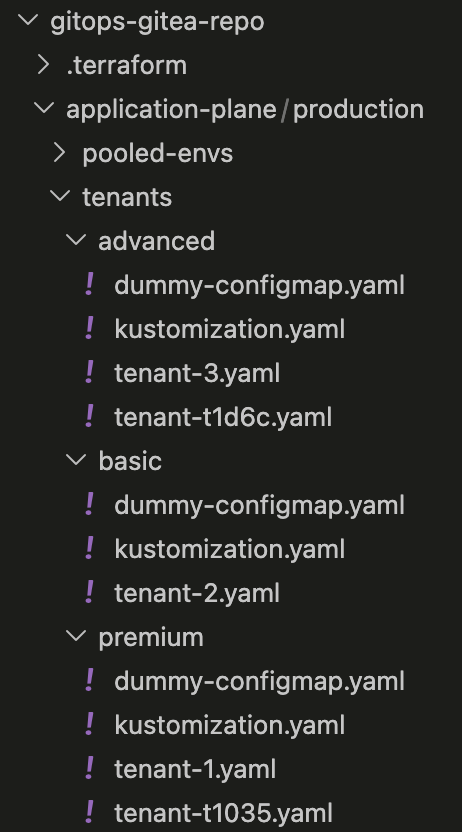
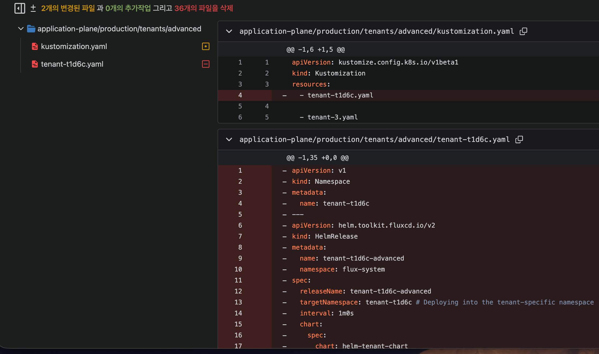

> *CloudNet 팀의 [2026년 AWS EKS Workshop Study 4기](https://gasidaseo.notion.site/26-AWS-EKS-Hands-on-Study-4-31a50aec5edf804b8294d8d512c43370) 6주차 학습 내용을 담고 있습니다.*
> *[AWS Workshop: Building SaaS Applications on Amazon EKS using GitOps](https://catalog.workshops.aws/eks-saas-gitops/en-US) 워크샵을 정리하였습니다.*

---


**워크샵 주제: EKS 기반의 멀티테넌트 SaaS를 GitOps 방식으로 프로비저닝/운영**

## SaaS 운영

### SaaS와 멀티테넌트

SaaS에서 테넌트는 서비스를 구독하는 개인, 조직 등의 고객 단위입니다. Gmail을 예로 들면, 수억 명의 사용자가 동일한 인프라를 공유하지만 내 메일함이 다른 사람에게 노출되지 않습니다. 이처럼 테넌트는 인프라를 공유하더라도 데이터와 접근이 격리되어야 합니다.

이 워크샵에서는 Namespace 기반으로 테넌트를 격리하되, AWS 리소스는 티어에 따라 공유(Basic) 또는 전용(Premium)으로 나누는 Hybrid 구조를 기반으로 실습을 진행합니다.

### SaaS 멀티테넌트 격리 모델

- **1. Silo**: 테넌트마다 전용 인프라를 사용하여 격리수준이 높음
- **2. Pool**: 테넌트가 인프라를 공유하며 논리적으로 테넌트 분리
- **3. Hybrid**:  Silo와 Pool을 조합하여 비용과 격리 수준을 티어별로 균형 있게 적용

### EKS 기반의 SaaS 운영 시 GitOps가 필요한 이유

SaaS 애플리케이션을 EKS에서 운영 시에는 테넌트가 늘어날 수록 다음의 문제가 커집니다.

- 신규 고객 온보딩마다 인프라 직접 프로비저닝 시 테넌트가 늘어날 수록 인프라팀의 수작업 증가
- Basic/Premium 티어별 인프라 구성 차이를 코드로 표현 시 Kubernetes 리소스와 AWS 인프라 양쪽에 일관 적용을 위한 조율 복잡도 증가
- 콘솔에서 IAM Policy 등 직접 수정 시 코드와 실제 인프라 상태 간 Drift 감지 체계 부재

이 워크샵에서는 Flux v2, Terraform&Tofu Controller, Helm, Argo Workflows 조합하여 이 문제들을 해결합니다.

### Platform Engineering 관점

위 세 가지 문제의 본질은 인프라팀이 모든 테넌트 요청을 수작업으로 처리하는 구조에 있습니다.

Platform Engineering은 이 반복 작업을 자동화하고, 개발팀이 플랫폼을 통해 셀프서비스로 인프라를 프로비저닝할 수 있는 Internal Developer Platform(IDP) 구축을 목표로 합니다. 인프라팀은 더 이상 개별 요청을 처리하는 대신, 테넌트가 안전하게 셀프서비스할 수 있는 플랫폼 자체를 만드는 역할로 전환됩니다.

GitOps는 이 IDP의 핵심 메커니즘입니다. Git을 Single Source of Truth로 삼아 인프라를 선언적으로 관리하면, 온보딩 자동화·티어별 구성 일관성·Drift 감지 문제를 한꺼번에 다룰 수 있습니다.

## GitOps

### GitOps 핵심 원칙 4가지

OpenGitOps 프로젝트에서 정의한 GitOps의 핵심 원칙 4가지가 있습니다.

출처: https://opengitops.dev/

| 원칙 | 설명 | 예시 |
|---|---|---|
| Declarative | GitOps로 관리하는 시스템은 선언적으로 표현된 Desired State를 가진다. | `kubectl apply`과 같은 명령어가 아닌  최종 인프라의 프로비저닝 결과를 구성 파일(`yaml`)로 관리  |
| Versioned & Immutable | Desired state는 불변성, 버전 관리 및 기록 유지를 보장하는 방식으로 저장된다. | 선언적 설정은 버전 관리 시스템에 저장되며 문제 시 `git revert`와 같은 방법으로 Rollback이 용이함 |
| Pulled Automatically | Git에 저장된 Desired State는 자동으로 시스템에 반영된다. | 클러스터 안의 컨트롤러가 Git Repository 내용을 주기적으로 확인 |
| Continuously Reconciled | 시스템의 상태를 지속적으로 관찰하여 선언된 Desired State와 Actual State가 일치하도록 유지한다  | `kubectl delete`로 Pod를 지워도 컨트롤러가 삭제된 리소스를 자동 복구 |

### Hands-on 구조

```text
┌─────────────────────────────────────────────────────────────┐
│                        Gitea (Git)                          │
│  application-plane/  clusters/  control-plane/              │
│  helm-charts/  infrastructure/  terraform/                  │
└────────────────────────┬────────────────────────────────────┘
                         │ (pull, 주기적 감지)
┌────────────────────────▼────────────────────────────────────┐
│                   Flux v2 Controllers                        │
│                                                              │
│  Source Controller      Helm Controller                      │
│  (Git 감지)      ──▶   (HelmRelease 처리)                   │
│                                                              │
│  Kustomization Controller                                    │
│  (Kustomize 적용)                                            │
│                                                              │
│  Tofu Controller                                             │
│  (Terraform CRD 처리 → tf-runner Pod 실행)                  │
└────────────────┬────────────────────────────────────────────┘
                 │
    ┌────────────┼─────────────┐
    ▼            ▼             ▼
  Helm       Kubernetes    AWS Resources
  Release    Resources     (SQS, DynamoDB,
  (앱배포)   (Namespace,   IAM Role, IRSA)
             SA, RBAC)
```

| 폴더 | 역할 |
| --- | --- |
| `application-plane/` | 테넌트별 HelmRelease values 파일 (tier-templates, tenants) |
| `clusters/` | Flux bootstrapping 설정 |
| `control-plane/` | Argo Workflows/Events WorkflowTemplate |
| `helm-charts/` | helm-tenant-chart 소스 (Chart + templates) |
| `infrastructure/` | Flux Source·HelmRelease 등 인프라 컴포넌트 정의 |
| `terraform/` | Terraform 모듈 (tenant-apps 등) |

### Flux vs ArgoCD

| 기준 | Flux v2 | ArgoCD |
|------|---------|--------|
| UI | 없음 (CLI/대시보드 별도) | 웹 UI 내장 |
| Helm 처리 | HelmRelease CRD | Application CRD |
| Terraform 통합 | Tofu Controller (네이티브 CRD) | 별도 도구 필요 (네이티브 CRD 없음) |
| 이미지 자동화 | Image Automation Controller 내장 | Argo Image Updater (별도) |
| 멀티테넌시 | 네임스페이스별 Kustomization | ApplicationSet |

이 실습에서는 **Tofu Controller** 사용을 위해 Flux를 선택합니다. Terraform CRD를 Kubernetes 리소스로 정의하고, Flux가 이를 감지해서 실행하는 패턴은 ArgoCD에서 동등한 수준으로 제공되지 않습니다.

> **Push 모델과 비교했을 때 Pull 모델의 이점**: CI/CD 파이프라인이 클러스터 kubeconfig를 갖지 않아도 됩니다. 클러스터 외부로 자격증명을 노출하지 않으므로 공격 표면이 줄어듭니다.

### 실습 스택 구성

| 도구 | 역할 | Hands-on 사용 예시 |
|------|------|-------------------|
| **Gitea** | Self-hosted Git 서버 | Helm chart, Terraform CRD, tenant 설정 저장소 |
| **Flux v2** | GitOps 오퍼레이터 | Git 감지 → HelmRelease, Kustomization, Terraform CRD 처리 |
| **Tofu Controller** | Terraform CRD 기반 AWS 인프라 프로비저닝 | `Terraform` CRD 감지 → tf-runner Pod → AWS 리소스 프로비저닝 |
| **Helm** | 패키지 매니저 | `helm-tenant-chart`로 테넌트 앱 + 인프라 CRD 배포 |
| **Argo Workflows** | 워크플로우 엔진 | 온보딩/오프보딩 DAG 실행 |
| **Argo Events** | 이벤트 소스 | SQS 메시지 → WorkflowTemplate 트리거 |
| **Amazon SQS** | 메시지 큐 | 온보딩/오프보딩/배포 요청의 비동기 버퍼 |
| **Amazon ECR** | 컨테이너/Helm 레지스트리 | Helm chart(OCI 형식) 및 Producer·Consumer 이미지 저장 |

**Producer-Consumer 앱 구조**: 실습에서 배포하는 샘플 앱은 두 컴포넌트로 구성됩니다.

- **Producer**: 주문 데이터를 SQS에 발행하고, DynamoDB에 기록
- **Consumer**: SQS에서 메시지를 읽어 처리

Basic 티어는 pool-1 SQS/DynamoDB를 공유하고, Premium 티어는 테넌트 전용 SQS/DynamoDB 리소스를 사용합니다.

---

## Hands-on 1: Terraform, Helm, Flux를 사용한 인프라 배포

### Fluxv2 주요 리소스

<details><summary>flux get all 명령어 실행 결과</summary>

```bash
flux get all
NAME                    REVISION                SUSPENDED       READY   MESSAGE
ocirepository/capacitor v0.4.8@sha256:1efcb443  False           True    stored artifact for digest 'v0.4.8@sha256:1efcb443'

NAME                            REVISION                        SUSPENDED       READY   MESSAGE
gitrepository/flux-system       refs/heads/main@sha1:664677a4   False           True    stored artifact for revision 'refs/heads/main@sha1:664677a4'
gitrepository/terraform-v0-0-1  v0.0.1@sha1:2d19a84a            False           True    stored artifact for revision 'v0.0.1@sha1:2d19a84a'

NAME                                    REVISION        SUSPENDED       READY   MESSAGE
helmrepository/argo                     sha256:77d58f2f False           True    stored artifact: revision 'sha256:77d58f2f'
helmrepository/eks-charts               sha256:d5d7cd31 False           True    stored artifact: revision 'sha256:d5d7cd31'
helmrepository/helm-application-chart                   False           True    Helm repository is Ready
helmrepository/helm-tenant-chart                        False           True    Helm repository is Ready
helmrepository/karpenter                                False           True    Helm repository is Ready
helmrepository/kubecost                                 False           True    Helm repository is Ready
helmrepository/metrics-server           sha256:ba69c5bb False           True    stored artifact: revision 'sha256:ba69c5bb'
helmrepository/tf-controller            sha256:1fcad0f6 False           True    stored artifact: revision 'sha256:1fcad0f6'

NAME                                                    REVISION        SUSPENDED       READY   MESSAGE
helmchart/flux-system-argo-events                       2.4.3           False           True    pulled 'argo-events' chart with version '2.4.3'
helmchart/flux-system-argo-workflows                    0.40.11         False           True    pulled 'argo-workflows' chart with version '0.40.11'
helmchart/flux-system-aws-load-balancer-controller      1.6.2           False           True    pulled 'aws-load-balancer-controller' chart with version '1.6.2'
helmchart/flux-system-karpenter                         1.4.0           False           True    pulled 'karpenter' chart with version '1.4.0'
helmchart/flux-system-kubecost                          2.1.0           False           True    pulled 'cost-analyzer' chart with version '2.1.0'
helmchart/flux-system-metrics-server                    3.11.0          False           True    pulled 'metrics-server' chart with version '3.11.0'
helmchart/flux-system-onboarding-service                0.0.1           False           True    pulled 'application-chart' chart with version '0.0.1'
helmchart/flux-system-pool-1                            0.0.1           False           True    pulled 'helm-tenant-chart' chart with version '0.0.1'
helmchart/flux-system-tenant-1-premium                  0.0.1           False           True    pulled 'helm-tenant-chart' chart with version '0.0.1'
helmchart/flux-system-tenant-2-basic                    0.0.1           False           True    pulled 'helm-tenant-chart' chart with version '0.0.1'
helmchart/flux-system-tenant-3-advanced                 0.0.1           False           True    pulled 'helm-tenant-chart' chart with version '0.0.1'
helmchart/flux-system-tenant-t1035-premium              0.0.1           False           True    pulled 'helm-tenant-chart' chart with version '0.0.1'
helmchart/flux-system-tf-controller                     0.16.0-rc.4     False           True    pulled 'tf-controller' chart with version '0.16.0-rc.4'

NAME                                            LAST SCAN               SUSPENDED       READY   MESSAGE
imagerepository/consumer-image-repository       2026-04-26T20:19:19Z    False           True    successful scan: found 2 tags with checksum 1929316067
imagerepository/payments-image-repository       2026-04-26T20:19:19Z    False           True    successful scan: found 2 tags with checksum 1929840356
imagerepository/producer-image-repository       2026-04-26T20:19:19Z    False           True    successful scan: found 2 tags with checksum 1930102500

NAME                                    IMAGE                                                   TAG                     READY       MESSAGE
imagepolicy/consumer-image-policy       064652267322.dkr.ecr.us-west-2.amazonaws.com/consumer   prd-20260424T052326Z    True        Latest image tag for 064652267322.dkr.ecr.us-west-2.amazonaws.com/consumer resolved to prd-20260424T052326Z
imagepolicy/payments-image-policy       064652267322.dkr.ecr.us-west-2.amazonaws.com/payments   prd-20260424T052309Z    True        Latest image tag for 064652267322.dkr.ecr.us-west-2.amazonaws.com/payments resolved to prd-20260424T052309Z
imagepolicy/producer-image-policy       064652267322.dkr.ecr.us-west-2.amazonaws.com/producer   prd-20260424T052345Z    True        Latest image tag for 064652267322.dkr.ecr.us-west-2.amazonaws.com/producer resolved to prd-20260424T052345Z

NAME                                                            LAST RUN                SUSPENDED       READY   MESSAGE
imageupdateautomation/consumer-update-automation-pooled-envs    2026-04-26T20:16:14Z    False           True    repository up-to-date
imageupdateautomation/consumer-update-automation-tenants        2026-04-26T20:18:01Z    False           True    repository up-to-date
imageupdateautomation/payments-update-automation-pooled-envs    2026-04-26T20:16:14Z    False           True    repository up-to-date
imageupdateautomation/payments-update-automation-tenants        2026-04-26T20:18:00Z    False           True    repository up-to-date
imageupdateautomation/producer-update-automation-pooled-envs    2026-04-26T20:17:59Z    False           True    repository up-to-date
imageupdateautomation/producer-update-automation-tenants        2026-04-26T20:18:01Z    False           True    repository up-to-date

NAME                                            REVISION        SUSPENDED       READY   MESSAGE
helmrelease/argo-events                         2.4.3           False           True    Helm install succeeded for release argo-events/argo-events.v1 with chart argo-events@2.4.3
helmrelease/argo-workflows                      0.40.11         False           True    Helm install succeeded for release argo-workflows/argo-workflows.v1 with chart argo-workflows@0.40.11
helmrelease/aws-load-balancer-controller        1.6.2           False           True    Helm install succeeded for release aws-system/aws-load-balancer-controller.v1 with chart aws-load-balancer-controller@1.6.2
helmrelease/karpenter                           1.4.0           False           True    Helm install succeeded for release karpenter/karpenter.v1 with chart karpenter@1.4.0
helmrelease/kubecost                            2.1.0           False           True    Helm install succeeded for release kubecost/kubecost.v1 with chart cost-analyzer@2.1.0
helmrelease/metrics-server                      3.11.0          False           True    Helm install succeeded for release kube-system/metrics-server.v1 with chart metrics-server@3.11.0
helmrelease/onboarding-service                  0.0.1           False           True    Helm install succeeded for release onboarding-service/onboarding-service.v1 with chart application-chart@0.0.1
helmrelease/pool-1                              0.0.1           False           True    Helm upgrade succeeded for release pool-1/pool-1.v2 with chart helm-tenant-chart@0.0.1
helmrelease/tenant-1-premium                    0.0.1           False           True    Helm upgrade succeeded for release tenant-1/tenant-1-premium.v2 with chart helm-tenant-chart@0.0.1
helmrelease/tenant-2-basic                      0.0.1           False           True    Helm install succeeded for release pool-1/tenant-2-basic.v1 with chart helm-tenant-chart@0.0.1
helmrelease/tenant-3-advanced                   0.0.1           False           True    Helm upgrade succeeded for release tenant-3/tenant-3-advanced.v2 with chart helm-tenant-chart@0.0.1
helmrelease/tenant-t1035-premium                0.0.1           False           True    Helm install succeeded for release tenant-t1035/tenant-t1035-premium.v1 with chart helm-tenant-chart@0.0.1
helmrelease/tf-controller                       0.16.0-rc.4     False           True    Helm install succeeded for release flux-system/tf-controller.v1 with chart tf-controller@0.16.0-rc.4

NAME                                    REVISION                        SUSPENDED       READY   MESSAGE
kustomization/capacitor                 v0.4.8@sha256:1efcb443          False           True    Applied revision: v0.4.8@sha256:1efcb443
kustomization/controlplane              refs/heads/main@sha1:664677a4   False           True    Applied revision: refs/heads/main@sha1:664677a4
kustomization/dataplane-pooled-envs     refs/heads/main@sha1:664677a4   False           True    Applied revision: refs/heads/main@sha1:664677a4
kustomization/dataplane-tenants         refs/heads/main@sha1:664677a4   False           True    Applied revision: refs/heads/main@sha1:664677a4
kustomization/dependencies              refs/heads/main@sha1:664677a4   False           True    Applied revision: refs/heads/main@sha1:664677a4
kustomization/flux-system               refs/heads/main@sha1:664677a4   False           True    Applied revision: refs/heads/main@sha1:664677a4
kustomization/infrastructure            refs/heads/main@sha1:664677a4   False           True    Applied revision: refs/heads/main@sha1:664677a4
kustomization/sources                   refs/heads/main@sha1:664677a4   False           True    Applied revision: refs/heads/main@sha1:664677a4
```

</details>

| CRD | 역할 | 설명 |
|-----|------|------|
| `gitrepository` | Git 저장소 연결 정의 | Git repo를 주기적으로 확인 |
| `helmrepository` | Helm chart 저장소 연결 | 이 OCI/HTTP repo에서 chart 가져오기 |
| `helmchart` | HelmChart 오브젝트 관리 | Helm chart 버전 추적 |
| `helmrelease` | Helm chart 배포 선언 | `helm install`의 선언적 버전 |
| `kustomization` | Kustomize 적용 선언 | 이 경로의 YAML을 apply |

Flux의 모든 리소스가 `READY`상태인 것을 확인하면, Flux가 Gitea 저장소를 모니터링 하도록 접근 권한을 설정하고 등록합니다.

<!-- # Flux가 Gitea 저장소를 감지하도록 등록
flux create source git gitea-source \
  --url=http://<GITEA_URL>/saas-org/saas-repo \
  --branch=main \
  --interval=1m \
  --secret-ref=gitea-credentials -->

```bash
# flux가 모니터링하는 Gitea 저장소 확인 명령어
flux get sources git
kubectl -n flux-system get gitrepository
```

### Terraform 및 OpenTofu 컨트롤러

#### Tofu Controller가 해결하는 문제

기존 방식에서 Terraform은 CI/CD 파이프라인(GitHub Actions, Jenkins 등)에서 실행됩니다.
이 방식의 문제는:

- 파이프라인이 AWS 자격증명을 갖고 있어야 함
- tfstate 파일 관리가 파이프라인과 결합됨
- Kubernetes 리소스와 Terraform 리소스 간의 의존성 표현이 어려움

Tofu Controller는 Terraform 실행 자체를 Kubernetes CRD로 추상화합니다.

#### Tofu Controller 동작 흐름

```text
1. 사용자가 Terraform CRD YAML을 Git에 커밋
        │
        ▼
2. Flux Source Controller가 Git 변경 감지
        │
        ▼
3. Flux Kustomize Controller가 Terraform CRD를 클러스터에 apply
        │
        ▼
4. Tofu Controller가 클러스터 내 Terraform CRD 변경 감지
        │
        ▼
5. tf-runner Pod 생성 (격리된 실행 환경)
        │
        ▼
6. tf-runner가 Terraform init → plan → apply 실행
        │
        ▼
7. tfstate/tfplan을 Kubernetes Secret으로 저장
   AWS 리소스 생성 완료 (SQS, DynamoDB, IRSA, IAM Policy)
```

#### tenant-apps Terraform 모듈

테넌트 한 명을 위해 프로비저닝되는 AWS 리소스는 `tenant-apps` 모듈이 담당합니다. 모듈은 `gitops-gitea-repo/terraform/modules/tenant-apps` 경로에 위치하며, 다음 파일로 구성됩니다.

```text
tenant-apps/
├── data.tf
├── main.tf
├── outputs.tf
├── README.md
├── variables.tf
└── versions.tf
```

모듈의 핵심 변수는 `enable_producer`와 `enable_consumer`입니다. 두 변수로 어떤 AWS 리소스를 프로비저닝할지를 제어합니다. 예를 들어 `enable_producer = true`, `enable_consumer = true`로 설정하면 11개 리소스가 생성되고, `enable_producer = false`로 바꾸면 그보다 적은 수의 리소스가 계획됩니다. 이를 통해 Basic 티어(공유 Producer 사용)와 Premium 티어(전용 Producer 사용) 간 인프라 차이를 동일 모듈로 표현할 수 있습니다.

프로비저닝되는 리소스는 다음과 같습니다:

| 리소스 | 용도 |
|--------|------|
| SQS Queue (Onboarding) | 온보딩 이벤트 수신 |
| SQS Queue (Offboarding) | 오프보딩 이벤트 수신 |
| SQS Queue (Deployment) | 배포 트리거 이벤트 수신 |
| DynamoDB Table | 테넌트 데이터 저장 |
| IAM Role (IRSA) | Pod가 AWS 리소스에 접근할 ServiceAccount |
| IAM Policy | SQS/DynamoDB 접근 권한 |
| IAM Role Attachment | 정책-역할 바인딩 |
| S3 Bucket (선택) | 테넌트별 오브젝트 스토리지 |
| ECR Repository (선택) | 테넌트별 컨테이너 이미지 저장소 |
| Secrets Manager (선택) | 테넌트 시크릿 관리 |
| KMS Key (선택) | 암호화 키 |

Terraform CRD 예시:

```yaml
/helm-charts/helm-tenant-chart/templates/terraform.yaml
apiVersion: infra.contrib.fluxcd.io/v1alpha2
kind: Terraform
metadata:
  name: tenant-t1a1c
  namespace: flux-system
spec:
  interval: 5m
  approvePlan: auto
  destroyResourcesOnDeletion: true    # 주의: CRD 삭제 시 AWS 리소스도 삭제됨
  path: ./terraform/tenant-apps
  sourceRef:
    kind: GitRepository
    name: gitea-source
  vars:
    - name: tenant_id
      value: t1a1c
    - name: tier
      value: premium
  writeOutputsToSecret:
    name: tenant-t1a1c-outputs        # Helm values로 주입할 출력값
```

> **프로덕션 주의: `destroyResourcesOnDeletion: true`**: 이 플래그가 설정된 상태에서 Terraform CRD를 삭제하면 실제 AWS 리소스가 삭제됩니다. 프로덕션에서는 이 플래그를 `false`로 설정하고, 별도의 오프보딩 프로세스로 리소스를 정리하는 것을 권장합니다. 실습에서는 편의상 `true`를 사용합니다.

#### `terraform-v0-0-1` 태그 설계

Terraform 코드 자체도 버전 태그로 관리합니다. Terraform CRD의 `sourceRef`는 `GitRepository` 리소스인 `terraform-v0-0-1`을 가리키며, 이 리소스는 Gitea 저장소의 특정 태그를 추적합니다.

```bash
kubectl get GitRepository terraform-v0-0-1 -n flux-system -o yaml | grep -i spec -C10
```

```yaml
spec:
  interval: 300s
  ref:
    tag: v0.0.1
  secretRef:
    name: flux-system
  timeout: 60s
  url: http://10.35.48.115:3000/admin/eks-saas-gitops.git
```

```yaml
# infrastructure/base/sources/terraform-git-v1.yaml 파일 내용
apiVersion: source.toolkit.fluxcd.io/v1
kind: GitRepository
metadata:
  name: terraform-v0-0-1
  namespace: flux-system
spec:
  interval: 300s
  url: "http://${gitea_url}:3000/admin/eks-saas-gitops.git" # Same repository for gitops components, could be sliptted
  ref:
    tag: "v0.0.1"
  secretRef:
    name: flux-system
  ```

태그가 바뀌면 Tofu Controller가 변경을 감지해서 re-apply합니다. 이 설계의 의도는:

- 모든 테넌트가 `v0.0.1` 태그를 참조하는 동안은 동일한 Terraform 코드를 공유
- 모듈 업그레이드 시 `v0.0.2` 태그를 생성하고, 테넌트별로 점진적으로 태그를 변경
- 특정 테넌트에서 검증 후 전체 적용 가능

#### Terraform CRD 실습 및 확인

실제로 Terraform CRD를 생성하고 tf-runner Pod가 AWS 리소스를 프로비저닝하는 과정을 확인합니다. CRD 파일을 작성하고 kustomization에 등록한 뒤 Git에 푸시하면, Flux가 변경을 감지하고 Tofu Controller가 tf-runner Pod를 실행합니다.

```bash
# tf-runner Pod 기동 확인
kubectl get po -n flux-system
# example-tenant-tf-runner 가 Running 상태로 나타남

# tf-runner 로그로 init → plan → apply 과정 확인
kubectl logs po/example-tenant-tf-runner -n flux-system -f
```

apply가 완료되면 AWS 리소스가 생성됩니다. 리소스 이름에는 `tenant_id` 값이 접두사로 포함됩니다.

```bash
# DynamoDB 테이블 확인
aws dynamodb list-tables

# SQS 큐 확인
aws sqs list-queues
```

#### Terraform CRD 삭제

CRD 삭제는 Git에서 CRD 파일을 제거하고 kustomization 참조를 업데이트하는 것으로 완료됩니다. `destroyResourcesOnDeletion: true`로 설정되어 있으면, Tofu Controller가 CRD 삭제를 감지하고 tf-runner를 재기동하여 `terraform destroy`를 실행합니다. 삭제 로그는 다음 명령어로 확인합니다.

```bash
kubectl logs po/<tenant>-tf-runner -n flux-system -f
```

destroy가 완료되면 DynamoDB 테이블과 SQS 큐가 목록에서 사라집니다.

> `destroyResourcesOnDeletion: true` 상태에서 CRD를 삭제하면 실제 AWS 리소스가 즉시 삭제되므로, 프로덕션에서는 `false`로 설정하고 별도의 오프보딩 승인 프로세스를 거쳐 리소스를 정리하는 것이 좋습니다.

### 헬름 차트 구조 이해

`helm-tenant-chart`는 앱 배포와 인프라 CRD를 하나의 패키지로 묶습니다.

```text
helm-tenant-chart/
├── Chart.yaml
├── values.yaml
├── values.yaml.template        # 티어별 values 기본값 템플릿
├── .helmignore
└── templates/
    ├── deployment.yaml         # Producer/Consumer Deployment
    ├── hpa.yaml
    ├── ingress.yaml
    ├── service.yaml
    ├── serviceaccount.yaml     # IRSA용 ServiceAccount
    └── terraform.yaml          # Terraform CRD (인프라 프로비저닝)
```

`values.yaml`의 `producer.enabled` 플래그로 테넌트 전용의 Producer, Comsumer 컴포넌트 생성 여부를 결정합니다.

```yaml
# Basic 티어 (Producer 비활성화 - pool-1 공유)
producer:
  enabled: false

# Premium 티어 (Producer 활성화 - 전용)
producer:
  enabled: true
```

### Helm 차트와 Flux 통합하기

Helm chart를 ECR에 OCI 형식으로 push하고, Flux가 이를 감지해서 배포합니다.

```bash
# ECR에 Helm chart push 확인
aws ecr describe-images \
  --repository-name helm-tenant-chart \
  --region ap-northeast-2 \
  --query 'imageDetails[].imageTags'

# Flux HelmRelease 상태 확인
flux get helmreleases --all-namespaces
```

HelmRelease 예시:

```yaml
apiVersion: helm.toolkit.fluxcd.io/v2beta1
kind: HelmRelease
metadata:
  name: tenant-t1a1c
  namespace: flux-system
spec:
  interval: 5m
  chart:
    spec:
      chart: helm-tenant-chart
      version: "0.1.*"
      sourceRef:
        kind: HelmRepository
        name: ecr-helm-repo
  targetNamespace: tenant-t1a1c
  values:
    tenantId: t1a1c
    tier: premium
    producer:
      enabled: true
```

```bash
# 배포 확인
kubectl get pods -n tenant-t1a1c
kubectl get terraform -n flux-system | grep t1a1c
```

### 요약: 실습 1의 패턴

| 레이어 | 담당 도구 | Git 저장 형태 |
|--------|-----------|---------------|
| 테넌트 앱 배포 | Flux HelmRelease | HelmRelease YAML + values override |
| K8s 인프라 | Flux Kustomization | Kustomize overlay (kustomization.yaml) |
| AWS 인프라 | Tofu Controller | Terraform CRD YAML |
| 테넌트 앱 패키지 | Helm + ECR | helm-tenant-chart (Chart + values.yaml.template) |

>  앱과 인프라를 하나의 Helm chart 안에 묶어서, Git 커밋 하나가 Kubernetes 리소스와 AWS 리소스를 동시에 선언합니다.

---

## Hands-on 2: 단일 Helm Chart로 3가지 티어 배포

### 티어 템플릿 살펴보기

SaaS 플랫폼의 핵심 설계 결정 중 하나는 티어별 격리 수준입니다. 이 실습에서는 세 가지 티어를 정의합니다.

| 티어 | 격리 수준 | Producer | Consumer | AWS 리소스 | 네임스페이스 |
|------|-----------|----------|----------|------------|--------------|
| **Basic** | Pool (완전 공유) | 공유 (pool-1) | 공유 (pool-1) | 공유 | pool-1 |
| **Advanced** | Hybrid (부분 격리) | 공유 (pool-1) | 전용 | 전용 SQS/DynamoDB | tenant-{id} |
| **Premium** | Silo (완전 격리) | 전용 | 전용 | 전용 SQS/DynamoDB/IRSA | tenant-{id} |


> Basic 티어 테넌트는 pool-1 네임스페이스 자체에서 실행되므로 별도 라우팅이 필요 없습니다. Advanced 티어는 Consumer가 별도 네임스페이스에 있지만 Producer가 없어, pool-1 네임스페이스의 Producer Service(<svc>.pool-1.svc.cluster.local)로 직접 요청합니다.

<!-- > **Noisy Neighbor 위험**: Basic 티어는 pool-1을 모든 Basic 테넌트가 공유합니다. 특정 테넌트가 급격히 트래픽을 늘리면 같은 pool을 사용하는 다른 테넌트가 영향을 받습니다. 이를 방지하려면 SQS Consumer별 처리량 제한, DynamoDB 테이블 수준의 RCU/WCU 예산 설정이 필요합니다. -->

티어별 Helm values 템플릿 파일로 관리합니다.

```text
application-plane/production/tenants/
├── tier-templates/
│   ├── basic_tenant_template.yaml      # producer.enabled: false
│   ├── advanced_tenant_template.yaml   # producer.enabled: false, consumer.enabled: true
│   └── premium_tenant_template.yaml    # producer.enabled: true, consumer.enabled: true
└── tenants/
    ├── advanced
        ├── tenant-3.yaml
        └── tenant-t1d6c.yaml
    ├── basic
        └── tenant-2.yaml
    └── premium
        ├── tenant-1.yaml
        └── tenant-t1035.yaml
```

### Advanced Tier 정의

Advanced 티어 템플릿:

```yaml
# advanced_tenant_template.yaml
cat << EOF > /home/ec2-user/environment/gitops-gitea-repo/application-plane/production/tier-templates/advanced_tenant_template.yaml
apiVersion: v1
kind: Namespace
metadata:
  name: {TENANT_ID}
---
apiVersion: helm.toolkit.fluxcd.io/v2
kind: HelmRelease
metadata:
  name: {TENANT_ID}-advanced
  namespace: flux-system
spec:
  releaseName: {TENANT_ID}-advanced
  targetNamespace: {TENANT_ID}  # 테넌트의 네임스페이스에 배포
  interval: 1m0s
  chart:
    spec:
      chart: helm-tenant-chart
      version: "{RELEASE_VERSION}.x"
      sourceRef:
        kind: HelmRepository
        name: helm-tenant-chart
  values:
    tenantId: {TENANT_ID}
    apps:
      producer:
        envId: pool-1
        enabled: false # pool-1 공유 Producer 사용
        ingress:
          enabled: true
      consumer:
        enabled: true  # # 전용 Consumer (Silo deployment)
        ingress:
          enabled: true
        image:
          tag: "0.1" # {"\$imagepolicy": "flux-system:consumer-image-policy:tag"}
EOF
```

테넌트 프로비저닝(수동):

```bash
cd /home/ec2-user/environment/gitops-gitea-repo/application-plane/production/
cp tier-templates/advanced_tenant_template.yaml tenants/advanced/$TENANT_ID.yaml

sed -i "s|{TENANT_ID}|$TENANT_ID|g" "tenants/advanced/$TENANT_ID.yaml"
sed -i "s|{RELEASE_VERSION}|$RELEASE_VERSION|g" "tenants/advanced/$TENANT_ID.yaml"

# kustomize 새 테넌트 추가
cat << EOF > tenants/advanced/kustomization.yaml
apiVersion: kustomize.config.k8s.io/v1beta1
kind: Kustomization
resources:
  - $TENANT_ID.yaml
EOF

# Advanced 티어 테넌트 Gitea 업로드
cd /home/ec2-user/environment/gitops-gitea-repo/
git pull origin main
git add .
git commit -am "Adding tenant-t1d6c with Advanced Tier"
git push origin main

# Flux 재조정 명령어 (대기 시 자동으로 재조정이 수행되나 빠르게 처리하려면 실행)
flux reconcile source git flux-system

# Flux가 감지하고 배포할 때까지 대기 & 모니터링
flux get helmreleases --all-namespaces --watch

```

배포 후 검증:

```bash
# Basic 티어 (pool-1 환경)
curl -s -H "tenantID: <tenant-id>" $APP_LB/consumer | jq
# 응답: {"tenantId": "t1b2d", "environment": "pool-1"}

# Advanced 티어 (전용 Consumer, pool-1 Producer)
curl -s -H "tenantID: tenant-t1d6c" $APP_LB/consumer | jq
# 응답: {"tenantId": "t1d6c", "environment": "tenant-t1d6c"}

# Premium 티어 (완전 격리)
curl -s -H "tenantID: tenant-1" $APP_LB/consumer | jq
# 응답: {"tenantId": "t1a1c", "environment": "tenant-t1a1c"}
```

`environment` 필드가 `pool-1`이면 공유 리소스를, `tenant-{id}`이면 전용 리소스를 사용 중임을 의미합니다.

### 요약: 실습 2의 핵심

| 티어 | 월 비용 (예시) | 격리 수준 |
|---|---|---|
| Basic | 낮음 | 낮음 (공유) |
| Advanced | 중간 | 중간 (Consumer 격리) |
| Premium | 높음 | 높음 (완전 격리) |

---

## Hands-on 3: Argo Workflow를 사용한 Tenant 온보딩/오프보딩 자동화

### 이벤트 드리븐 온보딩 아키텍처

실습 2까지는 인프라팀이 직접 Git 파일을 작성하고 커밋해야 테넌트가 온보딩되었습니다. 테넌트가 수십 개라면 감당할 수 있지만, 수백 개 이상이 되면 매 온보딩마다 수동 작업이 필요한 이 구조는 병목이 됩니다. 또한 휴먼 에러(파일명 오타, values 누락 등)가 발생할 가능성도 커집니다.

실습 3에서는 외부에서 SQS에 온보딩 메시지를 보내면, Argo Events가 이를 감지하여 Argo Workflows를 트리거하고, 워크플로우가 Git 커밋을 자동으로 수행하는 이벤트 드리븐 파이프라인으로 전환합니다.

```text
외부 시스템 (CRM, 관리 콘솔) # 실습에서는 AWS CLI로 SQS에 직접 메시지 전송
        │
        │ 온보딩 요청
        ▼
   Amazon SQS (Onboarding Queue)
        │
        ▼
  Argo Events (EventSource → Sensor)
        │
        ▼
  Argo Workflows (WorkflowTemplate)
  validate → clone-repo → create-tenant-helm-release
        │
        │ Git 커밋 (values 파일 생성 + kustomization 업데이트)
        ▼
Flux Source Controller가 변경 감지
        │
        ▼
Flux Kustomize Controller가 클러스터에 apply
→ Namespace 생성 + HelmRelease apply
  (tier template 파일에 두 리소스가 함께 정의됨)
        │
        ▼
Helm Controller → helm install
Tofu Controller → Terraform CRD → AWS 리소스 프로비저닝 완료
```

<!-- > **SQS vs HTTP API**: 온보딩 트리거로 SQS를 선택한 이유는 비동기성과 내구성입니다. HTTP API라면 Argo Events 서버가 일시적으로 다운됐을 때 요청이 유실됩니다. SQS는 메시지를 최대 14일 보존하므로, 워크플로우 엔진이 재시작되어도 처리되지 않은 요청을 이어서 처리할 수 있습니다. -->

### 온보딩 자동화 파이프라인

Premium 티어 온보딩 SQS 메시지:

```bash
export ARGO_WORKFLOWS_ONBOARDING_QUEUE_SQS_URL=$(kubectl get configmap saas-infra-outputs -n flux-system -o jsonpath='{.data.argoworkflows_onboarding_queue_url}')

aws sqs send-message \
    --queue-url $ARGO_WORKFLOWS_ONBOARDING_QUEUE_SQS_URL \
    --message-body '{
        "tenant_id": "tenant-1",
        "tenant_tier": "premium",
        "release_version": "0.0"
    }'
```

Basic 티어 온보딩:

```bash
aws sqs send-message \
    --queue-url $ARGO_WORKFLOWS_ONBOARDING_QUEUE_SQS_URL \
    --message-body '{
        "tenant_id": "tenant-2",
        "tenant_tier": "basic",
        "release_version": "0.0"
    }'
```

Advanced 티어 온보딩:

```bash
aws sqs send-message \
    --queue-url $ARGO_WORKFLOWS_ONBOARDING_QUEUE_SQS_URL \
    --message-body '{
        "tenant_id": "tenant-3",
        "tenant_tier": "advanced",
        "release_version": "0.0"
    }'
```

### 리소스 확인

온보딩 완료 후 Git 저장소 구조:

- `git pull` 실행 시 Argo Workflow가 만든 테넌트 파일 확인이 가능합니다.
    - 

Flux HelmRelease 상태 확인:

```bash
flux get helmreleases --all-namespaces
# 출력:
NAMESPACE       NAME                            REVISION        SUSPENDED       READY   MESSAGE                                                                                                                     
flux-system     argo-events                     2.4.3           False           True    Helm install succeeded for release argo-events/argo-events.v1 with chart argo-events@2.4.3                                 
flux-system     argo-workflows                  0.40.11         False           True    Helm install succeeded for release argo-workflows/argo-workflows.v1 with chart argo-workflows@0.40.11                      
flux-system     aws-load-balancer-controller    1.6.2           False           True    Helm install succeeded for release aws-system/aws-load-balancer-controller.v1 with chart aws-load-balancer-controller@1.6.2
flux-system     karpenter                       1.4.0           False           True    Helm install succeeded for release karpenter/karpenter.v1 with chart karpenter@1.4.0                                       
flux-system     kubecost                        2.1.0           False           True    Helm install succeeded for release kubecost/kubecost.v1 with chart cost-analyzer@2.1.0                                     
flux-system     metrics-server                  3.11.0          False           True    Helm install succeeded for release kube-system/metrics-server.v1 with chart metrics-server@3.11.0                          
flux-system     onboarding-service              0.0.1           False           True    Helm install succeeded for release onboarding-service/onboarding-service.v1 with chart application-chart@0.0.1             
flux-system     pool-1                          0.0.1           False           True    Helm upgrade succeeded for release pool-1/pool-1.v2 with chart helm-tenant-chart@0.0.1                                     
flux-system     tenant-1-premium                0.0.1           False           True    Helm upgrade succeeded for release tenant-1/tenant-1-premium.v2 with chart helm-tenant-chart@0.0.1                         
flux-system     tenant-2-basic                  0.0.1           False           True    Helm install succeeded for release pool-1/tenant-2-basic.v1 with chart helm-tenant-chart@0.0.1                             
flux-system     tenant-3-advanced               0.0.1           False           True    Helm upgrade succeeded for release tenant-3/tenant-3-advanced.v2 with chart helm-tenant-chart@0.0.1                        
flux-system     tenant-t1035-premium            0.0.1           False           True    Helm install succeeded for release tenant-t1035/tenant-t1035-premium.v1 with chart helm-tenant-chart@0.0.1                 
flux-system     tf-controller                   0.16.0-rc.4     False           True    Helm install succeeded for release flux-system/tf-controller.v1 with chart tf-controller@0.16.0-rc.4   
```

Terraform 리소스 상태:

```bash
kubectl get terraform -n flux-system
# NAME            READY   AGE
# tenant-t1a1c   True    5m
# tenant-t1c3e   True    4m    (Basic 티어는 Terraform 없음)
```

AWS 리소스 확인:

```bash
# SQS 큐 확인
aws sqs list-queues --queue-name-prefix tenant-t1a1c

# DynamoDB 테이블 확인
aws dynamodb list-tables | grep tenant-t1a1c

# IAM Role 확인
aws iam get-role --role-name tenant-t1a1c-irsa-role
```

### 테넌트 배포 테스트

각 테넌트별로 API 엔드포인트를 테스트합니다.

```bash
# Export Application Endpoint
export APP_LB=http://$(kubectl get ingress -n tenant-1 -o json | jq -r .items[0].status.loadBalancer.ingress[0].hostname)

# Premium 테넌트
curl -s -H "tenantID: tenant-1" $APP_LB/producer | jq
curl -s -H "tenantID: tenant-1" $APP_LB/consumer | jq

# Basic 테넌트
curl -s -H "tenantID: tenant-2" $APP_LB/producer | jq
curl -s -H "tenantID: tenant-2" $APP_LB/consumer | jq

# Advanced 테넌트
curl -s -H "tenantID: tenant-3" $APP_LB/producer | jq
curl -s -H "tenantID: tenant-3" $APP_LB/consumer | jq
```

DynamoDB 데이터 검증:

```bash
# Premium - 전용 테이블
curl --location --request POST "$APP_LB/producer" \
--header 'tenantID: tenant-1' \
--header 'tier: premium'

TABLE_NAME=$(aws dynamodb list-tables --region $AWS_REGION --query "TableNames[?contains(@, 'tenant-1')]" --output text)

aws dynamodb scan --table-name $TABLE_NAME --region $AWS_REGION

# Basic - 공유 테이블 (pool-1)
curl --location --request POST "$APP_LB/producer" \
--header 'tenantID: tenant-2' \
--header 'tier: basic'

TABLE_NAME=$(aws dynamodb list-tables --region $AWS_REGION --query "TableNames[?contains(@, 'pool-1')]" --output text)

aws dynamodb scan --table-name $TABLE_NAME --region $AWS_REGION
```

### 오프보딩 자동화

온보딩과 동일하게 SQS 메시지 전송으로 오프보딩이 시작됩니다. Argo Events가 오프보딩 큐를 감지하고 Argo Workflows를 트리거합니다.

```text
외부 시스템 (관리 콘솔) # 실습에서는 AWS CLI로 SQS에 직접 메시지 전송
        │
        │ 오프보딩 요청
        ▼
   Amazon SQS (Offboarding Queue)
        │
        ▼
  Argo Events (EventSource → Sensor)
        │
        ▼
  Argo Workflows (WorkflowTemplate)
  validate → clone-repo → remove-tenant-helm-release
        │
        │ Git 커밋 (values 파일 삭제 + kustomization 업데이트)
        ▼
Flux Source Controller가 변경 감지
        │
        ▼
Flux Kustomize Controller pruning
→ HelmRelease 삭제 + Namespace 삭제
  (tier template 파일에 두 리소스가 함께 정의됨)
        │
        ▼
Helm Controller → helm uninstall
(K8s 리소스 삭제, Terraform CRD 포함)
        │
        ▼
Tofu Controller가 CRD 삭제를 finalizer로 가로채
→ tf-runner 기동 → terraform destroy 실행
→ AWS 리소스 삭제 (SQS, DynamoDB, IAM)
        │
        ▼
finalizer 제거 → CRD 완전 삭제
오프보딩 완료
```

```bash
export ARGO_WORKFLOWS_OFFBOARDING_QUEUE_SQS_URL=$(kubectl get configmap saas-infra-outputs -n flux-system -o jsonpath='{.data.argoworkflows_offboarding_queue_url}')

aws sqs send-message \
    --queue-url $ARGO_WORKFLOWS_OFFBOARDING_QUEUE_SQS_URL \
    --message-body '{
        "tenant_id": "tenant-t1d6c",
        "tenant_tier": "advanced"
    }'
```

오프보딩 워크플로우 실행 단계:

1. Argo Workflows가 테넌트 values 파일 삭제 + kustomization 업데이트 후 Git 커밋/푸시 (`validate → clone-repo → remove-tenant-helm-release` 순서로 실행)
2. Flux Source Controller가 Git 변경 감지
3. Flux Kustomize Controller pruning → HelmRelease 삭제 + Namespace 삭제 (tier template 파일에 두 리소스가 함께 정의되어 있음)
4. Helm Controller가 HelmRelease 삭제를 감지하여 `helm uninstall` 실행 (Terraform CRD 포함 K8s 리소스 삭제)
5. Tofu Controller가 Terraform CRD 삭제를 finalizer로 가로채어 tf-runner 기동 → `terraform destroy`로 AWS 리소스(SQS, DynamoDB, IAM) 삭제
6. destroy 완료 후 finalizer 제거 → CRD 완전 삭제

```bash
# 오프보딩 완료 확인
kubectl get namespace tenant-t1d6c
# Error from server (NotFound): namespaces "tenant-t1d6c" not found

aws sqs list-queues --queue-name-prefix tenant-t1d6c
# 빈 결과 (큐 삭제됨)
```

- Gitea에 생성된 커밋에서 테넌트 리소스 삭제 여부 확인 가능:
    - 


<details><summary>offboarding workflow 파일 내용 (validate → clone → remove) </summary>
```yaml
apiVersion: argoproj.io/v1alpha1
kind: WorkflowTemplate
metadata:
  name: tenant-offboarding-template
  namespace: argo-workflows
spec:
  serviceAccountName: argoworkflows-sa # SA with IRSA permissions
  templates:
    - name: validate-if-tenant-exists
      container:
        image: "${ecr_argoworkflow_container}:0.1"
        command: ["/bin/sh","-c"]
        args: ['./00-validate-tenant.sh {{workflow.parameters.TENANT_ID}}']
        volumeMounts:
        - name: workdir
          mountPath: /mnt/vol
        env:
          - name: GIT_USERNAME
            value: "{{workflow.parameters.GIT_USERNAME}}"
          - name: GIT_TOKEN
            value: "{{workflow.parameters.GIT_TOKEN}}"
    - name: clone-repository
      container:
        image: "${ecr_argoworkflow_container}:0.1"
        command: ["/bin/sh","-c"]
        args: ['./01-tenant-clone-repo.sh {{workflow.parameters.REPO_URL}} {{workflow.parameters.GIT_BRANCH}} {{workflow.parameters.GIT_USERNAME}} {{workflow.parameters.GIT_TOKEN}} && cp -r eks-saas-gitops /mnt/vol/eks-saas-gitops']
        volumeMounts:
        - name: workdir
          mountPath: /mnt/vol
        env:
          - name: GIT_USERNAME
            value: "{{workflow.parameters.GIT_USERNAME}}"
          - name: GIT_TOKEN
            value: "{{workflow.parameters.GIT_TOKEN}}"
    - name: remove-tenant-helm-release
      container:
        image: "${ecr_argoworkflow_container}:0.1"
        command: ["/bin/sh","-c"]
        args: ['./04-tenant-offboarding.sh {{workflow.parameters.TENANT_ID}} {{workflow.parameters.TENANT_TIER}} {{workflow.parameters.GIT_USER_EMAIL}} {{workflow.parameters.GIT_USERNAME}} {{workflow.parameters.GIT_BRANCH}} {{workflow.parameters.GIT_TOKEN}}']
        volumeMounts:
        - name: workdir
          mountPath: /mnt/vol
        env:
          - name: GIT_USERNAME
            value: "{{workflow.parameters.GIT_USERNAME}}"
          - name: GIT_TOKEN
            value: "{{workflow.parameters.GIT_TOKEN}}"
  volumeClaimTemplates:
  - metadata:
      name: workdir
    spec:
      storageClassName: gp2
      accessModes: [ "ReadWriteOnce" ]
      resources:
        requests:
          storage: 1Gi
```
</details>

### 실습 3 요약

| 컴포넌트 | 역할 | 장애 시 영향 |
|----------|------|------------|
| Amazon SQS | 온보딩 요청 버퍼링 | 메시지 보존 (최대 14일) → 복구 후 처리 가능 |
| Argo Events EventSource | SQS 폴링 | 재시작 시 메시지 재처리 |
| Argo Events Sensor | 이벤트 → 워크플로우 트리거 | 트리거 규칙 설정 오류 시 워크플로우 미실행 |
| Argo Workflows | DAG 실행 (Git 커밋 + K8s 리소스) | 워크플로우 실패 시 부분 온보딩 상태 가능 |
| Flux | Git 변경 감지 → HelmRelease/Terraform | Git 접근 불가 시 변경 반영 안됨 |

> 파이프라인 장애 복구: Argo Workflows가 중간에 실패하면 테넌트가 부분 온보딩 상태가 될 수 있습니다. 예를 들어 Git 커밋은 성공했지만 K8s 리소스 생성이 실패한 경우, Flux가 Git의 HelmRelease를 처리하려 시도하면서 충돌이 발생할 수 있습니다. 이를 방지하려면 같은 워크플로우를 두 번 실행해도 결과가 동일하도록 Argo Workflows에 멱등성(idempotency) 설계가 필요합니다


<!-- 
## 정리

이 실습에서 다룬 패턴들을 실제 프로덕션에 적용할 때 추가로 고려해야 할 사항들입니다.

| 항목 | 실습 상태 | 프로덕션 권장사항 |
|------|-----------|-----------------|
| **tfstate 보안** | Kubernetes Secret | S3 + 서버사이드 암호화 + 별도 접근 제어 |
| **destroyResourcesOnDeletion** | `true` | `false` + 별도 오프보딩 승인 프로세스 |
| **온보딩 멱등성** | 미구현 | 같은 요청 재처리 시 동일 결과 보장 필요 |
| **티어 업그레이드** | 수동 | 데이터 마이그레이션 파이프라인 포함 |
| **Gitea 가용성** | 단일 Pod | HA 구성 (3 replicas + 외부 DB) |
| **Tofu Controller 안정성** | 실험적 | tf-runner 실패 시 재시도 정책 설정 |
| **Flux 모니터링** | 없음 | Flux 이벤트를 Slack/PagerDuty로 알림 |
| **테넌트 격리 검증** | 수동 curl | 자동화된 격리 테스트 suite |

### 핵심 아키텍처 결정 요약

1. **왜 Flux + Tofu Controller인가**: Kubernetes 클러스터 안에서 Terraform을 실행함으로써, AWS 자격증명을 CI/CD 외부로 노출하지 않고도 인프라를 GitOps로 관리할 수 있습니다.

2. **왜 Helm chart 안에 Terraform CRD를 포함하는가**: 앱 배포와 인프라 프로비저닝이 원자적으로 일어나야 하는 요구사항 때문입니다. Helm release 하나가 앱 + 인프라를 묶어서 배포하고, 삭제 시에도 함께 정리됩니다.

3. **왜 SQS 기반 온보딩인가**: 온보딩 요청의 내구성 보장과 비동기 처리를 위해서입니다. HTTP 기반이라면 일시적 장애 시 요청이 유실됩니다.

4. **왜 티어별 공유/격리를 Helm values로 표현하는가**: 인프라 결정을 코드로 문서화하기 위해서입니다. `producer.enabled: false`가 "이 테넌트는 공유 Producer를 사용한다"는 의도를 명시적으로 표현합니다. -->


## 느낀 점

실습을 진행하면서 Platform Engineering이 지향하는 추상화가 비즈니스 속도를 크게 향상시킬 수 있다는 점을 체감할 수 있었습니다. 이 워크샵을 기준으로 플랫폼 사용자(개발팀)는 tenant의 id, tier, 릴리즈 버전만 알면 복잡한 인프라 작업은 모두 플랫폼이 처리할 수 있어, 직접 관리할 때의 자유도 대신 표준화 템플릿이 주는 속도가 사용자에게는 이점이 될 수 있음을 이해하였습니다.

반면 플랫폼은 인프라를 직접 만지는 것과는 다르게 한계가 있고, 유지보수와 고도화가 필요한 제품이 되기에 인프라 엔지니어의 역할이 단순 운영에서 플랫폼 고도화로 변하고 있음을 실감했습니다.
인프라를 하나의 제품으로 바라보고 이를 어떻게 추상화하여 사용자에게 전달할지 고민하는 설계 역량이 중요하다는 것을 알았고, 앞으로는 인프라 자동화를 설계할 때 기능의 완성도뿐만 아니라 사용하는 동료의 편의성도 더 욕심을 내볼 것 같습니다. 