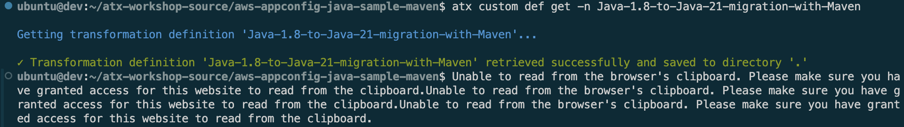
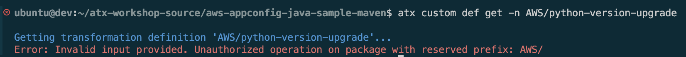

> 2026년 4월 21일 AWS Partner Summit Seoul 2026 AI Workshop에서 배운 내용을 정리하였습니다. 

## AWS Transform custom

### 개념: 무엇을 하는 서비스인가?

AWS Transform custom은 AI 에이전트로 대규모 코드의 애플리케이션 현대화를 자동으로 해주는 기능입니다.
정의된 규칙/패턴에 따라 기존 코드베이스를 분석하고 변환 계획을 수립하고, AI 에이전트를 통해 정교한 코드 변환을 수행합니다. 


### 왜 쓰는가: 어떤 문제를 해결하는가?

레거시 애플리케이션의 API 업그레이드, 라이브러리 업데이트, 프레임워크 마이그레이션 같은 반복적인 유지보수 작업을 자동화해서 기술 부채를 줄이는 것이 목적입니다. 

### 동작 방식

AWS Transform custom은 4단계 워크플로우로 동작합니다.

| 단계 | 설명 | 워크샵 예시 |
| --- | --- | --- |
| **1. Define** | 자연어 프롬프트, 문서, 코드 샘플로 Transformation Definition 생성 | `Java-1.8-to-Java-21-migration-with-Maven` TD 배포 |
| **2. Pilot** | 샘플 코드베이스에서 테스트하고 비용/노력 예측 | Movie Service 샘플 앱으로 변환 테스트 |
| **3. Scaled Execution** | CLI로 전체 코드베이스에 자동 대량 실행 | `atx custom def exec` 명령어로 Java 8→21 변환 실행 |
| **4. Monitor & Review** | 실행 결과 검토 및 지속적 학습으로 품질 개선 | Knowledge Items 확인 (선택사항) |

### 과금 체계

- 2026년 4월 23일 기준 Windows, VMware, 메인프레임 시스템의 마이그레이션 및 현대화 에이전트 사용은 무료입니다. 
- 해당 세션에서 다룬 Java, Python 등의 코드 베이스 업그레이드에 사용되는 Custom transformation agent는 에이전트 사용 분당 요금으로 비용이 청구됩니다. (1분당 0.035 USD)


### Transformation Definitions(TDs, 변환 정의)

Transformation Definition은 특정 코드 변환을 수행하는 데 필요한 규칙/패턴을 정의한 명세서입니다. 예제와 가이드를 제공하면 AI Agent는 학습된 패턴에 따라 일관적으로 코드를 수정 및 변환합니다.

#### AWS Managed vs User-Defined Transformation

AWS Transform custom은 출처에 따라 두 종류의 Transformation Package를 지원합니다.

- AWS Managed Transformation Package: 일반적인 현대화 시나리오에 적합한 AWS에서 미리 정의한 Definition
- User Transformation Package: 특정한 요구에 맞게 사용자가 만들고 AWS 어카운트 내에 게시할 수 있는 커스텀 Transformation package

**[비교 테이블]**

| 구분	| AWS-Managed Transformation	| User-Defined (Custom) Transformation |
|---|---|---|
| 누가 만드나 |	AWS가 사전 제작·검증	| 사용자(개발자)가 직접 정의 |
| 정의 단계	| 생략 가능 (이미 완성된 패키지) | 자연어·문서·코드 샘플로 에이전트와 대화하며 생성 가능 |
| 지원 예시	| Java 8→17, Python/Node.js 버전 업, AWS SDK v1→v2 등 6종 이상	| 사내 공통 라이브러리 통합, 조직 코딩 표준 적용, 독자 프레임워크 교체 등 | 
| 효율성 |	Java/Node.js 기준 최대 85% 자동화	| 조직 요건·복잡도에 따라 다름 |
| 장점 |	즉시 사용 가능, AWS가 관리	| 조직의 필요에 맞게 커스터마이징 가능, 버전제어 가능 |


#### 구성 파일

- transformation_definition.md (필수): 핵심 변환 로직과 지시사항 포함
- summaries.md (선택): 사용자가 제공한 참조 문서의 요약본
- document_references/ 폴더 (선택): 사용자가 직접 제공하는 문서, API 스펙, 마이그레이션 가이드, 코드 샘플 등


#### 상태: Draft vs Published

- Draft(초안): 개발·테스트 중인 상태. 특정 버전으로 저장되며, 이전 대화를 --conversation-id로 이어서 작업 가능.
- Published(게시됨): 계정 내 Transformation Registry에 등록되어 팀원 누구나 IAM 권한 범위에서 실행 가능.

Transformation Definition는 계정 단위로 관리됩니다. 다른 AWS 계정에서 사용하려면 별도로 publish해야 합니다.

### ATX

AWS Transform custom을 실제로 사용할 때 터미널에서 입력하는 명령어는 `atx`입니다.


#### ATX Hands-on

- Hands-on 워크샵에서는 Maven, Gradle로 빌드한 Java 1.8 버전의 샘플 애플리케이션을 ATX를 사용하여 Java 21로 변환하며 종속성을 해결하고 현대적인 코딩 패턴을 적용하는 실습을 진행하였습니다. 
- [워크샵 Link](https://catalog.workshops.aws/workshops/3a8b24dd-c05e-47e1-8972-a8fff07946e6/en-US)

#### ATX 기본 명령어
```bash
# Get Help
atx --help
atx custom def --help

atx  --version # Display version

atx # Enter Interative mode (Chat-based interface)

atx custom def list # List transformation packages

atx update # Update ATX Agent
```

#### ATX User-Defined TD 내용 확인

2026년 04월 21일 기준 영어만 지원하며, `AWS/` 접두사로 시작하는 AWS Managed Definition은 AWS에서 유지하고 관리하며, 현재는 내용 확인이 불가합니다. 


```bash
atx custom def get -n Java-1.8-to-Java-21-migration-with-Gradle
```






#### 변환 실행
```bash
atx custom def exec \
  -n <transformation-name> \   # 실행할 변환의 이름
  -p . \                       # 코드 경로
  -c "noop" \                  # 검증 빌드 명령어
  -x \                         # 추가 정보 요청없이 실행
  -t \                         # 모든 도구를 자동으로 승인 (신뢰 모드)
  --configuration 'additionalPlanContext=Target Python version is 3.12' # 구성 옵션으로 실행 컨텍스트 제공
  # 구성 옵션은 아래 세 가지 방법으로 지정 가능하며 구성 파일 값이 우선
  # 1. 인라인 키-값 쌍 
  # 2. JSON 파일 경로('file://config.json')
  # 3. YAML 파일 경로('file://config.yaml')
  

# Hands-on 변환 실행 명령어
atx custom def exec -n Java-1.8-to-Java-21-migration-with-Maven -p . -c "mvn clean compile"
```

#### Custom TDs 
```bash
atx custom def save-draft # Definition 저장

# Definition 게시
atx custom def publish \
  -n My-Python-Modernization \   # Definition 이름
  --description "Python modernization from 3.9 to 3.12" \ # Definition 설명
  --sd ~/.seg/20251125_141716_bf39a495/artifacts/tp-staging # Definition 경로
```

#### Knowledge Items 
```bash
# List knowlege items for TD
atx custom def list-ki --transformation-name "Java-1.8-to-Java-21-migration-with-Maven"

# 기본적으로 변환 실행 시 Knowledge Item을 추출하나, 비활성화 가능

# Disable knowledge extraction
atx custom def exec -n <transformation-name> -p . -d  # or --do-not-learn

# Enable knowledge extraction
atx custom def update-ki-status \
  -n <transformation_name> \
  --id <knowledge_item_id> \
  --status ENABLED

# View knowledge item details
atx custom def get-ki \
  --transformation-name "Java-1.8-to-Java-21-migration-with-Maven" \
  --id "<knowledge_item_id>"
```


#### 세션 관리

변환이 중단 되는 경우 중단된 곳부터 재개할 수 있습니다.

```bash
atx --resume # Resume most recent conversaion

atx --conversation-id <conversation_id> # Resume specific conversation
```

#### Logs

ATX CLI는 Conversation Log, Debug Log 두 가지고 변환 중에 일어나는 일을 기록합니다. 

**1. Conversation Log**

- 위치: `~/.aws/atx/custom/<conversation_id>/logs/<timestamp>-conversation.log`

**2. Debug Log**

- 위치:
    - `~/.aws/atx/logs/debug.log`
    - `~/.aws/atx/logs/error.log`

<!-- 이 로그에는 다음을 포함한 에이전트와의 전체 대화 기록이 포함됩니다:

사용자 입력 및 명령어
에이전트의 응답 및 추론
변환 결정 및 작업
가장 유용한 용도: 변환이 수행한 작업과 그 이유 이해

```bash 
# 최신 대화 로그 보기
ls -lt ~/.aws/atx/custom/*/logs/*.log | head -1 | awk '{print $NF}' | xargs cat
``` -->


<!-- 이 로그에는 CLI 작업에 대한 기술적 세부 정보가 포함되며 다음에 유용합니다:

고급 문제 해결
버그 보고
내부 작업 이해

```bash
# 디버그 정보 보기
tail -100 ~/.aws/atx/logs/debug.log 

# 최근 오류 보기
tail -50 ~/.aws/atx/logs/error.log 
```

##### MCP Servers

AWS Transform custom은 추가 도구 및 기능을 통합하기 위해 Model Context Protocol(MCP) Servers를 지원합니다.

구성
~/.aws/atx/mcp.json 디렉토리에 mcp.json 파일을 생성하여 MCP servers를 구성할 수 있습니다:

```bash
{
  "mcpServers": {
    "amzn-mcp": {
      "command": "amzn-mcp",
      "args": [],
      "disabled": false,
      "env": {},
      "autoApprove": [],
      "limit_tools": []
    }
  }
}
```

구성 옵션

- command: MCP server의 실행 가능한 명령어
- args: server에 전달할 명령줄 인수
- disabled: 구성을 제거하지 않고 server를 비활성화하려면 true로 설정
- env: server의 환경 변수
- autoApprove: 프롬프트 없이 자동으로 승인할 도구 목록
- limit_tools: server에서 사용 가능한 도구를 제한합니다
- MCP Servers 관리
- atx mcp 명령어를 사용하여 MCP servers를 관리하세요:

1
2
# MCP 관리 명령어 보기
atx mcp --help -->

## 후기

샘플 애플리케이션으로는 잘 되는 것 같은데, 실제 운영 환경에서도 잘 동작할지는 직접 테스트해봐야 알 것 같다. 전자정부 프레임워크 기반 애플리케이션에도 적용 가능하다고 들었다.

패턴이 명확한 작업은 자동화 효과가 크겠지만, User-Defined TD를 직접 만들려면 변환 패턴을 설계할 수 있는 개발 역량이 어느 정도 필요해 보인다. 이 부분이 진입장벽이 될 수 있을 것 같다.

레거시 현대화에 대한 고민을 가진 고객에게 PoC 용도로 제안해볼 수 있겠다는 생각이 들었다. Java 버전 업그레이드나 AWS SDK 마이그레이션처럼 범위가 명확한 케이스부터 시작하는 게 현실적일 것 같다.

ATX에서 MCP 서버를 연결해 외부 도구를 통합할 수 있다고 하는데, 어떻게 활용할 수 있을지 추가적으로 확인이 필요하다.

기회가 된다면 내부에서 사용하는 Lambda 런타임 버전 업그레이드할 때 먼저 사용해보고 싶다. 